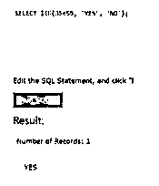
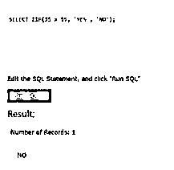
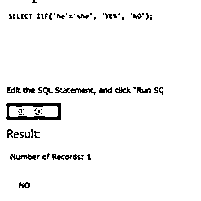

# T-SQL IIF

> 原文：<https://www.educba.com/t-sql-iif/>


## T-SQL IIF 简介

T-SQL IIF 定义为，它是一个逻辑函数，可以有另一种方式来编写 CASE 表达式；它有三个参数，第一个是布尔表达式；如果为真，则返回第二个参数作为值；否则，如果条件为假并且结果取决于估计，则它提供第三个参数。我们可以说，第一个参数被评估为提供真值或假值。已经概述了 T-SQL 中的 IIF 函数，以阐明常见的表达式情况，或者通过使用诸如 IF…ELSE…THEN 之类的运算符。

### T-SQL IIF 概述

IIF()函数可以利用下面截图中给出的 CASE 语句格式:

<small>Hadoop、数据科学、统计学&其他</small>

**代码:**

```
SELECT CASE Expression
When Expression1 Then result1
When Expression2 Then result2
…
ELSE Result
END
```

我们可以利用这个函数的语法，将布尔表达式、真值和假值作为它的参数，其中第一个参数可以被评估以得到结果；如果表达式为真，那么它将给出第二个参数中的值，如果表达式为假，那么它将给出假作为第三个参数，T-SQL IIF 语句是编写已连接到给定条件的 CASE 语句的新路径，正如我们所说的，IIF()函数提供了一种通过使用 IF…ELSE 逻辑编写新 CASE 语句的快速方法，因为 T-SQL 可以在内部将语句转换为 CASE 语句，从而实现该语句。

### T-SQL IIF 语句

我们可以使用 CASE 语句根据所描述的条件返回结果，因为它类似于 IF…ELSE…THEN 语句，可以评估表达式并返回输出，CASE 语句在所有版本的 T-SQL 中都很有用，该语句可以通过使用变量、字符串、表列、聚合函数来比较整数值，并且它可能有嵌套的 IF。

#### 1.使用整数值的 IIF 语句

让我们看一个例子，它有一个布尔表达式，如果表达式为真，它将返回一个真值，如果条件为假，它将返回一个假值。

**代码:**

```
SELECT IIF (4 > 5, 'TRUE', 'FALSE');
```

**输出:**


在这个表达式中，我们要描述的是，如果表达式(4 > 5)为真，那么它会返回 true 作为第二个参数，如果表达式为假，那么它会返回一个假的结果，如上图截图所示。

#### 2.带变量的 IIF 语句

让我们看看使用两个整型变量和赋值的例子。

**代码:**

```
DECLARE @B INT = 60, @C INT = 50
SELECT IIF (@B >= @C, 'PASS', 'FAIL')
```

**输出:**


在本例中，我们利用了两个变量，并为它们赋值；当给定的条件为真时，它将显示结果‘通过’,如上面的截图所示。

#### 3.比较两个字符串的 IIF 语句

我们能够定义不同的 T-SQL IIF 语句。

*   拉姆和西塔都喜欢芒果。
*   其他的都喜欢木瓜。

**代码:**

```
DECLARE @human Varchar (70) = 'Ram'
SELECT IIF (@human in ('Ram', 'Sita'),'Likes Mango', 'Likes Papaya')
```

**输出:**


### T-SQL IIF 函数

IIF 函数可以获得三个参数，它可以评估第一个参数并返回第二个参数；如果第一个参数为真，那么它将返回第二个参数；如果第一个参数为假，则它将返回第三个参数，IIF()函数可能返回具有各种数据类型的结果。真值和假值可能有多种数据类型，这些数据类型可能具有最高优先级，如果我们假设 IIF()函数的内部功能涉及 CASE 表达式，那么我们可以说 IIF()函数可能类似于 CASE 表达式，因为我们知道它是为快速和直接的 CASE 逻辑表达式而生成和实现的。

让我们看看 IIF()函数的语法:

```
IIF(Boolean Expression, true_value, false_value)
```

在哪里，

*   **布尔表达式:**它是一个有效的表达式，要被评估以得到一个错误。
*   **true_value:** 通过评估布尔表达式可以返回实际值的值。
*   **false_value:** 也是一个值，但是通过评估布尔表达式可以返回一个 false 值。

让我们看看 IIF()函数是如何简写 CASE 表达式的。

**代码:**

```
CASE
WHEN logical_expression
THEN
correct_result
ELSE
wrong_result
END
```

让我们看看使用 IIF()函数的简单例子:

**代码:**

```
SELECT IIF(35<55, 'YES', 'NO');
```

**输出:**




在上面的例子中，我们试图扫描像 35 这样小于 55 的给定值；如果是真的，它将显示“是”，如果是假的，那么它将在结果中返回“否”，因此它返回一个真的结果为“是”

反过来使用上面的例子可能会返回一个错误的结果，如下所示。

**代码:**

```
SELECT IIF (35 > 55, 'YES', 'NO');
```

**输出:**




所以如上图截图所示，我们可以说第 1 个表达式有 35 小于 55，所以 35>55 为假；因此，通过使用这个函数，我们得到“否”结果作为第三个参数。

现在让我们看一个两个条件相似的例子。

**代码:**

```
SELECT IIF ('he' = 'she', 'YES', 'NO');
```

**输出:**




在这个例子中，我们试图匹配上面例子中给出的两个字符串；如果相等，我们会得到“是”，如果不相等，我们会得到“否”，因为字符串不一样，所以我们得到的结果是“否”

### 结论

在本文中，我们得出结论，IIF 是一个逻辑函数，它可以通过评估布尔表达式返回一个值，这是它的第一个参数，因此我们已经讨论了 IIF 语句和 IIF 函数。

### 推荐文章

这是 T-SQL IIF 的指南。这里我们分别讨论简介、概述和 T-SQL IIF 语句和函数。您也可以看看以下文章，了解更多信息–

1.  [desc 的 SQL 订单](https://www.educba.com/sql-order-by-desc/)
2.  [SQL 执行](https://www.educba.com/sql-execute/)
3.  [PL/SQL 不等于](https://www.educba.com/pl-sql-not-equal/)
4.  [SQL 不在](https://www.educba.com/sql-not-in/)中


