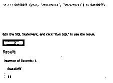
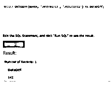
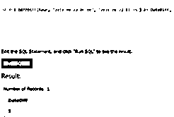
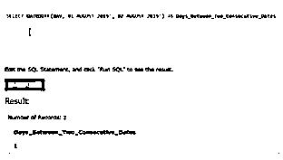
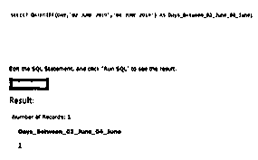

# T-SQL DATEDIFF

> 原文：<https://www.educba.com/t-sql-datediff/>


## T-SQL DATEDIFF 简介

T-SQL DATEDIFF 被定义为 T-SQL 中的主要函数，可用于查找两个日期实用程序之间的差异，在这两个日期实用程序中，它被用来区分具有不同日期部分的两个日期值。此函数出现在日期函数中；它可以接受三个参数:间隔、开始日期和结束日期。间隔部分是可以返回的已定义部分，它可以具有指定的值和用于查找它们之间的差异的日期，并且它将返回两个已标识日期之间的差异。

### T-SQL DATEDIFF 概述

DATEDIFF 是 T-SQL 中的普通函数，可用于根据日期执行数学计算；它以整数值的形式提供输出，如日期、月、年、分钟和秒。当我们想要找出两个日期之间的差异时，这个函数会很有帮助。它与数据函数类别相关；它有三个参数:间隔、第一个日期和结束日期，其中我们可以说它有间隔部分和日期值部分。
日期函数可以用日期和时间值作为争议来演示；当我们试图找出日期和时间戳之间的差异时，这个函数是必要的；它与一些 SQL server 版本兼容，如 SQL server 2008 plus、Azure SQL 数据库和数据仓库，以及并行数据仓库。

<small>Hadoop、数据科学、统计学&其他</small>

### 何时使用 T-SQL DATEDIFF？

T-SQL DATEDIFF 是 T-SQL 的 date 函数中可以提供的函数，所以当我们必须找出两个日期之间的日、月、年的差异时，就可以使用这个函数。此外，当我们必须找出预期订单交付日期和实际订单交付日期之间的差异时，它也很有用；然后，在这种情况下，DATEDIFF()函数是可行的，并且，当我们想要跟踪时间时，这意味着当我们想要计算从项目开始到现在我们已经在任何项目中花费了多少年，因为该函数可以返回指定间隔的计数，并且它在开始日期和结束日期中提供的日期部分边界之间工作。如果我们想找到连续的日期，这个函数会很有帮助；许多日期之间的差异意味着如果我们有很多数据，我们必须找到它的差异。

### T-SQL DATEDIFF 函数

DATEDIFF()函数已被用于查找两个已定义日期之间的差异，它可以出现在 date 函数中；这个函数可以接收三个参数，其中第一个是间隔，第二个是开始，第三个是结束日期。

**语法:**

```
DATEDIFF (interval/Datepart, start_date, end_date);
Or
DATEDIFF (interval, start_date, end_date) As DateDiff;
```

在哪里，

*   Interval:可以是我们可以取回的特定部分，值将采用下面的格式表列表，

1.  年、年、年:可以是定义的年、年。
2.  季度，qq，q:这个可以定义为季度。
3.  月，mm，m:也可以是指定的月份。
4.  dayofyear，dy，y:这是一年中定义的一天。
5.  日，dd，d:是描述的日，日。
6.  week，ww，wk:是定义的周，周。
7.  weekday，dw，w:是定义的工作日。
8.  小时，hh:可以是定义的小时，小时。
9.  分钟，mi，n:是定义的分钟，分钟。
10.  第二，ss，s:也是定义的秒，秒。
11.  毫秒，ms:是定义的毫秒，毫秒。
12.  微秒，mcs:它是定义的微秒，微秒。

*   开始日期和结束日期:这是两个定义的日期，在这两个日期上我们可以得到它们之间的差异。

### T-SQL DATEDIFF 表列表示例

让我们讨论一下 T-SQL DATEDIFF 的例子。

#### 示例#1

DATEDIFF()函数的示例是我们可以获取一年中两个日期值之间的方差。




在上面的例子中，我们试图得到一个日期值，在这个日期值中，我们将得到输出 11；正如我们在查询中看到的，我们添加了“As DateDiff ”,因为它是可选的。

#### 实施例 2

现在看看 DATEDIFF()函数的例子，在这个例子中，我们可以得到两个日期值之间的方差，但是是在一个月内。




在上面的例子中，我们提供了两个不同的日期来检索日期差异，我们得到的结果以月为单位，如屏幕截图所示。

#### 实施例 3

现在我们可以看到 DATEDIFF()函数的例子，在这个例子中，我们可以得到两个日期值之间的差值(以小时为单位)。




在上面的例子中，我们需要查询中给出的小时之间的差异，我们得到了截图中显示的结果。

#### 实施例 4

如果我们试图找出两个连续日期之间的差异，我们可以使用开始日期和结束日期，如下图所示。




在上面的示例中，我们试图找到查询中提供的日期之间的连续日期，并获得它们之间的天数。

#### 实施例 5

如果我们试图找出两个日期之间的差异，那么通过使用下面的查询，我们可以找到它。




在上面的例子中，我们试图找出给定日期之间的天数。

### 结论

在本文中，我们得出结论，DATEDIFF 是 date 函数中可以提供的主要函数，它可以根据值给出差异；我们还讨论了何时使用这个函数，DATEDIFF 函数的细节，并列出了 DATEDIFF 的例子。

### 推荐文章

这是一个 T-SQL DATEDIFF 的指南。这里我们讨论何时使用 T-SQL DATEDIFF，T-SQL DATEDIFF 表列表，以及示例。您也可以看看以下文章，了解更多信息–

1.  [T-SQL 插入](https://www.educba.com/t-sql-insert/)
2.  [T-SQL 字符串函数](https://www.educba.com/t-sql-string-functions/)
3.  [什么是 T-SQL？](https://www.educba.com/what-is-t-sql/)
4.  [T-SQL 命令](https://www.educba.com/t-sql-commands/)


