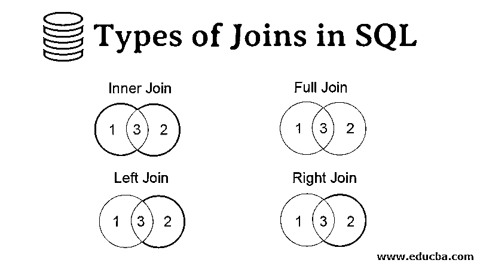
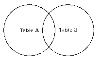
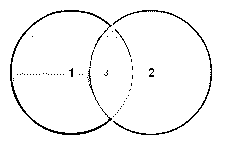
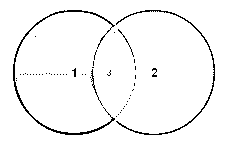
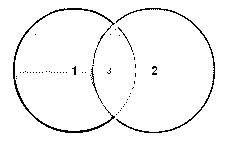
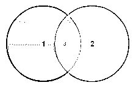

# SQL 中的联接类型

> 原文：<https://www.educba.com/types-of-joins-in-sql/>




## SQL 中连接类型的介绍

SQL 中的联接可以有四种不同的类型，通过利用联接函数中涉及的表的公共列来组合两个或多个表中的记录，可以得到预期的结果。内部联接用于获取两个表中具有相同值的记录，左联接用于从左侧表中获取所有记录，仅从右侧表中获取匹配值，右联接用于从右侧表中获取所有记录，仅从左侧表中获取匹配记录。最后进行完全连接，从两个表中获取所有记录，而不考虑匹配的记录。

假设我们的数据库中有两个数据集，分别以表一和表二的形式存储。这两个表之间存在某种关系，这种关系是以主键和外键概念的形式指定的。如果您连接两个具有某种关系的表，该场景的维恩图表示将类似于，

<small>网页开发、编程语言、软件测试&其他</small>




这种重叠的数量将决定两个表(即表 A 和表 b)之间的相似程度。这意味着表 1 中与表 2 中的记录相匹配的记录数量由重叠部分表示。这是数据的一个子集。根据我们从两个表中选取的数据子集，我们得到了四种不同类型的连接。

**连接语法:**

```
SELECT column-names FROM table-name1 JOIN table-name2 ON column-name1 = column-name2 WHERE condition
```

### SQL 中的联接类型

1.  内部连接
2.  [左连接](https://www.educba.com/left-join-in-oracle/)
3.  [右连接](https://www.educba.com/sql-right-join/)
4.  完全连接

下面我们详细解释不同类型的连接。

#### 1.内部连接

在内部连接中，我们只选择两个表中通用的数据。(也就是这里的第 3 部分)为了使它更加精确，在这个连接中挑选了两个表中所有符合连接条件的记录。




**内部连接的语法:**

```
SELECT column-names FROM table-name1 INNER JOIN table-name2 ON column-name1 = column-name2 WHERE condition
```

#### 2.左连接

在左连接中，我们从左表中选择所有数据，从右表中只选择符合连接条件的数据集(这里是区域 1+3)




**左连接的语法:**

```
SELECT column-names FROM table-name1 LEFT JOIN table-name2 ON column-name1 = column-name2 WHERE condition
```

#### 3.右连接

在右连接中，我们从右表中选择所有数据，从左表中只选择符合连接条件的数据集(这里是 3+2)




**右连接的语法:**

```
SELECT column-names FROM table-name1 RIGHT JOIN table-name2 ON column-name1 = column-name2 WHERE condition
```

#### 4.完全连接

在完全连接中，来自两个表的所有记录都被合并和选择，而不管连接是否满足所提到的条件。(这里是 1+2+3)




**完全连接的语法:**

```
SELECT column-names FROM table-name1 FULL JOIN table-name2 ON column-name1 = column-name2 WHERE condition
```

### SQL 中的连接示例

考虑下面给出的两个表:

#### 1.订单详细信息示例

order 表包含客户下订单的详细信息，比如订单 id、订购的产品数量、订单金额、下订单的客户 id 以及下订单的日期。任何在线网站都可以使用这种表格来存储订单的详细信息。

**订单 _ 明细表:**

| 订单 ID | 项目数量 | 订单 _ 金额 | 客户标识 | 订单日期 |
| One hundred and twenty-three | Three | Five thousand five hundred | P_1 | 01/20/2019 |
| Two hundred and thirty-four | Two | Six thousand five hundred | 第 12 页 | 02/10/2019 |
| Three hundred and forty-five | One | Ten thousand | 第 13 页 | 05/27/2019 |
| Four hundred and fifty-six | Four | Four thousand | 第 14 页 | 11/07/2019 |
| Five hundred and sixty-seven | Two | Twenty thousand six hundred and fifty-six | P_1 | 12/15/2019 |
| Six hundred and seventy-eight | Three | Fifteen thousand | 第 11 页 | 10/27/2019 |

#### 2.客户详细信息示例

现在让我们看另一个表，其中将存储客户的详细信息，以便能够将订单发送到他们各自的地址。因此，customer 表将包含客户的详细信息，例如客户 id (cust_id ),它对于每个客户都是唯一的。现在，名和姓存储在名为–Cust _ First _ Name 和 Cust_Last_Name 的字段中。其他字段将存储客户的电子邮件 id、手机号码以及地址、密码、城市和州等信息。因此，我们可以看到我们的客户表看起来像这样

**客户 _ 明细表:**

| 客户标识 | 客户名字 | 客户姓氏 | pin 码 | 地址 | 客户 _ 手机 | 城市 | 状态 | 客户电子邮件 |
| 第 50 页 | 爱丽丝 | 彼得（男子名） | One hundred and eleven thousand one hundred and eleven | xyz 街 330 号 | One hundred and twenty-three | 班加罗尔 | 灵魂 | alice_p@gmail.com |
| 第 12 页 | 詹姆斯 | dshua，你好吗 | One hundred and fifty-five thousand five hundred and eleven | 420 abc 殖民地 | Two hundred and thirty-four | 海得拉巴 | 美国联合通讯社(Associated Press) | jame_d@gmail.com |
| 第 15 页 | （英、瑞）哈里（人名） | 闲赏 | One hundred and twenty-three thousand four hundred and fifty-six | 551 毫克路 | Four hundred and forty-four | 诺伊达 | 德里 | hpotter@outlook.com |
| 第 40 页 | 麦莉（女子名） | 帕克 | One hundred and eleven thousand one hundred and twenty-one | 11 英尺路 | Two hundred and twenty-four | 班加罗尔 | 灵魂 | park01Miley@gmail.com |
| 第十页 | 赫尔曼 | 灌木丛 | One hundred and twenty-three thousand four hundred and twenty-three | 34 <sup>th</sup> thanco 街 | Four hundred and thirty-two | 德里 | 德里 | bushh@yahoo.com |
| 第 18 页 | 但 | 褐色的 | One hundred and thirty-four thousand five hundred and twenty-three | 第 50 <sup>号</sup>独立路 | One hundred and forty-five | 我很自豪 | 哈里亚纳邦 | dan_brown@gmail.com |
| 第 20 页 | 詹姆斯 | 拉塞尔 | One hundred and eleven thousand one hundred and eleven | 101 毫克路 | Six hundred and seventy-eight | 班加罗尔 | 灵魂 | russelJ@gmail.com |
| P_1 | 麦莉（女子名） | 麦迪逊 | One hundred thousand and eleven | 第 45 <sup>号</sup>卡维拉帕布局 | Nine hundred and eighty-seven | 金奈 | 长吨 | mmson@yahoo.com |

现在，使用这个例子，让我们理解连接的功能。我们可以看到，两个表(即 ORDER_DETAILS 表和 CUSTOMER_DETAILS 表)之间的关系是由具有客户 id 值的键(即 Customer_Id，它是 CUSTOMER_DETAILS 表中的主键和 ORDER_DETAILS 表中的外键)建立的。

**在我们继续之前，需要注意以下几点:**

*   并非我们的 CUSTOMER_DETAILS 表中的所有客户都发出了订单请求。
*   并非我们在 ORDER_DETAILS 表中的所有订单请求都有 customer_id，它出现在 CUSTOMER_DETAILS 表中，这意味着有些订单没有客户的详细信息。

#### 3.内部连接

内部联接将只给出那些满足条件的记录。

**查询:**

```
select Cust_First_Name, Cust_email, No_of_Items, Order_Amount, Order_Date
from   CUSTOMER_DETAILS cd
inner join  ORDER_DETAILS od
on cd.Cust_Id = od.Customer_Id
```

**输出:**

| 客户名字 | 客户电子邮件 | 项目数量 | 订单 _ 金额 | 订单日期 |
| 麦莉（女子名） | mmson@yahoo.com | Three | Five thousand five hundred | 01/20/2019 |
| 詹姆斯 | jame_d@gmail.com | Two | Six thousand five hundred | 02/10/2019 |
| 麦莉（女子名） | mmson@yahoo.com | Two | Twenty thousand six hundred and fifty-six | 12/15/2019 |

#### 4.左连接

左连接将为您提供左表(即 CUSTOMER_DETAILS 表)中的所有记录。如果客户没有下订单，它将为 ORDER_DETAILS 表中的列返回 null 值。

**查询:**

```
select Cust_First_Name, Cust_email, No_of_Items, Order_Amount, Order_Date
from   CUSTOMER_DETAILS cd
left join  ORDER_DETAILS od
on cd.Cust_Id = od.Customer_Id
```

**输出:**

| 客户名字 | 客户电子邮件 | 项目数量 | 订单 _ 金额 | 订单日期 |
| 爱丽丝 | alice_p@gmail.com | 空 | 空 | 空 |
| 詹姆斯 | jame_d@gmail.com | Two | Six thousand five hundred | 02/10/2019 |
| （英、瑞）哈里（人名） | hpotter@outlook.com | 空 | 空 | 空 |
| 麦莉（女子名） | park01Miley@gmail.com | 空 | 空 | 空 |
| 赫尔曼 | bushh@yahoo.com | 空 | 空 | 空 |
| 但 | dan_brown@gmail.com | 空 | 空 | 空 |
| 詹姆斯 | russelJ@gmail.com | 空 | 空 | 空 |
| 麦莉（女子名） | mmson@yahoo.com | Three | Five thousand five hundred | 01/20/2019 |
| 麦莉（女子名） | mmson@yahoo.com | Two | Twenty thousand six hundred and fifty-six | 12/15/2019 |

#### 5.右连接

对，Join 将为您提供右表(即 ORDER_DETAILS 表)中的所有记录。如果没有找到订单的客户记录，它将为 CUSTOMER_DETAILS 表中的列返回 null 值。

**查询:**

```
select Cust_First_Name, Cust_email, No_of_Items, Order_Amount, Order_Date
from   CUSTOMER_DETAILS cd
right join  ORDER_DETAILS od
on cd.Cust_Id = od.Customer_Id
```

**输出:**

| 客户名字 | 客户电子邮件 | 项目数量 | 订单 _ 金额 | 订单日期 |
| 麦莉（女子名） | mmson@yahoo.com | Three | Five thousand five hundred | 01/20/2019 |
| 詹姆斯 | jame_d@gmail.com | Two | Six thousand five hundred | 02/10/2019 |
| 空 | 空 | One | Ten thousand | 05/27/2019 |
| 空 | 空 | Four | Four thousand | 11/07/2019 |
| 麦莉（女子名） | mmson@yahoo.com | Two | Twenty thousand six hundred and fifty-six | 12/15/2019 |
| 空 | 空 | Three | Fifteen thousand | 10/27/2019 |

#### 6.完全连接

完全连接将为您提供两个表中指定的所有记录。

**查询:**

```
select Cust_First_Name, Cust_email, No_of_Items, Order_Amount, Order_Date
from   CUSTOMER_DETAILS cd
full join  ORDER_DETAILS od
on cd.Cust_Id = od.Customer_Id
```

**输出:**

| 客户名字 | 客户电子邮件 | 项目数量 | 订单 _ 金额 | 订单日期 |
| 爱丽丝 | alice_p@gmail.com | 空 | 空 | 空 |
| 詹姆斯 | jame_d@gmail.com | Two | Six thousand five hundred | 02/10/2019 |
| （英、瑞）哈里（人名） | hpotter@outlook.com | 空 | 空 | 空 |
| 麦莉（女子名） | park01Miley@gmail.com | 空 | 空 | 空 |
| 赫尔曼 | bushh@yahoo.com | 空 | 空 | 空 |
| 但 | dan_brown@gmail.com | 空 | 空 | 空 |
| 詹姆斯 | russelJ@gmail.com | 空 | 空 | 空 |
| 麦莉（女子名） | mmson@yahoo.com | Three | Five thousand five hundred | 01/20/2019 |
| 麦莉（女子名） | mmson@yahoo.com | Two | Twenty thousand six hundred and fifty-six | 12/15/2019 |
| 空 | 空 | One | Ten thousand | 05/27/2019 |
| 空 | 空 | Four | Four thousand | 11/07/2019 |
| 空 | 空 | Three | Fifteen thousand | 10/27/2019 |

### 优势

1.  更快的执行速度，这意味着更快地检索所需的列。
2.  优化、可读、易懂
3.  性能提升。

### 结论

正如所看到的，我们使用连接从不同的表中添加和获取字段。

*   内部联接获取满足给定条件的记录。
*   Left Join 将给出左表中的所有行，即使给定的条件不匹配。
*   右连接将给出左表中的所有行，即使给定的条件不匹配。
*   当其中一个表中有匹配项时，完全联接将返回所有行。
*   联接查询可以与–SELECT、INSERT、UPDATE 和 DELETE 等命令一起使用。
*   连接还可以与不同的子句一起使用，例如 GROUP BY、子查询、WHERE、聚合函数等。

### 推荐文章

这是 SQL 中连接类型的指南。在这里，我们将讨论基本概念、SQL 中不同类型的连接，以及它的优点和例子。您也可以浏览我们推荐的其他文章，了解更多信息——

1.  [SQL 管理工具](https://www.educba.com/sql-management-tools/)
2.  [SQL 中的数据库](https://www.educba.com/database-in-sql/)
3.  [SQL 中的通配符](https://www.educba.com/wildcard-in-sql/)
4.  [加入 MySQL](https://www.educba.com/joins-in-mysql/)


