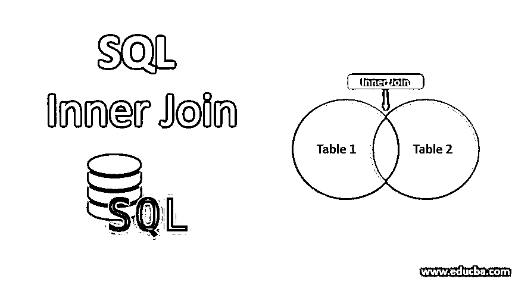
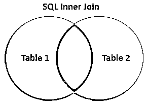

# SQL 内部联接

> 原文：<https://www.educba.com/sql-inner-join/>

## SQL 内部连接简介

SQL JOIN 子句将两个或多个表中的行组合起来，在临时表中形成一组行。至少，如果一个字段在两个或多个表中是相同的，并且它们之间存在关系，并且如果两个表之间有匹配的值，则具有匹配行的记录被拉进一个临时表中，这称为 SQL 内部连接。不包含匹配值的行将被拒绝，临时表只包含匹配值。最常见的 SQL 连接是 SQL 内部连接。一个表的主键被连接到另一个表的外键是 SQL 内部连接中最常见的情况。

**语法:**

<small>Hadoop、数据科学、统计学&其他</small>

`SELECT * FROM tab1 INNER JOIN tab2
ON tab1.col_name = tab2.col_name;`

**其中，**

*   tab1 是第一个表
*   表 2 是第二个表
*   tab1.col_name 是第一个表中的列名
*   tab2.col_name 是第二个表中的列名。

### SQL 内部连接的工作原理

如果两个表中有匹配的值，则返回具有匹配值的记录，通过 SQL 内部连接在临时表中形成一组行。SQL 内部联接的图示如下所示:

*   蓝色阴影部分表示两个表中的匹配值。
*   考虑两个表，订单表和客户表:

**订单表**

| **字** | **IDCust** | **字距** |
| One | One hundred and twenty-three | Twelve |
| Two | Four hundred and fifty-six | Thirty-four |
| Three | Seven hundred and eighty-nine | Fifty-six |
| Four | 012 | Seventy-eight |

**客户表**

| **IDCust** | **客户名称** | **原点** |
| Four hundred and fifty-six | 字母表 | 印度 |
| 012 | 极好的 | 美国 |
| Eight hundred and nine | GHI | 中国 |
| One hundred and thirty-four | JKL | 德国 |

*   IDCust 列在 orders 表和 Customer 表中是通用的。IDCust 是订单表和客户表之间的关系。
*   我们现在创建一个包含内部连接的 SQL 语句，只从 orders 和 customers 表中提取那些具有匹配值的记录。

**代码:**

`SELECT orders.IDord, orders.IDCust, customers.Custname, customers.origin
FROM orders
INNER JOIN customers ON orders.IDCust = customers.IDCust;`

**输出:**

**上表说明:** Orders 表由三列组成:订单 ID (IDord)、客户 ID (IDCust)和订单值(ordval)。Customers 表由三列组成:客户 ID (IDCust)、客户名称(Custname)和来源。这两个表之间的关系是客户 ID (IDCust)。

**代码:**

`SELECT orders.IDord, orders.IDCust, customers.Custname, customers.origin
FROM orders
INNER JOIN customers ON orders.IDCust = customers.IDCust;</code.`

**对上述代码的解释:**上述 SQL 语句从在客户 ID (IDCust)中具有匹配值的 orders 和 customers 表中选择 order ID (IDord)、Customer ID (IDCust)、Customer name 和 Customer origin 列，从而得到由两个记录和四列 order ID (IDord)、Customer ID (IDCust)、Customer name 和 Customer origin 组成的表。SQL 内部联接应用于订单 ID (IDord)列。

### 实现 SQL 内部连接的示例

以下是在 SQL 内部连接中实现的示例:

#### 示例#1

考虑两个表:学生表和分数表

**学生表**

| 罗隆 | 科目 | 马克斯（英格兰人姓氏） |
| One | 英语字母表中第一个字母 | Ninety |
| Two | 英语字母表的第 2 个字母 | Eighty |
| Three | 英语字母表中第三个字母 | Seventy |
| Four | 英语字母表中第四个字母 | Fifty |

**标记表**

| 罗隆 | 学生姓名 |
| Three | 字母表 |
| Four | 极好的 |
| Five | GHI |
| Six | JKL |

*   Rollno 列在 Students 表和 Marks 表中都很常见。Rollno 是订单表和客户表之间的关系。
*   我们现在创建一个包含 inner join 的 SQL 语句，只从 Students 和 Marks 表中提取那些具有匹配值的记录。

**代码:**

`SELECT students.Rollno, students.Subject, students.Marks, Marks.Studentname
FROM students
INNER JOIN Marks ON students.Rollno = marks.Rollno;`

**输出:**

**对上面代码的解释:**在上面的例子中，有两个表:学生的表和分数的表。学生表由三列组成:卷号(Rollno)、科目和分数。分数表由两列组成:卷号(Rollno)，学生姓名(Student name)。两个表之间的关系是卷号(Rollno)。

**代码:**

`SELECT students.Rollno, students.Subject, students.Marks, Marks.Studentname
FROM students
INNER JOIN Marks ON students.Rollno = marks.Rollno;`

**对上面代码的解释:**上面的 SQL 语句从学生和分数表中选择具有与卷号(Rollno)匹配的值的列卷号(Rollno)、主题和分数以及学生姓名(Student name)，从而得到由两个记录和四列卷号(Rollno)、主题、分数和学生姓名组成的表。SQL 内部联接应用于 Roll number (Rollno)列。

#### 实施例 2

考虑公司表和项目表这两个表

**公司表**

| **公司 ID** | **公司名称** | **公司所在城市** |
| One | 英语字母表中第一个字母 | 比奥雷 |
| Two | 英语字母表的第 2 个字母 | 迈索尔 |
| Three | 英语字母表中第三个字母 | 姆洛尔 |
| Four | 英语字母表中第四个字母 | Tumkur |

**项目表**

| **项目 ID** | **项目名称** | **公司 ID** |
| Three | 字母表 | Three |
| Four | 极好的 | Four |
| Five | GHI | Five |
| Six | JKL | Six |

*   公司 ID 列在公司表和项目表中是通用的。公司 ID 是公司表和项目表之间的关系。
*   我们现在创建一个包含内部连接的 SQL 语句，只从 Company 和 Item 表中提取那些具有匹配值的记录。

**代码:**

`SELECT Company.Company ID, Company.Company name, Company.Company city, Item.item ID, Item.item name
FROM Company
INNER JOIN Item ON Company.Company ID = Item.Company ID;`

**输出:**

**对上面代码的解释:**在上面的例子中，有两个表:公司表和项目表。公司表由三列组成:公司 ID、公司名称和公司城市。项目表由三列组成:项目 ID、项目名称和公司 ID。这两个表之间的关系是公司 ID。

**代码:**

`SELECT Company.Company ID, Company.Company name, Company.Company city, Item.item ID, Item.item name
FROM Company
INNER JOIN Item ON Company.Company ID = Item.Company ID;`

**对上述代码的解释:**上述 SQL 语句从在公司 ID 中具有匹配值的公司和项目表中选择列公司 ID、公司名称和公司城市、项目 ID 和项目名称列，从而得到由两个记录和五列公司 ID、公司名称和公司城市、项目 ID 和项目名称组成的表。SQL 内部联接应用于公司 ID 列。

### 结论

在本文中，我们学习了不同类型的连接、它们的定义和区别、语法连接、语法解释、工作、要实现的示例以及执行查询后结果的解释。

### 推荐文章

这是一个 SQL 内部连接的指南。在这里，我们讨论基本概念，它是如何工作的，并举例说明如何用适当的代码和输出来实现。您也可以浏览我们的其他相关文章，了解更多信息——

1.  [SQL 子句](https://www.educba.com/sql-clauses/)
2.  [MySQL 中的条件](https://www.educba.com/condition-in-mysql/)
3.  [MySQL 间](https://www.educba.com/mysql-between/)
4.  [不同类型的 SQL 连接两个表](https://www.educba.com/sql-join-two-tables/)
5.  [SQL 删除连接|示例|参数](https://www.educba.com/sql-delete-join/)

