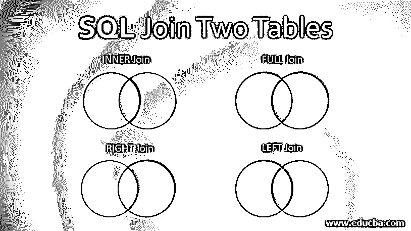
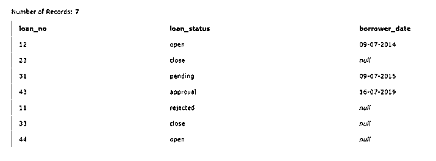

# SQL 连接两个表

> 原文：<https://www.educba.com/sql-join-two-tables/>

## SQL 连接两个表简介

让我们讨论一下连接两个表的语法和例子。让我们考虑贷款表和借款人表，并应用所有类型的连接，例如下面的类型。我们将对表应用的不同类型的连接如下:

**不同类型的连接**

<small>Hadoop、数据科学、统计学&其他</small>

*   内部连接
*   左连接
*   右连接
*   完全连接

**a) INNER Join:** Inner join 根据指定的条件获取两个表中的所有公共行。让我们以内部连接为例。

**语法:**

`SELECT * FROM TABLE_A A
INNER JOIN TABLE_B B
ON A. Common_COLUMN =B. Common_COLUMN`

**b) LEFT JOIN:** Left Join 获取左表的所有行和两个表的公共行。让我们以左连接为例。

**语法:**

`SELECT * FROM TABLE_A A
LEFT JOIN TABLE_B B
ON A. Common_COLUMN =B. Common_COLUMN`

**c) RIGHT JOIN:** Right Join 获取右表的所有行和两个表的公共行。让我们举一个正确连接的例子。

**语法:**

`SELECT * FROM TABLE_A A
RIGHT JOIN TABLE_B B
ON A.Common_COLUMN=B.Common_COLUMN`

**d)完全连接:**完全连接从两个表中获取所有的行。让我们举一个正确连接的例子。

**语法:**

`SELECT * FROM TABLE_A A
FULL JOIN TABLE_B B
ON A. Common_COLUMN =B. Common_COLUMN`

结果集包含空集值。以下语法可用于忽略空值:–

`SELECT * FROM TABLE_A A
FULL JOIN TABLE B B
ON A. Common_COLUMN =B. Common_COLUMN
WHERE A.Common_COLUMN IS NULL
AND A.Common_COLUMN IS NULL`

### 如何连接两个表？

#### 1.左连接

左连接=左表中的所有行+内部连接

**例子**

让我们考虑两个表，并对这两个表应用左连接:-

**贷款表**:

**借款人:**

**

** 

查询以从两个表中获取 loan_no、status 和借方日期:-

**查询:**

`SELECT L.LOAN_NO, L.LOAN_STATUS,B.BORROWER_DATE
FROM LOAN L LEFT JOIN BORROWER B
ON L.LOAN_NO=B.LOAN_NO`

让我们在对它们应用左连接后检查上表的输出。

**下面是截图:**

#### 2.右连接

*   右连接=右表中的所有行+内部连接
*   考虑右表中的所有行和两个表中的公共行。
*   基于条件的连接
*   ON 关键字用于指定条件和连接表。

**例子**

*   让我们考虑两个表，并在表上应用右连接:-
*   从两个表中查询贷款编号、状态和借款人日期:–

**查询:**

`SELECT L.LOAN_NO, L.LOAN_STATUS, B.BORROWER_DATE
FROM LOAN L RIGHT JOIN BORROWER B
ON L.LOAN_NO=B.LOAN_NO`

在对它们应用了正确的连接之后，让我们检查一下上表的输出。

**输出:**

**下面是截图:**

#### 3.内部连接

Inner Join =两个表中的所有公共行。而联接时，至少有一列应该是相同的数据类型，并且在表之间是公共的。

**例子**

*   让我们考虑两个表，并对这两个表应用内部连接:-
*   让我们构建一个查询，从两个表中获取 loan_no、status 和借款日期:-

**查询:**

`SELECT L.LOAN_NO, L.LOAN_STATUS, B.BORROWER_DATE
FROM LOAN L INNER JOIN BORROWER B
ON L.LOAN_NO=B.LOAN_NO`

让我们在对它们应用内部连接后检查上表的输出。

在上面的输出中，我们根据条件“L.LOAN_NO=B.LOAN_NO”获得了两个表的公共行。

**截图如下:**

#### 4.完全外部连接

完全外部联接=两个表中的所有行。而联接时，至少有一列应该是相同的数据类型，并且在表之间是公共的。

**例子**

*   让我们考虑两个表，并在这两个表上应用完全外连接:-
*   让我们构建一个查询，从两个表中获取 ap_date 和借方日期:-

**查询:**

`SELECT L.LOAN_NO,,B.BORROWER_DATE
FROM LOAN L FULL OUTER JOIN BORROWER B
ON L.LOAN_NO=B.LOAN_NO`

让我们在对它们应用内部连接后检查上表的输出。

**输出:**

**截图如下:** **

** 

### 结论

为了获取与客户需求相关的数据，我们可能需要连接表，这将通过连接来实现。如前所述，连接用于从多个表中获取数据。要连接多个表，我们需要两个表中至少有一个公共列。基于指定的条件连接表。

### 推荐文章

这是一个 SQL 连接两个表的指南。在这里，我们将讨论不同类型的连接，这些连接将应用于表和示例。您也可以看看以下文章，了解更多信息–

1.  [SQL 集合运算符](https://www.educba.com/sql-set-operators/)
2.  [Tableau 中的自定义 SQL](https://www.educba.com/custom-sql-in-tableau/)
3.  [SQL 右连接](https://www.educba.com/sql-right-join/)
4.  [像 SQL 中的查询](https://www.educba.com/like-query-in-sql/)
5.  [SQL 删除连接的各种例子](https://www.educba.com/sql-delete-join/)

