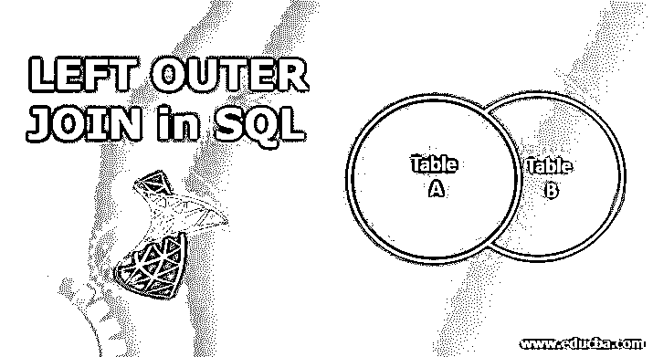
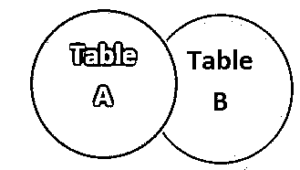
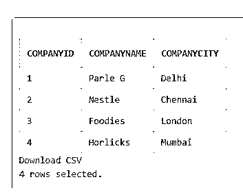
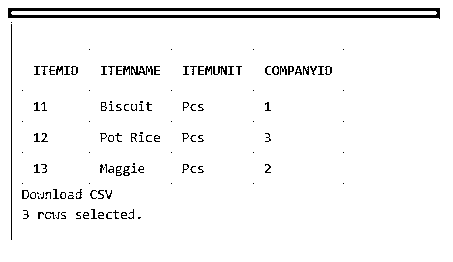
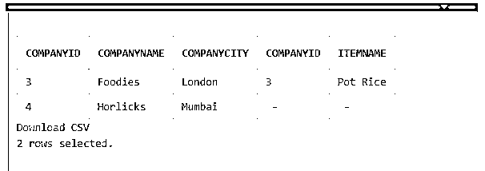
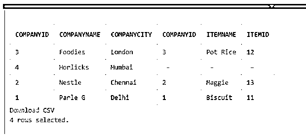

# SQL 中的左外部联接

> 原文：<https://www.educba.com/left-outer-join-in-sql/>

## SQL 左外连接简介

在 SQL 中，左外连接与左连接相同，在左连接中，我们可以在特定条件下组合两个表。根据定义，SQL Left Outer Join 关键字执行来从左表(假设表 A)中获取所有行，以及从右表(假设表 B)中获取两个表中的一些公共行。如果左表和右表之间没有匹配的公共行，则结果为 NULL，左外连接只返回左表数据。

我们可以说[是一个 SQL 内部连接](https://www.educba.com/sql-inner-join/),其中也有来自左侧表的不匹配记录。因此，它。产生与 Left Join 相同的结果，即它们在某些数据库中被视为相同，因为它们执行相同的任务，从左表返回所有行，从右表返回匹配的行。

<small>Hadoop、数据科学、统计学&其他</small>

**语法:**

让我们考虑两个表 A 和 b。

`SELECT Column1,..,ColumnN From TableA LEFT JOIN TableB ON join conditional expression WHERE row condition expression;`

**图:左外连接的图示**

例如，我们有两个表客户(客户标识，姓名，年龄，价格)和订单(OID，客户标识，金额):

如果我们将它应用于此，SQL 语句会是这样的。

`SELECT Customer.Name, Orders.Od_ID From Customer LEFT Outer JOIN Orders ON Customer.CustID = Orders.CustID ORDER BY Customer.Name;`

这里，我们从“客户”表中选择了“姓名”列，从“订单”表中选择了“OID ”,这两个表都有一个公共列“CustID ”,而所有其他行都来自左边的表，即“客户”表。如果右边的表与左边的行表不匹配，那么该列被设置为空。

但是，SQL LEFT JOIN 和 SQL LEFT OUTER JOIN 通过使用 SQL 语句来提供相同的结果。

### SQL 中的左外连接是如何工作的？

*   在 Oracle 中，连接运算符(+)有助于在两个或多个表上执行 SQL 外部连接。
*   通常，在 SQL 中，当我们合并两个表，并且希望得到的结果集只提供在外部连接之前指定的一个表中的不匹配行时，SQL LEFT OUTER JOIN 或 SQL RIGHT OUTER JOIN 是最好的选择。
*   它返回左表中的所有记录，即使两个表之间没有匹配的公共行。
*   这意味着如果 ON joins 条件没有找到任何匹配的行，那么在比较了 SQL 中执行的查询的两个表中的所有行之后，它将包含右表中的列的 NULL 值。

### SQL 中左外部连接的示例

以下示例说明了如何使用 SQL LEFT OUTER JOIN 来组合两个表:

让我们考虑两个表“CompTable”和“FoodTable”。通过以下 SQL 查询创建表:

**代码:**

`CREATE TABLE CompTable (CompanyID int NOT NULL PRIMARY KEY,
CompanyName varchar(255) NOT NULL, CompanyCity varchar(255) );`

`CREATE TABLE FoodTable ( ItemID int NOT NULL PRIMARY KEY ItemName varchar(255) NOT NULL, ItemUnit varchar(255),
CompanyID int );`

此外，让我们使用以下 SQL 语句向表中输入一些数据，我们将使用 SELECT 语句获得如下表:

**代码:**

`INSERT INTO Company (CompanyID, CompanyName, CompanyCity)
VALUES ('1', 'Parle G', 'Delhi');`

**输出:**

**代码:**

`INSERT INTO FoodTable (ItemID, ItemName, ItemUnit, CompanyID)
VALUES ('11', 'Biscuit', 'Pcs', '1');`

**输出:**

#### 示例# 1–SQL 左外连接关键字

我们考虑上面两个表。现在，我们对表 CompTable 和 FoodTable 应用 LEFT OUTER JOIN，以获取左表中的所有记录以及左表和右表之间的一些公共行。

结果集包含 left CompTable 的所有记录和与 right FoodTable 匹配的行，如果没有与任何列匹配，则用 NULL 列表示。

**代码:**

`SELECT CompTable.CompanyID, CompTable.CompanyName, CompTable.CompanyCity, FoodTable.CompanyID, FoodTable.ItemName FROM CompTable LEFT OUTER JOIN FoodTable ON CompTable.CompanyID = FoodTable.CompanyID;`

**输出:**

<u>

</u> 

#### 示例 2–WHERE 关键字和条件

**代码:**

`ELECT CompTable.CompanyID, CompTable.CompanyName, CompTable.CompanyCity, FoodTable.CompanyID, FoodTable.ItemName FROM CompTable LEFT OUTER JOIN FoodTable ON CompTable.CompanyID = FoodTable.CompanyID WHERE CompTable.CompanyID > 2;`

这里，我们对相同的表应用了 LEFT JOIN，但是使用了 SQL WHERE 关键字，并添加了一个条件，即 CompTable 表中的 CompanyID 应该大于 2。

**输出:**

#### 示例 3–ORDER BY 子句

同样，我们使用 SQL LEFT OUTER JOIN 从两个表中获取数据，方法是将它们与一些公共值、空值结合起来，并在结果集中再包含一个字段 ItemName。

**代码:**

`SELECT CompTable.CompanyID, CompTable.CompanyName, CompTable.CompanyCity, FoodTable.CompanyID, FoodTable.ItemName, FoodTable.ItemID FROM CompTable LEFT OUTER JOIN FoodTable
ON CompTable.CompanyID = FoodTable.CompanyID ORDER BY CompTable.CompanyName ASC;`

但是还有一件事，我们在查询中使用了 ORDER BY 子句，以 CompanyID 的升序从 CompTable 中产生左连接的结果。因此，对于上面的 SQL 语句，我们得到如下结果。

**输出:**

### 结论

因此，我们已经了解了将数据库中的两个或多个表组合起来以提供来自左侧表的结果以及来自右侧表的公共结果(如果匹配任何行)是非常有用的。如果没有行与正确的行匹配，则使用空值。 [SQL LEFT JOIN 允许](https://www.educba.com/sql-left-join/)通过将基于连接关键字条件的表与单个表进行比较，从多个表中查询数据。这提供了许多一对多的关系，最后，它给出了表中包含大量数据的结果集，其中大部分是重复的。

### 推荐文章

这是 SQL 中左外连接的指南。这里我们讨论介绍，例子和左外连接在 SQL 中是如何工作的？您也可以看看以下文章，了解更多信息–

1.  [SQL 子句](https://www.educba.com/sql-clauses/)
2.  [像 SQL 中的查询](https://www.educba.com/like-query-in-sql/)
3.  [NoSQL 数据库的类型](https://www.educba.com/types-of-nosql-databases/)
4.  [MySQL 中的条件](https://www.educba.com/condition-in-mysql/)

