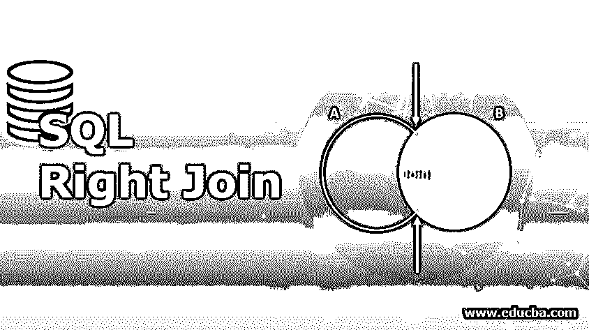
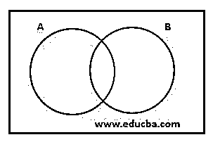
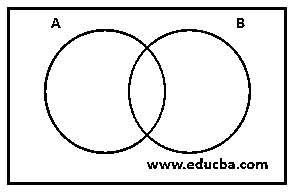
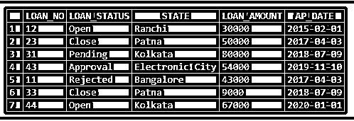
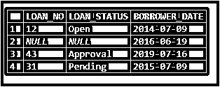
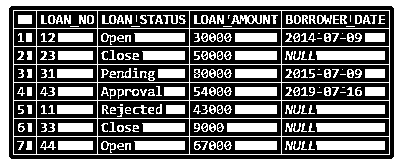

# SQL 右连接

> 原文：<https://www.educba.com/sql-right-join/>

## SQL 右连接简介

RIGHT Join 获取右表中的所有行以及两个表的公共行。在本主题中，我们将学习 SQL 右连接，所以让我们以右连接为例。

**举例:**下面代表右 Join 的维恩图。

<small>Hadoop、数据科学、统计学&其他</small>

在下图中，表 A 与表 B 右连接。在这里，表 B 中的所有行都被考虑在内，并且是两个表中的公共行。

**语法:**

`SELECT * FROM TABLE_A A
RIGHT JOIN TABLE_B B
ON A.Common_COLUMN=B.Common_COLUMN`

**完全连接:** [完全连接从两个表中获取所有的行](https://www.educba.com/sql-full-join/)。让我们举一个正确连接的例子。

**举例:**下面代表全联接的维恩图。

**语法:**

`SELECT * FROM TABLE_A A
FULL JOIN TABLE_B B
ON A. Common_COLUMN =B. Common_COLUMN`

结果集包含空集值。下面的语法可以用来忽略空值。

`SELECT * FROM TABLE_A A
FULL JOIN TABLE B B
ON A. Common_COLUMN =B. Common_COLUMN
WHERE A.Common_COLUMN IS NULL
AND A.Common_COLUMN IS NULL`

### 左连接与右连接的主要区别

下面给出了左连接和右连接的主要区别。

| **左连接** | **右连接** |
| 考虑表中的所有行和两个表中的公共行。 | 考虑右表中的所有行和两个表中的公共行。 |
| 内部联接+左侧表中的所有行 | 内部联接+右表中的所有行 |
| 基于条件的连接 | 基于条件的连接 |
| ON 关键字用于指定条件和连接表。 | ON 关键字用于指定条件和连接表。 |
| The result set contains NULL set values. Below syntax can be used to neglect the NULL values: –SELECT * FROM TABLE_A A左连接表 B BON a . Common _ COLUMN = b . Common _ COLUMN其中 B.Common_COLUMN 为空 | The result set contains NULL set values. Below syntax can be used to neglect the NULL values: –SELECT * FROM TABLE_A A右连接表 B BON a . Common _ COLUMN = b . Common _ COLUMN其中. Common_COLUMN 为空 |
| SELECT * FROM TABLE_A左连接表 BON a . Common _ COLUMN = b . Common _ COLUMN | SELECT * FROM TABLE_A右连接表 BON a . Common _ COLUMN = b . Common _ COLUMN |

**右连接**

*   右连接=右表中的所有行+内部连接
*   考虑右表中的所有行和两个表中的公共行。
*   基于条件的连接
*   ON 关键字用于指定条件和连接表。

**贷款表**

**借款人** **表**

### SQL 右连接示例

下面是 SQL 右连接的几个例子:

#### 示例#1

让我们考虑上面的两个表，并在表上应用右连接:–

查询以从两个表中获取 loan_no、status 和借方日期:-

**查询:**

`SELECT L.LOAN_NO, L.LOAN_STATUS, B.BORROWER_DATE
FROM LOAN L RIGHT JOIN BORROWER B
ON L.LOAN_NO=B.LOAN_NO
Let’s check the output of the above table after applying the right join on them.`

**输出:**

结果集包含空集值。以下语法可用于忽略空值:–

`SELECT * FROM TABLE_A A
RIGHT JOIN TABLE B B
ON A. Common_COLUMN =B. Common_COLUMN
WHERE A.Common_COLUMN IS NULL`

让我们考虑两个表，并在表上应用右连接。查询以从两个表中获取 loan_no、status、loan_aount 和借方日期。

**查询:**

`SELECT L.LOAN_NO, L.LOAN_STATUS,L.LOAN_AMOUNT, B.BORROWER_DATE
FROM LOAN L RIGHT JOIN BORROWER B
ON L.LOAN_NO=B.LOAN_NO`

在对它们应用了正确的连接之后，让我们检查一下上表的输出。

**输出:**

#### 实施例 2

让我们考虑两个表，并在表上应用右连接。查询以从两个表中获取 loan_no、status、loan_aount 和借方日期。

**查询:**

`SELECT L.LOAN_NO, L.LOAN_STATUS,L.LOAN_AMOUNT, B.BORROWER_DATE
FROM BORROWER B RIGHT JOIN LOAN L
ON L.LOAN_NO=B.LOAN_NO`

在对它们应用了正确的连接之后，让我们检查一下上表的输出。

**输出:**

在上表中，贷款是右表，借款人是左表。就像在 RIGHT join 中一样，我们得到了 inner join+右表中的所有行。在这里，我们从 LOAN 表中获取所有行，并将这些行与借款者表进行内部连接。不存在的值将为空。

### 结论

为了获取与客户需求相关的数据，我们可能需要连接将通过连接实现的表。如前所述，连接用于从多个表中获取数据。要连接多个表，我们需要两个表中至少有一个公共列。基于指定的条件连接表。

### 推荐文章

这是一个 SQL 右连接的指南。这里我们讨论 SQL 右连接的基本概念和例子，以及左连接和右连接的主要区别。您也可以看看以下文章，了解更多信息–

1.  [SQL 中的组合键](https://www.educba.com/composite-key-in-sql/)
2.  MySQL 中的[表](https://www.educba.com/table-in-mysql/)
3.  [SQL 键](https://www.educba.com/sql-keys/)
4.  [和 SQL 中的](https://www.educba.com/and-in-sql/)

