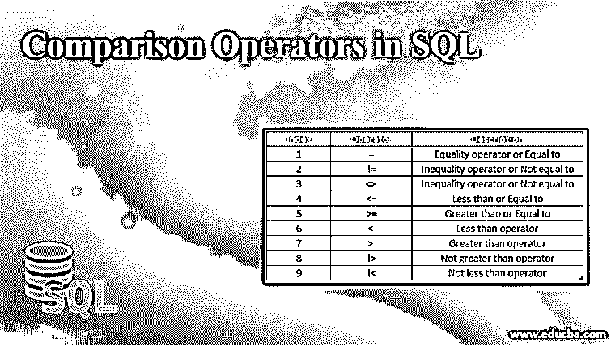
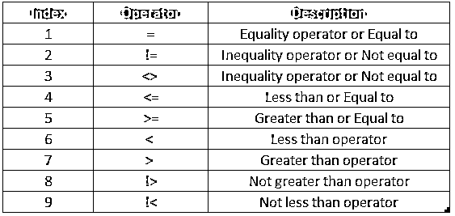

# SQL 中的比较运算符

> 原文：<https://www.educba.com/comparison-operators-in-sql/>

## SQL 中的比较运算符简介

SQL 中的比较运算符是用于比较表达式值的关系运算符。这些表达式可以是变量或列名、常数值、标量函数、SQL 查询片段或它们的组合。这些运算符用于测试值的不等性或相等性。在 SQL 或任何其他查询语言(如 Hive)中，可以在 WHERE 子句中使用这些操作符过滤掉大数据块。根据比较运算符的结果，这有助于关注满足特定条件的数据。此外，这些运算符还用于以下情况..或 IF-ELSE 语句，根据某些指定的条件形成一组记录。

常用的关系或比较运算符列表如下:

<small>Hadoop、数据科学、统计学&其他</small>

上述运算符包括关系运算符和高级运算符，它们在 SQL 编码中经常使用。这种支持正在从大量数据中获得有用的见解。

### SQL 中的各种比较运算符

现在让我们通过相关的例子来详细了解其中的每一个。

#### 1.相等或相等运算符

等于或等于运算符用于检查值是否等于一个表达式。

**语法:**

`expression = variable/another expression/constant ;`

#### 2.不等于或不等于运算符

不等式或不等于运算符用于检查表达式或查询中的值是否不相等。实现这一点的两种方法是使用！=或者<>。感叹号！表示“不”<>这表示“既不小于也不大于”，因此意味着不等于运算。

**语法:**

`Expression !=  variable/another expression/constant ;
Expression <>  variable/another expression/constant ;`

#### 3.小于或等于运算符

小于或等于运算符检查右侧值的表达式“小于或等于”。

**语法:**

`Expression <=  variable/another expression/constant ;`

#### 4.大于或等于运算符

大于或等于运算符检查表达式是否“大于或等于”右侧的值。

**语法:**

`Expression >= variable/another expression/constant ;`

#### 5.小于运算符

小于运算符检查表达式是否“小于”右侧的值。

**语法:**

`Expression <  variable/another expression/constant ;`

#### 6.大于运算符

大于运算符检查右侧值的表达式“大于”。

**语法:**

`Expression >  variable/another expression/constant ;`

#### 7.不大于运算符

不大于运算符检查表达式是否“不大于”右侧的值。这意味着该值可以小于或等于右边的表达式。

**语法:**

`Expression !>  variable/another expression/constant ;`

#### 8.不小于运算符

不小于运算符检查表达式是否“不小于”右侧的值。这意味着该值可以大于或等于右边的表达式。

**语法:**

`Expression !< variable/another expression/constant ;`

让我们考虑一个“雇员”数据的例子。这个雇员数据包含这些雇员的雇员 Id、名字、姓氏和出生日期。可以有不同的数据表，其中必须评估关键绩效指标(KPI)。我们将对它们进行如下的比较操作，以从中获得重要的见解。

### SQL 中比较运算符的示例

创建一个雇员表并向其中插入五条记录:

**查询:**

`Create table employee
(
Employeeid Int,
Lastname varchar(50),
Firstname varchar(50),
Birthdate date
);
Insert into employee
(Employeeid, lastname, firstname, birthdate)
Values
(1, ‘Debby’, ‘John’, ‘1990-02-02’),
(2, ‘Oliver’, ‘Jacob’, ‘1972-10-11’),
(3, ‘Jenner’, ‘Arnold’, ‘1968-11-01’),
(4, ‘Schmit’, ‘Ray’, ‘1971-08-09’),
(5, ‘Jason’, ‘Dawn’, ‘1986-02-10’)
);`

**查询:**

`Select * from employee;`

**输出:**

要获取 1971 年 1 月之前出生的雇员，查询是:

**查询:**

`SELECT employeeid, lastname, firstname, birthdate FROM employee where birthdate <= '1971-01-01';`

**输出:**

以下查询可用于获取出生日期不超过 1968 年 12 月 8 日的雇员。

**查询:**

`SELECT employeeid, lastname, firstname, birthdate FROM employee where
birthdate !> '1968-12-08';`

**输出:**

要返回填写了出生日期的雇员，查询将删除没有出生日期的案例，

**查询:**

`SELECT employeeid, lastname, firstname, birthdate FROM employee where birthdate <> '';`

**输出:**

**T2】**

 **为了返回出生于 1960 年和 1970 年之间的雇员，该查询使用了大于和小于运算符:

**查询:**

`SELECT employeeid, lastname, firstname, birthdate FROM employee where birthdate >= '1960-01-01' and birthdate <='1980-12-31';`

**输出:**

### 比较运算符的重要性

1.  这些运算符允许在 INSERT、UPDATE 和 SELECT 语句中有限地使用其他逻辑运算符(如 OR 或 AND)来开发精确的查询。
2.  这有助于轻松比较数值、非数值或日期字段数据值。
3.  这些操作符与各种版本的 SQL 数据库兼容，如并行数据仓库、Azure SQL 数据库、Azure SQL 数据仓库、SQL Server 2008 和更高版本。
4.  处理缺失值是数据库管理中的一项重要任务。比较运算符(如等式和不等式运算符)有助于筛选出满足该条件的记录。
5.  使用 sum()、min()、max()、avg()等对大型数据集执行的聚合也可以使用比较运算符进行比较或筛选。

### 结论

比较运算符保留字便于比较包含表中各种值的表达式的值。这些操作符使得数据分析和汇总易于执行和理解。开发人员也一直在 SQL 和其他 DML 查询中使用这些。本文重点介绍了比较运算符的用法和语法，比较运算符广泛用于将 SQL 作为一种语言的数据分析中。然而，这些操作符是语言不可知的，并且在所有语言中几乎是相同的。

### 推荐文章

这是 SQL 中比较运算符的指南。这里我们讨论 SQL 中的简介和各种比较操作符，以及不同的例子和重要性。您也可以阅读以下文章，了解更多信息——

1.  [SQL 中的 TOP](https://www.educba.com/top-in-sql/)
2.  [SQL 中的唯一键](https://www.educba.com/unique-key-in-sql/)
3.  [SQL 中的 LTRIM()](https://www.educba.com/ltrim-in-sql/)
4.  [SQL 中的左外连接](https://www.educba.com/left-outer-join-in-sql/)

**