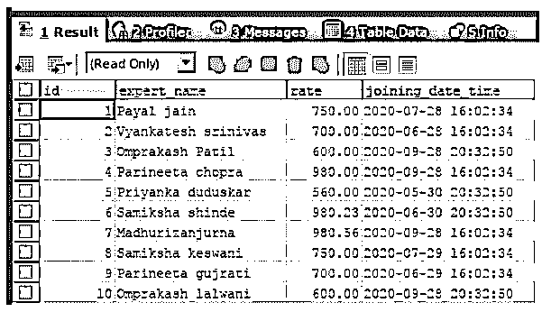
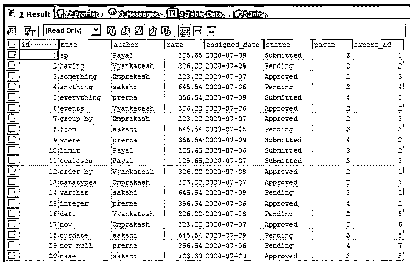
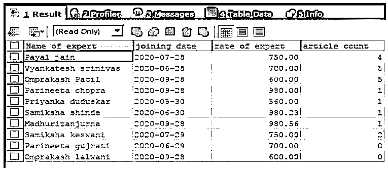
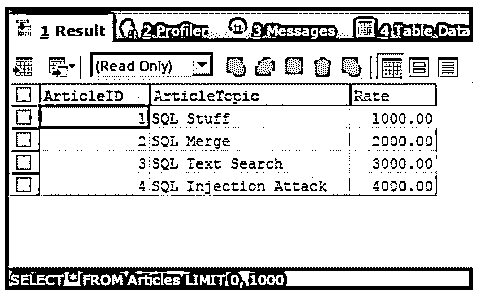
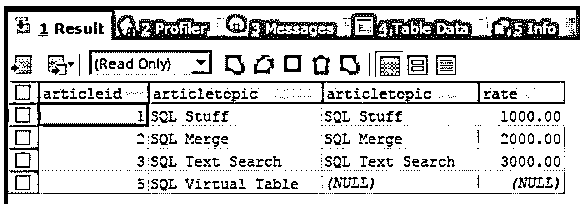

# SQL 左内部联接

> 原文：<https://www.educba.com/sql-left-inner-join/>

## SQL 左内连接简介

SQL LEFT INNER JOIN 是一种可用于检索左侧表的所有记录的连接类型，也就是说，紧接在 from 子句后面的表名以及其中左连接和右连接的所有匹配记录。当我们必须通过组合两个或多个表的记录来找出数据时，就要使用联接。左内连接专门用于这样的情况:无论右表中是否存在匹配的记录，都应该总是检索左表中的所有记录。

左边的表是其名称在 from 子句之后指定的表，而其名称放在 join 关键字之后的表在应用任何连接时都被视为右边的表。如果右表中有匹配的记录，那么也检索它的内容，如果没有找到这样的匹配记录，那么对于从右表中检索的那些列，检索空值。

<small>Hadoop、数据科学、统计学&其他</small>

### SQL 左内部连接的语法

下面给出了左内部联接的语法:

`SELECT table name1.column name1,table name1.column name2,table name2.column name1,....
FROM table name1
LEFT JOIN table name2
ON table name1.matching_column name = table name2.matching_column name;`

左内连接中 INNER 关键字的指定是可选的，因为默认情况下，左连接被视为 SQL 中的左内连接。因此，表名 1 是我们的左表名，表名 2 是左内连接的右表名。因为我们必须检索组合了两个表的结果集，所以检索两个表的列名，如上面的语法所示；列记录的检索方式是，指定表名，然后指定要检索其值的列名，只需用点分隔它们。

所有要检索的列值都用逗号隔开。此外，在语法的 on 子句中提到了从两个表中找到匹配记录所基于的列。

### SQL 左内部连接示例

让我们考虑我的 educba 数据库中的两个现有表，名为 educba_experts，其中存储了所有专家的记录及其详细信息。另一个名为 educba_articles 的表存储了已分配给专家的文章及其状态的详细信息。为了查看这两个表的结构和内容，我们将使用以下查询语句:

**代码:**

`SELECT * FROM `educba_experts`;`

**输出:**

**

** 

**代码:**

`SELECT * FROM `educba_articles`;`

**输出:**

现在，我们必须从专家表中检索所有记录，然后检索分配给这些专家的文章数。与专家相关的详细信息可以从 educba_experts 表中检索，而文章的计数(如果存在专家的话)可以通过对表 educba_articles 执行连接来检索。在这种情况下，因为我们必须检索专家的记录，而不管是否有任何文章分配给他/她，所以我们必须使用 left inner join。

**代码:**

`SELECT
a.expert_name AS "Name of expert",
DATE(a.joining_date_time) AS "joining date",
a.rate AS "rate of expert",
COUNT(b.id) AS "article count"
FROM
`educba_experts` a
LEFT JOIN `educba_articles` b
ON a.id = b.expert_id
GROUP BY a.id;`

**输出:**

正如我们所观察到的，检索了所有专家的详细信息，比如专家的姓名、他/她的加入日期、专家的等级以及表 educba_articles 中的文章总数。由于在表 educba_articles 中没有为 parineeta gujrati 和 Omprakash Lalwani 命名的专家找到 extry，因此为他们检索 NULL 值，并且 NULL 的计数为零，因此为 educba_articles 中没有记录的专家检索 0 值。因为我们必须根据专家的 id 对文章计数进行分组，所以我们对别名“a”的 id 列上的结果集进行了分组，这是 educba_experts 的别名。

让我们通过考虑两个表，借助另一个例子来理解左内连接的实现。首先，考虑两个名为 Articles 和 UpdatedArticles 的现有表，其内容和结构如以下查询语句的输出所示。

**代码:**

`SELECT * FROM Articles;`

**输出:**

**代码:**

`SELECT * FROM UpdatedArticles;`

**输出:**

现在，我们必须检索表 updated articles 的所有记录，而不管在表 articles 中是否找到匹配。

**代码:**

`SELECT
a.articleid,a.articletopic , b.articletopic,b.rate
FROM
`UpdatedArticles` a
LEFT JOIN `Articles` b
ON a.articleid = b.articleid ;`

上述查询语句的执行给出了如下所示的输出，其中包含在 articles 表中找不到匹配条目的空值。

**输出:**

### 结论

我们可以通过简单地在语法中指定 left join 来利用 LEFT INNER JOIN。它有助于检索左表的所有记录，而不管在右表中是否找到与之匹配的记录。如果没有找到匹配的记录，则为右表的列值检索空值。

### 推荐文章

这是一个 SQL 左内连接的指南。这里我们分别讨论 SQL LEFT INNER JOIN 的介绍和例子。您也可以看看以下文章，了解更多信息–

1.  [SQL DECODE()](https://www.educba.com/sql-decode/)
2.  SQL 中的[列](https://www.educba.com/column-in-sql/)
3.  [SQL 中的存储过程](https://www.educba.com/stored-procedure-in-sql/)
4.  [SQL SELECT DISTINCT](https://www.educba.com/sql-select-distinct/)

