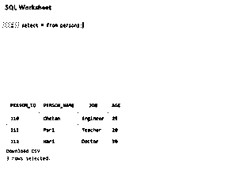
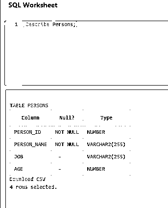

# SQL Plus 命令

> 原文：<https://www.educba.com/sql-plus-command/>

## SQL Plus 命令简介

*   以下文章提供了 SQL Plus 命令的概要。SQL plus 术语被定义为提供 Oracle RDBMS 访问的命令行工具。该 SQL plus 支持任何用户输入 SQL plus 命令来组成 SQL plus 环境。
*   此外，我们可以使用这个 SQL plus 命令来启动或中断 Oracle 数据库。它建立到 Oracle 数据库的连接，并插入和运行 SQL 命令和 PL/SQL 块。
*   之后，这个 SQL plus 作为一个命令工具，允许为用户设计和打印查询结果。SQL plus 命令存在于各种平台上。

### SQL plus 命令解释

*   众所周知，SQL plus 命令是一个与每个 Oracle 数据库安装相关联的协作和批处理查询工具。该命令由命令行用户界面、iSQL plus 以 web 为中心的用户界面和 Windows GUI(图形用户界面)组成。
*   此外，在维护 OCI 即时客户端的平台上，SQL plus 即时客户端也是可用的，这是一个单独的命令行界面。该 SQL plus 即时客户端与任何现有的 Oracle 数据库相关，但它的 Oracle 数据库安装不是强制性的。您可以查看基于 OCI 即时客户端的 Oracle Call Interface 程序员指南，了解更多信息。
*   SQL plus 命令拥有自己的命令和环境，提供对 Oracle 数据库的访问。它允许用户键入并运行 SQL、PL/SQL、操作系统和 SQL plus 命令来完成以下活动:

1.  格式化、执行计算、存储和打印查询结果。
2.  最后，观察这个表以及对象定义。
3.  创建和实现批处理脚本
4.  执行数据库管理

*   此外，还可以实现 SQL plus 来生成相关的报告，以批处理方式生成报告，并将结果生成文本文件、HTML 文件，以便在互联网上浏览和显示。此外，借助 SQL plus 的 HTML 输出能力，甚至借助 SQL plus 执行网页提供的脚本的生动的报告能力，也可以有力地生成报告。
*   在 form SQL plus 10.2 中，不支持与 Oracle7 数据库的连接。

### 标准 SQL 命令

SQL plus 命令在脚本和格式化能力方面得到了改进，可以实现简单的基本功能，用于多种不同的目的。因此，以下操作可通过 SFirst，concern 执行:

1.  关注选择查询并显示结果。
2.  接下来，插入、删除和更新数据库表中的数据记录。
3.  最后，PL/SQL 块被提交给 Oracle 服务器执行。
4.  生成 DDL 语句，如创建、更改或删除数据库对象(如表、索引和用户)以及 Oracle 支持的其他类型的 SQL 语句。
5.  实施 SQL*Plus 脚本文件
6.  将输出编程到外部文件。
7.  运行存储在数据库中的程序和功能。

SQL plus 命令及其功能列表如下所示:

<small>Hadoop、数据科学、统计学&其他</small>

1.  **/** :执行缓冲区中的当前 SQL 命令，类似 RUN。
2.  **ACCEPT** :接受来自操作符的值，并将其插入到变量中。
3.  **APPEND** :将文本添加到缓冲区中 SQL 语句当前行的末尾。
4.  **AUTOTRACE** :跟踪 SQL 语句的执行方案，统计数据。
5.  **BREAK** :配置 SQL 命令结果的结构化行为。
6.  **BTITLE** :在 SQL 声明的打印输出中的每一页的底部放置一个标题。
7.  **CHANGE** :替换 SQL 语句当前行的文本，包括新的文本。
8.  **清除**:清除缓冲器。
9.  **列**:交换查询的输出列的外观。
10.  **COMPUTE** :对从 SQL 语句恢复的表行执行计算。
11.  **CONNECT** :连接到另一个 Oracle 数据库服务器，或者连接到另一个用户名下的类似 Oracle 数据库。
12.  **复制**:将一个数据库表中的数据复制到同一个或不同数据库中的其他表中。
13.  **DEL** :删除缓冲区中当前可用的行。
14.  **DESCRIBE** :列出具有表格数据类型的表格列。
15.  **EDIT** :通过 emacs 或 vi 等外部编辑器编辑缓冲区中的当前 SQL 命令。
16.  **退出**:退出 SQL plus 程序。
17.  **GET** :加载一个 SQL 声明到缓冲区；但是，不实现它。
18.  **HELP** :获取在某些 SQL plus 命令安装中找到的帮助。
19.  **主机**:下降到 OS shell。
20.  **输入**:给缓冲区中的 SQL 声明添加单行或多行。
21.  **LIST** :列出缓冲区中占优势的 SQL 语句。
22.  **退出**:终止 SQL plus 的程序。
23.  **REMARK** :在 REMARK 关键字后面放置一条注释。
24.  **【pRUN**:运行缓冲区中的当前 SQL 声明。
25.  **保存**:将当前的 SQL 声明保存到脚本文件中。
26.  **设置**:将特定变量设置为新值。
27.  **显示**:显示给定变量的当前值。
28.  **SPOOL** :它将 SQL 声明的结果发送到一个文件中。
29.  **START** :加载位于脚本文件中的 SQL 命令，然后执行该 SQL 命令。
30.  **计时**:用于为性能研究的 SQL 命令的执行计时。
31.  **TITLE** :在打印输出的每一页的顶部放置一个 SQL 命令的标题。
32.  **取消定义**:删除一个自定义变量。

### SQL plus 命令示例

用户会发现这个 SQL plus 命令是一种简单的编码语言。假设，为了重命名由名为 FamilyName 的标题组成的标记为 LastName 的表列，要输入的命令是:

`COLUMN LastName HEADING ‘FamilyName’;`

同样，我们将插入下面的命令来查看特定表的列定义:

`DESCRIBE TableName;`

假设我们有一个名为 Persons 的示例数据库表，其中包含 id、姓名、工作和年龄字段。该表如下:

`SELECT * FROM Persons;`

**输出:**

现在，让我们使用如下 SQL plus 命令:

`Describe Persons;`

**输出:**

### 结论

SQL plus 命令是一种易于使用的语言。SQL Plus、PL/SQL 和 SQL 命令语言足够权威，可以满足数据库经验不多的操作员的需求，但对于可能正在学习使用 Oracle 数据库的新手来说也足够直接。

### 推荐文章

这是一个 SQL Plus 命令指南。在这里，我们讨论 PL/SQL 和 SQL 命令语言，它们被认为是足够权威的，可以满足操作员的需求。您也可以看看以下文章，了解更多信息–

1.  [SQL now](https://www.educba.com/sql-now/)
2.  [SQL DENSE_RANK()](https://www.educba.com/sql-dense_rank/)
3.  [SQL 同义词](https://www.educba.com/sql-synonyms/)
4.  [SQLite 函数](https://www.educba.com/sqlite-functions/)

