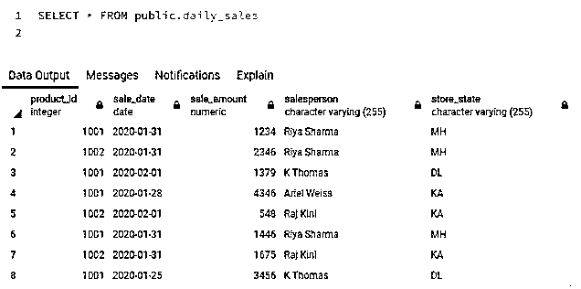
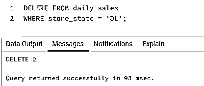
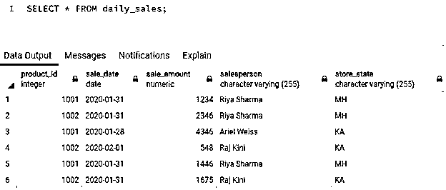
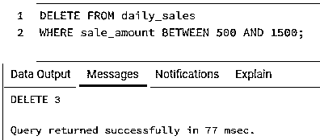
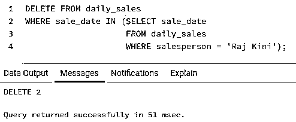

# SQL 删除行

> 原文：<https://www.educba.com/sql-delete-row/>

## SQL 删除行简介

标准查询语言(SQL)中的 DELETE 语句用于从数据库表中删除一行或多行。它是一种数据操作语言(DML)语句。这意味着它不会永久删除数据记录。我们总是可以执行回滚操作来撤消删除事务。通过 DELETE 语句，我们可以使用 WHERE 子句来过滤特定的行。还有一些其他语句，如 SQL 中的 DROP 和 TRUNCATE table，也用于从数据库中删除数据。

### 句法

现在让我们讨论一下用于删除 SQL 中的行的语法和参数:

<small>Hadoop、数据科学、统计学&其他</small>

`DELETE FROM table_name WHERE condition;`

#### 因素

该语法中使用的参数如下:

**Table_name:** 这是要从中删除一行或多行的表的名称。

**Condition:** 这是在 WHERE 子句中使用的条件表达式，用于过滤一行或多行以进行删除。

### DELETE TABLE、TRUNCATE TABLE 语句和 DROP TABLE 语句之间的区别

让我们看看不同之处:

| **删除表格** | **截断表格** | **下降表** |
| 从表中删除一个或多个数据行的 DELETE 语句。 | 从表中删除所有数据行的 SQL 语句。 | 删除表中所有记录并同时销毁表的 SQL 语句。 |
| 它是一种数据操作语言(DML)语句。 | 它是一种数据定义语言(DDL)语句。 | 它是一种数据定义语言(DDL)语句。 |
| 因为这是一个 DML 命令，所以我们可以使用 WHERE 子句。 | 我们不能使用 WHERE 子句。 | 我们不能使用 WHERE 子句。 |
| 我们可以执行回滚操作来撤消 DELETE table 语句。 | 我们不能执行回滚操作来撤消 TRUNCATE table 语句。 | 我们不能执行回滚操作来撤消 DROP table 语句。 |
| 表格行不会被永久删除。 | 表格行被永久删除。 | 表及其所有关系、索引、特权等将被永久删除。 |

### 实现 SQL 删除行的示例

讨论了 DELETE 语句中使用的语法和参数之后，让我们继续尝试一些例子来更详细地理解这个概念。

为了理解前面的例子，考虑下面的虚拟表“daily_sales”。该表包含销售的产品、销售人员、销售日期、金额等详细信息。与百货商店的日常销售有关。为了便于说明，请看下图。

**代码:**

`SELECT * FROM public.daily_sales`

**输出:**

#### 示例#1

假设 departmental store 的德里(DL)商店已经永久关闭，我们必须从日常销售表中删除与其相关的所有记录。

**代码:**

`DELETE FROM daily_sales
WHERE store_state = 'DL';`

**输出:**

**解释:**为了删除德里商店的详细信息，我们在 DELETE 语句中使用了 WHERE 子句来过滤 store_state 为 DL 的行。如上图所示，我们刚刚编写的 SQL 查询已经成功删除了 store_state 为 DL 的所有行。

对于那些想知道我们是否删除了正确的行的好奇的人，我们可以使用一个简单的 SELECT 语句来检查它。

可以清楚地看到，属于 DL 存储的所有行都已被成功删除。现在，我们在 daily_sales 表中只有来自 MH 和 KA 的条目。

#### 实施例 2

假设一个数据输入专家错误地输入了从 500 到 1500 的所有 sale_amount 条目，我们的任务是从 daily_sales 表中删除所有这样的行。

**代码:**

`DELETE FROM daily_sales
WHERE sale_amount BETWEEN 500 AND 1500;`

**输出:**

**解释:**我们已经成功删除了所有有任何错误输入的行，即 sale_amount 在 500 到 1500 之间。接下来，我们可以自己检查所需的行是否已经从 daily_sales 表中删除。对于外行，我们可以使用 SELECT 语句获取表中的所有记录。

我们可以看到，与 500 到 1500 之间的 sale_amount 相关的所有行都已从表中删除。

#### 实施例 3

假设在“Raj Kini”销售的那一天创建的所有条目都是错误的，我们的任务是从 daily_sales 表中删除所有这样的行。

**代码:**

`DELETE FROM daily_sales
WHERE sale_date IN (SELECT sale_date
FROM daily_sales
WHERE salesperson = 'Raj Kini');`

**输出:**

**解释:**这个例子是为了说明在 DELETE 语句中使用子查询作为 WHERE 子句的一部分。当然，查询必须已经从表中删除了所有需要的行。

现在，您可能会自豪地说，您已经学会了 SQL 中删除所需行的新语句。

### 结论

SQL DELETE 命令是一个数据操作语言(DML)命令，用于从数据库表中删除一行或多行。它临时删除行，因此该语句可以回滚。

### 推荐文章

这是一个 SQL 删除行的指南。这里我们讨论一个 SQL 删除行的介绍，语法，差异和各自的例子。您也可以浏览我们的其他相关文章，了解更多信息——

1.  [SQL IN 运算符](https://www.educba.com/sql-in-operator/)
2.  [SQL 中的 roll up](https://www.educba.com/rollup-in-sql/)
3.  [SQL 子查询](https://www.educba.com/sql-subquery/)
4.  [MySQL 子查询](https://www.educba.com/mysql-subquery/)

