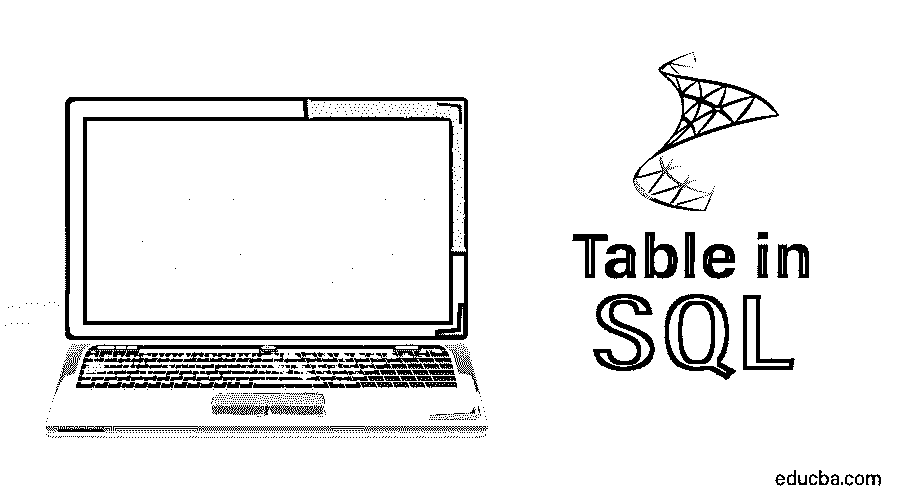

# SQL 表

> 原文：<https://www.educba.com/table-in-sql/>

## SQL 中表的介绍

SQL 中的表可以描述为数据或记录的集合，它们应该以行和列的格式排列。在数据库中，表应该是有限数量的；列应该是有限的，而行可以是无限的，因为列代表字段，行代表数据或记录。表最常用的 SQL 命令是 Create、delete、Rename & Alter。

### 如何用 SQL 创建表？

创建表格的语法如下:

<small>Hadoop、数据科学、统计学&其他</small>

`CREATE TABLE table_name (
COLUMN1 datatype PRIMARY KEY,
COLUMN2 datatype,
COLUMN3 datatype,
......
);`

让我们创建如下表“学生”:

`CREATE TABLE STUDENTS (
ROLL INT PRIMARY KEY,
NAME VARCHAR (50),
AGE INT,
SUBJECT VARCHAR (50)
);`

我们可以向“学生”表中插入值，如下所示:

`INSERT INTO STUDENTS VALUES (8,'Ram',12,'ENG');
INSERT INTO STUDENTS VALUES (11,'Priya',11,'MATH');
INSERT INTO STUDENTS VALUES (9,'Rahul',10,'SCIENCE');`

插入数据后，我们可以看到插入到表中的数据如下:

`SELECT * FROM STUDENTS;`

| **角色** | **名称** | **年龄** | **主题** |
| Eight | 随机存取存储器(random access memory 的缩写)ˌ随机访问内存(random-access memory 的缩写) | Twelve | 英语 |
| Eleven | 普里亚 | Eleven | 数学 |
| Nine | 拉胡尔 | Ten | 科学 |

### 如何在 SQL 中删除表？

删除表的语法如下:

`DROP TABLE table_name;`

`DROP TABLE STUDENTS;`

上面的查询将删除表“STUDENTS”，即该表的数据和表定义将被删除。因此，在执行 drop 语句之前，我们需要非常小心，因为与该表相关的所有信息都将从数据库中删除。

### 如何在 SQL 中删除表？

当我们使用不带 WHERE 子句的 DELETE 语句时，表中的所有行都将被删除，但表的结构将保持不变。其语法如下所示:

`DELETE FROM table_name;`

delete 语句在 SQL 中用于删除当前存在于表中的记录。每当需要时，如果我们不想要某些记录，就使用 delete 语句和 Where 子句来删除这些记录。其语法如下所示:

`DELETE FROM table_name WHERE [condition];`

`DELETE FROM STUDENTS WHERE SUBJECT= ‘MATH’;`

上述查询将提供以下结果:

| **角色** | **名称** | **年龄** | **主题** |
| Eight | 随机存取存储器(random access memory 的缩写)ˌ随机访问内存(random-access memory 的缩写) | Twelve | 英语 |
| Nine | 拉胡尔 | Ten | 科学 |

### 如何在 SQL 中重命名表？

碰巧在我们创建了表之后，我们想给它重新命名。ALTER TABLE 语句用于重命名表。

`ALTER TABLE table_name RENAME TO table_name_new;`

如果我们想改变表名“学生”,可以这样做。

`ALTER TABLE STUDENTS RENAME TO STUDENT_NEW;`

### 如何截断表格？

当需要删除表中的数据以及表结构(如列等)时。，需要保持原样，我们可以使用 TRUNCATE 语句，该语句只删除表中的数据而不删除表。

使用 TRUNCATE 语句的语法如下:

`TRUNCATE TABLE table_name;`

`TRUNCATE TABLE STUDENTS;`

上面的查询将从表“STUDENTS”中删除数据。执行截断操作后，该表如下所示:

`SELECT * FROM STUDENTS;`

| 卷 | 名字 | 年龄 | 科目 |
|  |  |  |  |
|  |  |  |  |
|  |  |  |  |

也就是说，我们可以说 TRUNCATE 语句执行相同的操作，这可以使用 DELETE 语句来完成，但不使用 WHERE 子句。

使用 TRUNCATE 语句的优点是我们不需要删除表并重新创建表。此外，在我们不需要担心回滚的情况下，这是从表中清除记录的有效方法。

### 如何在 SQL 中修改表？

我们使用 ALTER table 语句来修改当前存在于表中的列。同样，使用这个语句，我们可以在表中删除或添加不同的约束。

下面是向现有表中添加新列的语法:

`ALTER TABLE table_name ADD (column_name1 datatype, column_name2 datatype... column datatype);`

让我们将另一列“地址”添加到现有的表“学生”中。

`ALTER TABLE STUDENTS ADD ADDRESS VARCHAR (50);`

`SELECT * FROM STUDENTS;`

| **角色** | **名称** | **年龄** | **主题** | **地址** |
| Eight | 随机存取存储器(random access memory 的缩写)ˌ随机访问内存(random-access memory 的缩写) | Twelve | 英语 |  |
| Eleven | 普里亚 | Eleven | 数学 |  |
| Nine | 拉胡尔 | Ten | 科学 |  |

在上面的查询中，列地址被添加到表中。

如果我们想要删除一列，可以通过下面的语法来完成:

`ALTER TABLE table_name DROP COLUMN column_name;`

让我们通过删除列地址来看看下面的例子。

`ALTER TABLE table_name DROP COLUMN ADDRESS;`

上述查询将提供以下结果。

| **角色** | **名称** | **年龄** | **主题** |
| Eight | 随机存取存储器(random access memory 的缩写)ˌ随机访问内存(random-access memory 的缩写) | Twelve | 英语 |
| Eleven | 普里亚 | Eleven | 数学 |
| Nine | 拉胡尔 | Ten | 科学 |

这里我们可以看到表被修改了，因为列地址现在已经从表“STUDENTS”中删除了。

在 ALTER 语句的帮助下，我们可以一次修改一个或多个列。

修改列的语法如下。

`ALTER TABLE STUDENTS MODIFY column_name datatype;`

`ALTER TABLE STUDENTS MODIFY SUBJECT VARCHAR (30);`

### 如何用 SQL 从表中取数据？

在 SQL 中，SELECT 语句用作从数据库的表中检索数据的灵活机制。SELECT 查询的语法如下:

`SELECT column1, column2... FROM table_name;`

在上面的查询中，我们需要放置我们想要从表中检索数据的列。如果我们想要获取所有列的数据或整个表的数据，我们可以通过使用下面的语法来实现:

`SELECT * FROM table_name;`

`SELECT * FROM STUDENTS;`

| **角色** | **名称** | **年龄** | **主题** |
| Eight | 随机存取存储器(random access memory 的缩写)ˌ随机访问内存(random-access memory 的缩写) | Twelve | 英语 |
| Eleven | 普里亚 | Eleven | 数学 |
| Nine | 拉胡尔 | Ten | 科学 |

因此，使用通配符–“*”将检索表“STUDENTS”的所有行和列。这是 SELECT 语句的最简单形式。但是，如果需要根据一些特定的条件限制数据的获取，那么我们需要使用 where 子句。其语法如下:

`SELECT column1, column2...
FROM table_name
WHERE [condition];`

让我们看看如何使用上面的查询获取指定条件下的数据。假设我们想从“学生”表中选择年龄大于 10 岁的学生名单和科目。

`SELECT ROLL, SUBJECT FROM STUDENTS WHERE AGE > 10;`

上面的查询将只限制那些年龄超过 10 岁的学生的结果。这里的“WHERE”子句将查询结果限制为指定的条件。

| **角色** | **名称** | **年龄** | **主题** |
| Eight | 随机存取存储器(random access memory 的缩写)ˌ随机访问内存(random-access memory 的缩写) | Twelve | 英语 |
| Eleven | 普里亚 | Eleven | 数学 |

### 如何在 SQL 中复制表？

我们可以使用 SELECT INTO 或 INSERT INTO 语句将数据从一个表复制到另一个表。使用 SELECT INTO 语句时，数据库不需要有数据将被复制到的目标表。但是在使用 INSERT INTO 语句的情况下，数据将被复制到的目标表应该存在于数据库中。

`SELECT * INTO table_new FROM table_old;`

上述查询会将所有列从 table_old 复制到 table_new。

另外，如果我们只想将几列从一个表复制到另一个表，我们可以使用下面的语法:

`SELECT column1, column2...  INTO table_new FROM table_old;`

让我们举一个例子，我们希望将数据从表中复制到另一个表“STUDENT_DETAILS ”,可以按如下方式执行:

`SELECT * INTO STUDENT_DETAILS FROM STUDENTS;`

应创建另一个表“学生详细信息”，如下所示:

| **角色** | **名称** | **年龄** | **主题** |
| Eight | 随机存取存储器(random access memory 的缩写)ˌ随机访问内存(random-access memory 的缩写) | Twelve | 英语 |
| Eleven | 普里亚 | Eleven | 数学 |
| Nine | 拉胡尔 | Ten | 科学 |

使用 INSERT INTO 语句复制数据的语法如下:

`INSERT INTO table_new(column1, column2... )
SELECT column1, column2... FROM table_old WHERE [condition];`

如上所述，INSERT INTO 语句要求目标表存在；首先，我们需要在数据库中创建目标表结构。在创建了表 STUDENT_DETAILS 的结构之后，我们将执行下面的查询。

`INSERT INTO STUDENT_DETAILS (ROLL, NAME, AGE)
SELECT ROLL, NAME, AGE FROM STUDENTS
WHERE SUBJECT = ‘SCIENCE’;`

上述查询将给出以下结果:

| **角色** | **名称** | **年龄** | **主题** |
| Nine | 拉胡尔 | Ten | 科学 |

我们应该注意，在使用 INSERT INTO 语句时，源表和目标表中列的数据类型必须相互匹配。

### 结论

在 RDBMS 中，表可以有效地存储、检索、维护和操作数据。通过使用不同的命令，我们可以根据业务需求来安排和操作数据。这取决于设计人员/开发人员是否能看到不同命令和操作的灵活性，以选择最适合他们的设计和实现。

### 推荐文章

这是一个 SQL 中的表的指南。这里我们讨论介绍以及如何在 SQL 中创建、删除、删除、重命名、截断、改变、获取数据和复制表。您也可以阅读以下文章，了解更多信息——

1.  [SQL 中的外键](https://www.educba.com/foreign-key-in-sql/)
2.  [SQL 中的事务](https://www.educba.com/transactions-in-sql/)
3.  [SQL 视图](https://www.educba.com/sql-views/)
4.  [SQL 中的数据库](https://www.educba.com/database-in-sql/)

