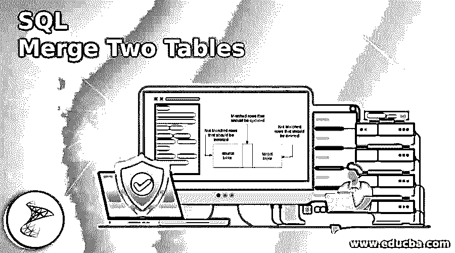
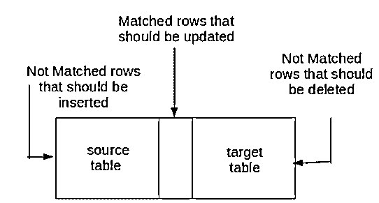
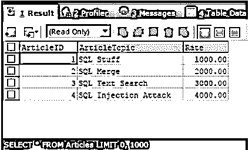
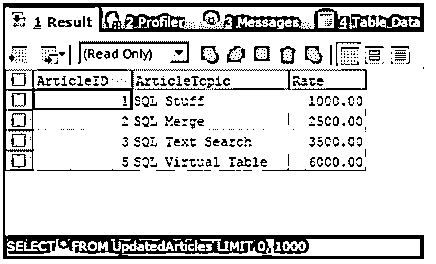
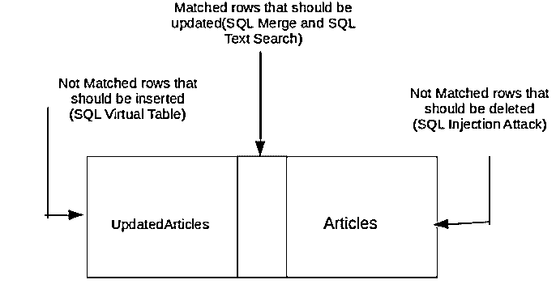

# SQL 合并两个表

> 原文：<https://www.educba.com/sql-merge-two-tables/>

## SQL 介绍合并两个表

每当有两个相关的表并充当源表和目标表时，源表中的任何变化都会导致目标表内容的变化。为了在源表发生任何变化时对目标表进行更改，我们可以在 SQL 中使用 merge 语句，这有助于我们一起执行 insert、update 和 delete 语句，作为单个查询执行的一部分。

无论何时使用 merge 语句修改源语句，我们都可以执行所有三个操作，包括删除、插入和更新目标表。在本文中，我们将了解 merge 语句的语法，并借助多个示例了解其实现。

<small>Hadoop、数据科学、统计学&其他</small>

### SQL 合并两个表的语法

SQL 中 MERGE 语句的语法如下所示。

`MERGE <target table> [AS TARGET] USING <source table> [AS SOURCE] ON <search_condition>
[WHEN MATCHED
THEN <merge the matched records> ] [WHEN NOT MATCHED [BY TARGET] THEN <perform merge operations when matching record is not found in the target table> ] [WHEN NOT MATCHED BY SOURCE
THEN <perform merge operations when matching record is not found in the source table> ];`

在上面的语句中，我们可以使用 merge 语句根据目标表和源表中匹配或不匹配的记录一起执行任何更新、插入和删除操作，这些记录是通过在两个表的列内容上指定条件(如 join)进行比较的，并根据使用一个 merge 语句来决定在什么条件下应该对所有可能的匹配和不匹配执行哪个操作。

在上述语法中，目标表是在条件比较结果出现时要对其执行操作的表的名称。源表是表的名称，其更改将作为一个事件，通过执行 merge 语句引起目标表中的更改。搜索条件可以是由逻辑运算符分隔的多个条件，例如 AND 和 OR，类似于联合语句 on 子句中的条件规范。

此外，根据所指定的条件的结果，流程将被转移到匹配的案例、不匹配的案例(按目标或源),并执行所需的操作。

该图演示了合并两个表时的操作

### SQL 合并两个表的例子

让我们借助一个例子来理解 merge 语句的实现。每当使用 merge 语句时，都需要标识源表、目标表以及在源语句中进行更改时需要在目标表上执行的操作。考虑两个名为 Articles 和 UpdatedArticles 的现有表，其内容和结构如以下查询语句的输出所示。

`SELECT * FROM Articles;`

上述查询语句的执行给出了如下所示的输出

`SELECT * FROM UpdatedArticles;`

上述查询语句的执行给出了如下所示的输出

现在，我们要做的是，更新的文章表中的内容应该被视为源表，每当源表中发生任何更改时，我们都必须对目标表执行操作。这里，目标表是文章表，我们必须在文章和更新的文章表之间同步数据。

可以通过将项目视为目标表并将更新的项目视为源表来使用 merge 语句。我们可以基于两个名为 article id 的表的唯一主键列进行连接和匹配，并通过匹配两个表中该列的内容来决定记录是否匹配。需要对记录进行比较的措施如下所述

*   每当在目标表中找到源表记录的匹配 id，并且发现文章主题和比率的内容不匹配且不相等时，我们就必须执行更新操作，并根据源表中该记录的内容更新目标表文章的内容。
*   当在源表中没有找到匹配的条目时，将在目标表项目上执行删除操作。
*   当在目标表中没有找到匹配的条目时，将通过从源表中复制该 id 的内容来对目标表项目执行插入操作。

因此，根据上面提到的使用单个 merge 语句在目标表上执行多个操作的要求，我们可以编写如下所示的 merge 语句，它将满足所有条件并执行必要的操作。

`MERGE Articles AS TARGET
USING UpdatedArticles AS SOURCE
ON (TARGET.ArticleID = SOURCE.ArticleID)
WHEN MATCHED AND TARGET.ArticleTopic <> SOURCE.ArticleTopic OR TARGET.Rate <> SOURCE.Rate
THEN UPDATE SET TARGET.ArticleTopic = SOURCE.ArticleTopic, TARGET.Rate = SOURCE.Rate
WHEN NOT MATCHED BY TARGET
THEN INSERT (ArticleID, ArticleTopic, Rate) VALUES (SOURCE.ArticleID, SOURCE.ArticleTopic, SOURCE.Rate)
WHEN NOT MATCHED BY SOURCE
THEN DELETE
OUTPUT $ACTION,
DELETED.ArticleID AS TargetArticleID,
DELETED.ArticleTopic AS TargetArticleTopic,
DELETED.Rate AS TargetRate,
INSERTED.ArticleID AS SourceArticleID,
INSERTED.ArticleTopic AS SourceArticleTopic,
INSERTED.Rate AS SourceRate;
SELECT @@ROWCOUNT;
GO`

上述查询语句的执行给出了如下所示的输出

我们可以观察到，id 为 2 和 3 的记录存在于两个表中，但是速率不同，因此通过在目标表上执行更新查询，源表的速率在目标表中被更新。对于 id 为 4 的更新的文章源表中没有记录，因此将其从目标表中删除，对于 id 为 5 的更新的文章目标表中插入了一条新记录，因为其中没有这样的条目。下图解释了合并两个表时执行的操作

### 推荐文章

这是一个 SQL 合并两个表的指南。在这里，我们还讨论了 sql 合并两个表的介绍和语法，以及不同的例子和代码实现。您也可以看看以下文章，了解更多信息–

1.  [对于 Unix 中的循环](https://www.educba.com/for-loop-in-unix/)
2.  [Crontab in Unix](https://www.educba.com/crontab-in-unix/)
3.  [Unix 中的数组](https://www.educba.com/array-in-unix/)
4.  [Unix 中的 VI 编辑器](https://www.educba.com/vi-editor-in-unix/)

