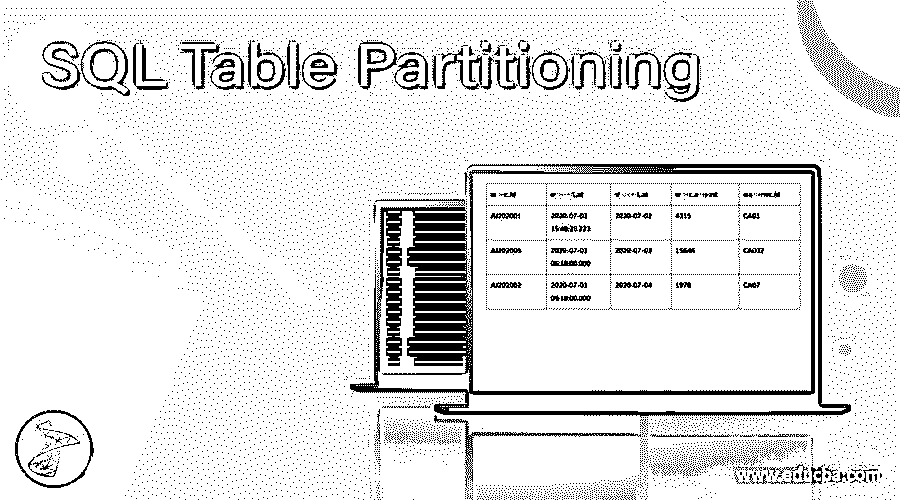
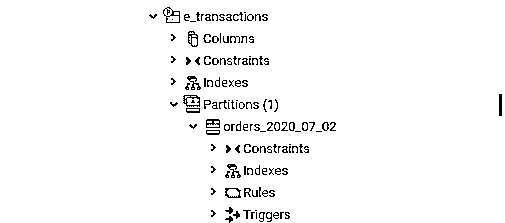

# SQL 表分区

> 原文：<https://www.educba.com/sql-table-partitioning/>

## SQL 表分区简介

标准查询语言(SQL)中的表分区是将非常大的表分成小的可管理部分或分区的过程，这样每个部分都有自己的名称和存储特征。表分区有助于显著提高数据库服务器的性能，因为需要读取、处理和返回的行数减少了。我们还可以使用分区技术来划分索引和按索引组织的表。

表分区有两种类型，即垂直分区和水平分区。在垂直分区中，我们按列划分表。而在水平分区中，我们按行划分表。

<small>Hadoop、数据科学、统计学&其他</small>

**垂直分区:**

| **e _ transactions:**

&#124; **【订单 _ id】** &#124;
&#124; **【订单 _ at】** &#124;
&#124; **【发货 _ at】** &#124;
&#124; **【订单 _ 金额】** &#124;
&#124; **【客户 _ id】** &#124;

 | **订单 _ 状态:**

&#124; **【订单 _ id】** &#124;
&#124; **【订单 _ at】** &#124;
&#124; **【运 _ at】** &#124;

 |

如上图所示，已经对 e-transactions 表进行了垂直分区，并且创建了一个名为“order_status”的新分区，其中包含 order_id、ordered_at 和 shipped_at 等列。接下来，我们来看看水平分区。

**水平分区:**

**电子交易:**

| **订单 id** | **已订购 _ 在** | **发货 _ 于** | **订单 _ 金额** | **客户标识** |
| AJ202001 | 2020-07-01 15:48:25.223 | 2020-07-02 | Four thousand three hundred and fifteen | CA01 |
| AJ202001 | 2020-07-02 10:48:00.000 | 2020-07-06 | Four thousand three hundred and fifteen | CA01 |
| AJ202004 | 2020-07-02 10:48:00.000 | 2020-07-05 | Five thousand four hundred and sixty | CA06 |
| AJ202003 | 2020-06-30 06:28:00.000 | 2020-07-02 | One thousand four hundred and sixty-two | CA05 |
| AJ202005 | 2020-07-01 06:18:00.000 | 2020-07-03 | Fifteen thousand six hundred and forty-six | CA032 |
| AJ202002 | 2020-07-01 05:10:00.000 | 2020-07-04 | One thousand nine hundred and seventy-eight | CA07 |

**分区:**

**订单 _2020 年 _06 月 _30 日:**

| **订单 id** | **已订购 _ 在** | **发货 _ 于** | **订单 _ 金额** | **客户标识** |
| AJ202003 | 2020-06-30 06:28:00.000 | 2020-07-02 | One thousand four hundred and sixty-two | CA05 |

**订单 _1_07_2020 :**

| **订单 id** | **已订购 _ 在** | **发货 _ 于** | **订单 _ 金额** | **客户标识** |
| AJ202001 | 2020-07-01 15:48:25.223 | 2020-07-02 | Four thousand three hundred and fifteen | CA01 |
| AJ202005 | 2020-07-01 06:18:00.000 | 2020-07-03 | Fifteen thousand six hundred and forty-six | CA032 |
| AJ202002 | 2020-07-01 05:10:00.000 | 2020-07-04 | One thousand nine hundred and seventy-eight | CA07 |

**订单 _2_07_2020 :**

| **订单 id** | **已订购 _ 在** | **发货 _ 于** | **订单 _ 金额** | **客户标识** |
| AJ202001 | 2020-07-02 10:48:00.000 | 2020-07-06 | Four thousand three hundred and fifteen | CA01 |
| AJ202004 | 2020-07-02 10:48:00.000 | 2020-07-05 | Five thousand four hundred and sixty | CA06 |

如图所示，当我们对表进行水平分区时，是基于特定列的值按行进行的。在本例中，我们选择 ordered_at 列的日期部分。已经准备了三个不同的分区。

**语法和参数**

使用 range 对表进行分区的基本语法如下:

**主表创建:**

`CREATE TABLE main_table_name (
column_1 data type,
column_2 data type,
.
.
. ) PARTITION BY RANGE (column_2);`

**分区表创建:**

`CREATE TABLE partition_name
PARTITION OF main_table_name FOR VALUES FROM (start_value) TO (end_value);`

上述语法中使用的参数类似于 CREATE TABLE 语句，除了这些:

`PARTITION BY RANGE (column_2) : column_2 is the field on the basis of which partitions will be created.
partition_name : name of the partition table`

FROM(start _ value)TO(end _ value):column _ 2 中的值的范围，它构成了该分区的一部分。注意 start_value 是包含性的，而 end_value 是排他性的。

这里有一个例子来进一步说明它。

### SQL 表分区的示例

假设您是一家 ecom 公司的数据工程师，每天都会收到大量订单。您通常存储 order_id、order_at、customer_id 等数据。在一个名为“电子交易”的 SQL 表中。由于该表数据量巨大，加载速度慢，返回时间长等问题。已经成为数据分析师的一个问题，他们每天都使用这个表来准备 KPI。您将如何临时制作这个表，以便数据分析师可以快速运行查询？

一个合理的步骤是将表分割成更小的部分。假设我们创建分区，使分区只存储与指定订单日期相关的数据。这样，每个分区中的数据会更少，使用它会更有趣。

我们可以使用声明性分区 ie 对表进行分区。通过使用如下所示的按范围分区(column_name)函数。

`CREATE TABLE e_transactions(
order_id varchar(255) NULL,
ordered_at date NULL,
shipped_at date NULL,
order_amount numeric(18, 0) NULL,
customer_id varchar(255) NULL
) PARTITION BY RANGE( ordered_at);`

该表已成功创建，并提供了分区。

*   #### Create table partition

接下来，让我们为电子交易表创建分区表。

`CREATE TABLE orders_2020_07_01
PARTITION OF e_transactions FOR VALUES FROM ('2020-07-01') TO ('2020-07-02');
CREATE TABLE orders_2020_07_02
PARTITION OF e_transactions FOR VALUES FROM ('2020-07-02') TO ('2020-07-03');`

我们已经成功创建了两个分区。新创建的分区可以在浏览器窗口中看到。

现在，让我们通过在 e-transactions 表中插入一些记录来检查这些表分区的功能。

`INSERT INTO public.e_transactions(
order_id, ordered_at, shipped_at, order_amount, customer_id)
VALUES (1,'2020-07-01','2020-07-02',456,'1'),
(2,'2020-07-02','2020-07-03',631,'1');`

让我们检查一下记录是否存储在指定的分区中。我们的老朋友 SELECT statement 来帮助我们了。

`SELECT * FROM orders_2020_07_01;`

`SELECT * FROM orders_2020_07_02;`

我们可以从 SELECT 查询的结果中清楚地看到，分区已经被成功地创建和使用。

*   #### Remove table partition

让我们假设我们不再需要其中一个分区。我们可以使用 ALTER 命令删除一个分区。

`ALTER TABLE e_transactions DETACH PARTITION orders_2020_07_01;`

现在，e_transactions 表只有一个分区，如下图所示:

但是，orders_2020_07_01 现在已经成为常规表了。

在这种情况下，我们使用 ALTER 命令从表中删除一个分区，但是也可以使用 DROP 命令。但是，我们应该注意，ALTER 命令在将分区表从表的分区中删除后，会将它保留为常规表，而 DROP 会将它从数据库中删除。因此，前者是最首选的命令。

### 结论

表分区是关系数据库中使用的一种方法，用于将一个巨大的表分成几个较小的部分。这有助于更快地在大型表上执行查询。

### 推荐文章

这是一个 SQL 表分区的指南。这里我们讨论简介、语法、参数、示例和代码实现。您也可以看看以下文章，了解更多信息–

1.  [SQL 选择顶部](https://www.educba.com/sql-select-top/)
2.  [SQL 集群](https://www.educba.com/sql-cluster/)
3.  [SQL 合并两个表](https://www.educba.com/sql-merge-two-tables/)
4.  [SQL 删除触发器](https://www.educba.com/sql-drop-trigger/)

