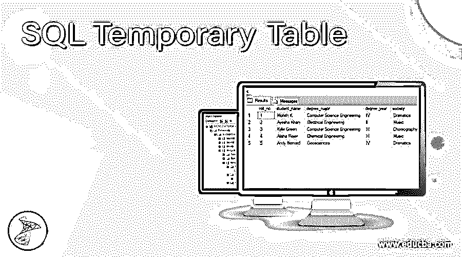
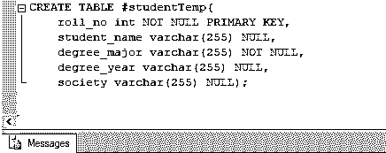
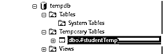
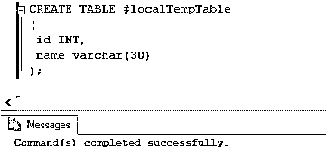
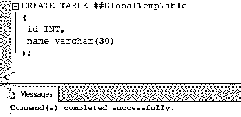

# SQL 临时表

> 原文：<https://www.educba.com/sql-temporary-table/>

## SQL 临时表简介

SQL server 中的临时表类似于用于存储中间数据记录的永久数据库表。顾名思义，这些临时表临时存在于服务器上。一旦与服务器的最后连接关闭，它们就会被删除。当我们在一个永久数据库表中有大量的行，并且我们必须频繁地使用这个表中的一些行时，临时表非常有用。我们可以从永久表中选择那些我们反复需要的特定行到临时表中，并在其上更有效地运行查询。

**语法和参数:**

<small>Hadoop、数据科学、统计学&其他</small>

创建临时表有两种方法，一种是先创建表，然后在其中插入值。类似于普通的桌子。其次，在从永久表中选择记录时创建它。下面是使用这两种方法创建临时表的基本语法。

**案例 1:使用 CREATE TABLE 语句创建临时表**

`CREATE TABLE {# | ##} temp_table_name (
column_name_1 data type CONSTRAINT,
column_name_2 data type CONSTRAINT,
.
.
.
column_name_n data type CONSTRAINT,
);`

**案例 2:使用 SELECT INTO 语句创建临时表**

`SELECT
columns_to_be_selected
INTO
{ # | ##} temp_table_name
FROM
table_name;`

上述语法中使用的参数如下:

{ # | ##}:单“#”或双“##”符号表示必须创建本地临时表或全局临时表。相应地指定“#”或“##”符号。

*   **临时表名:**要创建的临时表的名称。
*   **column_name1，… column_name_n:** 必须在临时表中创建的列以及它们的数据类型和约束(如果有的话)。
*   **columns_to_be_selected :** 必须从常规表“table_name”中选择并在临时表中创建和存储的列。

已经学习了用于创建临时表的语法和参数。

### 例子

让我们举几个例子来进一步说明这个问题。

#### 示例 1:创建一个名为 studentTemp 的临时表，将 roll_no、student_name、degree_major、degree_year 和 society 作为字段名。

`CREATE TABLE #studentTemp(
roll_no int NOT NULL PRIMARY KEY,
student_name varchar(255) NULL,
degree_major varchar(255) NOT NULL,
degree_year varchar(255) NULL,
society varchar(255) NULL);`

对于创建 studentTemp，我们使用了与上面讨论过的 CREATE TABLE 语句创建临时表相同的语法。

命令成功完成。临时表可以在 tempdb 的对象资源管理器中的临时表标题下看到。

创建了上述表之后，让我们从一个名为“students”的常规表中插入一些记录。我们使用了 INSERT INTO 和 SELECT FROM 语句。

`INSERT INTO #studentTemp
SELECT
roll_no,
student_name,
degree_major,
degree_year ,
society
FROM
dbo.students;`

填充后“studentTemp”中的数据如下所示:

`SELECT * FROM #studentTemp;`

我们可以查询类似于常规表的临时表。下面是一个简单的 SELECT 语句来说明它。

`SELECT student_name
FROM #studentTemp
WHERE degree_year = 'IV' AND society = 'Dramatics';`

#### 示例 2:使用 SELECT INTO 语句创建一个名为“studentsTemp2”的临时表。

`SELECT roll_no,
student_name,
degree_year,
degree_major,
society
INTO
#studentsTemp2
FROM students
WHERE degree_year = 'III';`

在影响学生的 Temp2 中的 2 行时，查询成功执行。如前一示例所述，可以从对象资源管理器中看到新创建的表。

### 使用临时表

它与 SQL 数据库中的常规表非常相似。

**(i)从临时表中取出记录**

`SELECT * FROM #studentsTemp2;`

`SELECT * FROM #studentsTemp2
WHERE student_name LIKE '%Green%';`

**(ii)修改现有的临时表**

`ALTER TABLE #studentsTemp2
ADD home_town VARCHAR(50);`

我们在 studentsTemp2 表中添加了一个新列。新创建的列可以在下图中看到。

`SELECT * FROM #studentsTemp2;`

**(iii)更新临时表中的列值**

让我们更新 roll_no '3 '的 home_town 列的值。

`UPDATE #studentsTemp2
SET home_town = 'New York'
WHERE roll_no = '3';`

该栏已成功更新。

`SELECT * FROM #studentsTemp2
WHERE roll_no = '3';`

**(iv)在临时表中插入新的一行**

`INSERT INTO #studentsTemp2
([roll_no] ,[student_name] ,[degree_year] ,[degree_major] ,[society] ,[home_town])
VALUES
(3,'Mohini Agarwal','III','Physics','Music','New Delhi')
GO`

查询成功返回。使用 SELECT 语句可以看到新插入的行。

`SELECT * FROM #studentsTemp2
WHERE roll_no = '3';`

**从临时表中删除记录**

`DELETE FROM #studentsTemp2
WHERE degree_major = 'Computer Science Engineering';`

查询成功返回。

`SELECT * FROM #studentsTemp2;`

从上面的图像中，我们可以看到被删除的行已经不在表中了。

**删除现有的临时表**

`DROP TABLE #studentsTemp2;`

命令执行成功。该表不再存在于数据库中。

`SELECT * FROM #studentsTemp2;`

### SQL 中临时表的类型

SQL 中基本上有两种类型的临时表，分别是**局部**和**全局**。在数据库服务器的同一会话期间，本地临时表仅对创建它的数据库用户可见。一旦用户断开与数据库服务器的连接，或者当他的会话结束时，这些表就会被自动删除。另一方面，全局临时表对在数据库服务器中创建的所有用户都是可见的。只有在所有用户都与数据库服务器断开连接后，这种表才会被删除。

#### (I)创建本地临时表

`CREATE TABLE #localTempTable
(
id INT,
name varchar(30)
);`

#### ㈡创建一个全球临时表

`CREATE TABLE ##GlobalTempTable
(
id INT,
name varchar(30)
);`

这两个表都存在于 tempdb 中的临时表下。

让我们尝试更改用户，看看我们是否还能访问这些表。

`SELECT * FROM ##GlobalTempTable;`

GlobalTempTable 本质上是全局的，其他用户也可以访问它。

但是其他用户无法访问 localTempTable。

`SELECT * FROM #localTempTable;`

### 结论

SQL 中的临时表类似于常规表，但本质上是临时的。一旦用户与服务器断开连接，它们就会被删除。

### 推荐文章

这是一个 SQL 临时表的指南。这里我们讨论简介、语法、参数、示例和代码实现。您也可以看看以下文章，了解更多信息–

1.  [SQL 选择顶部](https://www.educba.com/sql-select-top/)
2.  [SQL 集群](https://www.educba.com/sql-cluster/)
3.  [除 Select 之外的 SQL](https://www.educba.com/sql-except-select/)
4.  [SQL 删除触发器](https://www.educba.com/sql-drop-trigger/)

