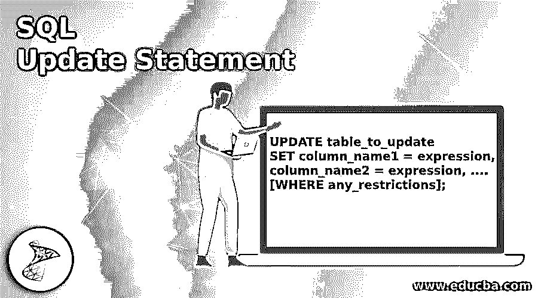
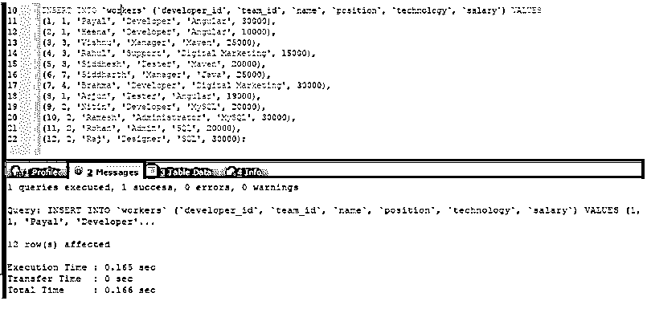
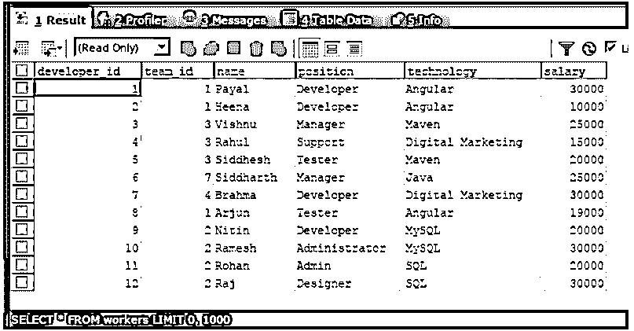
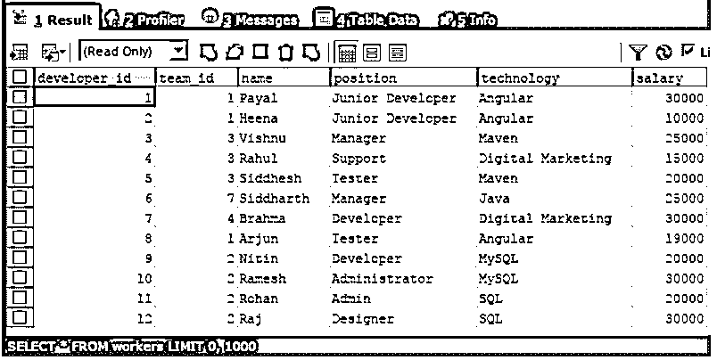
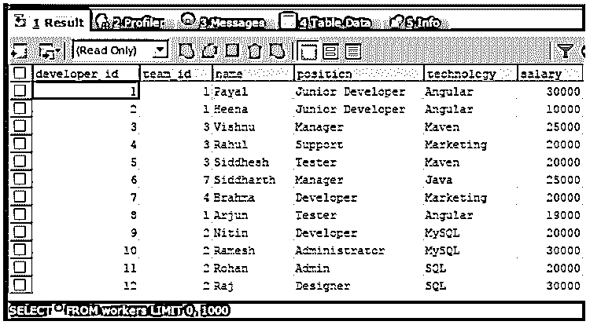

# SQL 更新语句

> 原文：<https://www.educba.com/sql-update-statement/>

## SQL Update 语句简介

SQL Update 语句是可用于修改表中现有记录的列值的语句，它允许我们同时更新一个或多个列，并且还可以控制在更新时应该考虑哪些行，是应该更新其中的一些行还是所有行，这最终导致向用户提供强大的语句，以便使用结构化查询语言来操作数据库。在本文中，我们将了解 SQL 中 update 语句的一般语法，并讨论查询的工作方式，此外，我们将举例说明如何使用 update 语句更新单个和多个列。还有一个 update 语句的扩展版本，称为 update join 语句，它帮助我们将多个表之间的交叉连接值分配给单个表的列值。

**语法:**

<small>Hadoop、数据科学、统计学&其他</small>

SQL 中 update 语句的语法如下所示

`UPDATE table_to_update
SET column_name1 = expression,
column_name2 = expression, ....
[WHERE any_restrictions];`

在上面的语法中，我们可以看到，我们可以使用 SQL 中的 update 语句指定表中需要更新的列。

*   **table _ to _ update:**table _ to _ update 是我们希望更新其列记录的表的名称。此外，我们需要在 SET 关键字后以逗号分隔的格式指定所有的列和要分配给它们的表达式。
*   **列名:** column_name1，column_name2 是列名，expression 是我们要分配给它们的值。
*   **表达式:**表达式可以是任何文字值、约束条件、涉及加、减、积、除、平方等运算的表达式的任何操作值或变量、另一个列值或在 update join 语句的情况下从另一个表的列形成的表达式。
*   **限制:**每当我们不得不提到只有满足某些条件的记录才应该从 update 语句中更新时，我们将不得不提到使用 SQL 中的 where 子句应该满足的所有条件。这些条件被称为限制。使用 where 子句是可选的。

### 在 SQL 中使用 Update 语句

当我们执行 update 语句时，子句的求值顺序与 select 查询语句的求值顺序相同。首先，执行“from”子句来检索表中的所有记录。之后，如果有 where 子句，则根据 where 子句的限制中提到的条件过滤结果集，最后执行 set 子句，以逗号分隔的格式将值分配给其中提到的列，这些值被分配给指定的表达式值。update 语句是自动提交的，因此，在更新 SQL 中的列值之前，我们应该小心。

### SQL Update 语句的示例

我们将首先演示如何使用 update 语句更新单个列值。为此，让我们创建一个名为 workers 的表，该表将包含以下创建查询中指定的六列

`CREATE TABLE `workers` (
`developer_id` int(11) NOT NULL,
`team_id` int(11) NOT NULL,
`name` varchar(100) DEFAULT NULL,
`position` varchar(100) DEFAULT NULL,
`technology` varchar(100) DEFAULT NULL,
`salary` int(11) DEFAULT NULL
);`

**输出:**

让我们在表中插入一些记录，以便在使用更新查询后检查修改。我们将使用以下查询语句在表中插入记录

`INSERT INTO `workers` (`developer_id`, `team_id`, `name`, `position`, `technology`, `salary`) VALUES
(1, 1, 'Payal', 'Developer', 'Angular', 30000),
(2, 1, 'Heena', 'Developer', 'Angular', 10000),
(3, 3, 'Vishnu', 'Manager', 'Maven', 25000),
(4, 3, 'Rahul', 'Support', 'Digital Marketing', 15000),
(5, 3, 'Siddhesh', 'Tester', 'Maven', 20000),
(6, 7, 'Siddharth', 'Manager', 'Java', 25000),
(7, 4, 'Brahma', 'Developer', 'Digital Marketing', 30000),
(8, 1, 'Arjun', 'Tester', 'Angular', 19000),
(9, 2, 'Nitin', 'Developer', 'MySQL', 20000),
(10, 2, 'Ramesh', 'Administrator', 'MySQL', 30000),
(11, 2, 'Rohan', 'Admin', 'SQL', 20000),
(12, 2, 'Raj', 'Designer', 'SQL', 30000);`

**输出:**

现在，我们将检索 workers 表的所有记录，并使用以下查询来观察内容

`SELECT * FROM workers;`

现在，我们将为属于 id 为 1 的团队并且职位为 Developer 的所有员工更新一个列，即 position 列。我们将更新这些记录，并使用以下查询语句将职位设置为初级开发人员

`UPDATE workers
SET POSITION = 'Junior Developer'
WHERE team_id = 1
AND POSITION = 'Developer';`

我们可以从输出中观察到有 2 行被更新。让我们获取 workers 表的记录，并查看哪些记录得到了更新，以及我们指定的记录的位置是否得到了更新。我们将使用以下查询来检查记录

`SELECT * FROM workers;`

我们可以看到名为 payal 和 Heena 的记录得到了更新，因为他们属于一个 id 为 1 的团队，并且他们的记录中有职位开发人员。

现在，我们将更新表 workers 的多个列。我们将设置工资为 20000 和技术营销，而不是数字营销的记录有技术数字营销。我们将使用以下查询语句来更新记录并修改两个列值

`UPDATE workers
SET technology = 'Marketing',
salary =20000
WHERE technology = 'Digital Marketing';`

为了获取记录并观察修改，我们将使用以下查询--

`SELECT * FROM workers;`

上述查询的执行给出了以下输出，其中 Rahul 和 Brahma 命名的工人受到影响

### 结论

我们可以使用 SQL 中的 update 语句来修改现有表中的两列或更多列，使一些或所有行受到影响。我们在使用更新查询时需要小心，因为更改无法恢复，并且更新查询默认设置为自动提交。

### 推荐文章

这是一个 SQL Update 语句的指南。在这里，我们还将讨论 sql 中 update 语句的介绍和工作方式，以及不同的示例及其代码实现。您也可以看看以下文章，了解更多信息–

1.  [SQL 映射](https://www.educba.com/sql-mapping/)
2.  [SQL MID](https://www.educba.com/sql-mid/)
3.  [用于循环的 SQL](https://www.educba.com/sql-for-loop/)
4.  [SQL 周](https://www.educba.com/sql-week/)

