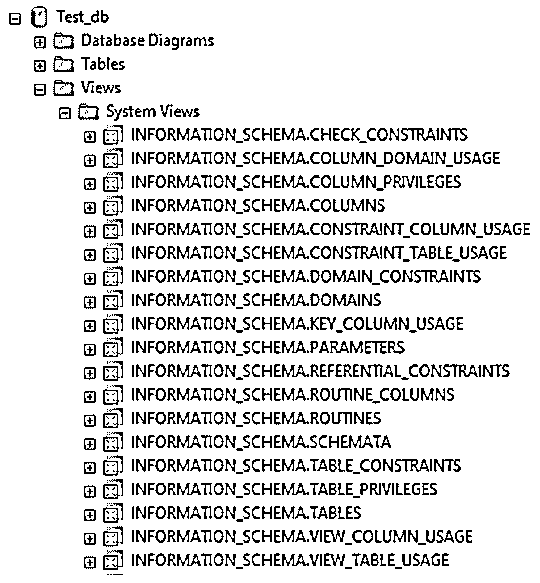
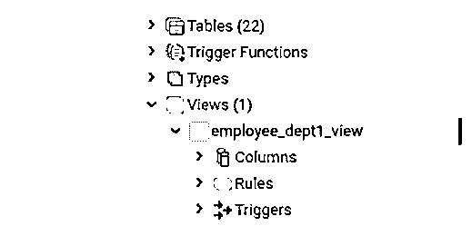

# SQL 视图的类型

> 原文：<https://www.educba.com/types-of-sql-views/>

## SQL 视图简介

标准查询语言(SQL)中的视图或多或少类似于虚拟表，用户可以通过虚拟表查看和操作数据。它们是对一个或多个数据表的预存储源查询的结果，该查询基于某些条件和连接在虚拟表中选择和存储记录。视图不构成数据库模式的一部分。但是，它反映了相关表格中所做的所有更改。

在 SQL 中，我们可以有两种类型的视图，即系统定义的视图和用户定义的视图。在用户定义的视图中，有两种广为人知的视图:

<small>Hadoop、数据科学、统计学&其他</small>

*   **简单视图**:简单视图是在单个表上创建的视图。我们只能在简单视图中执行基本的 SQL 操作。这意味着，我们不能通过分组、集合等来执行分析和聚集操作。简单来看。我们当然可以直接从一个简单的视图中执行插入、更新、删除，但是为此，我们必须在视图中有主键列。
*   **复杂视图**:复杂视图顾名思义相对于简单视图来说有点复杂。复杂视图在多个数据库表上创建。我们可以在复杂视图中执行分析和聚合操作，但是与简单视图不同，我们不能直接从复杂视图中执行插入、删除和更新操作。
*   在像 SQL server 这样的数据库中，我们也有一些系统定义的视图。它们是例程、模式、表特权、表特权、检查约束等的视图。它们是在我们创建数据库时自动创建的。以下是来自 SQL server management studio 的图像，它让我们了解了什么是系统视图:

*   还有很多，但对于这篇文章，我们保持简短。你自己去看看吧。
*   简单地说，在讨论了视图的类型之后，让我们继续讨论用于在 SQL 中创建视图的语法。

### 语法和参数

创建视图的基本语法如下:

`CREATE VIEW view_name AS query;`

上述语法中使用的参数如下:

*   **视图名称:**视图的名称
*   **查询:**通常是从数据库表中获取数据的 select 语句。该查询的结果将存储为视图。

简单视图和复杂视图的区别在于语法的查询部分。如果查询只从一个表中获取数据，并且没有任何 group by 子句，那么这将是我们的简单视图。否则，它将被称为复杂视图。接下来，让我们讨论几个例子来理解视图在 SQL 中是如何工作的，以及如何区分简单视图和复杂视图。

### SQL 视图类型的示例

为了说明简单和复杂视图的创建，我们首先需要一些基表。对于本文，我们将使用下面的表格。

雇员表中的数据如下所示:

`SELECT * FROM employee;`

第二个表中的数据如下所示:

`SELECT * FROM departments;`

现在，在这些表格的帮助下，我们准备尝试一些基于视图的例子。

#### 示例#1

为部门' D01 '创建一个包含员工详细信息的视图。

`CREATE VIEW employee_dept1_view AS
SELECT * FROM employee
WHERE department_id = 'D01';`

查询成功执行，视图已创建。我们可以在相关的数据库中看到视图。它将如下所示:

在本例中，我们创建了一个简单的视图，其中的数据仅来自一个基表。

#### 实施例 2

基于“雇员和部门”表创建一个视图，该表包含“雇员姓名”、“薪金”、“最高资格”、“部门名称”和“地点”等字段。

`CREATE VIEW employee_details AS
SELECT e.employee_name,
e.salary,
e.highest_qualification,
d.department_name,
d.location
FROM
employee as e JOIN departments as d
ON e.department_id = d.department_id;`

视图已成功创建。这种基于多个表格的视图被归类为复杂视图。下面是一个选择查询，让我们对创建的视图中的记录有所了解。

`SELECT employee_name, salary, highest_qualification, department_name, location
FROM employee_details;`

#### 实施例 3

创建一个包含每个部门最高工资记录的视图。

`CREATE VIEW employee_max AS
SELECT
d.department_id,
d.department_name,
MAX(e.salary)
FROM
employee as e JOIN departments as d
ON e.department_id = d.department_id
GROUP BY d.department_id,d.department_name;`

视图已成功创建。具有分组依据和聚合功能的视图也被归类为复杂视图。

让我们借助 SELECT 语句来看看新创建的 employee_max 视图中有什么。

`SELECT department_id, department_name, max
FROM employee_max;`

### 结论

在这篇文章中，我们讨论了 SQL 中的视图类型。SQL 中主要有两种类型的用户定义视图，简单视图和复杂视图。简单视图是在一个数据库表上创建的，而复杂视图是在多个表上创建的。

### 推荐文章

这是 SQL 视图类型的指南。在这里，我们还将讨论 SQL 视图的语法和参数，以及不同的示例及其代码实现。您也可以看看以下文章，了解更多信息–

1.  [PostgreSQL 随机排序](https://www.educba.com/postgresql-order-by-random/)
2.  [MySQL DDL](https://www.educba.com/mysql-ddl/)
3.  [SQL 窗口函数](https://www.educba.com/sql-window-functions/)
4.  [SQL 用户](https://www.educba.com/sql-users/)

