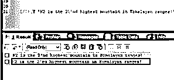
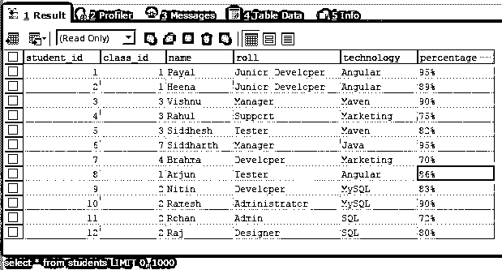
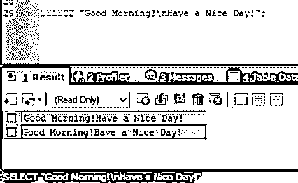
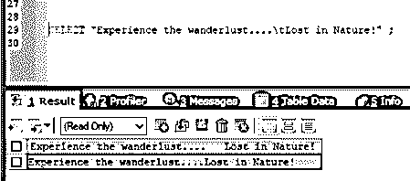

# 转义字符 SQL

> 原文：<https://www.educba.com/escape-character-sql/>

## 转义字符 SQL 简介

SQL 中的转义字符主要用在文字字符串中，在任何解释和行为需要更改的字符之前提到它们。那个字符的含义与它通常的含义是不同的。存储在数据类型为 varchar 或 string 的列中的文本字符串或字符串值在检索或使用时也被视为文本。这些文字字符串只不过是有明确开始和结束的字符序列。在 SQL 中，字符的开始和结束由单引号或双引号确定。

经常会出现这样的需要，我们希望在字符串文字之间使用单引号或双引号。如果发生这种情况，作为字符串值一部分的引号也可以被解释为分隔符。为此，我们可以使用分隔符。除此之外，还需要指定许多格式，如制表符、换行符等。分隔符也用于这些情况。在本文中，我们将借助一些例子来了解转义字符在 SQL 字符串中的用法。

<small>Hadoop、数据科学、统计学&其他</small>

### 转义字符串中的单引号和双引号

通过使用单引号和双引号来分隔字符串值，以标记开始和结束。在字符串值之间出现的任何单引号当单引号用于标记文字的开始和结束时，或者当双引号用作分隔符并且双引号用于字符串值内部时，则转义字符用于指定字符串文字内部的那些中间引号是它的一部分。SQL 中的默认转义序列值是反斜杠(\)。

让我们考虑一个使用反斜杠作为转义字符的例子。我们有一个字符串，' K2 是喜马拉雅山脉的第二高峰！这是在单引号的帮助下分隔的，字符串值包含单词 2'nd，它本身有一个单引号。现在，我们必须在 SQL 中检索字符串值作为 select 查询的输出。我们将使用简单的 select 语句来实现这一点。考虑以下查询语句–

`SELECT 'K2 is the 2'nd highest mountain IN Himalayan ranges!'`

上述查询语句的输出给出了以下输出，以及说明语法不正确的错误信息–

这是因为在分号前的字符串值之间有一个单引号，它标志着查询语句的完成

现在让我们尝试在字符串文字的第二个值中出现的单引号前使用转义符反斜杠。转义字符反斜杠将告诉它后面的单引号是字符串文字的一部分，而不是分隔符。为此，我们将使用以下查询语句

`SELECT 'K2 is the 2\'nd highest mountain in Himalayan ranges!'`

上述查询语句的输出给出了以下结果

正如我们所观察到的，输出包含了预期的适当的字符串值。类似地，考虑下面的语句，该语句包含一个双引号来表示螺钉的英寸，并被括在双引号中来指定字符串的分隔符–

"我们需要一个 2 英寸的螺丝钉来把这个框架挂在上面的墙上."

该语句在 SQL 中的使用，例如，在下面的 SELECT 查询中--

`SELECT "We will need a 2" screw to hang this frame on the above wall.";`

上述查询语句的输出给出了以下结果

现在考虑双引号前的用法转义字符，它在 2 后面提到所需的螺钉英寸数。

`SELECT "We will need a 2\" screw to hang this frame on the above wall.";`

上述查询语句的输出给出了以下结果

将转义字符用于其他用途–

在 SQL 中，转义字符有多种用法，有助于改变 SQL 查询语句中字符的含义和解释。其中一些如下所列

引号(")–\ "

换页–\ f

实线(/)-\/

水平制表符–\ t

回车符-\ r

新行-\ n

退格–\ b

反向实线(\)–\ \

下划线(_)–\ _

百分位(%)–\ %

让我们考虑一个名为 students 的现有表，它具有以下结构和内容，如以下查询语句的输出所示

`SELECT * FROM students;`

上述查询语句的输出给出了以下结果

我们将使用 like 语句以 90%的百分比检索所有学生。为此，让我们使用下面的查询语句，该语句包含要比较的字符串中百分号容差的转义序列

`SELECT * FROM students WHERE percentage LIKE "90\%";`

上述查询语句的输出给出了以下结果

现在，我们将使用我们必须打印句子“早上好！”在第一行，在新的一行之后，应该有问候的句子“祝你有美好的一天！”.我们将使用下面的查询语句，在转义符反斜杠和' n '字符的帮助下定义新行，它们共同指定新行。由于输出是以行和列的格式显示的，我们将看不到新的一行。但是，一旦您将输出内容复制并粘贴到任何编辑器或记事本上，它将向您显示以下输出

`SELECT "Good Morning!\nHave a Nice Day!";`

上述查询语句的输出给出了以下结果

让我们再举一个例子，在这个例子中，我们必须得到含有句子“迷失在自然中！”在一个制表符和句子“体验旅游癖…”.为此，我们将使用以下带有转义字符的查询语句来提及制表符–

`SELECT "Experience the wanderlust....\tLost in Nature!" ;`

上述查询语句的输出如下所示

### 结论–转义字符 SQL

SQL 中的转义字符帮助我们改变某些字符的含义及其解释，这些字符通常被用作通配符，其中一些在上面的例子中已经讨论过。

### 推荐文章

这是一个转义字符 SQL 的指南。这里我们讨论字符串中的转义单引号和双引号以及例子。您也可以看看以下文章，了解更多信息–

1.  [MySQL sum()](https://www.educba.com/mysql-sum/)
2.  [SQL NTILE()](https://www.educba.com/sql-ntile/)
3.  [SQL 行号](https://www.educba.com/sql-row_number/)
4.  [SQL 重命名表](https://www.educba.com/sql-rename-table/)

