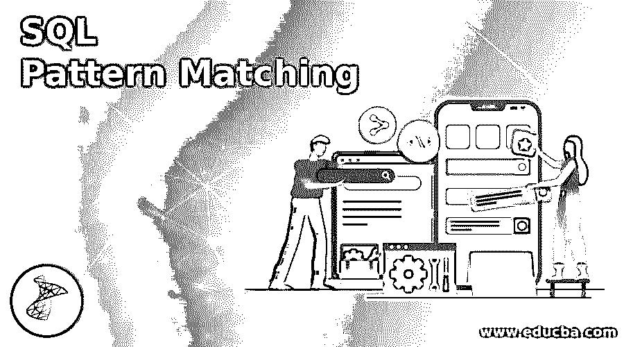

# SQL 模式匹配

> 原文：<https://www.educba.com/sql-pattern-matching/>

## SQL 模式匹配简介

我们可以使用 SQL 中的 LIKE 操作符匹配字符串并检查其与不同模式的匹配，LIKE 操作符是一种逻辑操作符，它比较字符串并搜索满足并匹配使用各种常规和通配符指定的模式的部分。包含二进制类型、varchar 类型和文件数据的字符串、文本和列值或变量可用于将它们与正则表达式进行匹配。如果找到匹配，LIKE 运算符返回 true，如果字符串与指定的模式不匹配，则返回 false。

使用 LIKE 运算符的模式匹配主要用在查询语句的 WHERE 子句中，以筛选出包含具有特定值或模式或与特定值或模式匹配的列值的结果集。在本文中，我们将学习使用 LIKE 操作符来匹配列和变量的值或内容，它的语法，以及演示其实现的一些示例。

<small>Hadoop、数据科学、统计学&其他</small>

### 句法

LIKE 运算符的语法如下所示:

`column name or expression LIKE pattern [ESCAPE character to be escaped]`

**解释:**其中，列名或表达式可以是特定表中要与模式匹配的列的名称，也可以是任何变量，或者是不同函数和列或变量的组合，它们产生最终值要与模式匹配的特定表达式。我们甚至可以提供匹配时要跳过的字符，方法是在 ESCAPE 关键字后指定要转义的字符，这也是一个可选的事情。提及我们想要用来匹配表达式的模式是必需的，并且必须被指定。LIKE 运算符可用于查询语句中的匹配，包括 SELECT、INSERT、UPDATE 和 DELETE 语句。

### SQL 模式匹配是如何工作的？

下面是 SQL 模式匹配的工作原理:

#### 模式说明

我们必须用来匹配表达式的模式可以是常规字符和通配符的序列。通配符在匹配表达式时提供了灵活性和多样性。常规字符是我们要搜索的字母和数字的字符串，而通配符可以是下列字符之一:

带有百分位签名(%)的通配符用于指定在此位置可以出现一个或多个字符。下划线字符可用于指定在指定单个下划线通配符(_)的位置可以出现任何单个字符。我们可以指定在那个地方允许出现一次的字符列表，方法是在方括号中提到它们[逗号分隔的允许字符列表]。

我们甚至可以通过在方括号[starting character–ending character]中提到范围内的开始和结束字符来指定允许字符在指定范围内出现一次的范围。或者，我们也可以允许存在不在指定范围内的单个字符，方法是在方括号中提到要排除的范围，方括号中的前缀是^字符[^].

### 实现 SQL 模式匹配的示例

下面是提到的例子:

#### 示例 1:转义字符

我们可以选择指定一个字符作为转义字符。我们可以使用这个转义字符来表示通配符被认为是常规字符。这可以通过简单地在通配符前面加上转义字符来实现。使用 LIKE 将表达式与模式匹配时，只能指定一个转义字符。

**步骤 1:** 让我们通过使用包含以下记录的名为 dictionary 的表来考虑这个例子:

**代码:**

`SELECT * FROM dictionary;`

**输出:**

**第 2 步:**现在，我们必须搜索在它们的含义列值中包含“word”字符串的记录。为此，我们将使用以下包含 LIKE 函数的查询。

**代码:**

`SELECT * FROM dictionary WHERE meaning LIKE "%word%";`

**输出:**

**步骤 3:** 使用下划线(_)通配符来指定指定字符串或字符之间的单个字符，我们将考虑一个示例，在该示例中，我们将只从字典表中获取与 I 和 I 之间的字符串匹配的记录，I 和 I 之间可以有任意字符，并且指定下划线。我们的模式是“%i_i%”，查询语句如下:

**代码:**

`SELECT * FROM `dictionary` WHERE meaning LIKE "%i_i%";`

**输出:**

**解释:**包含上述记录的输出被检索，因为在这些输出中出现了诸如“附加”、“起源”、“书写”、“相似”和“原创”之类的单词，这些单词在两个 I 字符之间只有一个字符，并且该模式之前和之后的任何单词和字符都由%通配符指定。

#### 示例 2:与转义符的规范相匹配

**步骤 1:** 考虑以下名为 questions 的表，该表包含名为 question 的列，该列中有以下内容，如输出所示:

**代码:**

`SELECT * FROM questions;`

**输出:**

**步骤 2:** 现在，我们必须搜索所有包含百分位字符的记录。但是由于% character 是一个通配符，我们将使用转义符 say /。我们的查询如下:

**代码:**

`SELECT * FROM questions WHERE question LIKE "%/%%" ESCAPE "/";`

**输出:**

### 结论

通过在 SQL 中使用 LIKE 操作符，可以将字符串、列值和表达式与特定的模式进行匹配，这有助于我们指定由不同的常规字符和通配符组成的模式。通配符的使用使得匹配和模式规范更加灵活和简单。转义字符可用于使通配符(如百分位、下划线等)的行为像常规字符一样，并通过简单地在字符前加上我们在查询中提到的转义字符，将它们视为字符串中的匹配字符。

### 推荐文章

这是一个 SQL 模式匹配指南。在这里，我们讨论了 SQL 模式匹配的介绍，语法，它是如何与查询的例子。您也可以浏览我们的其他相关文章，了解更多信息——

1.  [SQL REGEXP](https://www.educba.com/sql-regexp/)
2.  [MySQL 备份](https://www.educba.com/mysql-backup/)
3.  [MySQL 客户端](https://www.educba.com/mysql-client/)
4.  [MySQL 管理工具](https://www.educba.com/mysql-admin-tool/)

