# SQL 用户

> 原文：<https://www.educba.com/sql-users/>

## SQL 用户简介

在 SQL Server 中，可以使用 Transact-SQL 或 SQL Server Management Studio (SSMS)创建数据库用户。可以在 SQL 中创建不同类型的用户，但是在理解用户类型之前，让我们先理解用户创建流程。下面是登录到用户的创建和分配权限的流程。

### 典型的 SQL 用户工作流

下面是 SQL 用户的工作流程:

<small>Hadoop、数据科学、统计学&其他</small>

#### 1.创建登录

**步骤 1:** 首先，我们需要为一个用户创建一个登录，并导航到安全- >登录

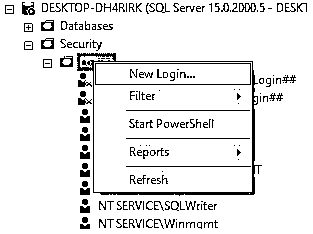

**步骤 2:** 接下来，我们输入登录名，并选择 SQL server 身份验证和密码

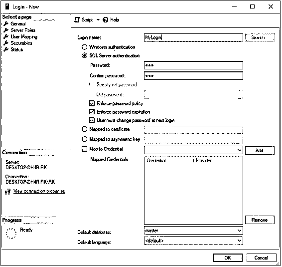

**步骤 3:** 这将创建登录

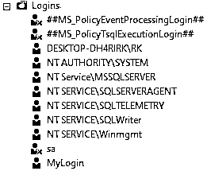

使用以下 T-SQL 命令可以获得相同的结果:

`CREATE LOGIN MyLogin WITH PASSWORD = 'abc';`

#### 2.创建用户

**步骤 1:** 要创建一个用户，首先进入对象浏览器中的数据库文件夹，并确定要为其创建用户的数据库。在安全文件夹中，有一个创建用户的选项。

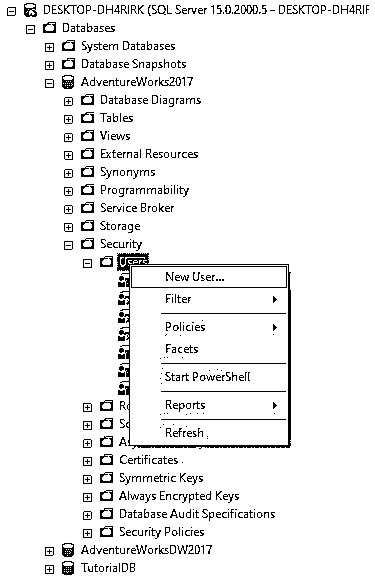

**步骤 2:** 然后您将看到以下屏幕，在该屏幕中设置用户名并选择我们刚刚创建的登录名，因为我们正在使用登录名创建 SQL user 类型的用户。

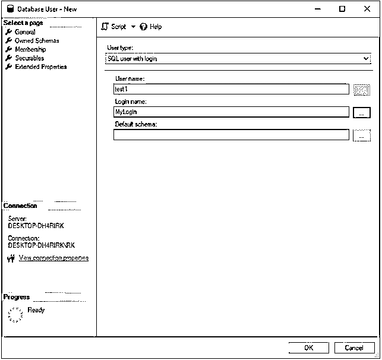

**步骤 3:** 使用下面的 T-SQL 查询可以获得相同的结果。要查看，查询单击“创建数据库用户”窗口上的“脚本”按钮，它将在查询窗口中打开。

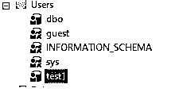

`USE [AdventureWorks2017] GO
CREATE USER [test1] FOR LOGIN [MyLogin] GO`

我们可以看到用户已创建，如果不可见，则刷新用户文件夹。

#### 3.向用户分配权限

**步骤 1:** 右键单击用户 test1 的属性，选择左侧的安全对象选项，然后单击搜索。

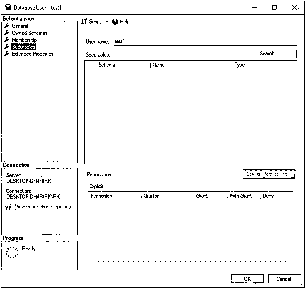

**步骤 2:** 然后我们选择所有属于该模式的对象，我们选择的模式是 dbo。我们选择了 dbo(数据库所有者),因为它拥有执行数据库所有活动的权限。

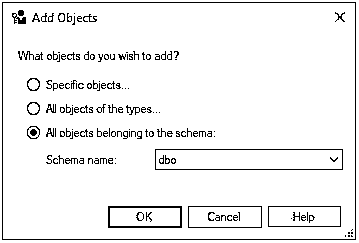

**步骤 3:** 现在选择一个表，在显式权限中，我们授予 select。

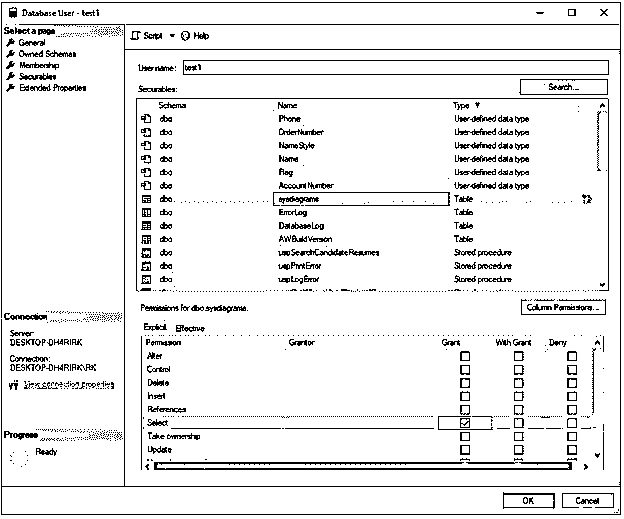

使用下面的 T-SQL 查询可以达到同样的目的

`use [AdventureWorks2017] GO
GRANT SELECTON [dbo].[sysdiagrams] TO [test1] GO`

权限将被授予用户，现在我们已经看到了用户的一般工作流程。现在我们将进入细节，看看不同类型的用户。

### 用户类型

有 3 种主要类型的用户

*   映射用户是基于 SQL Server 登录创建的用户
*   未映射用户是在没有 SQL Server 登录的情况下创建的用户
*   包含的用户是在没有 SQL Server 登录的情况下创建的用户，但用户名和密码都存储在数据库中。

现在让我们创建用户

登录的 SQL 用户

我们已经在用户创建流程中看到了这种类型

没有登录的 SQL 用户

#### 1.创建用户(Transact-SQL)

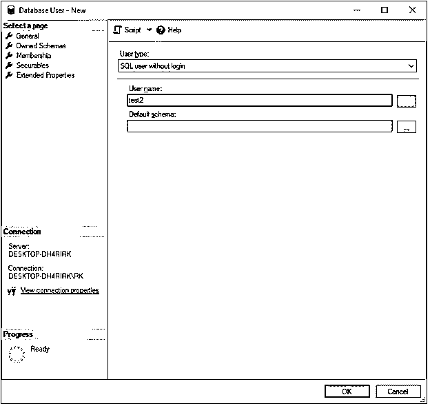

在这种类型的用户中，我们不提供任何登录信息，只给出用户名，并可以选择默认模式。

使用下面的 T-SQL 查询可以达到同样的目的

`USE [AdventureWorks2017] GO
CREATE USER [test2] WITHOUT LOGIN
GO`

**解释:**如果建立连接的人无法通过 windows(通常是组织外的人，例如连接到您的服务器的客户)的验证，则会创建基于登录的用户。对于组织内部的人来说，windows 身份验证是更好的选择，因为他们不必记住额外的密码，而且它还提供了 Kerberos 的一个特性。

#### 2.包含的用户

包含的用户与 master 数据库中的登录没有关联。这使得数据库具有可移植性，如果您希望在 SQL Server 实例之间移动数据库，这是一个不错的选择。要创建这种类型的用户，管理员必须启用 SQL Server 的包含数据库，并且应该首先启用数据库的包含。

若要启用包含，请转到服务器属性，并将“启用包含的数据库”设置为 True。

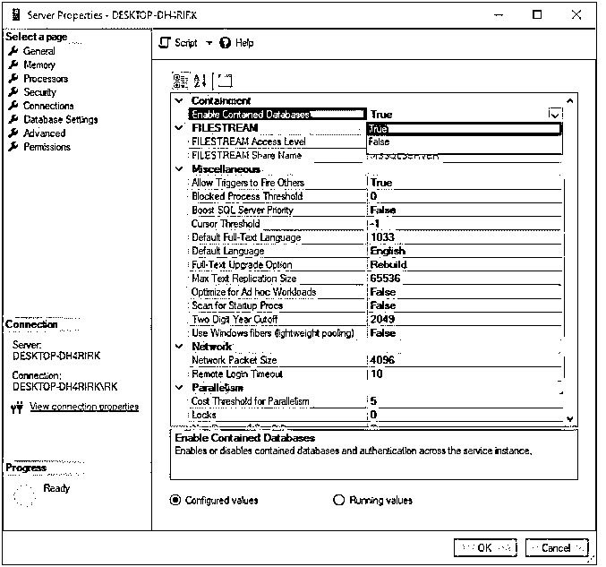

接下来，选择所选数据库定位选项部分的属性，并将包容类型设置为部分

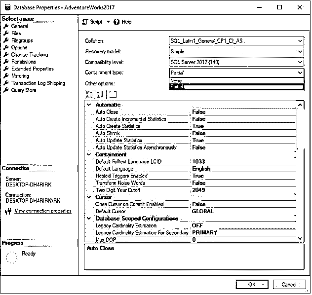

现在让我们使用带密码的 SQL 用户创建一个新用户，我们可以选择添加默认语言和选择默认模式。

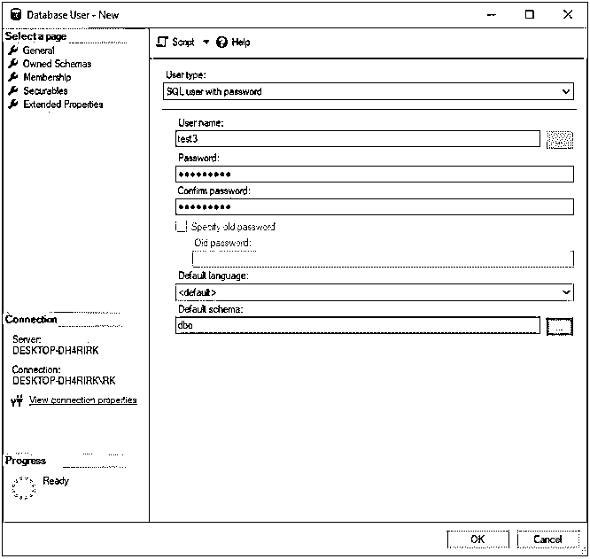

使用下面的 T-SQL 查询可以达到同样的目的

`USE [AdventureWorks2017] GO
CREATE USER [test3] WITH PASSWORD = N'Password1', DEFAULT_SCHEMA = [dbo] GO`

### 添加用户时的常规选项

根据所选的用户类型，选项可能会发生变化，有些选项有默认值，因此可以留空。

用户名–您可以输入用户名，也可以通过单击省略号(…)从类型列表中选择 Windows 用户，然后从选择用户对话框中进行选择

登录名–输入用户的登录名，或通过单击省略号(…)从对话框中进行选择，然后从选择登录名对话框中进行选择。如果选择了 Windows 用户或登录的 SQL 用户，则该选项可用。

密码和确认密码–它们用于包含的数据库，在这些数据库中，您必须输入密码以供用户进行身份验证。

默认语言–选择用户的默认语言。

默认模式–此模式将拥有用户创建的对象，或者通过单击省略号(…)从对话框中选择，并从选择模式对话框中选择。对于用户类型，它适用于 Windows 用户、有登录权限的 SQL 用户和没有登录权限的 SQL 用户

证书名称–您可以在此输入用户要使用的证书，或者通过单击省略号(…)从对话框中选择，然后从选择证书对话框中选择。对于用户类型，它适用于映射到证书的用户

非对称密钥名称–我们可以输入用户要使用的密钥，或者通过单击省略号(…)从对话框中进行选择，然后从选择非对称密钥对话框中进行选择。对于用户类型，它可用于映射到非对称密钥的用户

### 结论

因此，在本文中，我们已经了解了 SQL server 数据库中的用户创建工作流，以及我们可以在 SQL server management studio 和 T-SQL 查询中创建的用户类型。

### 推荐文章

这是 SQL 用户指南。在这里我们讨论一个 SQL 用户介绍，一步一步的工作流程，不同类型的详细解释。您也可以浏览我们的其他相关文章，了解更多信息——

1.  [MySQL 管理](https://www.educba.com/mysql-administration/)
2.  [PostgreSQL 表空间](https://www.educba.com/postgresql-tablespaces/)
3.  [PostgreSQL 集群](https://www.educba.com/postgresql-cluster/)
4.  [SQL 批量插入](https://www.educba.com/sql-bulk-insert/)

