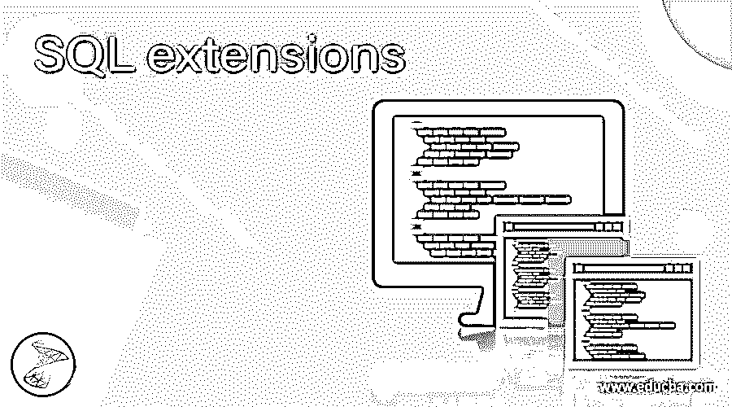
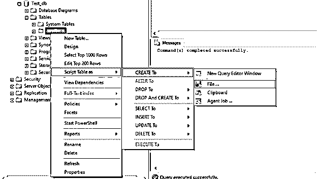
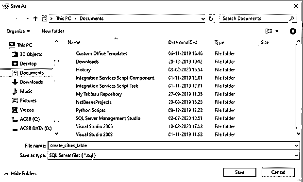
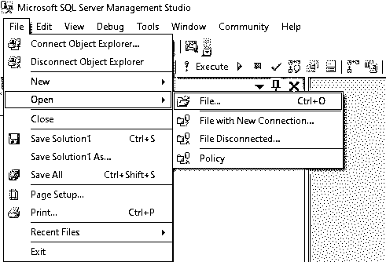
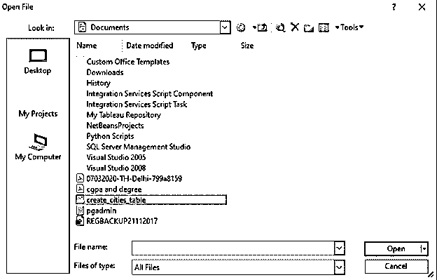
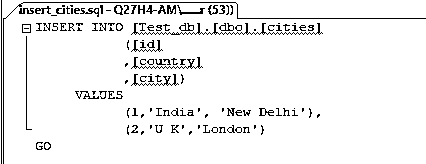
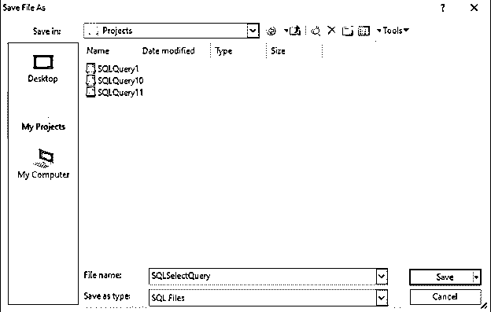

# SQL 扩展

> 原文：<https://www.educba.com/sql-extensions/>

## SQL 扩展简介

sql 扩展是用于包含标准查询语言(SQL)查询和命令的文件的文件扩展，用于创建和修改关系数据库对象。它被标识为。sql 类型。SQL 文件格式是用 ASCII 编写的。对于外行来说，它可以被认为是一个除了一组 SQL 语句之外什么都没有的平面文件。例如，在 SQL 数据库中创建、插入、提取、更新或删除数据表的语句。它不包含整个数据库。

您一定想知道我们何时以及如何使用 SQL 扩展。最经常使用的。sql 扩展是指我们必须多次运行某些查询。想象一下多次编写相同的查询。太可怕了。我们可以用。sql 扩展并打开、重新运行或编辑它 n 次，而不必一次又一次地重写整个查询。sql 扩展的另一个重要用途是备份和恢复数据库备份。一些数据库服务器如 SQL Server 和 MYSQL 支持这一点。的一个更突出的用法。sql 扩展导出用户定义的模式、函数、过程和触发器，并与其他用户共享。

<small>Hadoop、数据科学、统计学&其他</small>

### SQL 扩展的示例

接下来，让我们介绍一些基础知识，比如创建和打开带有 sql 扩展名的文件。

#### 示例# 1–创建 sql 文件扩展名

要创建一个表或模式，我们首先需要一个数据库。因此，让我们创建一个名为“Test_db”的新数据库。对此，我们可以使用以下说法。

`CREATE DATABASE Test_db;`

创建完数据库后，让我们在其中创建一个名为“cities”的表，该表包含一个带有 id 和国家的城市列表。下面是城市表的 create table 语句。

`CREATE TABLE cities (
id int NULL,
country varchar (50) NULL,
city varchar (50) NULL
);`

现在，我们已经准备好使用 extension 编写这个 create table 语句的脚本，这样我们就可以重用代码了。请遵循以下步骤了解更多信息。

**步骤 1:** 转到对象资源管理器

**第二步:**选择所需的数据库

**步骤 3:** 选择要编写脚本的表格

这里有一个图像来说明这个流程。

导航完成后，转到步骤 4。

**步骤 4:** 选择需要编写脚本的语句。

**第 5 步:**从下一个菜单中选择一个文件，用所需的名称保存脚本。在这里，文件的扩展名类型默认为。如果对你来说不是这样，那就提出来。作为文件扩展名的 sql。

#### 示例 2–打开 sql 文件扩展名

打开一个 sql 扩展类型的文件就像创建一个文件一样简单。你只需按照以下步骤。

**第一步:**进入文件菜单

**步骤 2:** 选择打开并转到文件

一个如下所示的对话框将出现在你面前。

**第三步:**选择所需。sql 文件，然后单击打开。

sql 扩展类型的文件将具有以下语句。它基本上是城市表的创建脚本。只需运行这个脚本来创建表。

`USE [Test_db] GO
/****** Object:  Table [dbo].[cities]    Script Date: 07/10/2020 12:04:49 ******/
SET ANSI_NULLS ON
GO
SET QUOTED_IDENTIFIER ON
GO
SET ANSI_PADDING ON
GO
CREATE TABLE [dbo].[cities](
[id] [int] NULL,
[country] [varchar](50) NULL,
[city] [varchar](50) NULL
) ON [PRIMARY] GO
SET ANSI_PADDING OFF
GO`

我们已经成功地从一个脚本(一个 sql 扩展类型的文件)创建了这个表。

#### 示例 3–使用。sql 文件

假设我们没有访问服务器查询编辑器的权限，但是我们想编写一个查询来将一些记录插入到 cities 表中。我们可以使用记事本、notepad++、atom、sublime、vim 等文本编辑器。查看、写入或编辑。sql 文件。

下面是一个用 notepad++编写的 INSERT 语句的例子。只需在文本编辑器中编写查询，并用。sql 扩展。

`INSERT INTO [Test_db].[dbo].[cities] ([id] ,[country] ,[city])
VALUES
(1,'India', 'New Delhi'),
(2,'U K','London')
GO`

在文本编辑器中成功编写并保存查询后，下一个任务是打开文件。所以打开。sql 文件，如上所述。查询将在查询编辑器中自动打开，如下所示。

现在执行查询，在 city 表中插入记录。让我们使用 SELECT 语句检查数据是否已经成功输入。

`SELECT * FROM cities;`

是的，已成功填充。如果您希望重新运行相同的选择查询或与您的团队成员共享它，只需保存它(通过按 Ctrl + S 或从文件菜单)。将再次出现如下所示的对话框。

只要保存它，你就可以走了。

### 结论

sql 扩展是一种文件格式，用于存储和保存 SQL 命令、查询、函数、触发器等。以便它们可以被重用和共享。

### 推荐文章

这是 SQL 扩展的指南。这里我们通过例子讨论一些基础知识，比如创建和打开一个带有 sql 扩展名的文件。您也可以看看以下文章，了解更多信息–

1.  [MySQL 存在](https://www.educba.com/mysql-exists/)
2.  [SQL NOT 运算符](https://www.educba.com/sql-not-operator/)
3.  [SQL 集群](https://www.educba.com/sql-cluster/)
4.  [SQL 删除触发器](https://www.educba.com/sql-drop-trigger/)

