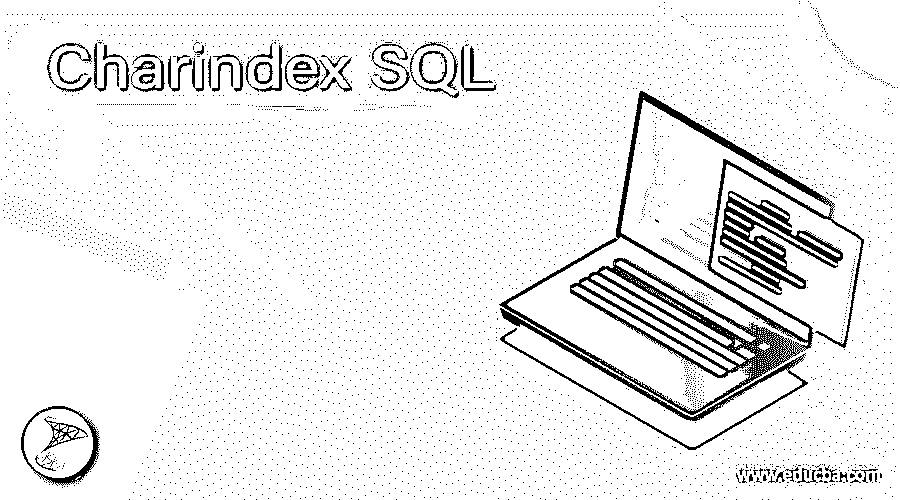
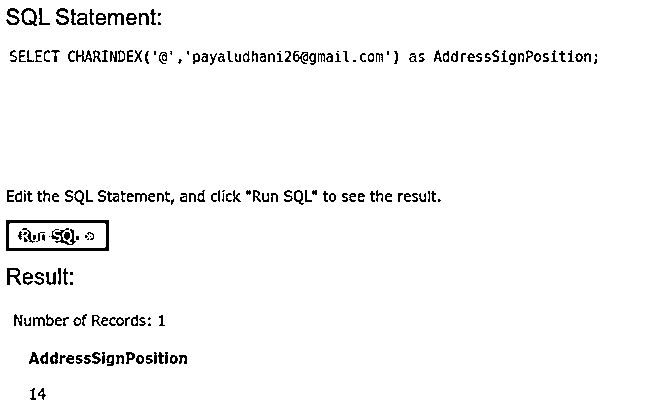
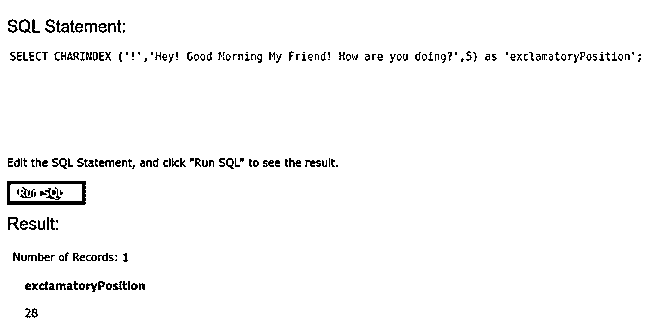
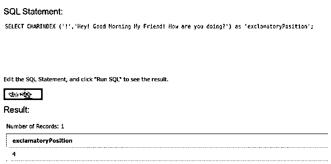
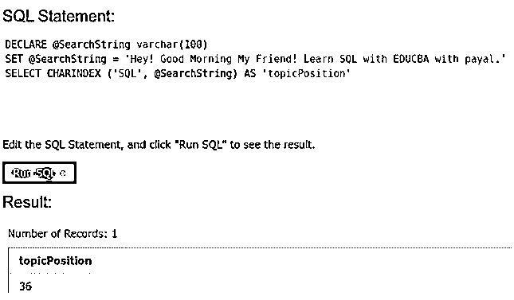
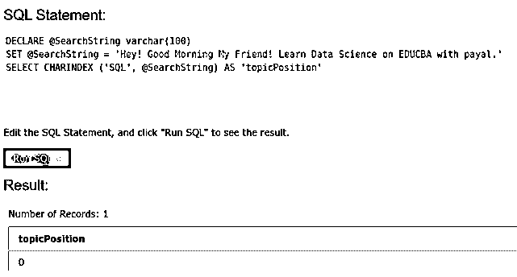

# Charindex SQL

> 原文：<https://www.educba.com/charindex-sql/>

## Charindex SQL 简介

SQL 中的 Charindex 用于搜索某个字符串或字符在其他字符串中的位置。我们可以使用这个功能来查找文本中的子字符串或特定字符的存在和位置，只需指定我们要搜索的字符串和我们希望在该字符串中搜索的字符串。此外，我们可以有选择地指定在原始字符串中开始搜索的起始位置。我们必须小心，并了解 CHARINDEX 函数的工作原理。因为如果我们在主字符串中搜索的字符串表达式的字符多次出现，那么函数将只返回所搜索的表达式的第一次出现的位置。

### 句法

CHARINDEX 函数的语法如下所示

<small>Hadoop、数据科学、统计学&其他</small>

`CHARINDEX ( Search Expression, Original Expression [, Beginning Location ] )`

搜索表达式和原始表达式参数是必需参数，需要强制提及，而第三个参数，开始位置，是可选的。搜索表达式是我们要搜索的字符串的字符，我们希望在原始字符串中找到它的位置。原始字符串是我们希望在其中搜索特定字符串的文本、字符串或字符数组。

起始位置是您指定在原始表达式中搜索表达式时应该从其开始的索引。它是可选的，因此当没有指定时，它将默认值 0 作为函数开始搜索的索引。因此，当起始位置参数中没有指定任何值时，在原始表达式中搜索搜索表达式将从原始字符串的开头开始。请注意，如果指定了起始位置参数，则该参数应该始终是代表 index 的整数值。

### Charindex SQL 函数的使用

CHARINDEX 函数从原始字符串中索引为 0 的第一个位置开始，在原始表达式内部搜索搜索表达式中指定的字符。这是在未指定起始位置参数时完成的。如果提到一个整数值作为开始位置，那么搜索表达式的搜索将从原始字符串中的索引开始，该索引将是第三个参数中指定的值。

当搜索字符串时，一旦函数遇到原始表达式中的搜索表达式值，就立即停止搜索，并从函数返回找到字符串的索引。因此，在搜索表达式在原始表达式中多次出现的情况下，如果没有指定开始位置，则仅检索被搜索表达式的第一次出现；否则，检索开始位置索引之后搜索表达式的第一个出现。

### Charindex SQL 示例

让我们考虑一个例子，我们将试图在一些电子邮件地址中找到@符号，比如 payaludhani26@gmail.com。我们必须在给定的邮件地址中找到@符号的索引。为此，我们将使用 CHARINDEX 函数，搜索表达式值为@，原始字符串参数的值为 payaludhani26@gmail.com，并且没有任何值作为开始位置，因为我们希望从原始字符串中的索引 0 开始搜索。我们的查询语句如下

`SELECT CHARINDEX ('@','payaludhani26@gmail.com') as 'AddressSignPosition';`

在执行查询语句后，它会给出以下输出–

让我们考虑一些其他的例子；我们有一串“嘿！早上好，我的朋友！你过得怎么样？”.我们必须在上面的字符串中寻找感叹号的第二个位置。为此，我们必须跳过搜索字符串中第一个匹配项的索引，在我们的例子中是 4。因此，我们将从索引 5 开始搜索感叹号，将起始值参数指定为 5，并将搜索表达式指定为'！'用值为“嘿！早上好，我的朋友！你过得怎么样？”.我们的查询语句如下

`SELECT CHARINDEX ('!','Hey! Good Morning My Friend! How are you doing?',5) as 'exclamatoryPosition';`

这在执行后给出了以下输出–

如果我们在上面的例子中直接搜索感叹号，而不是指定开始位置，那么我们的查询语句应该如下所示

`SELECT CHARINDEX ('!','Hey! Good Morning My Friend! How are you doing?') as 'exclamatoryPosition';`

执行上述查询的输出如下

现在让我们在主字符串中搜索 ceratin 子字符串，而不是字符。考虑下面的例子，我们将要搜索的字符串存储在一个变量中，然后在 CHARINDEX 函数中指定它，如下所示

`DECLARE @SearchString varchar(100)
SET @SearchString = 'Hey! Good Morning My Friend! Learn SQL with EDUCBA with Payal.'
SELECT CHARINDEX ('SQL', @SearchString) AS 'topicPosition'`

上述语句的执行给出了以下输出，结果位置为 36，这是 SQL 在所提供的字符串中的位置。

让我们看看如果被搜索的字符串或字符不在原始字符串中会发生什么。考虑下面的例子——

`DECLARE @SearchString varchar(100)
SET @SearchString = 'Hey! Good Morning My Friend! Learn Data Science on EDUCBA with Payal.'
SELECT CHARINDEX ('SQL', @SearchString) AS 'topicPosition'`

这给出了位置为 0 的以下输出，这意味着搜索字符串不可用。

### 结论

我们可以使用 SQL 中的 CHARINDEX()函数找出原始字符串中特定字符或子字符串的存在和位置。此外，我们可以通过指定索引来自定义搜索，通过指定起始位置，我们的表达式的搜索应该在原始字符串中开始，起始位置也是一个代表 index 的整数值。

### 推荐文章

这是一个 Charindex SQL 的指南。在这里，我们将讨论 Charindex SQL 的工作方式、示例以及语句和输出。您也可以看看以下文章，了解更多信息–

1.  [MySQL 拆分](https://www.educba.com/mysql-split/)
2.  [SQL 临时表](https://www.educba.com/sql-temporary-table/)
3.  [SQL 表分区](https://www.educba.com/sql-table-partitioning/)
4.  [SQL NOT 运算符](https://www.educba.com/sql-not-operator/)

