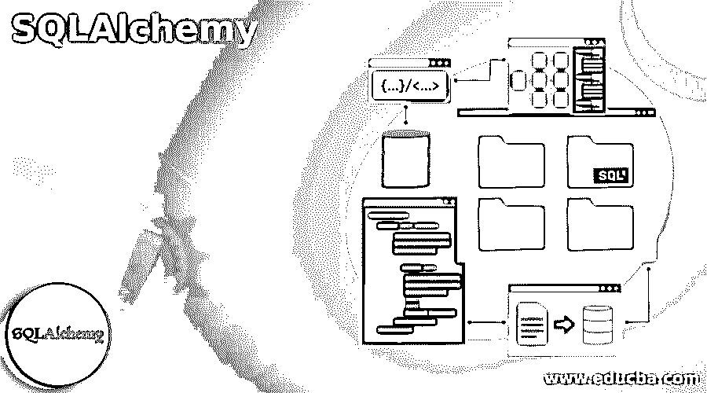
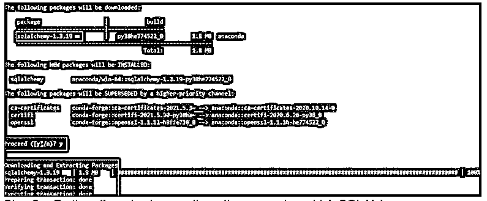
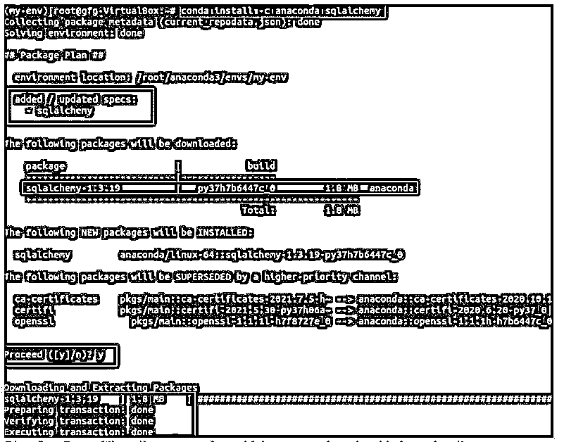
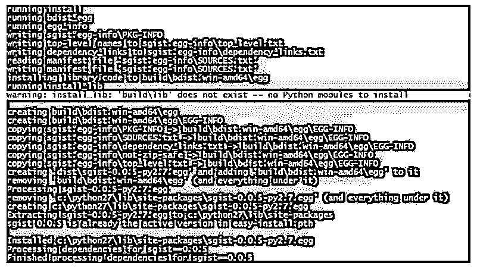
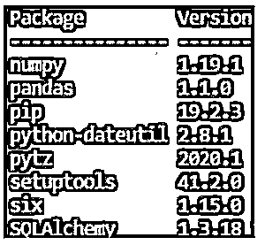

# sqllcemy(SQL 语法)

> 原文：<https://www.educba.com/sqlalchemy/>

## SQLAlchemy 简介

SQLAlchemy 是最流行的对象关系映射工具之一，也是一个 SQL 工具包，可用于为开发人员提供完全的灵活性和对 SQL 的控制。这个平台是用 python 编写的，是完全跨平台的软件，其开源访问由 MIT 发布，并由 MIT 授权。本文将着眼于一个名为 SQLAlchemy 的数据库的对象关系映射的最流行和开放源码的框架之一，这是一个超级工具。

### SQLAlchemy 是什么？

SQLAlchemy 是一个 ORM 工具，用于将对象与数据库中的实体(在关系数据库中是表)进行映射。通过使用这个工具，可以将类映射到所需的数据库。这进一步增强了数据库和创建应用程序时遵循的对象模型之间的解耦，同时带来了从数据库轻松存储、检索和访问数据的功能。Python 开发人员最深刻地使用 SQLAlchemy 和 SQLAlchemy 的 API 来了解 ORM 框架并在他们的应用程序中实现它。

<small>Hadoop、数据科学、统计学&其他</small>

使用 SQLAlchemy 工具有一些先决条件，其中包括对 python 语言、数据库、DB-API、关系数据库和 SQL 有深入的了解。python 的 SQLAlchemy 的行为和用法类似于 Hibernate ORM for java。

### 为什么使用 SQLAlchemy？

SQLAlchemy 附带了完整的持久化企业级模式集合，这些模式是专门为访问数据时的高性能和高效率需求而设计的，适用于 python 编程语言。当数据库的规模变得更大，需要在对象的帮助下通过表中的抽象来提高数据库的性能时，SQLAlchemy 就来了。从 SQLAlchemy 的角度来看数据库的感觉是，它是一个包含关系代数的引擎。SQLAlchemy 最受欢迎的原因之一是使用 ORM，即对象关系映射器，它有助于形成数据映射的模式。因此，类到数据库的映射可以以多种方式进行，这是完全开放的，有助于诱导数据库模式中的解耦。

SQLAlchemy 遵循互补导向的方法，即内部执行的流程不会以自动化的名义隐藏起来；相反，它们是完全公开的，并带有许多可以组合的透明工具。SQLAlchemy 的策略在于改变您对 SQL 和数据库的看法。SQLAlchemy 被一些最著名的组织使用，包括 DropBox、Survey Monkey、Reddit、OpenStack 项目和 yelp。

### 如何为 SQLAlchemy 创建环境？

为了在我们的系统上使用 SQLAlchemy，我们需要遵循某些步骤:

**步骤 1:** 使用 python 包管理器 pip 进行安装。

您可以在命令提示符下启动下面的命令进行安装。

**代码:**

`Pip install SQLAlchemy`

**输出:**

**步骤 2:** 此外，还有一种使用 conda 终端安装 SQLAlchemy 的替代方法。

**代码:**

`conda install -c anaconda SQLAlchemy`

**输出:**

**步骤 3:** 另一种下载方法是使用 python setup.py 文件。

**代码:**

`Python setup.py install`

**输出:**

**步骤 4:** 最后一步是验证 SQLAlchemy 的安装，可以通过执行命令来完成。

**代码:**

`Pip install`

这将产生以下输出，我们可以在其中检查 SQLAlchemy 的版本。

**输出:**

### SQLAlchemy Web 框架

市场上有很多 web 框架，事实证明它们非常有用，选择哪一个取决于场景和需求。一些 web 框架包括 Sanic、Flask、FastAPI 和 Django，它们是用于使用 python 编程语言创建和设计 web 应用程序的 python web 框架。

#### 1.姜戈

Django 是最古老的可用框架之一，它提供了 web 框架所需的所有资源。其中有基于类和函数的视图，并具有创建页面模板的功能。没有必要去操作 SQL，因为 Django 中提供的管理站点可以直接用来连接数据库。它附带了一个巨大的库集，可以用于内置功能。如果你的项目规模很大，这是一个完美的选择。

#### 2.瓶

Flask 是用于 web 开发的微框架，其特点包括轻量级框架、用户友好和易于了解，并允许您以自己的风格编码。这与 Django 的行为完全相反。它通常伴随着基于函数的视图，并带有对 jinja 的本地支持。它还有许多库来帮助您获得内置资源，从而简化您的任务。它最适合中等规模的项目，主要用于实现以 web 为中心的应用程序。

#### 3 .音速

Sanic 是新开发的 web 框架，本质上是异步的，具有开发速度和技术上的优势。它用于开发的方式与 flask 非常相似。在这里讨论的所有其他框架中，它的速度最快。由于其异步特性，它被证明非常有助于以简单有效的方式进行扩展。当您需要高性能的 web 应用程序时，或者如果您的应用程序需要异步 flask 版本的特性时，这个 web 框架是首选。

### SQLAlchemy 资源

如果您想了解更多关于 SQLAlchemy 的知识，那么下面提到的资源将会有很大的帮助。

*   SQLAlchemy 的官方网站是这样的，而对于维基百科链接，你可以参考这个。
*   可以为 SQLAlchemy 提供极大清晰度的基本书籍包括 Jason Myers 和 Rick Copeland 的“基本 SQLAlchemy”和 Luciano 拉马尔霍的“流利的 Python”。
*   另外一本对 python 新手很有帮助的书是 Byron Francis 的《SQL 初学者编程，其中也包括 Python》。

### 数据库ˌ资料库

SQLAlchemy 的设计是专门为与 DBAPI 的实现和特定数据库一起工作而设计的，因为使用方言是为了在数据库和 DB API 实现之间进行通信。

支持和包含的数据库方言如下表所述:

*   赛贝斯
*   神谕
*   关系型数据库
*   一种数据库系统
*   火鸟
*   Microsoft SQL Server
*   SQLite

除此之外，您还需要确保您的系统中安装了与方言和 DBAPI 相对应的适当驱动程序。

### 结论

SQLAlchemy 是用于对象关系映射的 ORM 框架，也被认为是 SQL 的工具包，因为它为开发人员提供了对 SQL 的完全控制和灵活性。

### 推荐文章

这是一本 SQLAlchemy 的指南。这里我们讨论一下入门，如何为 SQLAlchemy 创建环境？资源和数据库。您也可以看看以下文章，了解更多信息–

1.  [desc 的 SQL 订单](https://www.educba.com/sql-order-by-desc/)
2.  [SQL 执行](https://www.educba.com/sql-execute/)
3.  [SQL 排除](https://www.educba.com/sql-exclude/)
4.  [MySQL InnoDB 集群](https://www.educba.com/mysql-innodb-cluster/)

