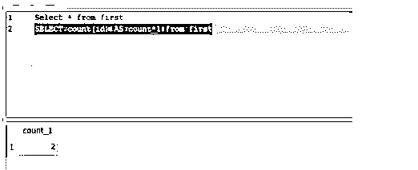
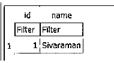

# SQLAlchemy 计数

> 原文：<https://www.educba.com/sqlalchemy-count/>

## SQLAlchemy 计数简介

SQLAlchemy count 是一个函数，可用于计算在数据库中编写相同查询的运行时间。在 ORM 层的每个阶段都要对数据记录进行计数。SQLAlchemy 的核心是数据库模式和模型，它提供所有相关的数据和数据库部分，如行、列和表。

### SQLAlchemy 计数概述

sqlAlchemy 是流行的 SQL 工具包之一，对象关系映射器(ORM)是用 python 语言编写的。它将提供 SQL 数据库及其应用程序的完全兼容性和灵活性。主要是麻省理工学院许可下的开源和跨平台软件；它以 ORM 而闻名，ORM 的类必须映射到特定的数据库，它允许对象模型和数据库。

<small>Hadoop、数据科学、统计学&其他</small>

数据库的大小和性能是为数据模式映射器计算和采用的，而不是 ORM 使用的其他活动数据记录。将使用 SQLAlchemy 在不同的客户端中查看数据库和 SQL 此外，表达式语言已经针对具有附加行和列的表构造了表达式；它可以被称为表示数据库表中的列的对象，而数据库表又由 table 对象表示。元数据是角色的主要部分，因为它包含表的定义，并且与索引、视图、触发器等对象相关联。

### SQLAlchemy 怎么算？

通常，group by 和 count 函数主要在不同的函数集使用的不同方法集中执行。将在数学运算中处理和使用的是依赖于数据库的 sql(如 PostgreSQL)和 Group by，包括程序员使用的计数函数，无论何时使用聚合函数并使用一组值进行计算，并返回单个值，这些值将从整组表行和列中汇总。SQL Count 函数使用这些类型的函数进行聚合，这些函数将忽略值，如 null 和其他指定值。

我们可以使用查询等方便的方法。Count()用于计算行数，如下所示:

我们使用了 count()函数，如 count (*)，它表示并从数据库表中获取行数和列数；它将用作指定的表达式，可以返回不包含 null 类型值的行数，必须对其进行计算并返回总数。

计数是常见的 SQLAlchemy 函数之一。他作为必要的函数从 SQLAlchemy 包中导入，通过使用 create_engine()函数执行 CRUD 操作(如创建、读取、更新和删除数据)来建立与 PostgreSQL 数据库的连接。另一方面，元数据信息对于使用查询从表中存储和获取数据更有用。

### SQLAlchemy 为什么算？

sqlAlchemy 函数是提供内置 SQL 函数的主要模块，这些函数可以帮助用户更快、更有效地进行数据计数和汇总等操作。查询数据对于启动和执行用户操作更有用，这些用户操作可以从用户和当前会话中提取，这些会话还与链接到对象的指定映射类相关联。Count()函数主要返回查询的总行数，它用于从数据库中检索所有数据，我们需要从会话工厂类中提取用户会话。它是通过使用查询对象的所有函数与指定的查询一起导入的。它根据完成的工作量统计子查询的所有结果，并检索包含统计数据的表行。

下面的截图是 SQLAlchemy 表行和列的基本结构；基于此；我们可以检索数据库表中的行数。

我们可以在附加的连接中使用相同的坏查询集，并在 API 中频繁使用，以获得足够的频率，这必然会影响额外的性能。从子查询中涉及的角度来看，使用 count()方法是低效的，并且通过名为 count (*)的方法对列进行计数。

上面的屏幕截图显示了从数据库表中计数和检索所有 id。

### SQLAlchemy 计数的示例

下面是提到的例子:

#### 示例#1

**代码:**

`import SQLAlchemy as db
eng = db.create_engine("sqlite:///D:/Mar9.db")
md = db.MetaData(bind=eng)
db.MetaData.reflect(md)
mar13 = md.tables['test3'] res = db.select([db.func.count()]).select_from(mar13).scalar()
print("Count:", res)`

**输出:**

在上面的例子中，我们以一种基本的方式使用了 count()方法来与数据库进行交互。我们使用数据库引擎来创建和连接数据库表，如行和列。在这种情况下，我们使用 Mar9.db 连接数据库表，元数据将处理用户数据，如关于数据的数据和存储在单个结果集变量上的结果。这里将调用“test3”数据库表；它已经在 sqlite mar9.db 中了。最后，我们可以使用 count()和 print 语句打印输出屏幕中的行数。

#### 实施例 2

**代码:**

`import SQLAlchemy as db
from SQLAlchemy.ext.declarative import declarative_base
Base = declarative_base()
eng = db.create_engine("sqlite:///D:/Mar9.db")
class First(Base):
__tablename__ = 'test3'
id= db.Column(db.Integer,
primary_key=True,
autoincrement=True)
name = db.Column(db.String(10))
from SQLAlchemy.orm import sessionmaker
Session = sessionmaker(bind = eng)
ses = Session()
result = ses.query(First).count()
print("Count:", result)`

**输出:**

对于这个例子，我们使用与上面相同的；使用了 count()函数。此外，我们创建了类，并将数据库表映射到一个单独的变量中。此外，我们使用 SessionMaker 包导入并存储在单独的会话中，作为我们可以在会话生成器中绑定引擎的变量。因此，结果将存储在一个单独的变量中，并在 count()方法的帮助下打印在屏幕上。

### 结论

SQLAlchemy 有许多函数、操作符和关键字，可以将数据库中的数据用于应用程序 UI。counter()中有一个聚合函数，它将从指定数据库和已经创建的表中计算表行。

### 推荐文章

这是一个 SQLAlchemy 计数指南。在这里，我们讨论介绍，概述，例子，以及为什么 SQLAlchemy 计数。您也可以看看以下文章，了解更多信息–

1.  [desc 的 SQL 订单](https://www.educba.com/sql-order-by-desc/)
2.  [SQL 执行](https://www.educba.com/sql-execute/)
3.  [SQL 排除](https://www.educba.com/sql-exclude/)
4.  [MySQL InnoDB 集群](https://www.educba.com/mysql-innodb-cluster/)

