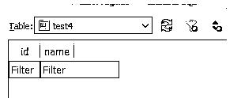

# SQLAlchemy 连接

> 原文：<https://www.educba.com/sqlalchemy-connection/>


## SQLAlchemy 连接简介

Sqlalchemy 连接是使用 engine.connect()方法创建数据库连接的对象之一，该方法作为 connection 对象返回。此外，它与其他连接相关的实体相关并协调。sqlAlchemy ORM 一般会通过数据库接口的 session 对象和 ORM 高级管理服务上的其他文本 SQL 语句 live 表达式来访问这些东西，这并不太重要。

### 什么是 SQLAlchemy 连接？

Sqlalchemy 连接是主要可以与各种数据库交互的库。它支持使用 python 类和语句的数据模型和查询。我们可以使用 sqlalchemy 库的 create_engine()方法来连接 URL，并使用方言和池引用的 sqlalchemy 引擎返回，这与 DBAPI 的模块函数一起解释数据库的不同行为。我们已经成功地为 MySQL、Postgresql、Microsoft SQL 等数据库创建了数据库连接。数据库的本地实例是为 sql 数据库设计的，并使用驱动程序来建立连接。

<small>Hadoop、数据科学、统计学&其他</small>

### 如何使用 SQLAlchemy 连接？

sqlalchemy 引擎是通过 create_engine()方法创建的，其调用通过特定数据库 URL 的典型用法贯穿全局，与单个服务器应用程序进程一起使用。管理许多单独的 DBAPI 与流程的连接的单引擎主要用于并发流程。引擎与 DBAPI 连接方法不是同义词。该函数表示数据库引擎连接资源，并为每个对象或函数调用有效地创建应用程序模块。它还使用一个多任务应用程序。该流程使用与多处理模块类似的 python 模块的基本系统，并且通常需要用于不同的引擎以及子流程。

我们可以通过连接池的引用来维护引擎，连接池最终引用倾向于跨边界移植的 DBAPI 连接。引擎被配置为通过与要求相匹配的空池实现的轮询。如果连接是实例类型，那么主要为实际的 DBAPI 连接调用代理对象。它提供了一个很大程度上兼容的接口和 DBAPI 游标；产生的代理用于连接表的行和列的数据库驱动程序。sqlalchemy 引擎已与数据库建立连接；可能是 PostgreSQL，MySQL，SQLite 等。


在这里，我使用 SQLite 数据库来创建引擎和会话，以便从后端到 UI 访问用户数据。

### SqlAlchemy 连接用法

PyMySQL 之类的数据库是 Python 库，可用于连接 MySQL 数据库或其他已安装的数据库服务器。Pip install using pymysql 命令之类的命令可用于设置环境。由于采用了新的方式，可以在以前形式的数据库(如 MySQL 4.1 版)上处理 forma 字段(如密码列)，这在需要 MySQL 4.1 版或更高版本的 SQLAlchemy 库上受支持。此外，如果我们需要只能在特定版本的 MySQL、Oracle 或 SQLite 中使用的语句类型。SQLAlchemy 库没有给出像 MySQL 和其他数据库版本那样在数据库上使用这些语句的正确方法。相比之下，该语句在结果集上不可用。如果 SQLAlchemy 中的某个组件或功能没有出现在工作环境中，则应参考数据库文档来制定适当的验证规则。


我们还可以设置 pool_recycle 值来创建具有指定驱动程序的数据库引擎。用于帮助连接的数据库服务器名称、用户名和密码凭证保存在 cookies 数据下的历史记录中。日志数据由满足 sql 语句及其参数的数据库引擎处理的用户操作执行；默认值被设置为假条件。然后在数据库连接期间，使用 sqlalchemy 技术和概念对连接字符串进行编码。默认格式是 UTF-8，DBAPIs 支持在后端数据库中对该类型进行编码。


sqlalchemy 连接的一般工作流如上图所示，用于调用引擎中的 connect()方法，该引擎将数据与 DBAPIs 数据库一起共享到池和方言内存中。

### SQLAlchemy 连接的示例

下面提到了不同的例子:

#### 示例#1

```
import sqlalchemy as sa
from sqlalchemy.sql import select
import datetime
metadata = sa.MetaData('sqlite:///Mar9.db', echo = True)
print(“Connection Successfully”)
varss = sa.Table('test3', metadata,
sa.Column('id',   sa.types.Integer, primary_key=True),
sa.Column('date', sa.types.DateTime(timezone=True), default=datetime.datetime.utcnow)
)
metadata.create_all()
engs = metadata.bind
today_dt = date.today()
dtr_log = DailyTimeRecord.query.filter(
func.date(DailyTimeRecord.time_in_am)==today_dt,
DailyTimeRecord.staff_id==staff.id
).first()
cnnection = engs.cnnectionect()
outss = cnnection.execute(varss.insert().values(id=1))
s = select([varss])
outss = cnnection.execute(s)
row = outss.fetchone()
```

**样本输出:**


我们已经用下面的步骤创建了上面的例子。

1.  首先，我们必须导入 sqlalchemy 库，如 import sqlalchemy、datetime 等。
2.  根据概念和需求，我们必须导入库。
3.  接下来，我们在元数据类中导入并设置数据库。
4.  **元数据= sa。元数据(' sqlite:///Mar9.db '，echo = True)**
5.  我们在名为 Mar9.db 的特定数据库中创建了这个表
6.  在实例的帮助下，我们可以调用和创建 id、date 等表列。
7.  id 的数据类型应该是整数，日期应该是日期时间类型。
8.  引擎在变量的帮助下被调用，并执行默认的方法，如 execute()、insert()等。
9.  Insert()方法用于在表中插入值
10.  Execute()方法有助于在表结果集中执行查询。

#### 实施例 2

```
from sqlalchemy import create_engine
from sqlalchemy.ext.declarative import declarative_base
from sqlalchemy.orm import sessionmaker
engine = create_engine('sqlite:///D:/Mar9.db')
Session = sessionmaker(bind=engine)
print("Connection successfully")
Base = declarative_base()
class clsfrdst(Base):
__tablename__ = 'test4'
id = Column(Integer, primary_key = True)
name = Column(String)
class scclss(Base):
__tablename__ = 'secndtble'
id = Column(Integer, primary_key = True)
invid = Column(Integer, ForeignKey('test5.id'))
fts = relationship("clsfrdst", back_populates = "secndtble")
clsfrdst.secndtble = relationship("scclss", order_by = scclss.id, back_populates = "fts")
Base.metadata.create_all(engine)
```

**样本输出:**




1.  上面的例子我们首先用来创建数据库引擎连接
2.  然后，我们使用 python 类创建了数据库及其表。
3.  它已经被导入到 sqlalchemy 函数及其库中
4.  我们创建了像 id 这样的表列作为整数属性，并作为在后端执行唯一操作的主键。
5.  另一列像 invid 一样，也是一个整数，作为外键从前面的表引用中获取表数据。
6.  在这里，我们可以通过使用主键和外键概念来执行从一个表到另一个表数据的数据库关系。
7.  元数据引用包含所有其他表，尤其是包含多个表的 DBAPIs 关系的类。

### 结论

数据库引擎连接是从 UI 视图到后端执行用户操作的最重要方式。这是一个基于 python 的 sqlalchemy 库，它可以创建包含所需列的数据库表并执行用户操作，这取决于项目需求。

### 推荐文章

这是 SQLAlchemy 连接指南。在这里我们讨论了简介，什么是，以及如何使用 SQLAlchemy 连接的例子和代码实现。您也可以看看以下文章，了解更多信息–

1.  [MySQL DROP 表](https://www.educba.com/mysql-drop-table/)
2.  [PL/SQL 异常](https://www.educba.com/pl-sql-exception/)
3.  [MYSQL 提交](https://www.educba.com/mysql-commit/)
4.  [SQL 表达式](https://www.educba.com/sql-expressions/)


