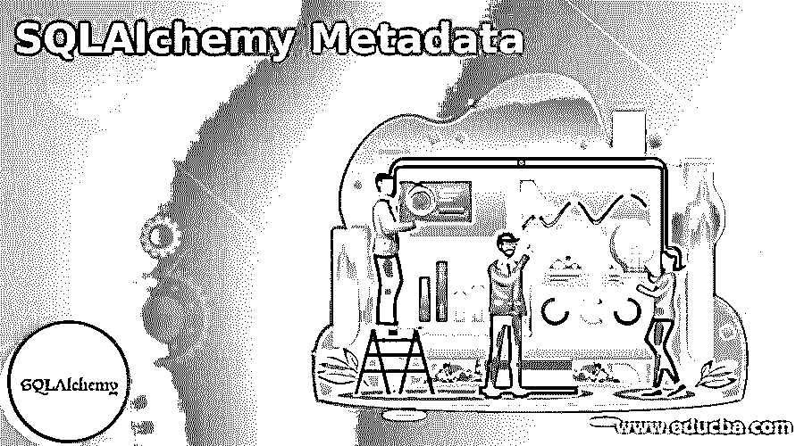
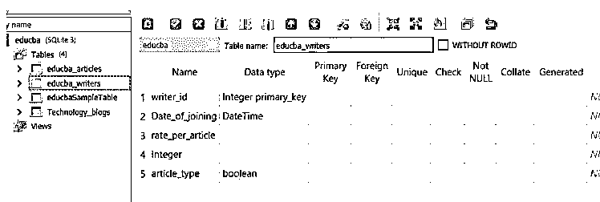

# SQLAlchemy 元数据

> 原文：<https://www.educba.com/sqlalchemy-metadata/>




## SQLAlchemy 元数据简介

SQLAlchemy 元数据充当一个接口，帮助描述数据库中的表对象。通常，元数据对象包含许多表示所有数据库表的表对象，而列对象描述 python 框架中每个数据库表的列。然而，python 的一个应用程序只需要一个元数据就足够了。在这里，我们将看到以下 sqlalchemy 的完整性，包括什么是 sqlalchemy 元数据、sqlalchemy 元数据模式、SQLAlchemy 元数据数据库、示例以及关于相同内容的结论。

### 什么是 SQLAlchemy 元数据？

SQLAlchemy 元数据用于描述 python 应用程序正在使用的单个或多个数据库。数据库的完整详细结构是使用 python 的数据结构在元数据对象中为数据库中每个表的每一列定义的。元数据的数据库信息包括两种类型的东西，即表和列。

<small>Hadoop、数据科学、统计学&其他</small>

数据库元数据的主要用途和目的是一个 ORM 工具，用于对象关系映射和在应用程序中生成必要的 SQL 查询。SQLAlchemy 中的元数据被证明有助于数据库模式的生成。元数据中需要且经常使用的一些虚拟对象包括表、列和元数据。

### SQLAlchemy 元数据架构

Schema 只不过是用 SQLAlchemy 中的元数据描述的数据库内部各种表的结构。让我们先借助一个例子来了解查询是如何产生的，如何定义 schema。查询是在数据库内部的表上形成的。在 SQLAlchemy 的元数据中，借助于 Table 对象来引用数据库中的表，而使用 Column 对象来引用数据库中表的列。

元数据的对象是由数据库中与它们的名称配对的表对象组成的。

我们可以按照下面的语法创建一个元数据对象:

**语法:**

```
From sqlalchemy import MetaData
Sample_object_metadata = MetaData()
```

创建元数据的单个实例就足以满足整个应用程序的需求。现在，我们可以考虑一个名为 educba_articles 的表，该表包含 article_name、no_of_pages 和 writer 列，其中 article_id 列充当主键，来看看如何定义该模式。

我们现在可以使用下面的代码来定义模式:

**代码:**

```
from sqlalchemy import MetaData
from sqlalchemy import Integer, String, Column, Table
sample_object_metadata=MetaData()
articles_table = Table(
"educba_articles",
sample_object_metadata,
Column('article_id', Integer, primary_key=True),
Column('article_name', String(30)),
Column('no_of_pages',Integer),
Column('writer', String(80))
)
```

上面代码中的 Table 对象指的是数据库表，它被进一步分配给元数据的对象。列引用数据库中存在的表的列，并被赋予表的对象。列对象通常由字符串格式的列名和允许存储在该列中的对象类型(可以是字符串、整数、布尔、数据时间等)组成。

上述代码引用了 educba_articles 的下表，如下所示:


### SQLAlchemy 元数据数据库

可以使用 SQLAlchemy 的元数据对象在 python 应用程序中详细描述数据库。我们可以通过描述上述格式中的表来创建和定义数据库的模式，以便在 python 应用程序中访问数据库中的表数据。

我们可以使用 SQLAlchemy 的元数据，借助下面所示的格式来访问数据库表中的值:

我们可以使用在描述模式时创建的对象来获取表名。

例如，如果我们想要访问上述模式中的表名，那么我们可以使用下面的语句:

**代码:**

```
articles_table.name
```

**输出:**
T3】


表的所有列通常存储在名为 table_name.c 的关联数组中，这意味着使用。c 表示法，我们可以访问关于表的列的信息。

例如，如果您想访问 article_name 列，我们可以使用以下命令:

**代码:**

```
articles_table.c.article_name
```

**输出:**


要访问列的名称，可以执行下面的命令:

**代码:**

```
articles_table.c.article_name.name
```

**输出:**


要仅访问列存储类型，即列的数据类型，我们可以执行下面所示的命令:

**代码:**

```
articles_table.c.article_name.type
```

执行上述命令仅检索列的类型，如下所示:

**输出:**


类似地，假设我们想要检索主要的重要细节。在这种情况下，您需要做的就是在上面显示的层次流之后追加 primary_key 关键字，这将获得与当前表相关联的主键的信息。

我们可以使用名为 createAll()和 drop all()的元数据方法创建表并删除数据库中存在的所有表，这将删除该特定元数据对象的所有表。请记住，调用此方法时，必须使用在代码中创建的元数据实例。

### SQLAlchemy 元数据的示例

以下是 SQLAlchemy 元数据的示例:

让我们考虑一个包含多列不同数据类型和格式的例子。我们将创建一个名为 educba_writers 的表，其中包含用于时间戳值的 DateTime 类型的列。

**代码:**

```
from sqlalchemy import create_engine
from sqlalchemy import Numeric, DateTime, Enum
writer_table = Table(
"educba_writers",
educba_metadata_obj,
Column("writer_id", String(50), primary_key=True),
Column("Date_of_joining", DateTime),
Column("rate_per_article", Numeric(100, 2)),
Column("article_type", boolean),
)
# creating an engine object
sample_engine = create_engine("sqlite+pysqlite:///:educba:",
echo=True, future=True)
# emitting DDL
educba_metadata_obj.create_all(sample_engine)
```

**输出:**

上述代码的输出引用了 educba_writers 的下表，如下所示:




### 结论

通过使用元数据 SQLAlchemy 的实例对象，我们可以使用 SQLAlchemy 元数据在 python 应用程序中以 python 数据结构的形式描述所有表、列和数据库相关的细节。

### 推荐文章

这是 SQLAlchemy 元数据指南。这里我们讨论简介、SQLAlchemy 元数据模式和示例。您也可以看看以下文章，了解更多信息–

1.  [desc 的 SQL 订单](https://www.educba.com/sql-order-by-desc/)
2.  [SQL 执行](https://www.educba.com/sql-execute/)
3.  [SQL 排除](https://www.educba.com/sql-exclude/)
4.  [MySQL InnoDB 集群](https://www.educba.com/mysql-innodb-cluster/)


