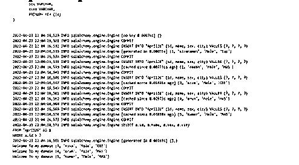
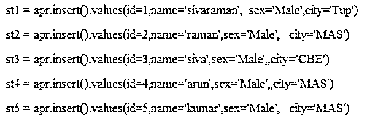
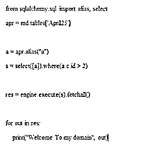
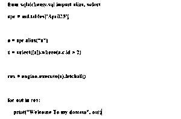
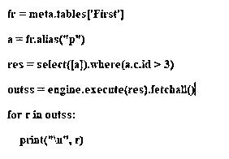

# SQLAlchemy 别名

> 原文：<https://www.educba.com/sqlalchemy-alias/>


## SQLAlchemy 别名介绍

SQLAlchemy 别名是导入的类型之一，它主要对应于 sqlalchemy sql 它被选择到对象，并从子句转换为别名。alias()方法使用 sqlalchemy.sql 模块为 alias()中的每种类型的函数配置和生成结构，该模块表示适用于任何表和子选择表的别名，并使用 as 作为 sql 关键字。

### 什么是 SQLAlchemy 别名？

SQLAlchemy 导入包更有必要触发已建立的 postgresql 数据库的函数调用。别名看起来像是每个表的临时名称，这对于可读格式来说更方便。这有助于在单个查询中使用简单的名称，而不是复杂的表名或来自多个表的列名。这个 alias()函数通常在连接到数据库时用每组元数据对象形成 sqlalchemy 模块。借助别名来执行带有所有阶段结果的查询，跨像 fetchall()方法这样的方法来迭代通过结果的循环条件。

<small>Hadoop、数据科学、统计学&其他</small>

### 使用 SQLAlchemy 别名

我们可以用指定的别名显示表中的 n 个列名，比如假设我们可以使用文本框列名，它将在。label()方法。有时，我们可能会对相同的 label()方法使用不同的名称，而对确切的函数定义使用相同的要求。指定属性列的一些列值将根据其他属性计算值，这些属性称为根据用户要求计算的同一组值。sqlalchemy 查询将花费更多时间从后端执行用户操作来检索结果。通常，查询是 ORM 生成的所有 Select 语句的来源，sql 别名有助于在复杂表的每个区域使用简单的名称。它在查询中被多次使用。

因此，将简单名称放在复杂表名中是一种更方便的时间和可读的格式，而复杂表名必须在查询中多次使用。alias()函数是 sqlalchemy.sql 模块之一，表示为连接数据库而初始化的元数据对象的 sql 别名。因此，通过使用别名表名称(它执行查询以检索结果，并借助 fetchall()函数来迭代循环条件)，它将被映射到应该添加到 RDBMS(关系数据库管理系统)的其他对象。它允许数据库管理员和其他数据库用户减少理解数据库字段的混淆和技术所需的代码。

1.表格的行和列被映射到与名称相关的表格，如相关名称，编码器将临时将其分配给表格名称。

2.首先，我们需要使用 sqlalchemy.sql 包导入 sqlalchemy 别名。


3.然后，我们将创建数据库引擎，将数据库从前端连接到后端。


4.created_engine()将像 sqlite drivers 一样具有单独的参数或参数，这有助于连接已经在 sqlite 数据库上创建的数据库。

5.将为每个用户计算查询性能，并存储在一个单独的会话中，以处理用户 cookies 数据。

6.我们可以使用 alias()函数和其他内置函数，如 filter 和其他 dbsession 查询，根据用户的需求来处理用户数据。


7.会话将单独处理每个类名，如果假设名称本身通过使用 alias()函数与其他名称或名称的缩写进行映射。

8.不仅仅是类名，方法名、变量和其他默认关键字将充当数据库关系映射器和 alias()，并解析不同区域中的 sql 查询。

9.变量执行条件语句，即.)别名来执行操作。

### SQLAlchemy 别名的示例

下面提到了不同的例子:

#### 示例#1

**代码:**

```
import sqlalchemy
from sqlalchemy import create_engine, MetaData,Table, Column, Numeric, insert, Integer,VARCHAR, update, text, delete
from sqlalchemy.engine import result
engs = create_engine(
'sqlite:///Mar9.db', echo = True)
md = MetaData(bind=engs)
MetaData.reflect(md)
apr = Table(
'April26', md,
Column('id', Integer, primary_key=True),
Column('name', VARCHAR),
Column('sex', VARCHAR),
Column('city', VARCHAR)
)
md.create_all(engs)
st1 = apr.insert().values(id=1,name='sivaraman', sex='Male',city='Tup')
st2 = apr.insert().values(id=2,name='raman',sex='Male', city='MAS')
st3 = apr.insert().values(id=3,name='siva',sex='Male',,city='CBE')
st4 = apr.insert().values(id=4,name='arun',sex='Male',,city='MAS')
st5 = apr.insert().values(id=5,name='kumar',sex='Male', city='MAS')
engs.execute(st1)
engs.execute(st2)
engs.execute(st3)
engs.execute(st4)
engs.execute(st5)
from sqlalchemy.sql import alias, select
apr = md.tables['April26']
a = apr.alias("a")
s = select([a]).where(a.c.id > 2)
res = engs.execute(s).fetchall()
for out in res:
print("Welcome To my domain", out)
```

**输出:**




1.在上面的例子中，首先，我们可以导入 sqlalchemy 驱动程序、类和函数来执行操作。


2.我们导入了一个额外的别名包来像使用别名一样使用用户操作。

3.首先，我们使用带有独立参数的 Table()方法创建表，并使用元数据对 create_all()等其他方法进行额外调用。




4.通过使用 insert()方法，我们可以借助特定的技术(如 values()附加参数)来插入值。

5.最后，我们可以使用 alias()方法来执行操作，并在同一个控制台上打印它们。




#### 实施例 2

**代码:**

```
from sqlalchemy.sql import alias, select
import sqlalchemy
from sqlalchemy import create_engine, MetaData,Table, Column, Numeric, insert, Integer,VARCHAR, update, text, delete
from sqlalchemy.engine import result
engss = create_engine(
'sqlite:///Mar9.db', echo = True)
meta = MetaData(bind=engine)
MetaData.reflect(meta)
fr = meta.tables['First']
a = fr.alias("p")
res = select([a]).where(a.c.id > 3)
outss = engine.execute(res).fetchall()
for r in outss:
print("\n", r)
```

**输出:**


1.在第二个例子中，我们使用了与上一个例子相同的方法；我们可以在不同的表中使用别名方法。




2.数据库引擎是使用 create_engine()方法实例执行的。

3.使用循环，我们可以迭代别名输出的值。




### 结论

sqlalchemy 有 n 个函数、类和关键字来以各种方式执行用户操作。例如，我们可以使用 alias()关键字和函数作为方法、变量和其他函数操作的别名。通过使用默认方法，可以成功地存储和检索数据。

### 推荐文章

这是一个 SQLAlchemy 别名的指南。这里我们讨论介绍，使用 SQLAlchemy 别名和例子来更好地理解。您也可以看看以下文章，了解更多信息–

1.  [desc 的 SQL 订单](https://www.educba.com/sql-order-by-desc/)
2.  [SQL 执行](https://www.educba.com/sql-execute/)
3.  [SQL 排除](https://www.educba.com/sql-exclude/)
4.  [MySQL InnoDB 集群](https://www.educba.com/mysql-innodb-cluster/)


