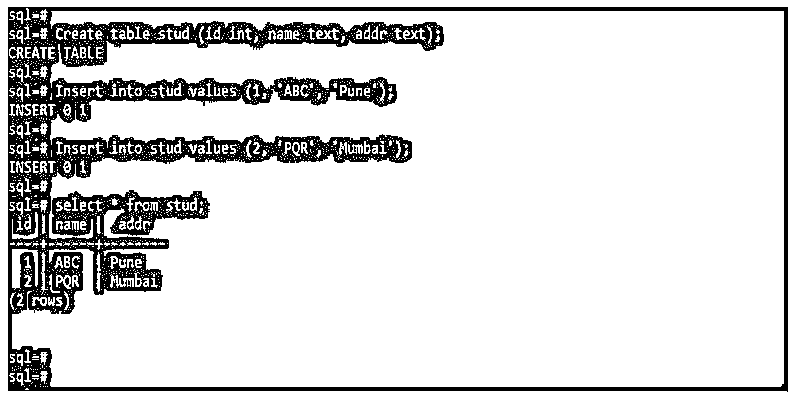

# SQLAlchemy 唯一

> 原文：<https://www.educba.com/sqlalchemy-unique/>


## SQLAlchemy unique 简介

SQLAlchemy unique 将定义从后端数据库支持的标准 SQL 类型中抽象出的类型数量。这个小细节对 SQLAlchemy 是隐藏的，我们可以确信我们创建的任何查询或语句都将正常工作。受约束的列被称为外键列。外键是连接行对的“关节”。

### SQLAlchemy 的独特之处是什么？

*   当我们在指定列的语句中指定 true 时，该列将包含唯一约束。True 表示应该使用唯一的标志创建索引。使用 Unique 约束或索引构造显式指定列。
*   要在代码中使用 sqlalchemy，我们首先需要使用 pip 命令安装 sqlalchemy 模块。如果不安装 sqlalchemy，我们就不能在代码中使用这个模块。
*   Sqlalchemy 可以在 pip 的安装包中获得。SQL 中的外键是一个表级构造，它将该表中的一个或多个列限制为只允许来自不同列集的值。
*   sqlalchemy unique 约束是在表、sqlalchemy 和 DDL 中定义的附加属性，或者在单列外键的情况下，可以选择在单列的定义中指定它们。单列外键更常见，在列级别指定。
*   外键参数通常是 name_of_table 形式的字符串。列的名称。
*   只有在需要时才解析用户偏好，从而允许表对象轻松地分布在多个模块中，并以任意顺序定义。
*   外键约束对象也可用于在表级别定义外键。
*   该对象可用于描述单列外键。复合外键总是带有复合主键的表。
*   外键指令的约束用于创建表查询，以“内联”方式创建约束。缺省情况下，MetaData.create all()和 MetaData.drop all()方法会这样做，使用所有相关表对象的拓扑排序，以便按照外键依赖关系的顺序创建和删除表。
*   Sqlalchemy unique 应用于数据库表，以定义表列中的唯一值。

### 如何对 SQLAlchemy unique 建模？

使用列上的 unique 约束，我们可以匿名定义单个列上的特殊限制。sqlalchemy unique 生成唯一的、显式指定的约束和/或具有许多列。Check Constraint 构造可用于建立命名或未命名的 check constraints 列级别。“独立于数据库”的行为是有限的，因为检查约束文本是直接提供给数据库的。表级 check 约束可以与表中的任何列相关；但是，列级检查约束是指列级。

<small>Hadoop、数据科学、统计学&其他</small>

为了定义 SQL alchemy 模型，我们需要安装 SQLmodel。

以下步骤显示了如何安装 sqlmodel 模块，如下所示。

**代码:**

```
pip install sqlmodel
```

**输出:**


安装完所有模块后，我们使用 python3 命令打开 python shell。

**代码:**

```
python
```

**输出:**


在这一步登录到 python shell 后，我们检查 sql 模型包是否安装在我们的系统中。

**代码:**

```
import sqlmodel
```

**输出:**


列元数据是 SQLModel 中采用表参数的类属性。该属性接受位置参数和关键字参数，这些参数通常传递给表函数 Object(){[本机代码] }。字典和元组是属性中的两种格式。

以下示例显示了如何对 sqlalchemy unique 进行建模，如下所示。在下面的例子中，首先，我们从 sqlalchemy 模块导入了 unique 约束包。然后我们创建元数据对象。创建元数据对象后，我们将表名定义为一个 stud。在定义了表名之后，我们将表列名创建为 id、stud_phone 和 stud_pincode。最后，我们对 id 列应用 sqlalchemy unique，如下所示。

**代码:**

```
from sqlalchemy import UniqueConstraint
metadata_obj = MetaData ()
tab = Table('stud', metadata_obj,
Column ('id', Integer, unique=True),
Column ('stud_phone', Integer),
Column ('stud_pincode', Integer),
UniqueConstraint ('stud_phone', 'stud_pincode', name='uix_1')
)
```

**输出:**


### SQLAlchemy 唯一数据库和表

在我们的系统中安装 python 包时，Sqlalchemy 模块不在下面。所以要使用 sqlalchemy，我们需要使用 pip 命令安装 sqlalchemy 模块。显示如何安装 sqlalchemy 模块的步骤如下。

第一步，我们使用 pip 命令安装 sqlalchemy 模块。我们可以在任何安装了 python 的操作系统中安装 sqlalchemy 模块。在下面的例子中，我们正在安装 sqlalchemy 模块。

**代码:**

```
pip install sqlalchemy
```

**输出:**


安装完所有模块后，我们使用 python3 命令打开 python shell。

**代码:**

```
python3
```

**输出:**


在这一步登录到 python shell 之后，我们检查 sqlalchemy 包是否安装在我们的系统中。

**代码:**

```
import sqlalchemy
```

**输出:**


在下面的例子中，我们如下创建数据库和表。

**代码:**

```
Create database sql;
Create table stud (id int, name text, addr text);
Insert into stud values (1, ‘ABC’, ‘Pune’);
Insert into stud values (2, ‘PQR’, ‘Mumbai’);
Select * from stud;
```

**输出:**




在下面的例子中，我们从 SQL 表中获取记录，如下所示。在下面的例子中，首先，我们导入了 sqlalchemy 模块。然后我们定义数据库引擎。然后我们创建一个元数据对象。创建元数据对象后，我们使用选择查询来显示 stud 表中的所有记录。

**代码:**

```
import sqlalchemy as db
sql_en = db.create_engine ("sql:///sql.db")
meta_data = db.MetaData (bind=sql_en)
db.MetaData.reflect (meta_data)
STUDENT = meta_data.tables ['stud']
sql = db.select ([db.distinct (STUDENT.c.id)])
res = sql_en.execute (sql).fetchall()
for rec in res:
print("\n", rec)
```

**输出:**


### 结论

SQL 中的外键是一个表级约束，它将该表中的一个或多个列限制为只允许来自不同列集的值。Sqlalchemy unique 将定义从后端数据库支持的普通 SQL 类型中抽象出的类型数量。

### 推荐文章

这是一本 SQLAlchemy unique 的指南。在这里，我们讨论介绍，唯一数据库，以及如何用表建模 SQLAlchemy unique。您也可以看看以下文章，了解更多信息–

1.  [desc 的 SQL 订单](https://www.educba.com/sql-order-by-desc/)
2.  [SQL 执行](https://www.educba.com/sql-execute/)
3.  [PL/SQL 不等于](https://www.educba.com/pl-sql-not-equal/)
4.  [SQL 不在](https://www.educba.com/sql-not-in/)中


