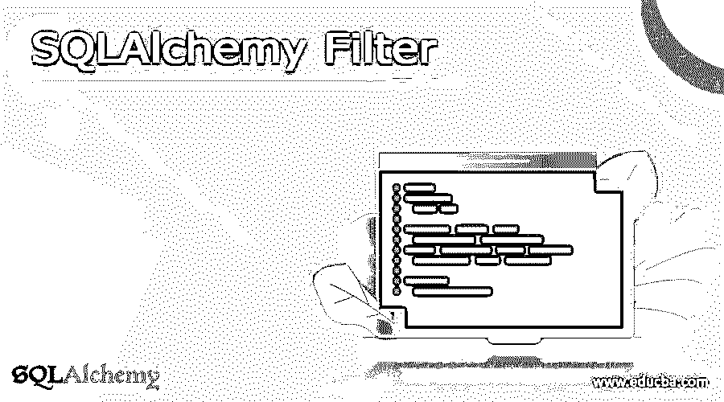

# SQLAlchemy 筛选器

> 原文：<https://www.educba.com/sqlalchemy-filter/>

## SQLAlchemy 筛选器简介

SqlAlchemy 过滤器是其中一种类型，它的功能是以不同的方式将它写在运算符和条件上，如 where for sql，但将它引用到对象关系映射器(ORM)工具，该工具可以转换为表和关系数据库上的 Python 类，将自动转换为每个 sql 语句的函数调用，它有运算符用于检查条件。

### SQLAlchemy 筛选器概述

ORM 层是 SQL 的创建，它还会生成每个类的对象。所有的 select 语句更多的是通过使用 ORM 生成的，用来自最终用户操作所制定的查询。然后使用类似于与集合加载类相关的高级内部过程来创建那些构造的操作和对象。此外，它有一个生成接口，这意味着每一行和每一列都有单独的调用，并返回查询对象。然后，它具有前一个标准的复制标准，并带有额外的标准和参数自变量。大多数情况和查询对象都是通过调用会话来创建的。query()方法，并且在直接实例化查询和连接用户会话时，它使用较少的常见情况。通过使用查询。session()方法将生成用户会话。通过使用过滤器，可以对不包含 kwargs 正则表达式和用法的每个列范围和名称进行简单查询。但是我们使用了' == '等式操作符来代替它，这个操作符已经在 db users 和 object name 上重载了。通过使用包括表达式在内的过滤条件，我们可以编写更多功能强大的查询。

<small>Hadoop、数据科学、统计学&其他</small>

### 如何使用 SQLAlchemy 过滤器？

在创建查询时，新对象也被创建，这有助于加载用户的实例。然后，我们可以处理 filter 关键字，通过使用 name 和 id 之类的属性来分离和过滤数据，它将获取并返回包含行和列的完整列表数的结果。一个用户可能已经创建了实例，这相当于用户会话已确定了已经映射到内部对象的行。在每个会话上使用 Query()方法创建一个查询对象，并为任意数量的组合类和方法提供独立数量的参数和自变量。一般来说，运行大量的 db 事务需要使用通用的过滤器操作符，另外还需要指定所需的操作符。

Appy 给定的过滤标准条件，通过使用 SQL 表达式以及类似 session 的代码来复制查询。查询(类名)。filter(ClassName.name=='value ')这些代码将对单个筛选条件使用' == '运算符。如果情况是在多个条件中，那么我们通过使用 AND 运算符将它们连接在一起，如下所示:

`session. query(ClassName).\filter(ClassName.name == ‘value’,conditions)`

这些标准需要 SQL 表达式对象，该对象适用于使用 text()方法构造的 select 和 String 表达式的 Where 子句等条件。

### sqlalchemy 筛选器授权:

需要 SqlAlchemy 级别来执行用户和数据所有者有权查看其费用的过滤条件。添加了的自定义冲突解决程序，以调整查询并检索结果，同时检查其他区域。它实现了用于添加表达式的定制 sqlAlchemy 查询，并触发了用于使用授权数据重复 every db 模型的 SQL 代码。该授权规则基于每种类型的记录(有时称为对象级代码权限),并使用更多数量的复杂数据挑战中间件中的数据，这些数据添加到单独的装饰器中。

为了使 SQLAlchemy ORM 映射特定的表，必须至少将一列指定为主键列，我们通常在其他列使用主键列。如果我们想使用更多数量的主键，我们将利用逗号分隔，它也像一个复合主键，也更有可能由开发人员处理的需求数量。尽管我们必须被数据库识别为主键列，必须通过行的唯一且不可为空的标识符来处理。主要是内存对象必须与数据库表中唯一标识的行和列相匹配，因此大多数 ORM 都要求对象至少定义了指定的主键，这些主键必须被处理并允许对象引用目标热点更新。在 SQLAlchemy 中，主键超出了 ORM 的范围，ORM 通过使用称为标识映射的模式，在指定的用户会话中始终将唯一链接的对象映射到数据库行。在中央单元工作系统允许的模式中，该键是 ORM 模式用法的公共键属性。

#### 示例#1

`from sqlalchemy import Column, Integer, String
from sqlalchemy import create_engine
from sqlalchemy.orm import sessionmaker
con = create_engine('mysql+mysqldb://@localhost/feb26')
from sqlalchemy.ext.declarative import declarative_base
Base = declarative_base()
class Months(Base):
__tablename__ = 'month'
id = Column(Integer, primary_key=True)
name = Column(String)
Session = sessionmaker(bind =engine)
session = Session()
result = session.query(Months).filter(Months.id == 2)
for j in result:
print ("ID:", j.id, "Name: ",j.name)`

**样本输出:**

在上面的例子中，我们在 SQLAlchemy 会话导入中使用了普通过滤器。我们可以通过指定的用户会话处理用户数据，因此在这些会话中，我们可以创建名为 Feb26 的数据库，并创建类似 month 的表，该表有两列，如 id 和 name。这里的数据库是 MySQL，所以我们可以用指定的连接代码连接数据库连接。通过使用结果查询会话，使用 filter()方法过滤数据。

### 结论

sqlalchemy 是这个特性，它有助于连接数据库中的 python 代码。在这方面，它满足了所有的数据库，如 MySQL，SQLite，PostgreSQL 等。对于每个数据库所需的连接字符串，在过滤器的帮助下处理从数据库到 python 代码的连接，我们可以分离并显示所需的数据。

### 推荐文章

这是一个 SQLAlchemy 过滤器的指南。这里我们讨论定义，概述，如何使用 sqlalchemy 过滤器？代码实现示例。你也可以看看下面的文章来了解更多-

1.  [SQL 排除](https://www.educba.com/sql-exclude/)
2.  [SQL 执行](https://www.educba.com/sql-execute/)
3.  [PLSQL 长度](https://www.educba.com/plsql-length/)
4.  [MySQL 删除数据库](https://www.educba.com/mysql-drop-database/)

