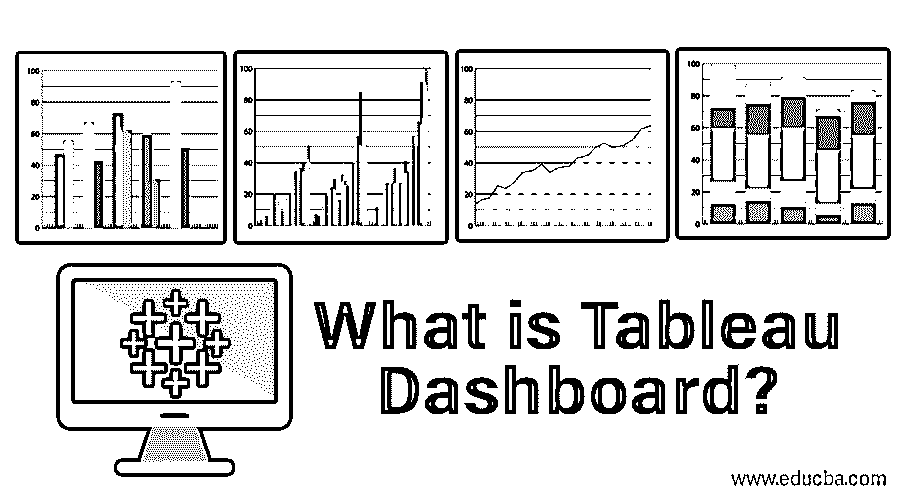

# 什么是 Tableau 仪表板？

> 原文：<https://www.educba.com/what-is-tableau-dashboard/>

## Tableau 仪表板简介

Tableau 是一种传统的 BI 工具，可以快速获得有用的信息。它提供了一种使用应用程序进行快速分析和可视化的简单方法。在外面展示我们的作品有很多选择。对于数据可视化，我们选择不同的图表来传达结果。 [Tableau 工作簿包含](https://www.educba.com/tableau-workbook/)个表和仪表板。工作表用于创建单独的可视化效果。仪表板用于组合多个工作表。另一方面，故事点是协同工作来链接数据的工作表和仪表板的集合。Tableau 增加了一些功能，如 Tableau 桌面、动作、聚合维度。

tableau 是 2003 年在美国华盛顿州西雅图首次推出的软件工具。如果我们想使用任何商业智能工具来直观地分析数据，我们想到的第一个软件就是 Tableau。Tableau 帮助用户创建和分发交互式仪表盘**。**有趣的是，这个交互式的可创建仪表板也是可共享的。Tableau 可以连接到文件、关系和大数据源，以获取和处理数据。

<small>Hadoop、数据科学、统计学&其他</small>

这款 tableau 软件可以轻松实现数据混合和实时协作，这为它提供了独特的功能。它通常被学术研究人员、企业和许多政府机构用于可视化数据分析。

### Tableau 仪表板

一般来说，仪表板是一个高级业务数据视图，报告就是在这里生成的。tableau 中的仪表板提供了高性能，并允许非技术用户通过创造性的实时可视化来访问和使用数据。仪表板是工作表的集合，允许同时分析多个视图。仪表板由大小、工作表、对象、平铺、仪表板(我们可以在其中看到设备预览)组成。

在 Tableau public 或 desktop 中构建的任何仪表板都可以发布到 web 上供公众使用。当你在云上秘密分发工作表时，Tableau 服务器需要有适当的许可。

**仪表板的类型有**

1.  解释性仪表板–它们是静态的。
2.  探索性仪表板–它们是交互式的。
3.  解释性/探索性仪表板-包括注释和交互式控件。
4.  讲述故事的仪表板–传达一系列事件。

### 什么是 Tableau 仪表板？

仪表板操作(提供灵活的交互性)是关键特性。它们允许工作表在视图域之外工作。有 3 种类型的行动:过滤行动，突出行动，网址行动。

布局(自动调整对象大小)和大小部分提供了各种交互和定制仪表板的方式。

可以通过从左侧拖动网页工具来嵌入网页。该超链接在仪表板上可用。

创建仪表板的步骤如下:

1.  选择一个指标
2.  视觉呈现
3.  设计
4.  改善
5.  出版

tableau dashboard 中有多种方法:

以地理为中心的仪表盘、以时间为中心的引导式分析、特别调查。

### 了解 Tableau 仪表板？

所以我们现在很清楚什么是仪表板。tableau 仪表板为我们提供了它所包含的各种工作表的要点(通常是为仪表板映射的),所有这些都集中在一个地方。仪表板是一个完美的页面，在这里你可以一眼看到不同工作表的完整视图，尽管你希望每个不同的工作表一个接一个。

### 一个人能用 Tableau 仪表板做什么？

以下是用户可以使用 Tableau 和 Tableau dashboard 的各种事情。让我们一个一个地读。

*   **数据分析的速度–**由于构建 Tableau 仪表板非常容易，不需要任何高水平的专业知识，因此可以使用它来分析数据。它不仅有助于分析数据，还能快速提供数据。
*   **自力更生**–由于 Tableau dashboard 是自力更生的，不需要复杂的设置，因此可以轻松定制 dashboard，使其包含完成数据分析所需的所有功能
*   **可视化发现–**使用 Tableau 仪表盘，用户可以分析和探索数据。用户可以添加一些可视化工具，如图表、图形、趋势等，以便更好地可视化数据。所有的功能都可以通过简单的拖放来实现，几乎不需要什么操作
*   **混合不同的数据集–**Tableau Dashboard 允许我们混合不同的原始数据源，这些数据源可能是半结构化的或不同的关系数据，而无需任何昂贵的前期集成成本。用户不需要知道数据通信的内部细节。
*   **集中数据—**由于 tableau 遵循集中数据的概念，因此我们可以定制 tableau dashboard，以集中的形式查看所有数据

### 在 Tableau 桌面中创建仪表板的目的

用户喜欢在一个页面上看到一些视图，以节省时间。创建新仪表板时，数据窗格被工作表列表所取代。拥有仪表板支持仪表板和源表之间的双向通信。

只需将对象拖到仪表板上就可以添加它们，默认情况下，它们以“平铺”方式添加。平铺对象是向仪表板添加工作表的最佳方式。仪表板可以根据以下选项调整大小:自动、精确、范围、预设。

布局选项卡允许设置单个组件的尺寸和位置。尺寸以像素为单位。仪表板视图的主要组成部分:

*   工作表列表
*   要添加的仪表板对象
*   平铺对象与浮动对象
*   仪表板布局轮廓，大小控制
*   仪表板本身

### Tableau 仪表板的优点和缺点

以下是 Tableau dashboard 的优点和缺点:

#### 优势

*   集中式数据可视化
*   易于实施
*   快速创建交互式可视化
*   可以显示大量的数据
*   移动支持
*   响应式仪表板
*   描述性文本
*   KPI(关键绩效指标)和指标
*   多重注释
*   过滤
*   甜蜜的行动
*   多媒体

通过将网页仪表板对象拖到画布上，可以在仪表板中启用实时网站。

我们可以将动态 Google Maps 卫星图像添加到仪表板，方法是选择仪表板文件菜单，单击操作，然后单击添加操作按钮并选择 URL。并将 youtube 视频添加到仪表盘(需要一个电子表格来添加所有视频)。我们可以通过选择下拉选项->所有数据源，向仪表板中可用的工作表添加过滤器，以增强交互性。将单个过滤器应用于所有工作表，仪表板->操作。

#### 不足之处

*   没有自定义视觉导入
*   有限列表
*   静态和单值参数
*   有限数据预处理
*   缩放问题
*   很贵

### Tableau 仪表板的限制

如果开发人员的分辨率不同于最终用户的分辨率，tableau 仪表板上的屏幕分辨率会受到干扰。加强仪表板没有响应。当比较两个条形时，轴上的数字可用于给出较大的差异。如果我们想刷新数据，我们需要重新运行流程。

### 带有 Tableau Public 的交互式仪表盘

Tableau Public 将各种可视化效果整合到一个交互式仪表盘中。

**第一步:**连接数据源。

**第二步:**将药丸移动到行和列，开发新图表。

**第三步:**创建一个可以充当过滤器的工作表。

**第四步:**创建一个交互式仪表盘。

### 为什么要用？

使用 Tableau 仪表板有很多原因。让我们看看。

*   **对于集中式数据—**我们可以使用 Tableau 仪表盘获得更好的数据视图。在 tableau 仪表板中，所有数据都是集中且同步的。我们可以在一个点查看所有数据
*   **更好的可视化数据—**所有数据都可以以更好的方式可视化。它提供了几个工具，可以用来更好地理解数据
*   **为了更好地表示数据—**我们可以插入几个图表和图形来增强仪表板的数据表示功能。这些注入的工具帮助我们更好地可视化数据。

### 为什么我们需要一个 Tableau 仪表板？

Tableau dashboard 可以以多种方式使用。Tableau 是一个商业分析工具，因此它可以用于数据的商业分析，用于数据的研究目的，用于数据处理。如果我们的需求是可视化我们的数据，并以更好的方式表示它，以帮助更好地理解，那么 tableau 和 tableau dashboard 是一个很好的工具。Tableau dashboard 是一个具有多种用途的多用途工具。如果我们讨论数据的业务分析，这是一个很好的工具。

### Tableau 仪表盘和 Power BI 的区别

[Tableau 和 Power BI](https://www.educba.com/power-bi-vs-tableau/) 之间有一些具体差异，我们将在下面讨论:

*   Power BI dashboard 是一个名为 canvas 的单个表。它们可以被商业分析用于决策制定以获取利润。它们不适用于台式机。
*   使用 Tableau dashboard，分析的最终目标是很好地理解数据。他们在不破坏分析流程的情况下更深入地了解异常值。与 power BI 相比，在这里探索数据很容易。
*   Power BI dashboard 的当前限制是，在移动设备中，不支持使用 REST API 的主题。它们不是为数据可视化的切片而构建的。Tableau dashboard 非常灵敏，具有强大的报告功能，我们可以在手机和笔记本电脑上定制它。
*   与 Power 相比，它从来没有互操作性问题
*   与 Power BI 相比，Tableau 的成本较低，因为他们需要额外的许可证和 IT 支持。就实时仪表板构建功能和数据共享能力而言，BI 成本较低，而 tableau 的类似功能定价较高。

### 这项技术将如何帮助职业发展？

tableau 工具自推出以来已经有了很大的发展。现在，它包含越来越多的新功能，如按邮政编码搜索，在网络平台上编译新的仪表板，并可以表示各种数据。

Tableau 通过增加新的特性和改进包含的特性来改进它的工具。因此对这个工具有很多需求，更多的人需要使用 tableau

### **结论**

在当今竞争最激烈的世界中，分析是谈论最多的话题，为了表示任何分析和组织数据的洞察力，它必须在仪表板中得到很好的表示，因此 tableau 是重要的报告工具之一。我们已经看到了如何将多个表组合到 tableau 中的仪表板上，以及如何配置它们。我们使用了像仪表板动作这样的功能来进行注释。他们有可移动的仪表盘。仪表板中的这些高级功能可以带来很大的不同。他们可以让交流数据变得有趣，他们可以吸引和取悦用户。使用布局容器 tableau 可以水平或垂直分组对象。共享仪表板不需要编程。Tableau 有三种不同类型的导航，它们是选择，悬停，菜单。

### 推荐文章:

这是一个 Tableau 仪表板指南。在这里，我们讨论了一些基本概念，比如什么是 Tableau dashboard，特性，在 Tableau 中创建仪表板的步骤等等。您也可以阅读以下文章，了解更多信息——

1.  [Tableau 的用途](https://www.educba.com/uses-of-tableau/)
2.  [视觉分析 vs Tableau](https://www.educba.com/visual-analytics-vs-tableau/)
3.  [Tableau 中的排名函数](https://www.educba.com/rank-function-in-tableau/)
4.  [Tableau 上下文过滤器](https://www.educba.com/tableau-context-filter/)

