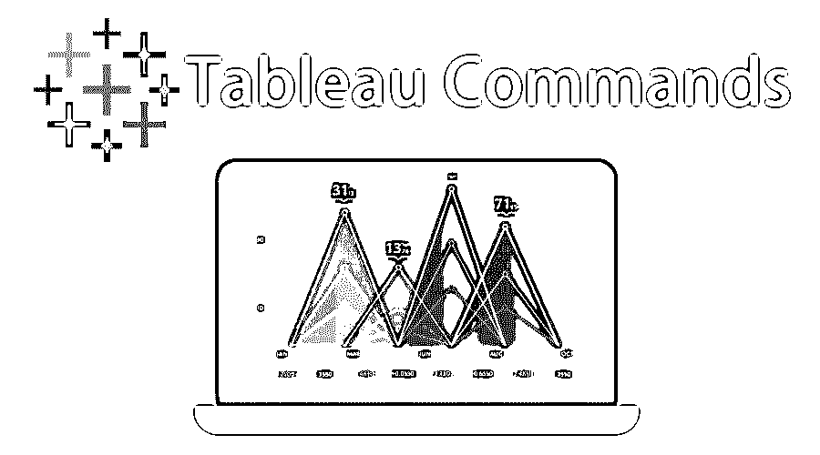
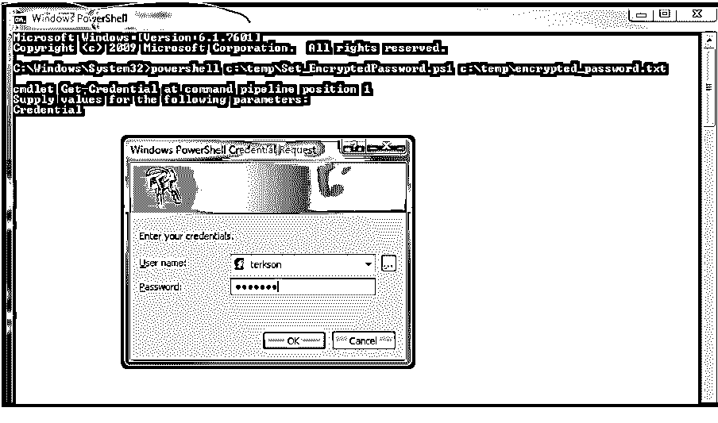
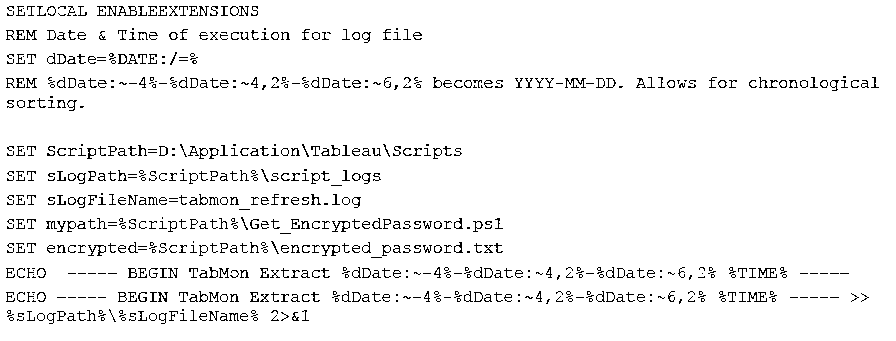
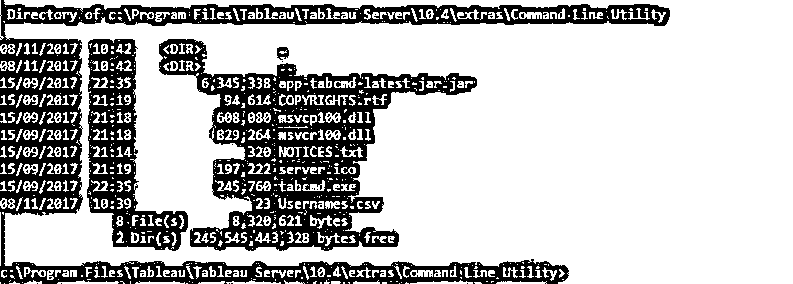

# Tableau 命令

> 原文：<https://www.educba.com/tableau-commands/>

## Tableau 命令简介

Tableau 提供了两个命令行工具来自动执行常规任务。他们是 tabcmd 和 tabadmin。所有功能都可以在 tableau 服务器的用户界面中直接使用。Tabcmd 提供负责添加新用户、导出图像和数据文件的功能。Tabcmd 不安装在同一台机器上，这种灵活性从管理和调度角度来看非常有益。Tabadmin 用于服务器管理–配置服务器、激活新用户、重置密码。

### 什么是 Tableau？

Tableau 是一个数据可视化软件，带有交互式仪表盘，告诉我们数据的存储情况。Tableau 的实际流程是通过可视化对数据进行分析。人类已经使用可视化来描述不同见解中的数据。易于使用的拖放界面。许多不同行业的数据科学家和数据分析师都在使用它。它允许业务用户以简单的方式创建自己的报告，从而减少积压的报告。

<small>Hadoop、数据科学、统计学&其他</small>

### 基本 Tableau 命令

基本命令如下所述:

*   **启动、重启、停止服务器**

命令是

1.  tsm 启动
2.  tsm 停止
3.  tsm 重启

*   **设置加密密码**

密码加密凭证在批处理脚本或 power shell 中可见。TSM 本身是一个批处理文件，运行它需要调用命令。如果用户想要运行脚本，必须在 power shell 中运行“测试登录”。

要获取加密文件:

要查看加密文件中的凭据对象:

获取批处理文件的密码。

*   **使用 tabcmd** 登录

*   **设置本地日期**

#### 

*   **创建会话**

*   **创建群组**

tabcmd 创建组“图书馆部门”

*   **创建站点用户**

tab cmd createsiteusers:c:\ TC \ create user . CSV "

csv 包括密码、用户名、显示名称、角色、发布者。

*   **删除项目**

tabcmd 删除项目“库管理”

*   **更新数据提取**

tabcmd 刷新摘录-项目“图书馆管理”-数据源“图书数量”

*   **检查 tabcmd 方向**

键入 dir，然后按 enter 键

*   **版本**

显示当前 tabcmd 实用程序的版本信息。

示例:tabcmd 版本

### 中间 Tableau 命令

中间命令解释如下:

Tableau 服务经理(TSM)

1.  **待定/应用配置更改**

要重新启动服务器并更改拓扑，命令是:

*   tsm 待定-应用更改

2.  **标题标识和登录的变化**

要更改路径中图像的标题徽标，命令是:

*   **tsm 定制-**标题-徽标<路径>

要更改图像的登录徽标

*   **tsm 定制-**签到-logo <路径>

3.  **默认定制重置**

*   tsm 定制–恢复–默认值

4.  **启用存储库访问**

*   tsm 数据访问存储库-访问启用-存储库-用户名<username>-代表</username>

5.  **禁用存储库访问**

*   tsm 数据访问存储库-访问禁用-存储库-用户名<username>-rep</username>

6.  **数据缓存配置**

*   tsm 数据访问缓存设置–刷新频率<value></value>

<value>选项包括低，总是，30 或其他数值。</value>

7.  **Tsm 认证**

*   **sspi:**

tsm 身份验证 sspi 启用/禁用[全局选项]

*   **开标:**

tsm 身份验证 openid 启用[全局选项]

*   **可信:**

tsm 身份验证可信配置[选项][全局选项]

**举例:**

tsm 身份验证可信配置-th "192.168.1.100 "、" 192.168.1.101 "、" 192.168.1.102 "

8.  **Tsm 数据访问:**

*   **缓存设置**

tsm 数据访问缓存集[选项][全局选项]

选项包括-r，–刷新

全局选项包括-h、-p、-s(帮助、密码、服务器地址)

*   **数据访问存储库**

tsm 数据访问存储库-访问启用/禁用[选项][全局选项]

选项包括–存储库-用户名<username>(例如:用户名为 tableau)，–请求超时-重启。</username>

9.  **tsm 许可证**

*   它激活 tableau 服务器产品密钥

1.  tsm 许可证激活–许可证密钥<product-key>[全局选项]</product-key>

*   选项包括-f(许可证文件)、-k(许可证密钥)、-t(试用版)

2.  tsm 许可证停用–许可证密钥<product-key>[全局选项]</product-key>
3.  tsm 许可证更新

tsm 许可证刷新[全局选项]

### 高级 Tableau 命令

高级命令如下所述:

**tabcmd**

它是一个命令行工具，tableau 将这些命令安装到根目录下自己的文件夹中，名为 c:\ drive tab cmd。我们在 tableau online 中使用所有这些命令。

**ex: c:\tabcmd**

1.  **向群组添加用户**

*   tabcmd 添加用户“开发”-用户“users.csv”

2.  **创建项目**

–tab cmd 创建项目–名称“报告”-d“工作簿”

-名称(项目名称)，-d(项目描述)

3.  **从命令行生成 PDF 格式的 PNG 文件**

我们需要用 tabcmd 登录 tableau 服务器。

tab cmd log in-s http://tableauserver:80-u admin-p admin(u 和 p 代表用户名和密码)

要获取 pdf 文件:

*   tabcmd 获取/查看/xxx.pdf

4.  **发送电子邮件**

我们必须安装电子邮件共享软件

*   tab cmd get/views/Wow/XXX . png-f progressReport.png

5.  **发布数据源**

*   tab cmd publish:c:\ TC \ Sql extracts "-r " tab cmd "-n " Transactions "-db–username " test "-d B- password " test "-save-d B- password

6.  **获取网址**

*   它从 tableau 中获取资源，结果以文件格式给出。
*   tab cmd get "/views/lib/management . png "-PPF " books return . png "

7.  **日程安排**

*   运行指定的计划
*   tabcmd 运行计划“库存销售刷新”

### 要使用的提示和技巧

Tabcmd 是一个基于窗口的工具，用于通过命令行与 tableau Server/online 通信。它是随 tableau server 一起安装的命令行工具之一。它们通常用于自动化 Tableau Server 中常见的内容管理任务。主要的提示是它们被用来发布新的内容和管理它。要使用的版本是必不可少的，tabcmd 与 tableau 服务器的版本相同。服务器密码存储在一个单独的文件中，以增加安全性。

### 结论

Tableau 命令在 tableau 服务器本身上运行。tableau 服务器上有关于计算的内容。另一个好处是，我们可以将这些 Tableau 命令输入到脚本中，然后我们可以将它们自动化到许多流程中。我们可以使用 Tableau data extract 命令自动刷新任务——这个命令来自 Tableau desktop，通过它我们可以刷新任务并向其追加数据。这些命令不适用于多连接数据源。tabcmd 在 tableau 中的主要应用是自动下载特定仪表板中的 pdf，并通过电子邮件分发给员工。

### 推荐文章

这是 Tableau 命令的指南。这里我们讨论了基本、中级和高级的 Tableau 命令以及使用的技巧和诀窍。您也可以阅读以下文章，了解更多信息——

1.  [Tableau 的用途|你应该知道的](https://www.educba.com/uses-of-tableau/)
2.  [使用 Tableau 进行数据可视化](https://www.educba.com/data-visualization-with-tableau/)
3.  [Splunk 和 Tableau 的区别](https://www.educba.com/splunk-vs-tableau/)
4.  [十大 Tableau 面试问题](https://www.educba.com/tableau-interview-questions/)
5.  [关于 Splunk 命令的信息](https://www.educba.com/splunk-commands/)

