# 表格中的直方图

> 原文：<https://www.educba.com/histogram-in-tableau/>

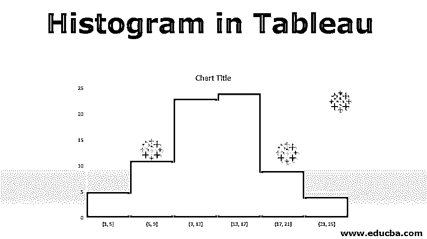

## Tableau 中的直方图介绍

直方图是绘制变量频率分布的可视化工具。它类似于条形图，但与需要两个变量的条形图不同，直方图只需要一个变量。它创建表示范围的条柱，并计算变量值在这些范围内出现的次数。条柱的频率决定了条柱的高度。直方图在野外研究中非常流行，因为它们提供了对频率分布的快速洞察。在统计学术语中，直方图是一个非常强大的工具，因为它有助于理解变量的分布并验证正态假设。

### 在 Tableau 中创建直方图

现在，我们将看到如何在 Tableau 中构建一个有洞察力的直方图。在演示中，我们将考虑按区域划分的年销售额数据。它包含四个不同地区一整年的日销售额，即。东，西，北，南。我们打算用柱状图来分析这些地区的销售业绩。让我们按照下面的步骤来进行。

<small>Hadoop、数据科学、统计学&其他</small>

1.将数据加载到 Tableau。点击“数据”菜单中“新数据源”。或者，单击“连接到数据”。

2.在“连接”中，单击所需的数据源类型。在这种情况下，数据源类型是 Microsoft Excel，所以单击它。

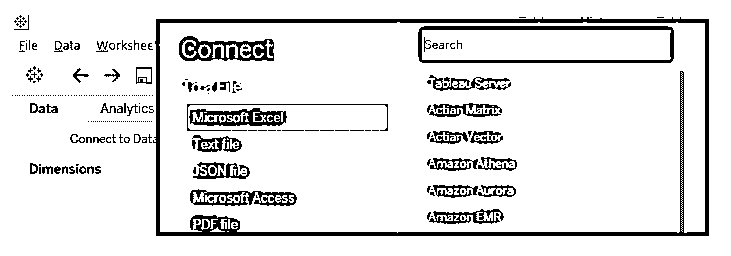

3.数据被加载，可以在“数据源”选项卡中看到，如下所示。

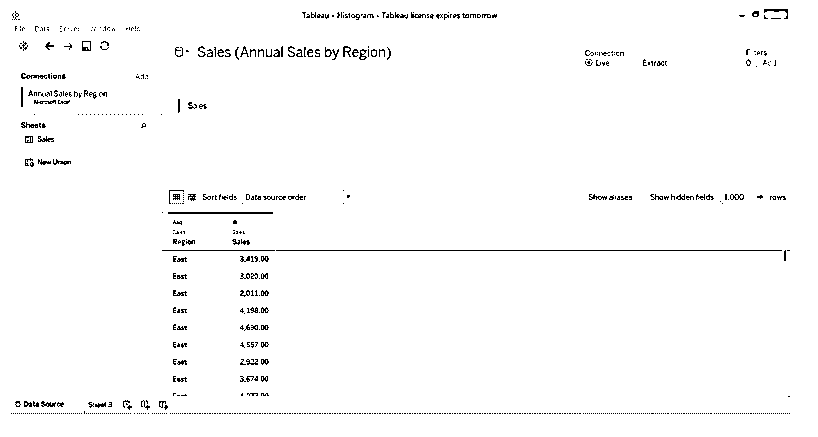

4\. Moving to the sheet tab, we can see the dimension Region and measure Sales present in the respective sections.

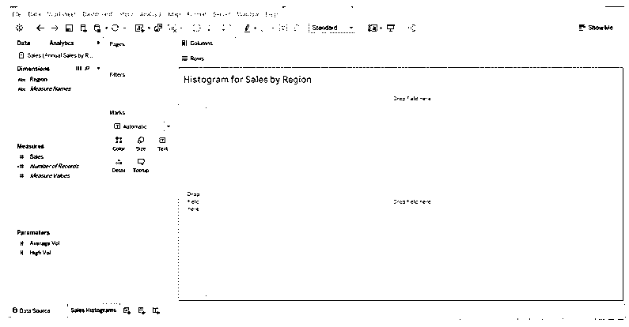

5.现在，只需将“销售额”度量值拖到“行”区域。我们得到一个衡量销售额的单条线，如下所示。就其本身而言，酒吧不提供任何见解。

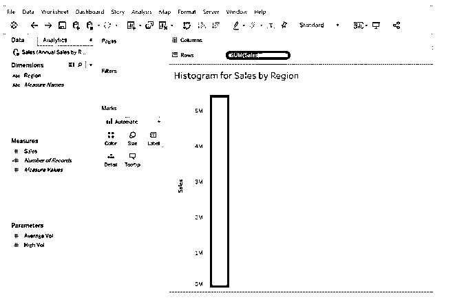

6.要创建衡量销售额的直方图，请单击演示中的直方图，如下图所示。将鼠标悬停在直方图符号上，我们可以看到它只需要一次测量的细节。

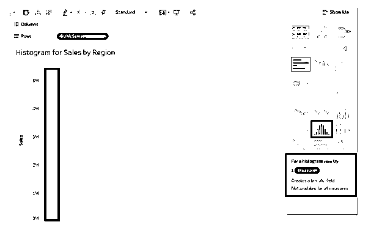

7.按照上面的步骤产生直方图，如下图所示。我们还看到一个自动创建的维度 Sales (bin ),它将被用作直方图创建的 bin。

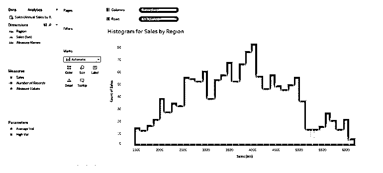

8.下面的屏幕截图突出显示了自动创建的维度 Sales (bin)。

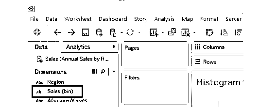

9.下面的截图让我们更近距离地观察可视化效果。直方图适用于所有四个区域。在列区域中，我们有销售维度(bin ),而在行区域中自动计数，即计数函数应用于衡量销售。CNT 函数计算一个容器中度量销售额的值的数量。我们的目标是为四个不同的区域获得四个不同的直方图。

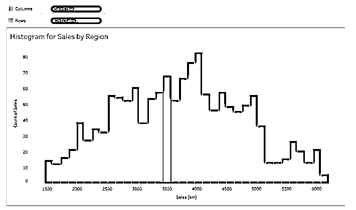

10.要按区域生成直方图，只需将维区域拖到列区域中，如下所示，我们将为四个不同的区域获得四个不同的直方图。然而，下面的可视化是粗糙的。我们将通过用不同的颜色区分各个区域并为每个区域的水平轴设置适当的范围来对其进行优化。让我们看看如何实现这一点。

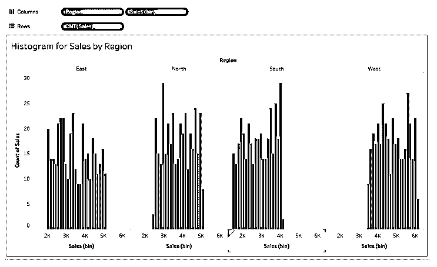

11.如下图所示，将区域拖动到标记卡的颜色上。我们可以看到，现在，四个区域用四种不同的颜色表示，这有助于我们更好地可视化和区分它们。

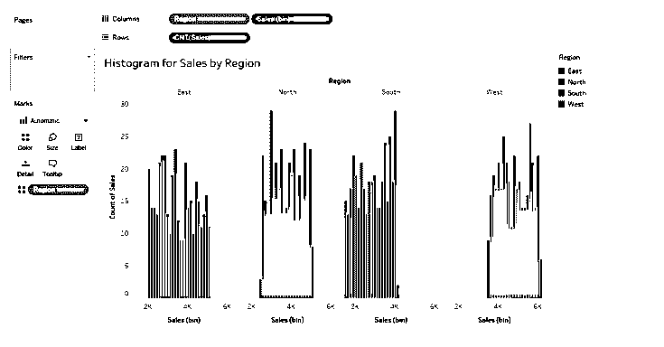

12.下面的截图给出了直方图的详细信息。现在，我们希望不同的区域有不同的水平轴范围。这是很重要的，因为四个区域具有相同的水平轴范围。如果对于一个区域，没有值出现在一个范围内，那么直方图要么被推到左边要么被推到右边，这给可视化带来了尴尬的外观，如下面对于南部和西部区域所看到的。为了使不同的维度(区域)值具有不同的轴范围，如以下截图所示，只需右键单击水平轴，然后单击“编辑轴…”。

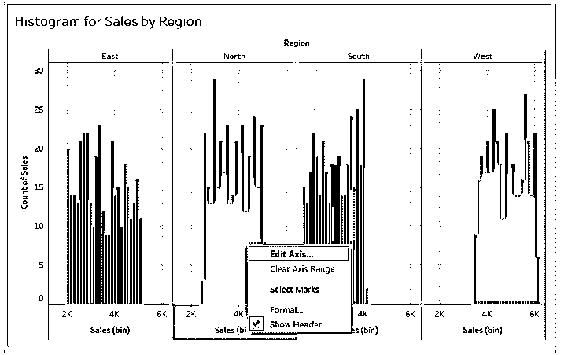

13.点击“编辑轴…”生成编辑轴对话框，如下图所示。在“范围”部分，默认选择是“自动”,为所有尺寸值保持相同的范围。选择“每行或每列的独立轴范围”，如下所示。选择此选项将为不同的维度(区域)值创建不同的水平轴范围。因此，它本质上是基于该维度的最低和最高度量值来创建范围，该范围用于直方图创建。

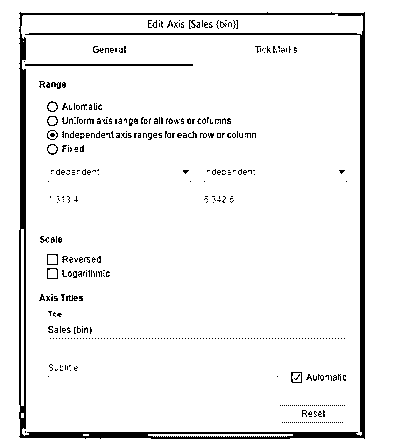

14.正如我们在下面的屏幕截图中看到的，现在，按照上面的过程为每个区域设置了不同的范围，与之前的可视化不同，直方图现在已经沿着水平轴正确地居中。

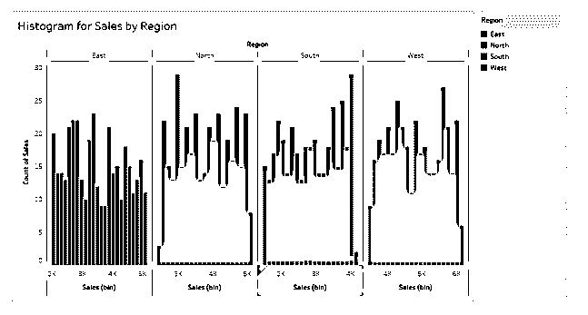

15.如果我们研究直方图，我们可以看到已经创建了大量的箱。这意味着创建 bin 的值范围很小。记住，箱子的尺寸越小，箱子的数量就越多，反之亦然。Tableau 会在创建直方图之前自动选择容器大小。但是，我们可以手动指定 bin 范围。我们可以通过单击 dimension Sales (bin)的下拉菜单并选择“Edit…”来完成此操作。

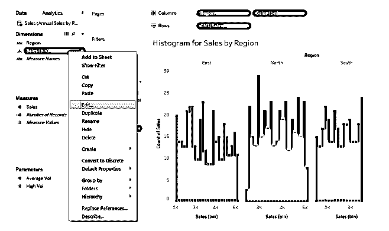

16.一旦我们点击“编辑…”如上所述，编辑箱[销售]对话框弹出。这里，我们可以看到所考虑的 bin 的默认大小是 132。在下面的截图中，我们可以看到，bin 大小可以手动指定，也可以通过参数指定。

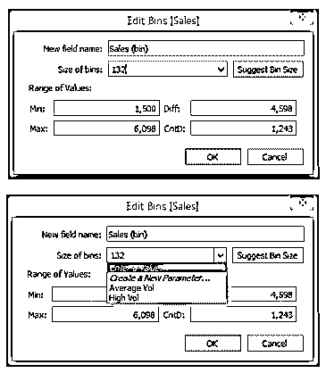

17.我们在上面对话框的“箱子大小”选项中指定了值 200。正如下面可以看到的，与早期版本相比，我们得到的直方图具有较少数量的仓。拥有太多的条块可能并不总是对洞察力推导有用。

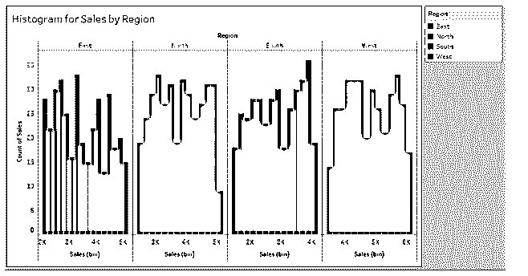

18.下面的屏幕截图显示了 bin 大小为 400 的直方图。将鼠标悬停在任何箱上，可显示与该箱相关的详细信息。

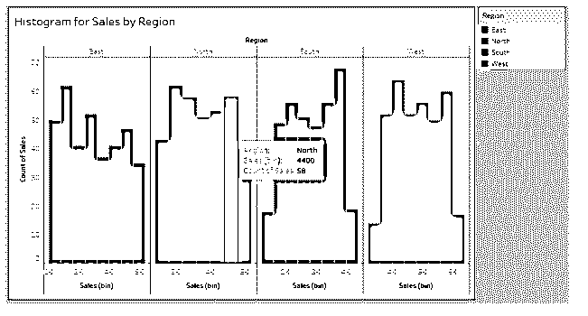

### 结论

直方图是一种非常重要和强大的探索性分析工具，通常用于变量分布分析。Tableau 是一个可视化分析工具，提供了一种用户友好的方法来创建和分析直方图。在某种程度上，Tableau 通过向用户提供有用的提示，提供了一种自我指导的方法来创建直方图。然而，必须理解某些错综复杂的问题。这些通常与可视化的某些设置有关，为了获得更有洞察力的结果，必须对这些设置进行修改。此外，创建直方图时必须考虑上下文，并且直方图能够传达正确而有用的见解。

### 推荐文章

这是一个在 Tableau 直方图指南。这里我们讨论一下 Tableau 中直方图的介绍，Tableau 中直方图的创建和基本要点。您也可以浏览我们推荐的其他文章，了解更多信息——

1.  [画面可视化](https://www.educba.com/tableau-visualization/)
2.  [Tableau 图表类型](https://www.educba.com/tableau-chart-types/)
3.  [什么是 Tableau？](https://www.educba.com/what-is-tableau/)
4.  [R 中的直方图](https://www.educba.com/histogram-in-r/)
5.  [Tableau 中的排名函数](https://www.educba.com/rank-function-in-tableau/)
6.  [Tableau 聚合函数](https://www.educba.com/tableau-aggregate-functions/)
7.  [Tableau 上下文过滤器](https://www.educba.com/tableau-context-filter/)
8.  [Tableau 项目符号图](https://www.educba.com/tableau-bullet-chart/)
9.  [Tableau 特性和属性介绍](https://www.educba.com/tableau-new-features/)

