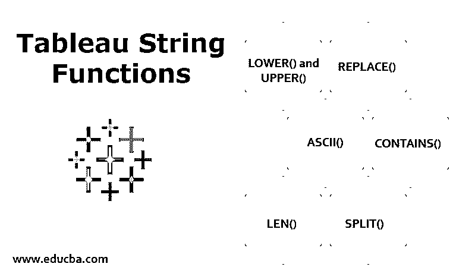
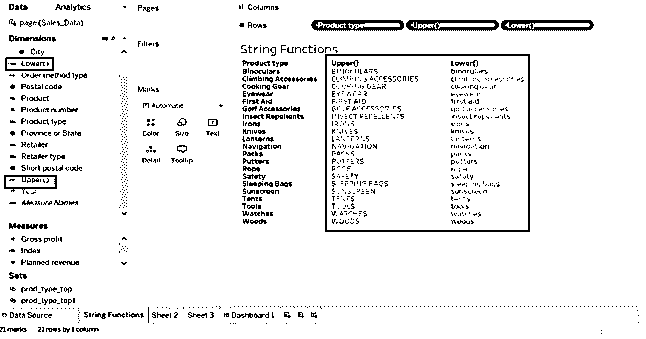
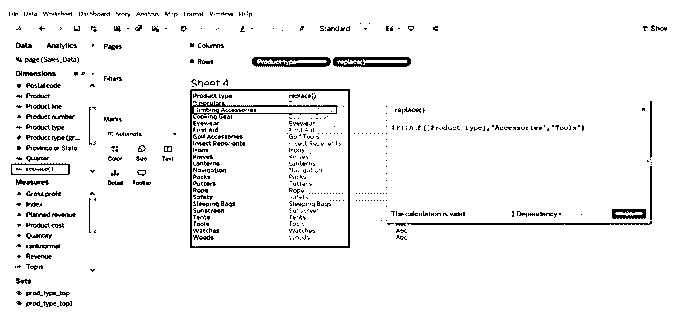
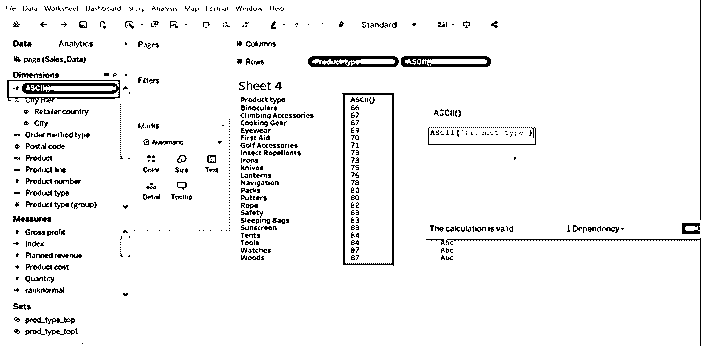
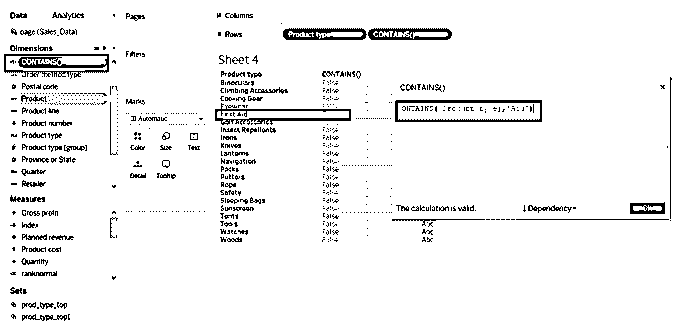
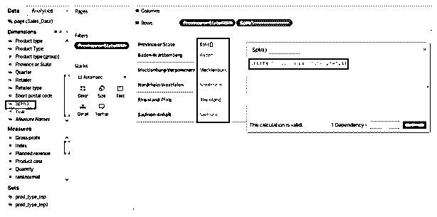
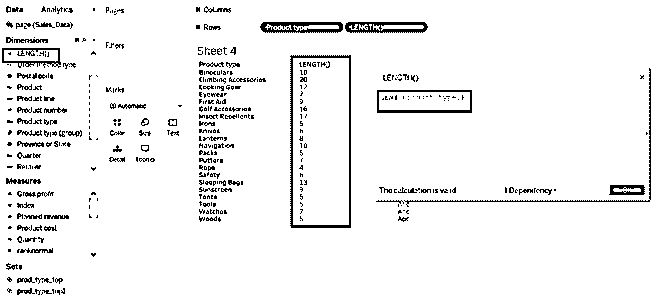
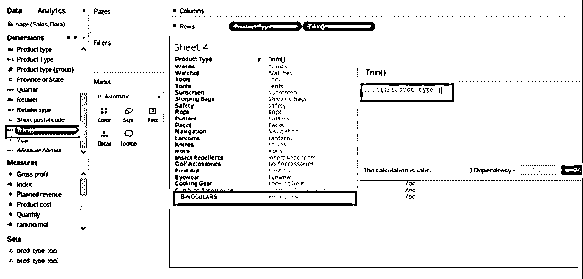

# Tableau 字符串函数

> 原文：<https://www.educba.com/tableau-string-functions/>

## Tableau 字符串函数介绍

Tableau 字符串函数是用来操作字符串的函数，比如说，如果你想提取某些字符，替换，分割，修剪，整形，连接等等。让我们假设一个场景，其中您有客户的订单和销售数据，并且您想要分析名为“Mark”的所有客户的销售贡献，但是您没有名为“first name”的单独列来单独分析它，所以这就是字符串函数发挥作用的地方，您可以在这里使用字符串函数，并且可以创建名为“First Name”的新计算字段，并且可以分析目标客户。

Tableau 支持各种类型的函数，如日期函数、数字函数、类型转换函数、聚合函数、逻辑函数。就数据表示而言，它们中的每一个都有其重要性，并减少了编写复杂计算和复杂表达式的大量工作。例如，如果要对数字进行计算，可以使用幂、上限、舍入等数字函数；如果要进行日期计算，可以使用 DATEADD()和 DATENAME()等日期函数。

<small>Hadoop、数据科学、统计学&其他</small>

### Tableau 的字符串函数

现在让我们来看看其中的一些函数，以便更好地理解它。

#### 1.下部()和上部()

这些函数将把字符串分别转换成小写和大写。

**语法**:

`Lower ( String )
Upper ( String )`

首先，我们来看看如何创建计算字段。

*   转到顶部的分析选项卡，并选择*创建计算字段
*   将出现一个对话框，要求输入计算字段表达式。给出计算字段的名称。

*   在“计算”框中输入表达式 Lower ( [列名])，然后单击

(这里我使用的是我的数据集中的产品类型列)。

同样，为 Upper Function 创建计算字段。

计算字段(Lower()和 Upper())将出现在左侧的维度中。

现在，首先，将 Dimensions 面板中的列(在我的例子中是 Product Type)拖动到 rows 部分，后面是 Lower()和 Upper()计算字段。我们注意到字符串分别被转换为大写和小写，如图所示。

#### 2.替换()

它在字符串中搜索子字符串并用替换值替换它。如果子串不存在

在搜索到的字符串中，字符串不会改变。

**语法** : `REPLACE ( string, substring, replacement )`

#### 3.ASCII()

它返回字符串第一个字符的 ASCII 码。

**语法:** `ASCII ( string )`

#### 4.包含()

它返回布尔值(TRUE 或 FALSE)，如果子字符串包含在字符串中，则返回 True，如果子字符串不存在，则返回 False。

**语法** : `CONTAINS ( string, substring )`

#### 5.拆分()

Split 函数将由分隔符分隔的字符串拆分为标记，并为每个标记分配一个标记号。例如，字符串“RTO-123-MNX-YUH”被分成令牌 RTO，123，MNX，YUH(令牌),其中 1，2，3，4 分别是这些令牌的编号。通过将标记 no 作为 split 函数的参数，可以检索您想要检索的字符串部分。

**语法** : `SPLIT ( String, Delimiter, Token number )`

#### 6.LEN()

它返回字符串的长度(或给定字符串中的字符数)。

**语法** : `LEN (String)`

#### 7.修剪()

它从字符串中删除不需要的、多余的和尾随的空格。

如图所示，产品类型“双筒望远镜**”**中所有多余的空格都已删除。

#### 8.CHAR()

它返回与作为参数给出的 ASCII 码相关联的字符。

**语法** : `CHAR ( Integer )`

因此，CHAR ( 65)返回“A ”,因为“A”的 ASCII 代码是 65。

#### 9\. ENDSWITH()

如果字符串以指定的子字符串结尾，则返回布尔值(TRUE 或 FALSE)，如果字符串不以指定的子字符串结尾，则返回 FALSE。

**语法** : `ENDSWITH (String, Substring)`

For eg : ENDSWITH ( 'FUNCTION '，' ION ')返回 TRUE，因为字符串' FUNCTION '以' ION **'结尾。**

#### 10.左侧()

这个函数返回字符串最左边的字符。

**语法** : `LEFT (String, no. of characters)`

例如，让我们离开(“Tableau”，3)

**输出:'** Tab' (返回最左边的 3 个字符)

#### 11.右()

这个函数返回字符串最右边的字符。

**语法** : `LEFT (String, no. of characters)`

例如，让我们有权利(“Tableau”，3)

**输出:'** eau **'** (返回最右边的 3 个字符)

### 结论

Tableau 是一个自助式商业智能工具,你可以通过拖放功能进行复杂的分析。准备用于分析的数据、数据清理、透视、来自多个来源的数据混合、创建集合和箱、动态维度和度量、漂亮的可视化，此外，其用户友好性使其成为完美的企业解决方案。每个业务领域都在广泛使用信息技术，向客户提供有洞察力的视觉效果，以实现他们的业务目标。

通过将它们与各种 R 和 Python 库连接起来，我们可以构建漂亮的交互式视觉效果和仪表板。我们可以在任何设备上查看它，Tableau 足够智能，可以理解设备并根据设备大小调整报告的大小，而无需任何额外的编码工作。像任何其他编程/脚本语言、数据库和 BI 工具一样。Tableau 还提供了一些内置函数来修改和格式化字符串数据。如果你想成为一名优秀的开发人员，对字符串函数的了解是必不可少的。有了这些函数，您可以用任何想要的方式来表示字符串数据。

该功能节省了数据分析师在对某些业务领域进行具体分析时必须花费的大量时间和精力。我希望你们都清楚如何在 Tableau 中实现字符串函数。

### 推荐文章

这是一个 Tableau 字符串函数的指南。这里我们分别讨论 Tableau 的不同类别的字符串函数的语法。您也可以看看以下文章，了解更多信息–

1.  [Tableau 替代方案](https://www.educba.com/tableau-alternatives/)
2.  [Tableau 中的树形图](https://www.educba.com/treemap-in-tableau/)
3.  [如何安装 Tableau](https://www.educba.com/install-tableau/)
4.  [c#中 Trim()的完整指南](https://www.educba.com/trim-in-c-sharp/)

