# 在 Tableau 中连接

> 原文：<https://www.educba.com/concatenate-in-tableau/>

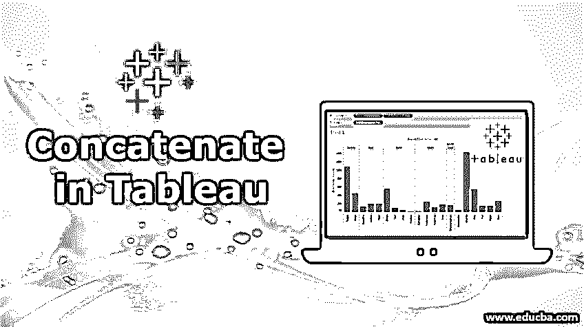

## Tableau 中的 Concatenate 介绍

串联的概念实质上是指多个字段可以组合在一起，以服务于特定的基于上下文的目的。通常，字符串被组合在一起，以形成另一个字符串来传达某种意义。Tableau 中连接的使用可以认为不同于任何编程语言。在 Tableau 中，concatenate 通常应用于两个或多个字段要合并成另一个字段的情况。这个组合字段本身将具有某种意义。

**语法:**

<small>Hadoop、数据科学、统计学&其他</small>

Tableau 中的串联可以使用“+”运算符来完成。Tableau 中串联的语法如下。

`string_1 + string_2 + string_3…+ string_n`

使用上述语法创建的串联字段将是 Tableau 中的计算字段。

### Tableau 中如何使用 Concatenate？

在本次演示中，我们将使用配送单位体积数据集，其中包含分布在印度各个城市的体积。分销区域的层级是地区->分销单位->城市。重要的维度是发行单位和地区，而发行体量是一个度量。我们将使用该数据集演示 concatenate 的概念及其应用，如下一节所述。

1.首先加载数据集。如下所示，点击数据菜单下的“新数据源”。

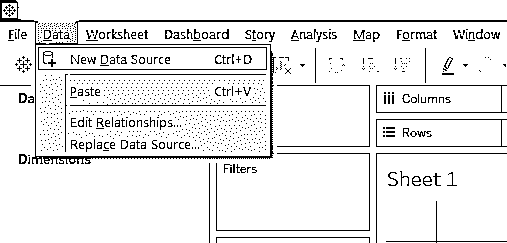

2.在“连接”部分，选择必需的数据源类型。在这种情况下，它是在“MS Excel”上单击的，因此单击“Microsoft Excel ”,如下所示。

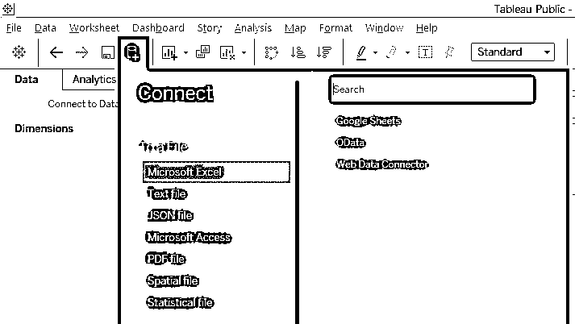

3.数据被加载，可以在数据源选项卡中看到，如下所示。

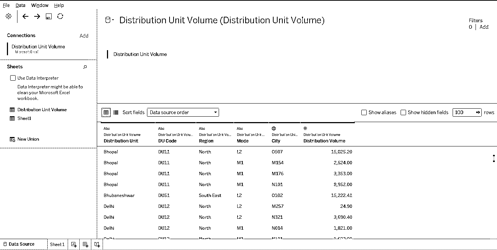

4.转到 sheet 选项卡，我们可以看到必要部分中的尺寸和度量，如下面的屏幕截图所示。

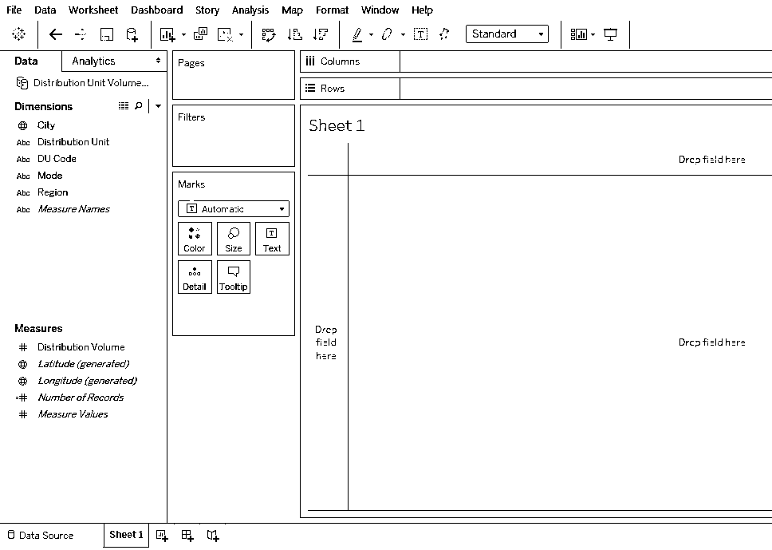

5.首先，将“区域”和“分配单元”维度放入“行”区域，并将“分配体积”度量值拖到“标记卡”中的文本上。作为这一行动的结果，我们得到了一个表格，该表格给出了不同区域的分布单位分布量。如下图所示。

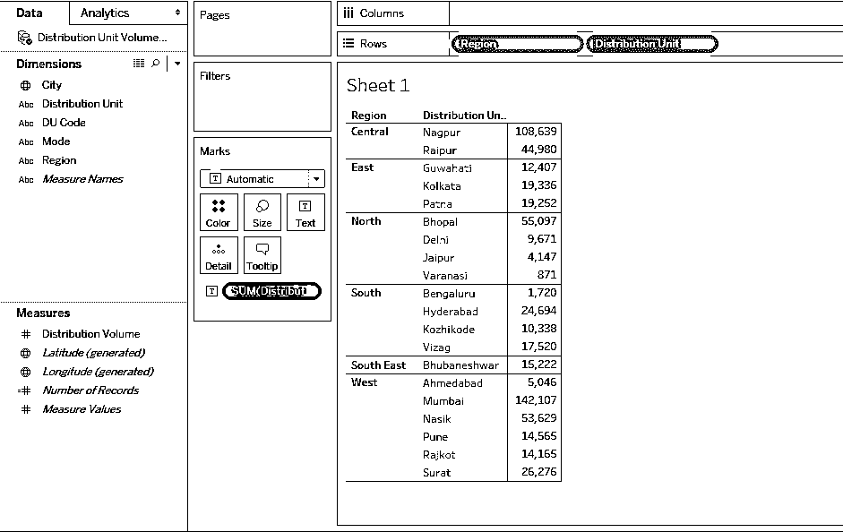

6.我们在上表的基础上创建了一个柱形图，如下所示。如果我们仔细研究一下，我们会发现一个区域性的分裂使外观变得凌乱不堪。如果我们在分析中引入另一个维度呢？然后，分析将变得过于复杂，无法得出任何洞见。

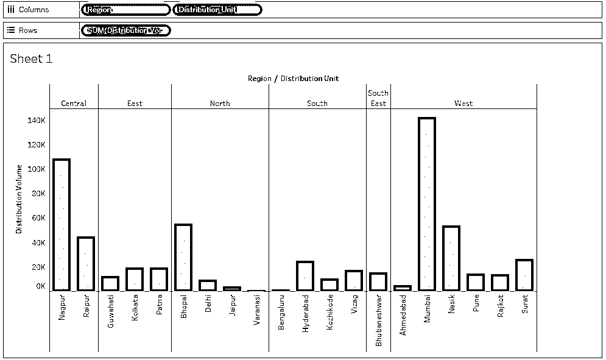

7.如上所述，我们在分析中引入了另一个维度，即模式，如下所示。现在，我们可以发现分析变得复杂了。我们的目的是为每种模式的不同区域可视化分布单元式分布体积。然而，似乎使用这种方法，我们可能无法获得任何正确的见解。

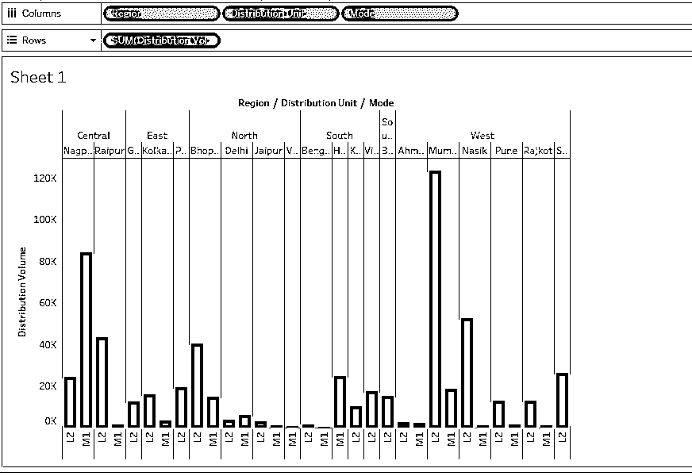

8.现在，为了克服复杂性的问题，我们可以使用 Tableau 提供的串联功能[。使用这个功能，我们将结合三个方面或领域，即。按此顺序分配单元、区域和模式。组合字段将作为唯一字段，并作为单个字段工作。使用单个字段并从中获得洞察力比一起使用多个字段要容易得多。我们可以通过“创建计算字段”选项创建组合字段。单击“数据”选项卡空白处的任意位置，然后单击“创建计算字段”，如下图所示。](https://www.educba.com/what-is-tableau/)

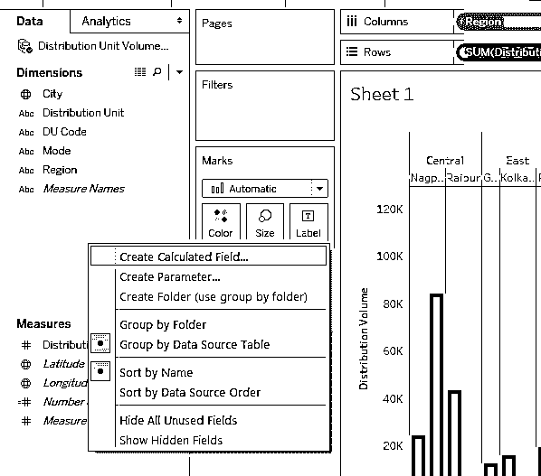

9.当我们执行上述步骤时，将弹出计算字段窗格，如下所示。该字段的默认名称是“计算 1”。

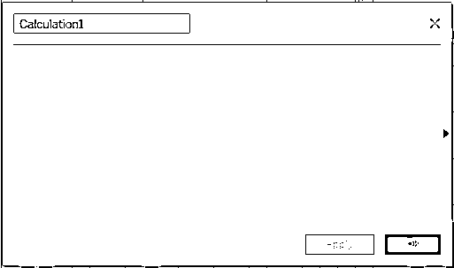

10.如下所示，将该字段重命名为“组合字段”。应该为应该传达含义的字段提供一个适当的名称。完成后，单击应用，然后单击确定。

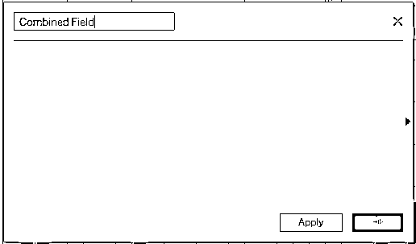

11.现在，下一步是一个接一个地引入维度。我们将创建类型为[分配单元]_[区域]_[模式]的字段。例如，如果分配单位在艾哈迈达巴德，其区域为西部，模式为 L2，则组合字段值将为艾哈迈达巴德 _ 西部 _L2。这样，所有的字段值都应该生成了。以下屏幕截图显示了分配单位维度被拖到计算字段中。

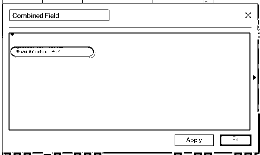

12.一旦引入了第一个维度(在本例中是分布单元),那么语法中的下一个维度就是‘+’操作符。必须在双引号中指定要插入的字符串。这是非常重要的，否则，字段不会被创建，我们将得到一个错误。

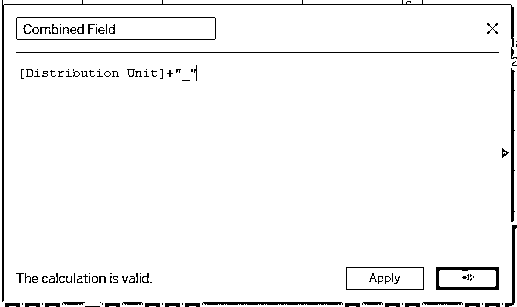

13.同样，把其余两个维度，即。区域和模式，并正确使用语法，创建如下图所示的字段。请记住，如果语法实现正确，那么我们会在字段的右下角得到“计算有效”的消息。仔细观察下面截图中的每一个元素，并检查语法是如何工作的。

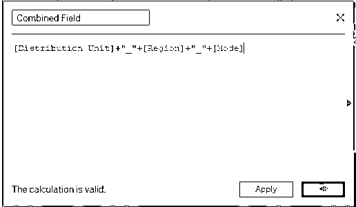

14.新创建的字段“组合字段”可以在窗口左侧的维度部分看到。如下图所示。

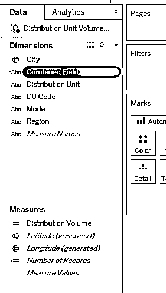

15.只需双击新创建的计算字段“组合字段”,它就会进入行区域。接下来，将分布体积测量拖到标记卡中的文本上。正如我们所看到的，在下面的屏幕截图中，我们获得了每个组合字段值的分布量值。新创建的字段可以更好地洞察数据。

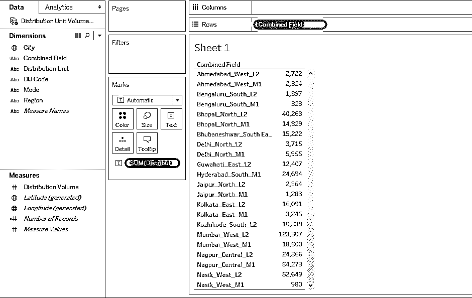

16.我们将在上表的基础上创建一个柱形图，并仔细观察下面截图中的分析。该分析比我们在上一节中创建的分析更加清晰，后者将分销单位、区域和模式作为不同的维度。

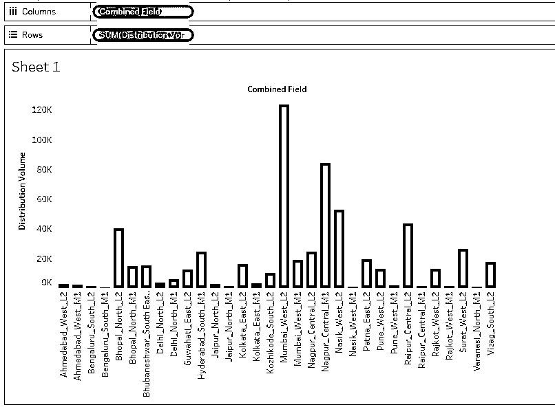

17.上面截图中的一些尺寸值看不清楚，所以我们在下面显示的水平条形图中修改了上面的图表。现在，名称出现正确。

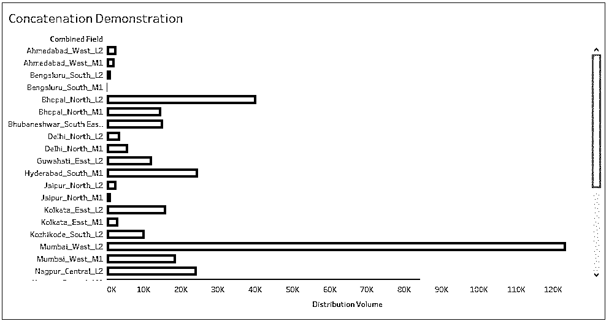

上面的可视化是一个例子，展示了我们如何有效地利用 Tableau 中的 concatenate 函数，使洞察推导过程变得简单而高效。

### 结论

Tableau 是一个可视化分析工具，它极大地推动了可视化的应用，以促进洞察力的推导。虽然不是一个编程工具，但它确实提供了诸如连接之类的功能。Tableau 中的串联功能在各种上下文中都很有用，尤其是在组合多个字段时。

### 推荐文章

这是 Tableau 中连接的指南。在这里，我们讨论如何有效地利用 Tableau 中的 concatenate 函数，使洞察推导过程变得简单而高效。您也可以看看以下文章，了解更多信息–

1.  [Tableau 的字符串函数](https://www.educba.com/tableau-string-functions/)
2.  [Tableau 中的地图图层](https://www.educba.com/map-layers-in-tableau/)
3.  [Tableau 中的仪表板](https://www.educba.com/dashboard-in-tableau/)
4.  [Tableau 新功能](https://www.educba.com/tableau-new-features/)
5.  [Tableau 动作过滤器的不同概念](https://www.educba.com/tableau-action-filter/)

