# Tableau 中的查找函数

> 原文：<https://www.educba.com/lookup-function-in-tableau/>

## Tableau 中的查找函数介绍

本文将探讨 Tableau 中的查找函数。lookup 函数是 Tableau 中最重要和最广泛使用的表计算之一，用于查找选定范围内的值。顾名思义，它用于在表(分区)中查找值，即从分区的开头或结尾开始查找。获取的值基于定义当前行的位置(正或负)的偏移值。需要查找的值(测量/尺寸)在语法中指定，位置基于偏移。偏移量是指定地址数量的东西，它被添加到基址以获得绝对地址。

### Excel 查找和 Tableau 查找的区别

Excel 还提供了 vlookup 和 hlookup 的查找功能。但是，excel 中的查找广泛用于从不同的表中提取值，而 Tableau 查找将根据偏移值从表中提取数据。

<small>Hadoop、数据科学、统计学&其他</small>

**查找函数的语法:[表达式，偏移量]**

**表达式:**函数的第一部分是将返回的度量或维度的集合。

**Offset:** 这是一个数字，它指定 tableau 应该向哪个方向移动(正或负)以及从当前行值移动多少。这意味着它指定了获取第一部分中指定的值的位置。偏移量基本上是指从表格的开始处或从表格的结尾处到单元格的距离。它可以是硬编码的数字、参数或公式。如果偏移量是负值，它将查找前面的行，如果偏移量是正值，它将查找下一行的值。

让我们用工作实例来理解这个主题。

#### 示例#1

**正在设置的数据源**

我们有一个样本数据集，其中包含美国 5 年(2005-2010 年)的失业数据。它包括每个月不同年龄组的失业人数。男性和女性的失业人数分别列出。

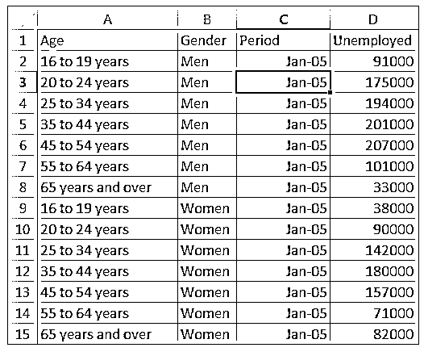

1.启动 Tableau 后，使用 Tableau 登录页面上的连接选项连接到上面提到的 excel 文件。选择 excel 选项并浏览至您的数据文件。

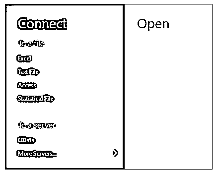

2.选择并打开文件后，您将导航到 tableau 的数据源视图。在“数据源”选项卡中，它显示了数据源的设置方式，还显示了数据的前 1000 行。要转到工作表，请单击工作表 1。

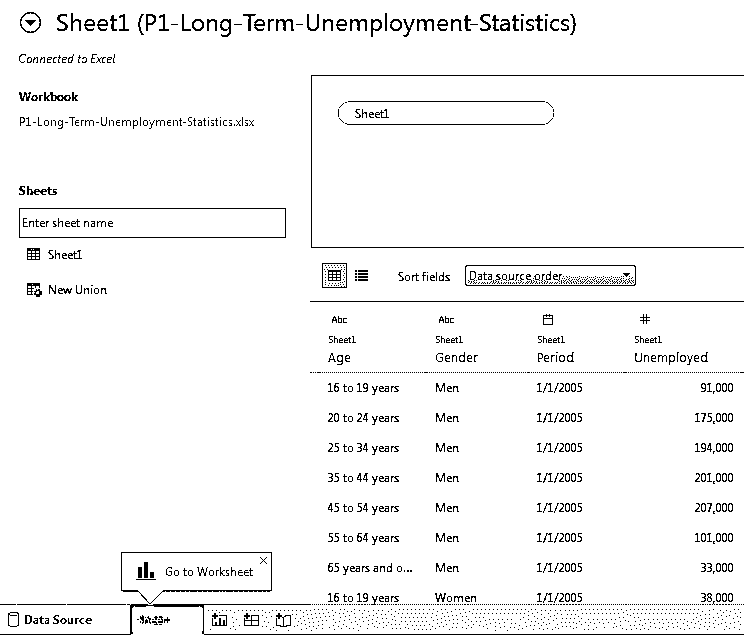

3.Tableau 将自动识别数值(度量)和分类值(维度)。

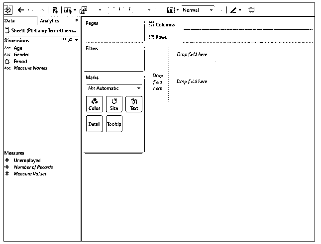

4.从“维到行”窗格中拖放期间值。此外，将失业度量移到标记窗格中的文本框上。这将产生一个如下图所示的表格。

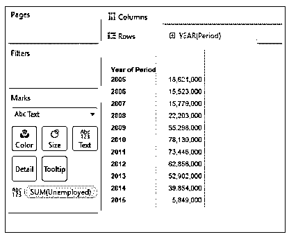

5.为了介绍查找的概念，使用偏移量为 1 的查找函数创建一个名为“去年失业”的计算字段。

6.将新创建的计算字段拖放到表中。

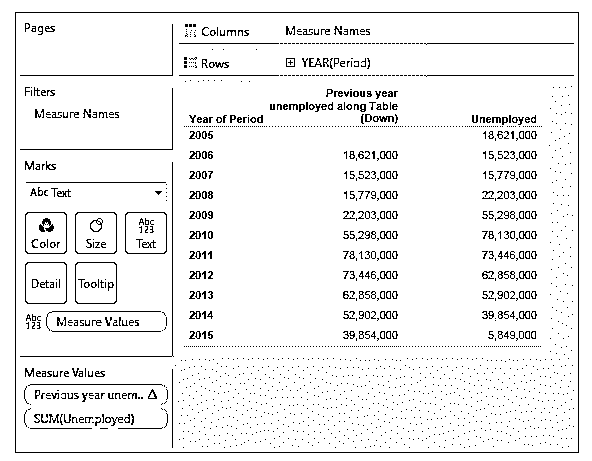

因此，Tableau 在查找功能的帮助下提取了前一年的失业人数。我们可以根据需要不断改变偏移值来获取数字。值为 1 将查找下一年的值并显示在表格上。

#### 实施例 2

**偏移参数控制**

您还可以通过引入参数的概念来动态更改偏移值。该参数将允许在可视化本身中更改偏移值，而不是每次都编辑计算字段来更改数值。我们需要在工作空间中做一些更改，比如添加一个新参数，并在查找函数中使用该参数。

1.右键单击测量窗格并选择“创建参数”选项。指定名称和当前值。当前值将与您希望的偏移值相同。

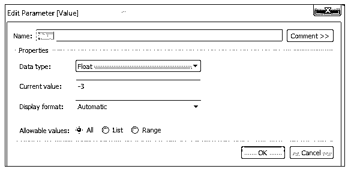

2.现在，通过用偏移值替换参数名称来修改计算字段。

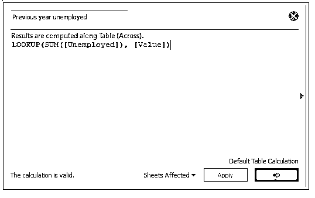

3.因此，工作区看起来会像这样。这个特性在创建仪表板和故事时非常有用。

**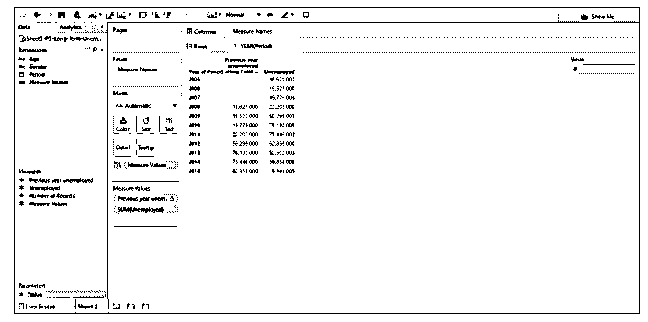

** 

#### 实施例 3

**使用查找表**计算失业人数与前一年相比的差异

创建一个新的计算字段，我们将在其中计算当前值和基于偏移量指定的值之间的差异

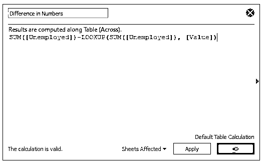

将这个新的计算字段拖放到表中。

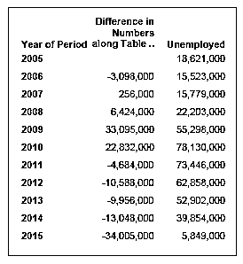

**查找功能的用例**

*   Lookup 函数执行计算，并在表计算中提供每年的季度销售额。
*   考虑一个组织的销售数据的例子，该组织的销售往往随季节变化。圣诞节期间可能会有更多的销售，而不是任何正常的周末。因此，为了比较连续几年中同一时期的销售额，我们使用 tableau 中的查找函数。查找函数用于提取从目标列偏移的值。
*   比较一段时间内的季度销售额。
*   各年的年度小计。

### 结论

以下是查找功能的主要亮点

*   最广泛使用的表计算，用于根据偏移位置在表中查找值。
*   每次改变计算字段中的偏移值都是繁琐的工作，因此 Tableau 通过参数来处理。偏移值可以由一个参数替换，并在视图本身中给出参数控制。这将使可视化更具互动性。
*   如果指定的偏移值大于表中的行数，它将返回空结果。

### 推荐文章

这是一个 Tableau 中查找函数的指南。这里我们讨论什么是 Tableau 中的查找函数，Excel 查找和 Tableau 查找的区别，并给出相应的例子。您也可以浏览我们推荐的其他文章，了解更多信息——

1.  [Tableau 中的堆积条形图](https://www.educba.com/stacked-bar-chart-in-tableau/)
2.  [Tableau 日期函数](https://www.educba.com/tableau-date-functions/)
3.  有哪些可供选择的画面？
4.  [什么是 Tableau？|用途和应用](https://www.educba.com/what-is-tableau/)
5.  [学习 MongoDB 中的查找示例](https://www.educba.com/lookup-in-mongodb/)

