# Tableau 中的过滤器

> 原文：<https://www.educba.com/filters-in-tableau/>

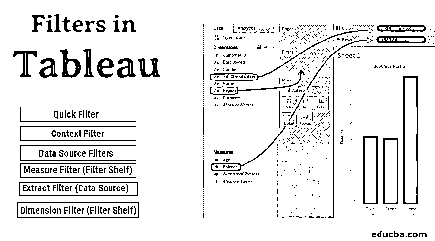

## Tableau 中的滤镜介绍

Tableau 中的过滤器将帮助我们高效快速地可视化数据。根据数据的性质和需求，我们主要有 6 种类型的 tableau 过滤器。每个过滤器都设计用于特定的情况，比如当列包含数值或字符串时？是度量还是量纲？等等。应用这些过滤器非常简单明了，可以在几秒钟内完成。

假设您有一个包含 10000 行数据的电子表格，而您的工作只需要其中的 10%。如果您只处理这 10%的数据，而不是处理整张工作表，不是更省时吗？

<small>Hadoop、数据科学、统计学&其他</small>

在大多数情况下，答案是肯定的。因此，提炼数据在数据可视化中起着至关重要的作用。

Tableau 是一款数据可视化工具，也是 2019 年的市场领导者之一，它提供了根据我们的要求，借助 Tableau 中可用的各种过滤器选项来组织和查看数据的能力。

### Tableau 中的过滤器类型

以下是 Tableau 中不同类型的过滤器:

*   维度过滤器(过滤器架)
*   测量过滤器(过滤器架)
*   快速过滤器
*   上下文过滤器
*   提取过滤器(数据源)
*   数据源筛选器

#### 1.维度过滤器

维度筛选器适用于非聚合列，如地区、客户名称、国家等。在这个过滤器选项中，我们根据任务所需的类别过滤数据。

**NOTE:** For the demonstration purpose we are using the sample bank data with the Dimensions: Customer ID, Date Joined, Region Gender, Job Classification, and Surname. Measures are AGE and Balance. In the below picture our objective is to filter data of Job Classification VS Balance by Region.

**如何使用维度过滤器？**

要应用维度，将您想要应用过滤器的维度(在我们的案例区域中)拖动到**过滤器架**，如红色图片所示。拖动后，将打开“测量过滤器”窗口，其中有四个选项卡，如下所示:

*   一般
*   通配符
*   情况
*   顶端

##### 1.一般

在此选项卡中，我们可以包括/排除要应用过滤器的字段。Tableau 还提供了像 ALL、NONE、Custom Value list 和 USE ALL 这样的选项，这有助于我们轻松地选择所需的过滤器列，即使我们有大量的列。

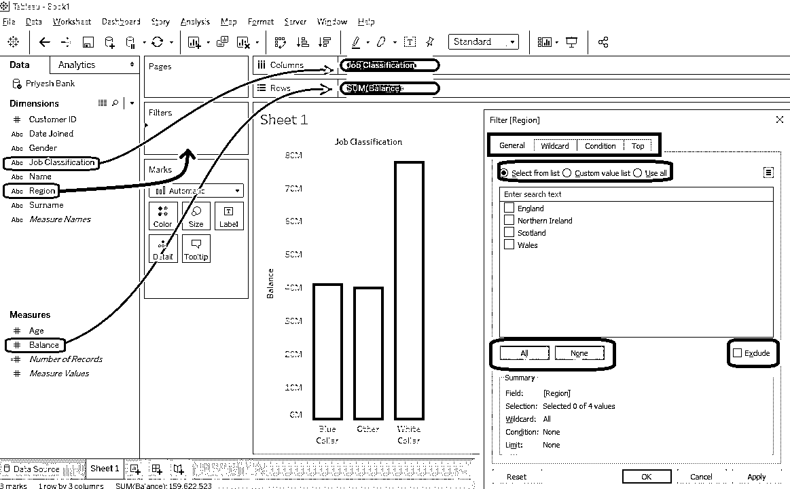

##### 2.通配符

我们可以使用通配符过滤器来包含/排除开始、结束、包含或完全匹配我们在文本框中输入的值的字段。例如，如果您需要姓名为 James 的客户的记录，那么您可以使用“包含”选项，如下图所示。

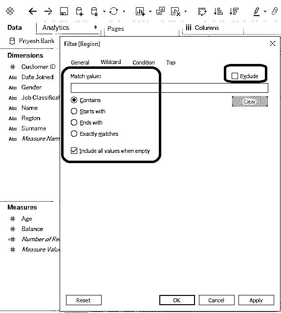

##### 3.情况

我们可以通过以下两种方式使用条件过滤器:

*   按字段
*   按公式

**按字段**

在这里，我们可以从可用的维度和度量中选择一个字段。然后，我们可以从下拉列表中选择不同的聚合函数，如 SUM、AVERAGE、COUNT 等。并且还选择了条件是应该是 <=, > =还是=。我们还可以提供一系列最大值和最小值。

**通过公式**

在这里，我们可以通过在公式框中键入相应的公式来指定要筛选的字段。例如，在下图中，我们正在过滤余额小于 5000 的记录。

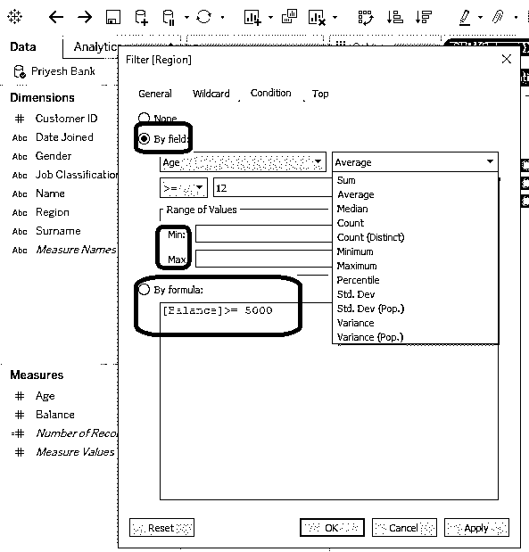

##### 4.顶部/底部

在此选项卡中，我们可以根据类似于“条件”选项卡的“按字段或按公式”筛选来显示前“N”条或后“N”条记录。这里“N”可以是大于零的任何数字。在这个选项的帮助下，我们可以得到顶/底 5，3 或 10 等。按照我们的要求记录。 **T2】**

#### 2.测量过滤器

度量值筛选器应用于聚合列，如 Age 和 Balance。在这个过滤器选项中，我们根据任务所需的聚合函数来过滤数据。

**如何应用测量过滤器？**

要应用度量过滤器，只需拖动过滤器架中的一个度量，如下图红色所示。然后过滤字段窗口将打开，然后根据您的要求选择聚合函数。

**NOTE:** For the demonstration purpose we are applying the filter on the measure AGE and selecting “All values.”

选择聚合函数(在我们的例子中是所有值)后，我们可以从如下 4 个选项卡中选择如何应用过滤条件。

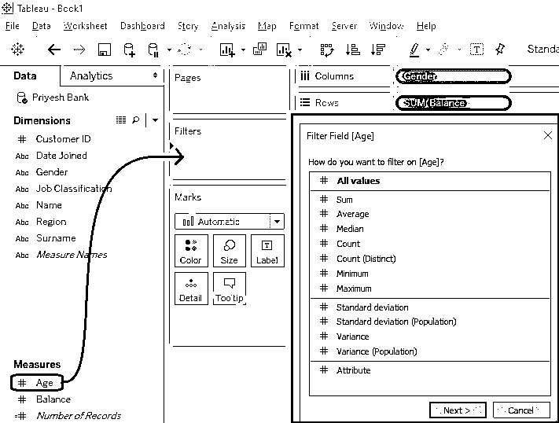

*   **数值范围**

这里我们需要提供我们想要在结果中查看的范围的开始和结束值。(在下面的例子中，我们可以选择 15 到 64 岁之间的任何年龄。如果我们想找到年龄在 30 到 40 之间的结果，那么我们需要指定 30 作为起始值，40 作为结束值。)

*   **至少**

这里我们只需要提供我们范围的起点。

*   **最多**

这里我们只需要提供我们范围的端点。

*   **特殊**

在这里，我们可以选择空值、非空值和所有值

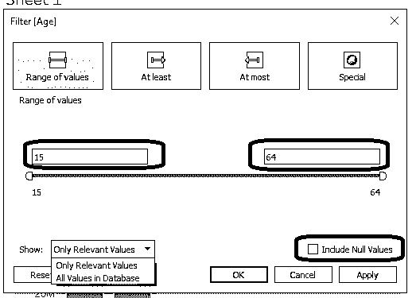

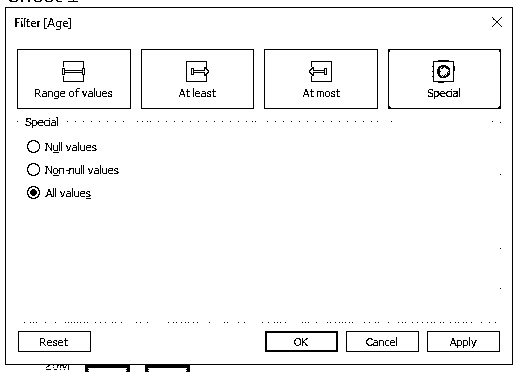

#### 3.快速过滤器

快速筛选或自定义筛选主要用于需要用单个或多个值列表快速显示筛选数据的情况。

**如何应用快速滤镜？**

*   要应用快速筛选，您需要在筛选架中有一个度量或维度。然后，您需要右键单击该字段(在我们的例子中，它是 REGION ),并选中“显示过滤器”。
*   然后你会在工作表中发现一个新的复选框，你可以根据不同的类别可视化数据(在我们的例子中，是英格兰，苏格兰等。)

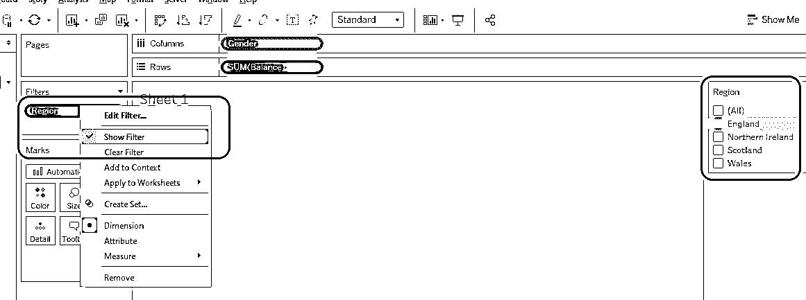

*   您还可以通过单击复选框中的向下箭头来选择快速过滤器的类型，并在单个、多个和通配符匹配值之间进行选择，如右图所示。

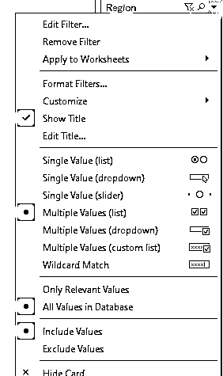

#### 4.上下文过滤器

*   上下文过滤器是一个过滤器选项，它可以从原始数据源创建一个单独的数据组，并计算工作表中的选择。
*   应用上下文过滤器后，它以灰色显示，如图所示。
*   在不同的分类字段需要固定的顶部或底部记录的情况下，上下文过滤器会很方便。

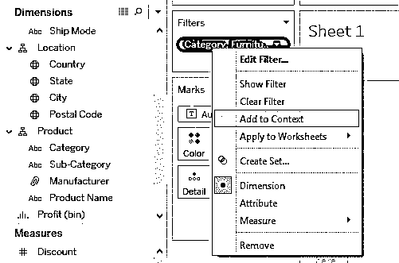

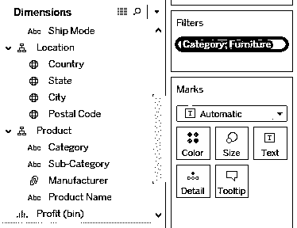

#### 5.提取和数据源过滤器

提取和数据源过滤器是通常在移动到工作表之前应用的过滤器。这些过滤器是有用的，因为使用它们我们可以从一开始就过滤掉不必要的数据。

提取筛选和数据源筛选的主要区别在于，数据源筛选的筛选结果立即可见，而提取筛选的结果只有在移动到工作表标签(Sheet1)后才可见。

**如何应用提取过滤器？**

要应用此过滤器，首先将连接类型选择为“提取”,然后单击“编辑”,之后需要单击“添加”,然后选择一个字段，根据您选择的字段类型(测量或维度),将会打开一个过滤器窗口。其余的事情类似于维度或测量过滤器。

**如何应用数据源过滤器？**

要应用此过滤器，您需要单击添加(以绿色突出显示)，然后您需要添加要应用过滤器的字段，其余的事情类似于维度或度量过滤器。

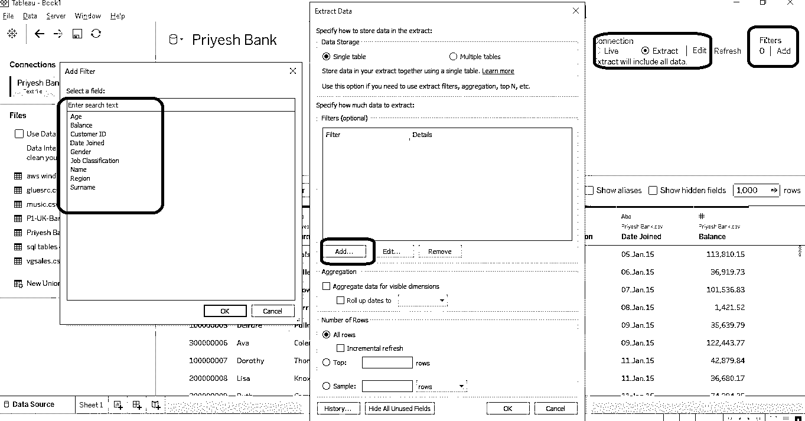

### 结论

Tableau 提供了各种选项来根据我们的要求过滤和限制源数据。这些过滤器选项帮助我们只可视化所需的信息，从而节省我们的时间、处理能力、内存和精力。快速过滤器及其菜单类型可以帮助我们快速高效地可视化数据。度量和维度过滤器类似于 Tableau 中过滤器选项的基础。在这里，我们有足够的选项来根据我们的要求过滤任何类型的数据。

### 推荐文章

这是 Tableau 中的过滤器指南。在这里，我们讨论 Tableau 中的过滤器类型，以及如何通过截图一步一步地应用过滤器。您也可以阅读以下文章，了解更多信息——

1.  [Tableau 替代方案](https://www.educba.com/tableau-alternatives/)
2.  [什么是 Tableau？](https://www.educba.com/what-is-tableau/)
3.  [数据挖掘软件](https://www.educba.com/data-mining-software/)
4.  PHP 过滤器|如何使用各种过滤器来验证用户输入？

