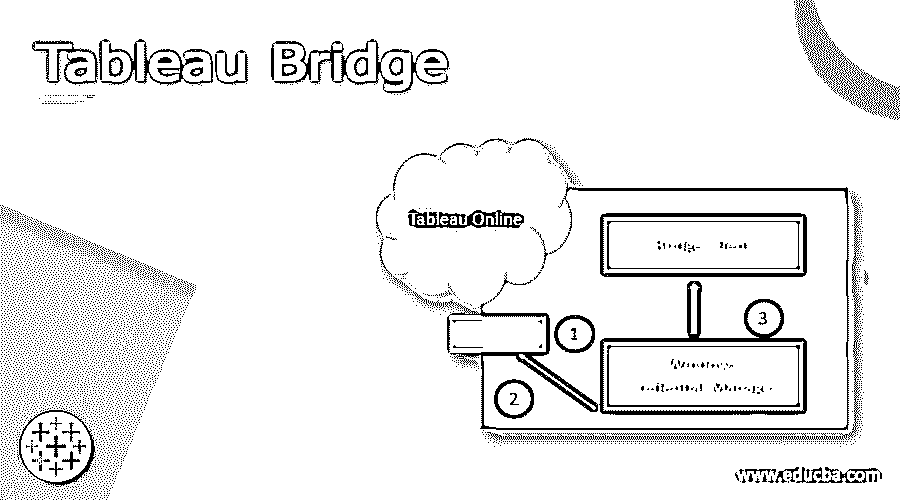
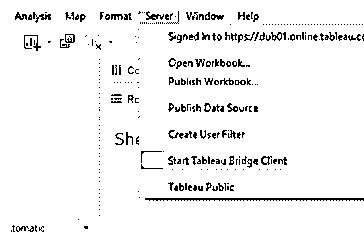
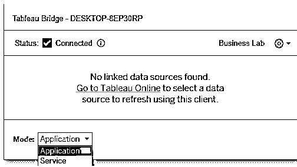
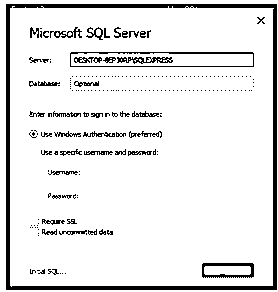
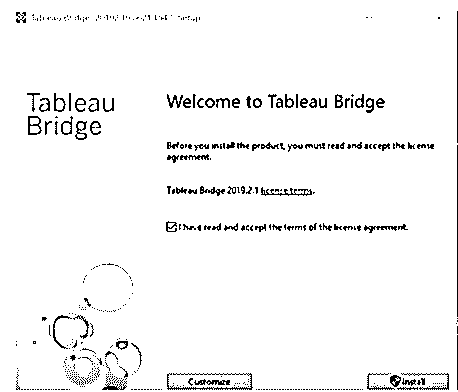
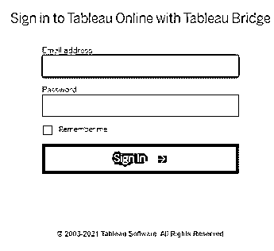
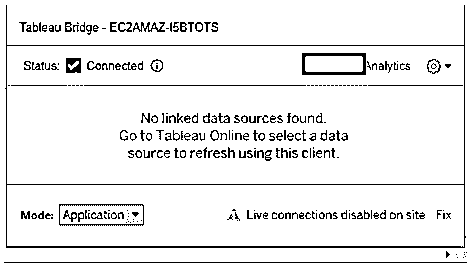
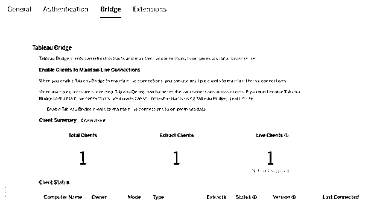
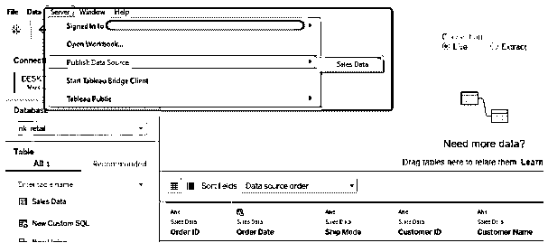
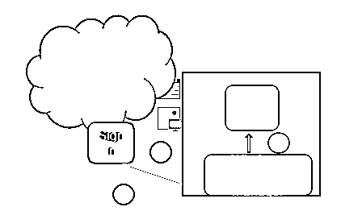

# Tableau 桥

> 原文：<https://www.educba.com/tableau-bridge/>

## Tableau 桥的定义

Tableau Bridge 是一个基于 Windows 的应用程序，数据来自同一个系统。在防火墙后面，桥接与在线平台的接口，管理所有已发布信息源的计划提取更新和实时查询。Tableau Bridge 在收到报告时在本地搜索数据，并将测试结果安全地传送到 Tableau Online。

### 什么是 tableau 桥？

Tableau Bridge 是一个多功能的工具，它允许我们通过本地访问数据并安全地上传到网上来连接到公共可用的数据源。这使我们的信息保持最新。10.3 版本中发布的 Bridge 是一种将信息链接到在线示例的机制。它与内部收集的数据保持实时连接。它仅适用于 10.3 版本。

<small>Hadoop、数据科学、统计学&其他</small>

Bridge 是在线用户访问私有网络信息(包括 Excel 表和 SQL Server 数据)的管道。内部数据和 Tableau Online 网站都通过一个传出的加密通道进行交互。每个在线授权用户都可以使用 Bridge，但它对站点管理员和组织内的多个数据管理员最有用，因为它可以用于管理客户、发布和维护数据源，以及启用活动和提取数据。

### tableau bridge 是如何工作的？

**第一步:**

在那之后，我们必须发射舰桥。从主菜单中选择“服务器”，然后单击“启动 Tableau 桥客户端”Tableau Bridge 预装了桌面，因为我们现在要做的就是启动。Bridge 会提示用户登录在线网站。

**第二步:**在线“发布。

在整个安装过程中，系统会提示用户连接到他们的在线帐户。如果完成，用户将看到两个选项，如下图所示。

**第三步:** **加入数据源**

需要 Tableau Desktop 将数据源连接到桥并部署信息源。这种情况下的数据源是一个机密的 Microsoft SQL Server。右侧的三个不同按钮用于调整时间表、编辑本地系统上的文件路径或进行快速刷新。我们可以通过导航窗格中的“设置”来检查网桥状态的规范，然后滚动到结果网页的底部。这应该显示建立桥接连接的机器的名称。

我们可以在线发布仪表板，同时使用 Tableau 桥保持与任何数据源的实时连接。

**好处:**–全自动–无需手动重新发布，更新可以随时进行，无需围绕组成员的可用性进行工作。

–Tableau Cloud 已包含在内。

### 安装桥

Bridge 是将本地数据连接到 Tableau Online 的优秀工具。桥接应该在持续运行的专用虚拟机中执行。这意味着当人们关闭他们的笔记本电脑时，它不会影响事情。它还建议我们维护两个桥，一个用于活动数据(数据持久化)，另一个用于提取器。(提取数据的快照)这降低了实时报告或更新中崩溃和延迟的可能性。

#### 步骤 1:安装与桌面相同版本的网桥。

有两种方式可以到达桥。

1.信息请求:当用户在这个应用程序中通过身份验证时，Bridge 进行提取更新。

2.Tableau Bridge 在这个过程中作为服务运行，用户可以随时注销。但是，只能使用活动连接。Tableau Bridge 被设计为作为服务来执行。

#### 步骤 2:运行安装程序，并通过以下步骤登录到在线:

1.  从服务器选项中选择“启动 Tableau 桥客户端”。
2.  使用站点管理员级别的访问权限登录到网桥。
3.  如果出现提示，选择我们希望在其中发布实时数据的 Tableau Online 站点。桥客户端出现在“设置”菜单中，可以从那里访问。
4.  默认情况下，桥客户端被配置为在应用程序模式下运行。如果用户选择“切换到服务”，网桥现在可以管理实时连接
5.  承担在线网站管理员的角色。从站点的菜单栏中单击设置，然后单击桥。

在管理员启用保持活动连接的支持后，我们可以在发布过程中看到该选项。只要在工作表或数据源中存在到网络数据库系统(如 Microsoft SQL Server 或 MySQL)的实时连接，就可以访问它。

#### 步骤 3:与客户的实时连接

在我们发布后，实时请求由授权的客户端处理。就这么简单。首先，创建一个在线数据源，并选择保持实时连接的选项。或者，可以发布一个工作簿，然后选择独立发布数据源，之后我们可以选择一个活动连接。

**步骤 4:最后一步是发布一个数据源，在工作流程中说明**

### Tableau 桥安全

Tableau Bridge 使用安全的 TLS 连接联机，以保持信息最新。如果用户下载了桌面，也将设法安装 Bridge。Tableau 桌面包括桥牌。Bridge 使用以下安全设计:

1.  因为所有的通信都发生在专用网络墙之后，所以我们不需要管理任何额外的异常。
2.  发送到网桥或从网桥接收的所有数据在传输过程中都是安全的。

Online 是一个基于网络的可视化工具。以下是安全性的要点:

用户的 Tableau 在线凭证被输入到桥应用程序中以进行在线访问。Tableau Online 会在 1)输入密码后返回一个身份验证令牌。3)令牌保存在运行客户端的计算机上的 Windows 操作系统的凭据控制器中。Bridge 使用令牌来执行各种任务，例如获取提取的刷新计划。

### 结论

本博客中讨论了 Tableau Bridge，因此简要介绍了如何利用它将内部信息连接到在线数据源。它充当中间人的角色，保证我们在需要时随时随地都能获得相关信息，而不受专用网络的限制。Tableau 是一个流行的数据可视化工具，每个人都可以掌握。

### 推荐文章

这是 Tableau 桥的指南。这里我们分别讨论 tableau 桥的定义，什么是 tableau 桥，tableau 桥是如何工作的，以及例子。您也可以看看以下文章，了解更多信息–

1.  [Tableau BI 工具](https://www.educba.com/tableau-bi-tool/)
2.  [Tableau 仪表盘](https://www.educba.com/tableau-dashboard-with-examples/)
3.  [qlik sense vs table](https://www.educba.com/qlik-sense-vs-tableau/)
4.  [什么是桥？](https://www.educba.com/what-is-bridge/)

