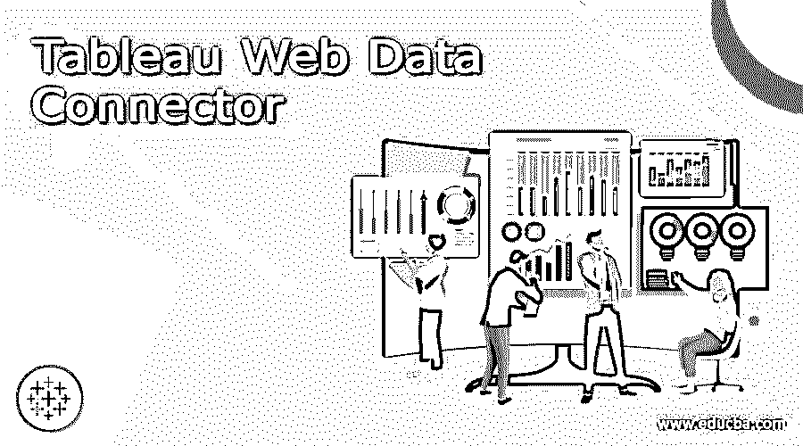
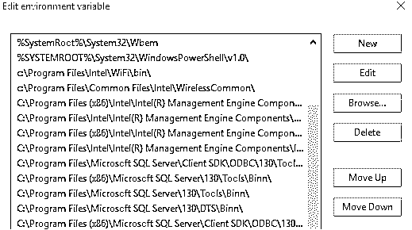
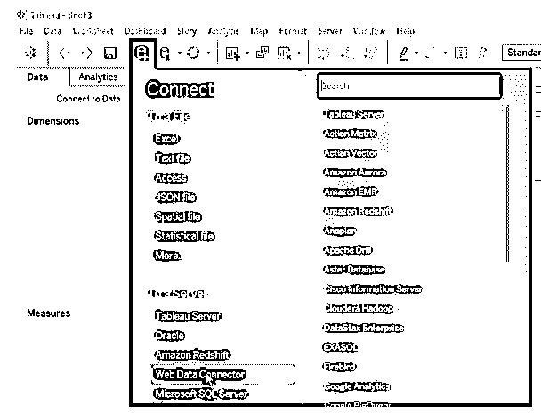
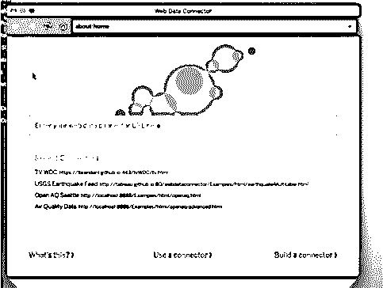
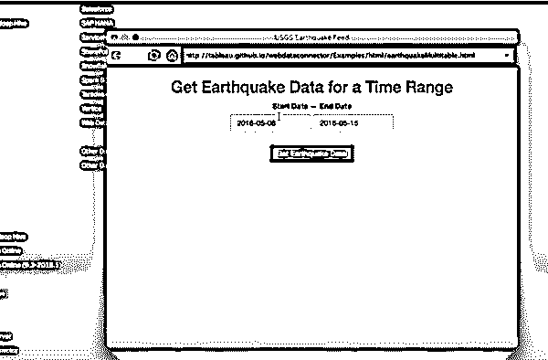
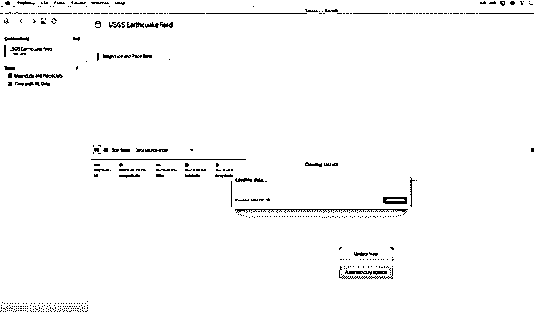
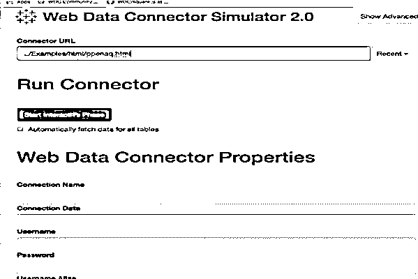
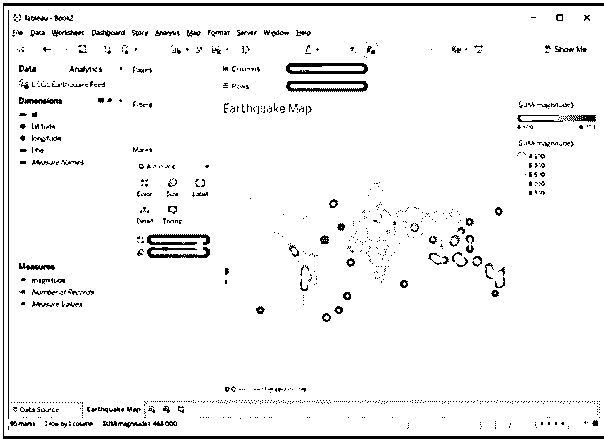

# Tableau Web 数据连接器

> 原文：<https://www.educba.com/tableau-web-data-connector/>

## Tableau Web 数据连接器的定义

Tableau Web 数据连接器(WDC)允许用户连接到几乎任何网站并获取数据。一个人可以制作自己的 WDC，甚至可以使用其他人制作的连接。包含 JavaScript 代码的 HTML 文件被视为 web 数据连接器。现在，我们总是可以选择制作我们的个人在线数据连接器，或者使用其他人已经设计和实现的连接器。web 数据连接器应该在计算机的本地 web 服务器、第三方 web 服务器或 Tableau 服务器上维护。

### 什么是 tableau web 数据连接器？

使用 Tableau 时，最重要的阶段是导入数据进行分析。但是如果我们的数据存储在网络上而不是数据库里呢？web 数据连接器是一种将基于 Web 的数据集成到 Tableau 中的技术。第一次连接可能会很慢。一旦进行了提取，就不再是一个问题，但是建议从有限数量的数据(单个系列，开始日期仅在几年前)开始，以便对该过程有所了解。我们使用 WDC 来实现数据的可访问性和自动化。

<small>Hadoop、数据科学、统计学&其他</small>

### 如何使用 tableau web 数据连接器？

WDC 使人们能够连接到网络上几乎任何可用的数据，并为特定的工作簿创建摘录。一个 web 连接器连接到一个 REST API，并在将数据传递给 Tableau 之前将其转换为 JSON。

### Tableau web 数据连接

可以使用以下清单来验证 Web Data Connector 是否正常工作:

1.  WDC 创造了大量的用户，所以有必要对其进行记录。
2.  在一个隔离的房间里，我们测试了 Web 数据连接器。
3.  评估 Web 连接器的资源使用和效率
4.  探索源头

开始之前，我们需要一些东西。确定安装了以下依赖项:

*   **js 和 npm**

通过公开的 WDC，我们将能够看到发布的仪表板收到了多少视图、喜欢和其他指标。在 Tableau 中，创建一个新的 Web 数据连接器数据源。在 Tableau 应用程序中选择连接>到服务器下方的 Web 数据连接器选项，以使用 Tableau 或 Tableau Public v.10+中的连接器。

我们将在弹出的屏幕中键入 web 数据连接器 URL。

我们放在这里的 URL 将由我们想要执行的导入类型决定。人们可以在两个选项之间进行选择:

*   导入数据集或应用程序中的所有表。
*   一次只能导入一个表、文件或查询结果。

### Tableau web 数据连接

Tableau 提供了一种简单的连接数据的方式。Web 数据连接是一个较新的 Tableau 功能。Web 数据连接使得将来自现有 API 的数据立即集成到 Tableau 变得简单，使我们能够快速构建仪表板。选择正确的 Tableau 属性可能是一个耗时且乏味的过程。大多数时候，我们只是想更新一些属性，而在报告的每个循环中重新选择所有的字段是不可行的。上一节中保存的. txt 文件在这里会非常方便。我们可以使用这些文件来复制现有的 Web 数据连接设置。

### WDC 制备

1.  WDC 托管在已经设置好的服务器上(例如 Tableau server、HTTP-server、Apache 等)。).
2.  WDC SDK 的安装。

3.HTML 和 JavaScript 用于构建 WDC 文件。

4.  服务器配置:对于本地设置，我使用 HTTP-server(带有 npm)和 git 作为存储库，并带有 Node.js 服务器端应用程序。

**步骤 1:**NPM 安装完成后，创建一个目录并打开 MINGW64

**步骤 2:** 在单独的目录下安装 WDC SDK。

**步骤 3:** 转到属性并设置环境变量，然后添加一个新路径到 npm 目录。

在终端或命令提示符下使用命令普遍安装 HTTP-server。

**步骤 4: Npm 启动和安装**

最后，服务器设置完成。接下来的过程就是要有一个连接器。

要设置 Tableau Web 数据连接器，请遵循以下简单步骤。

1.  从下拉菜单中选择 Web 数据连接器。我们通常会在“连接到服务器”模块中找到它。现在，让我们到 tableau 来连接 web 连接器。截图如下:

### Tableau web 数据连接器的主要优势

Tableau Web 数据连接器是一个有用的工具，具有以下优点:

*   Tableau WDC 使用户能够用基于网络的信息创建一个定制的链接，快速提取它，并使这些信息在 Tableau 中可用。
*   我们可以创建自己的 WDC，通过内部 web 服务、REST APIs 以及其他 HTTP 或 HTTPS 源来检索 JSON、XML 或 HTML 数据。
*   允许用户通过选择和过滤元素参与。

### 例子

让我们看一个使用最近的连接器和工具及文档的数据源的例子。

**步骤 1:** 构建一个连接器，我们可以在 URL 框中键入内容，如下所示:

**第二步:**

在这里，我们将访问一个 URL 并输入 file.html。这里我们使用了与电视节目相关的产品。打开名为 earthquakeWDC.html 的文件，并将其存储在 web data connector 存储库的顶层文件夹中。

2.  对于适配器，构建一个 javascript 文件。在顶层文件夹中将其另存为 earthquakeWDC.js。在 Html 文档中，为 UI 按钮添加一个事件侦听器。

WDC 将检索 JSON 格式的数据，并将其传输到 Tableau。所以，我们来为它制定一个策略吧。

3.  我们现在都准备好了。保存所有内容，并使用 cmd 4 的 npm start 命令重新启动服务器。在浏览器上转到，然后键入

要访问数据集，我们可以从数据集中获取地震数据，屏幕截图如下所示:

**第三步:**

从连接的数据集中创建提取。

**步骤 4:** 为交互式网页添加 javascript 代码。;

| let myCon = tableau.makeConnector();mycon . get schema = function(schema callback){};myCon.getData = function (table，doneCallback) {

id =

列= " "；

};

表.寄存器连接器(分支)：

函数提交(){

//在此添加代码

}

 |

**步骤-5:** 最终模拟零件

步骤 6: 最终的可视化显示如下

### 结论

在本文中，我们学习了何时有效地使用 Tableau Web 数据连接器。Tableau 是一个强大的数据可视化工具，允许用户通过视觉上吸引人的仪表板和报告获得有用的见解。另一方面，持续监控数据连接器确实是一个耗时且耗费资源的过程。为了成功做到这一点，我们必须将一些技术能力用于整合来自各种来源的数据。

### 推荐文章

这是 Tableau Web 数据连接器的指南。这里我们讨论一下定义，什么是 tableau web 数据连接器，如何使用 tableau web 数据连接器？和代码实现的例子。您也可以看看以下文章，了解更多信息–

1.  [Tableau 桥](https://www.educba.com/tableau-bridge/)
2.  [Tableau BI 工具](https://www.educba.com/tableau-bi-tool/)
3.  [Tableau 仪表盘](https://www.educba.com/tableau-dashboard-with-examples/)
4.  [qlik sense vs table](https://www.educba.com/qlik-sense-vs-tableau/)

