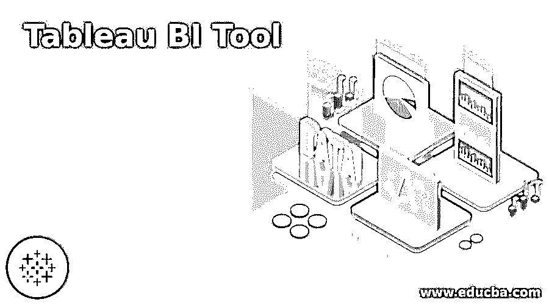

# Tableau BI 工具

> 原文：<https://www.educba.com/tableau-bi-tool/>

## Tableau BI 工具简介

以下文章提供了 Tableau BI 工具的概要。Tableau 是商业智能行业中使用的快速发展的数据可视化方法。这是用编码知识和零技术技能将原始信息集转换成易于解释的格式的一种极好的方法。重要的应用是将查询翻译成可视化和元数据管理。它导入所有大小和类型的数据。对于非技术人员来说，Tableau 是用来创建非编码数据查询的救命工具。沃尔玛、联想、亚马逊、埃森哲等公司使用 Tableau 作为商业智能工具和数据可视化。

### Tableau BI 工具列表

tableau 软件用于快速可视化，并使他们能够创建有吸引力的仪表板，其中包含推动业务增长的行动见解。它允许用户在一个可视化的环境中操作，该环境是用适当的底层操作硬件和系统定制的。此外，它还用于探索具有无限可视化设施的信息。Tableau 的高级特性是数据混合、数据协作、实时分析以及对非技术人员的用户友好。

<small>Hadoop、数据科学、统计学&其他</small>

Tableau 的重要工作是链接和检索存储在不同位置的信息。它可以从任何可用的平台或数据库提取数据，或者让它成为 excel 表、Oracle、PDF 或 Amazon web services。部署 tableau 时，数据库的连接器使用户能够将其与任何数据库相关联。提取的可以作为一个现场连接到 Tableau 桌面上的 Tableau 的数据引擎。在这里，数据工程师与信息一起工作，提取并发展成可视化。

仪表板作为静态文件与用户共享。tableau 阅读器用于查看接收端仪表板中的文件。从 tableau 桌面提取的数据通过 tableau 服务器发布，组织的所有基本操作都发生在 tableau 服务器上。此类操作包括协作、安全模型、分发、自动化功能。tableau 服务器允许最终用户从所有位置访问文件，无论是手机还是台式机。

#### 1.数据分析工具

开发工具用于开发阶段，如创建图表、仪表板、可视化和报告。主要产品是 Tableau public 和 Tableau desktop。共享工具了解如何使用这些工具，并在开发人员工具的支持下共享报告、仪表板和可视化方法。Tableau server、Tableau Reader 和 Tableau online 等重要产品都属于这一类。

#### 2.桌上型电脑表格

该软件使用户能够创建一个代码来修改报告。开始创建图表和报告，以合并它们，形成一个定制的仪表板，可以在 Tableau 桌面执行。它分为数据源和连接。

#### 3.Tableau 个人桌面

开发功能类似于桌面版的 tableau。这里工作簿是以私有模式访问的，访问方法是有限的。它表示工作簿不能发布和分配给个人使用。应该分为 Tableau offline 或者 Tableau public。

#### 4.Tableau 桌面专业版

它与 Tableau desktop 非常相似，后者基于生成的工作或在 Tableau desktop 中开发，后者可在 Tableau 服务器上获得。在这里，可以对所有类型的数据进行完全访问。对于希望在 Tableau 服务器上发布任务的用户来说，这是一个很好的选择。

#### 5.Tableau 阅读器

这是一个工具，使用户能够查看可视化过程和 Tableau 桌面或 Tableau 公共开发的工作簿。信息可以很容易地被过滤，并且它具有有限的修改。任何想要访问工作簿的人都可以使用 tableau reader 来显示，这没有安全性。

#### 6.Tableau 服务器

tableau 服务器用于共享工作簿和可视化流程，其中 tableau 桌面的应用程序在整个企业中生成。一旦任务被导出到相关的服务器，就可以对其进行访问。为了增强 tableau 服务器中仪表板的共享，用户必须发布先前在 Tableau 桌面中的工作。

尽管对于购买并安装了 Tableau 服务器的注册用户来说这不是强制性的。他可以只要求登录凭证来验证访问或生成的报告。由于 tableau 服务器具有强大的防火墙，因此对于企业可靠有效的数据共享来说是安全的。如果用户有任何相关的疑问，可以通过庞大的商务智能社区中的商务智能专家来解答。

#### 7.Tableau 在线

顾名思义，Tableau online 是一个类似于 Tableau 服务器的共享组件。但是数据存储在服务器上，这些服务器交给由一组 Tableau 管理的云。这些信息可以在 Tableau online 上发布，Tableau 有无限的存储空间。tableau 服务器和 tableau online 需要 Tableau desktop 开发的工作簿来发布数据。数据从网页应用程序中流出，无论是由 Tableau server 和 Tableau online 支持的 google analytics 还是 Salesforce。

#### 8.Tableau 公共

它不贵，对省钱的人来说是一大优势。顾名思义，开发出来的工作簿不能保存在本地，不能转移到普通大众可以管理的 Tableau 的公有云。这是一个经济的版本，方便人们了解和分享数据。

#### 9.嵌入式分析

嵌入式分析将数据整合到外部应用程序中，以向公司外部人员(如合作伙伴、供应商或客户)提供分析、仪表板和报告。它向客户提供信息，客户对信息进行定制和整合。所有的用户任务都可以定制，以吸引客户，帮助他们获得最大的功效。

### 结论–Tableau BI 工具

Tableau 的价格可以按年计费，并基于用户数量。价格可能因用户类型而异，如查看者或报告创建者。所以所有的基础用户都可以从 Tableau 中受益。

### 推荐文章

这是一个 Tableau BI 工具指南。在这里我们分别讨论一下 Tableau BI 工具的简介和列表。您也可以看看以下文章，了解更多信息–

1.  [Tableau 参数过滤器](https://www.educba.com/tableau-parameter-filter/)
2.  [Tableau 中的饼图](https://www.educba.com/pie-chart-in-tableau/)
3.  [Tableau 分组依据](https://www.educba.com/tableau-group-by/)
4.  [Tableau 中的 LOD 表达式](https://www.educba.com/lod-expressions-in-tableau/)

