# 表格中的参数

> 原文：<https://www.educba.com/parameters-in-tableau/>

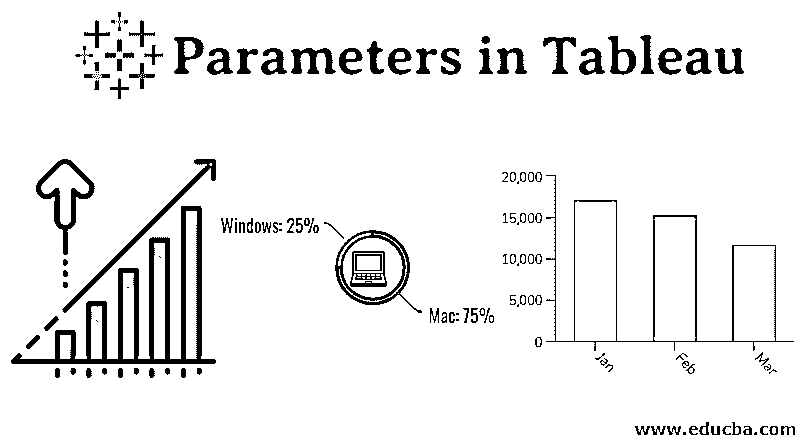

## Tableau 中的参数介绍

通常，不采用特定值而是采用由用户基于上下文传递或分配的值的变量被称为“参数”。在 Tableau 中，参数是类似的实体，它们接受基于上下文的值，并向用户提供动态性。让我们举一个例子。组织中的高级管理层喜欢在每个月底看到一定数量的销售业绩最佳和最差的区域。在他们的仪表板上，他们提供了前十个表现最好的地区。然而，管理层现在认为，有必要进行动态控制，以便进行更深入的分析，利用这种分析，可以在仪表板上查看任何数量的最佳表现者。在 Tableau 中，这可以使用“参数”来实现。

### 如何在 Tableau 中创建和使用参数？

现在，我们将逐步了解如何创建和使用参数。使用参数，我们将显示所需数量的表现最佳的区域。对于这个例子，我们将使用有多个字段的数据。每个领域都有自己的意义。出于我们的目的，感兴趣的字段是区域和数量。区域是一个分类变量，而数量是一个数字变量。

<small>Hadoop、数据科学、统计学&其他</small>

下面是创建和使用参数的步骤。

**步骤 1:** 首先，我们将把必要的数据加载到 Tableau 中，如下所示:

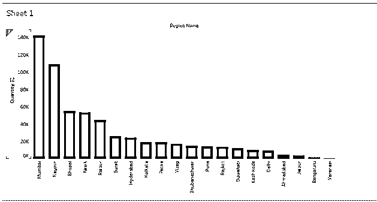

**第二步:**这一步，我们将了解参数的最初几个方面。

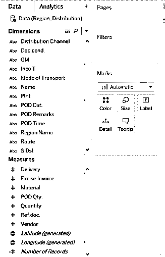

点击此按钮。会弹出各种选项。

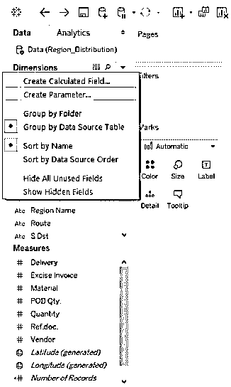

点击按钮将生成一个菜单列表。点击列表中的“创建参数…”选项。

**第三步:**和上一步一样，点击“创建参数…”选项，会出现一个对话框，如下图所示:

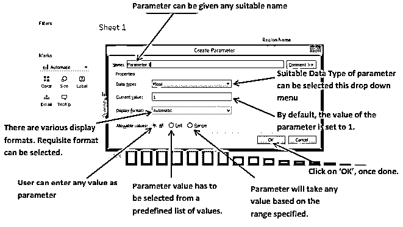

**步骤 4:** 在这一步中，我们将创建实际参数。为参数提供的名称。

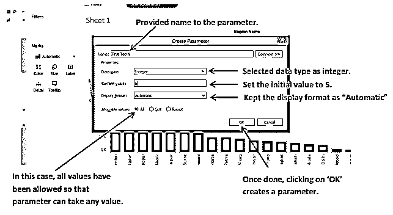

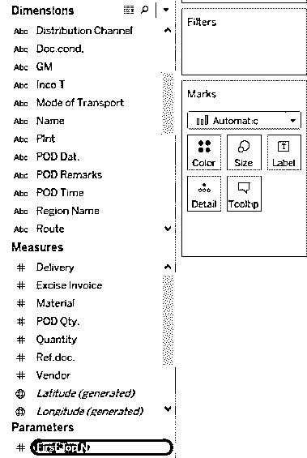

新创建的参数出现在窗口的左下角。它出现在“测量”下方的“参数”部分。它被突出显示以便于注意。现在，我们将在过滤器中使用这个参数来达到我们的目的。

**第 5 步:**在这一步中，我们将在分类变量上创建一个过滤器，即区域名称。

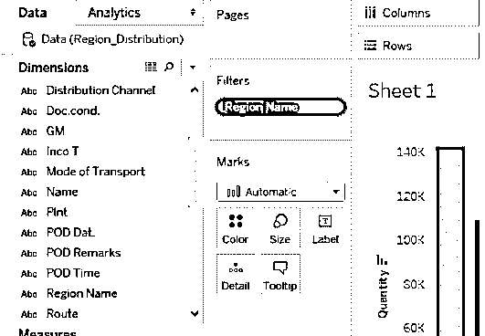

我们通过在“过滤器”中引入维度，在“区域名称”字段上创建了一个过滤器
一节。接下来，我们将使用在过滤器的上一部分中创建的参数“前 N 名”。

**第 6 步:**编辑过滤器，使用一个参数。

点击按钮将产生各种选项。单击“编辑过滤器”选项。它将生成一个带有各种选项的对话框。

在对话框中，单击“顶部”选项卡。默认情况下，选择“无”。点击“按字段”。点击“按字段”
激活这些选项。这里的默认值是 10。请注意，我们创建的参数出现在列表中。点击并选择它。

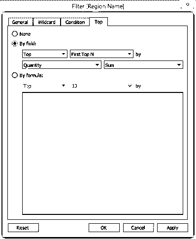

我们创建的参数已被选中。

这里有两个选项:顶部和底部。选择 Top 将使用“前 N 名”参数根据“数量”输出最佳表现者。选择底部会产生相反的效果。最后，单击“应用”，然后单击“确定”

**第 7 步:**我们将使参数在窗口上可见，没有它就不可能使用。

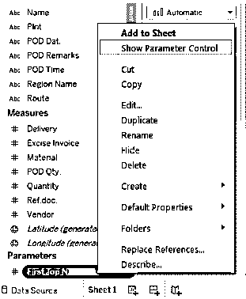

从列表中选择“显示参数控制”选项。这将使参数在屏幕上可见。右键单击参数将生成菜单列表。

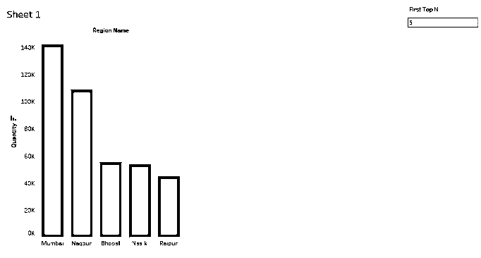

点击“显示参数控制”使参数可见。记住，在创建参数时，我们已经将默认值设置为 5。该图现在只有 5 个条形对应于前 5 个顶级
表演区域。

**步骤 8:** 验证并使用参数，用多个值进行试验。

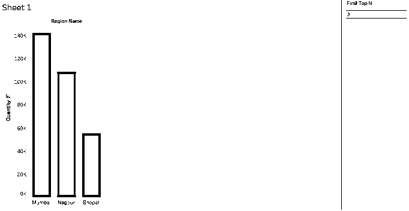

在此处输入“3 ”,我们将获得销量排名前三的地区。在我们输入必要的参数值后，生成了前三个执行区域。参数支持实时赋值
并为用户提供动力。

在上面的部分中，我们学习了创建和使用参数。在这种情况下，我们通过在“允许值”中选择“全部”来允许
参数取任何值。现在，我们将尝试探索另外两个选项，即。列表和范围。

### 列表形式的允许值

右键单击参数，然后单击“编辑…”如图所示:

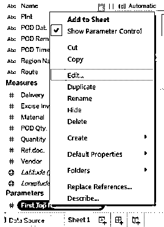

点击“编辑…”。它将生成编辑参数对话框。

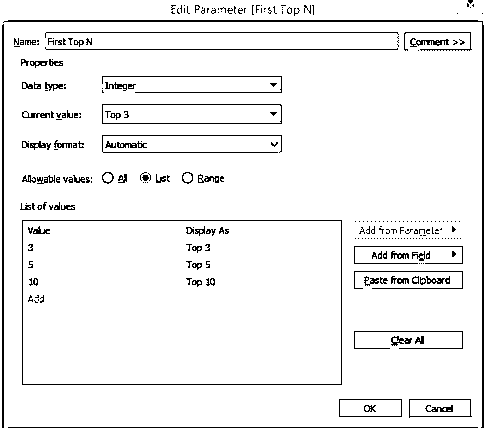

选择“列表”选项。在“值列表”部分，我们创建了一个包含值 3、5 和 10 的列表，前 3、前 5 和前 10 分别作为它们的名称。完成后，点击“确定”。

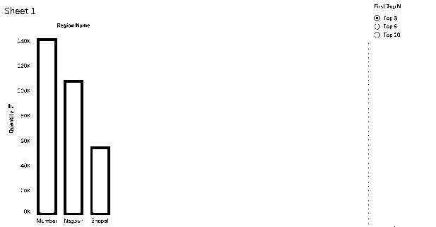

现在看看列表是如何显示的。它以列表的形式出现。现在参数只能取列表中指定的值。它将相应地显示结果。

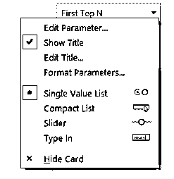

单击参数以探索各种选项。我们可以通过选择合适的选项来改变列表的显示方式。

### 作为范围的允许值

再次编辑上一节中提到的参数，并执行必要的更改。

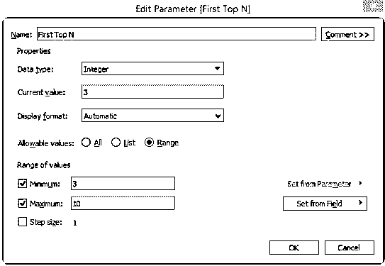

选择“范围”选项。设置最小值和最大值。我们将最小值设置为 3，最大值设置为 10。点击确定；一旦完成

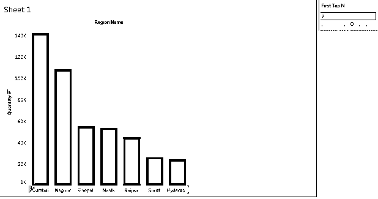

注意，现在参数显示为一个滑块，取值范围从 3 到 10。我们选择了 7 作为
参数值，结果我们得到了输出中表现最好的 7 个人。

### 结论-表格中的参数

参数是动态实体，作为一种功能为 Tableau 增加了巨大的价值。它们可以根据上下文以多种方式使用。Tableau 中参数的基本思想与任何一般参数的基本思想相同，即它们不是常数，而是采用实时分配给它们的任何值。

### 推荐文章

这是 Tableau 中的参数指南。这里我们分别讨论 tableau 中参数的介绍以及如何创建和使用参数。您也可以浏览我们推荐的其他文章，了解更多信息——

1.  [表格中的折线图](https://www.educba.com/line-chart-in-tableau/)
2.  [Tableau 中的气泡图](https://www.educba.com/bubble-chart-in-tableau/)
3.  [Tableau 建筑](https://www.educba.com/tableau-architecture/)
4.  [Tableau 日期函数](https://www.educba.com/tableau-date-functions/)

