# Tableau 动态参数

> 原文：<https://www.educba.com/tableau-dynamic-parameters/>

## Tableau 动态参数介绍

参数是一个变量，它采用用户动态分配或传递的值。Tableau 允许我们在分析中创建、处理和利用动态参数。动态参数在视觉分析中具有特殊的意义，因为它们允许我们基于不同的参数值来理解各种场景和变化。此外，该参数通常是整个分析中的重要控制变量。在 Tableau 中，我们可以创建整数、浮点、布尔、字符串、日期和时间格式的参数。每种类型的使用都是基于上下文的，应该正确使用，以免参数应用给出不适当的见解。

### 在 Tableau 中创建动态参数的步骤

现在，让我们继续理解如何创建和利用动态参数。在本演示中，数据包含 20 个主要印度城市的利润(百分比)和销售额(百万印度卢比)。我们将创建一个动态参数，按照利润或销售额或用户提到的城市标签的字母顺序对结果进行排序。

<small>Hadoop、数据科学、统计学&其他</small>

**第一步:**将数据源加载到 Tableau 中。点击数据菜单，点击“新建数据源”。或者，单击“连接到数据”。

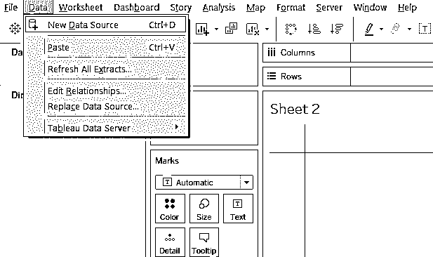

**第二步:**接下来，选择所需的数据源类型。在这种情况下，数据存在于 Microsoft Excel 文件中，因此单击 Microsoft Excel。

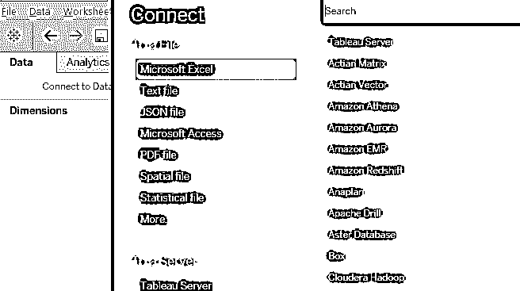

**步骤 3:** 数据被加载到 Tableau 中，如下图所示。

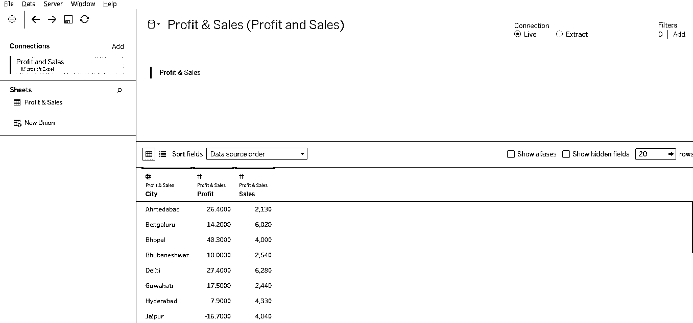

**步骤 4:** 转到工作表标签，我们可以看到数据中的维度和度量。正如我们所看到的，在这种情况下，我们有一个维度，即城市和两个措施，即。利润和销售额。

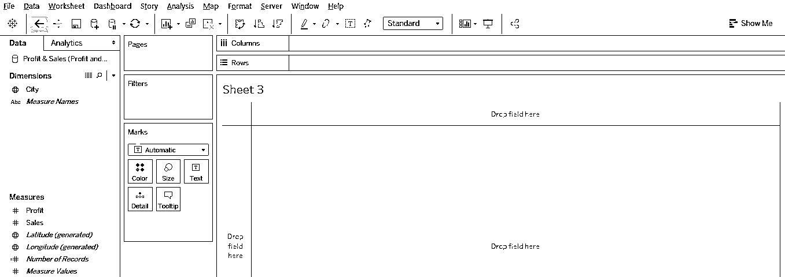

**步骤 5:** 一旦数据成功加载到 Tableau 中，将 measures 和 Profit and Sales 拖动到 Columns 区域，将 dimension City 拖动到 Rows 区域。如下图所示，我们得到了城市利润和销售额的水平条形图。如果默认图表类型不是条形图，请从“演示”中选择它。

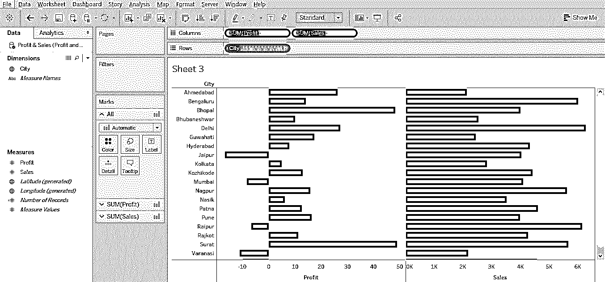

**第六步:**上面的可视化只是生成条形图。但是，我们可以通过在 Marks 卡中将尺寸拖到颜色上来使它更有洞察力。这在利润的情况下特别有用，因为一些利润值是负的。因此，基于值的颜色变化总是有用的。因此，将利润拖动到 Marks 卡中 SUM(利润)部分的颜色上，同样将销售额拖动到 Marks 卡中 SUM(销售额)部分的颜色上。下面两张截图说明了这一点。正如我们所看到的，对于衡量利润，负值用橙色突出显示，而正值用蓝色突出显示。

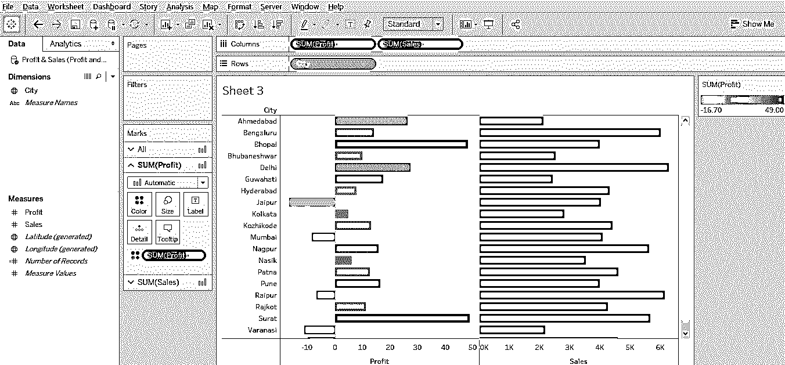

此外，颜色的深浅会根据值而变化。

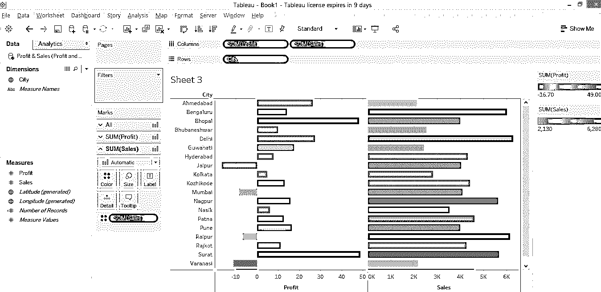

**第七步:**我们的任务是做一个排序动态。为此，我们将创建一个参数。右键单击数据部分的空白区域，如下图所示。

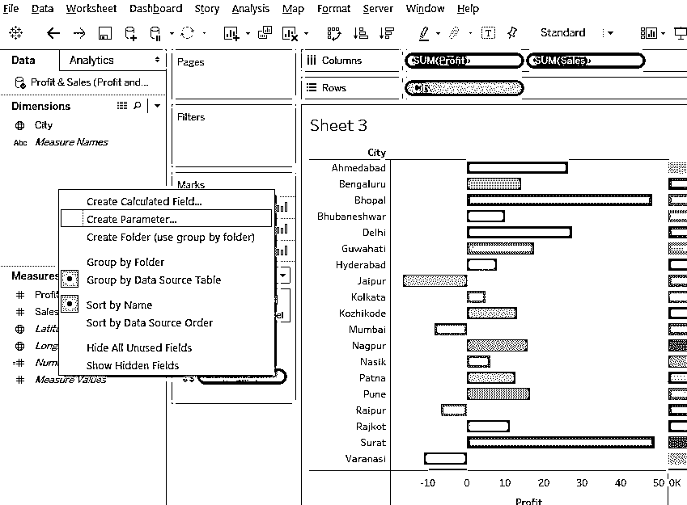

*   这将弹出“创建参数”对话框，如后续截图所示。

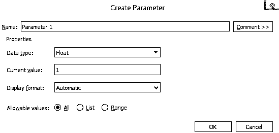

**步骤 8:** 在“创建参数”对话框中，我们将进行一些重要的更改。首先，将名称改为“排序依据”。在“数据类型”中选择“字符串”。点击允许值中的“列表”。一旦我们选择了列表，我们需要创建一个值列表。该列表应该创建如下。由于我们考虑了三个排序选项，在本例中，我们创建了一个包含三个值的列表。应该根据上下文创建一个值列表。完成后，单击 OK，我们的参数就准备好了。

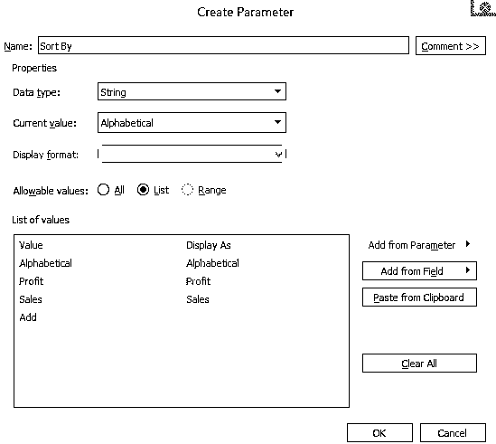

**第 9 步:**接下来，创建计算字段。创建一个计算字段是必要的，因为我们要将参数“排序依据”嵌入到这个计算字段中以进行动态排序。要创建计算字段，请右键单击数据部分的空白区域，然后单击“创建计算字段”。

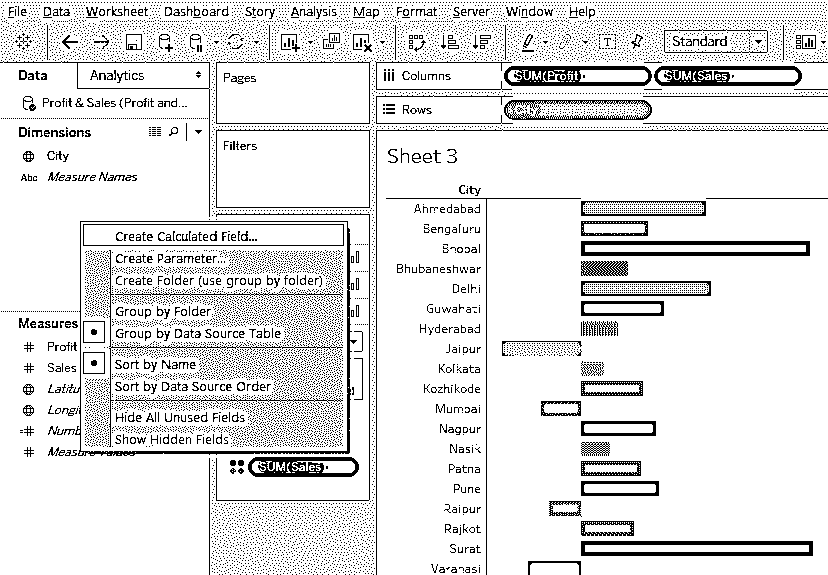

**第十步:**将计算字段命名为“动态排序”。可以根据上下文给出任何合适的名称。可以看到，在计算字段中编写的 CASE 语句代码使用了参数“Sort By”。因此，基于“Sort By”参数的值，Case 语句将起作用，我们将使用这个参数计算的字段组合进行动态排序。代码编写完成后，确保左下角显示“计算有效”消息，如下图所示，然后单击“应用”，然后单击“确定”。

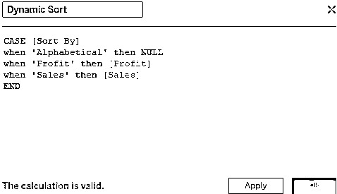

**步骤 11:** 新创建的参数和计算字段出现在各自的部分，如下面的截图所示。

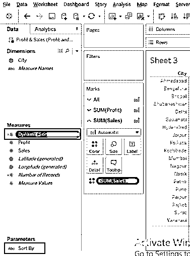

**第十二步:**我们用计算字段“动态排序”。将它拖到行区域，正如我们在下面的截图中看到的，我们得到了一个不合适的结果。要解决这个问题，只需将计算字段的类型从连续转换为离散。这使它的颜色变成蓝色。

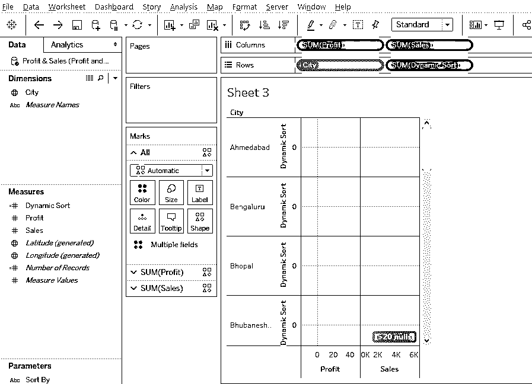

*   下面的截图显示了这一点。一旦类型更改为离散，在“行”区域中，将动态排序字段拖动到城市维之前的第一个位置。如果计算字段不在第一个位置，那么动态排序将不起作用。因为度量的排序现在变得依赖于顺序中第一个离散变量。

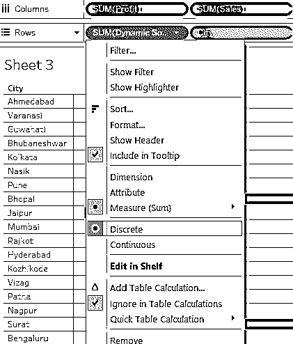

**步骤 13:** 我们希望结果基于计算字段动态排序进行排序，但不希望它出现在可视化中，因此在动态排序的下拉菜单中取消选中“显示标题”，如下图所示。

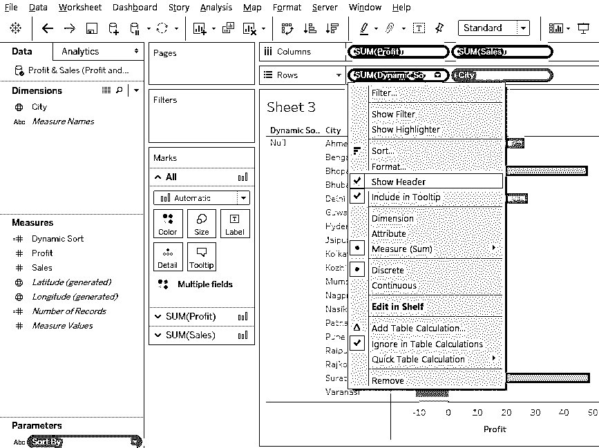

**步骤 14:** 如下图所示，取消勾选“显示表头”使动态排序消失。

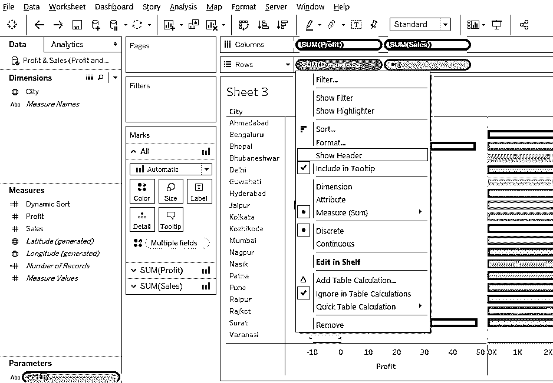

**步骤 15:** 现在，我们将使用参数对结果进行动态排序。首先使参数可见，为此，在“排序依据”参数的弹出菜单中单击“显示参数控制”。

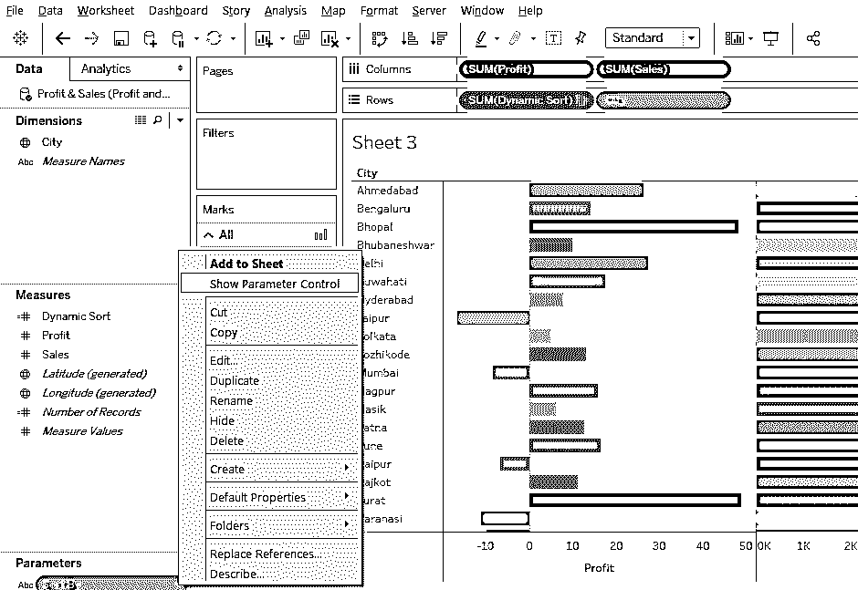

**步骤 16:** 参数现在可见，如屏幕右侧所示。它有三个价值。当前选择，即“按字母顺序”按城市标签的字母顺序对结果进行排序。

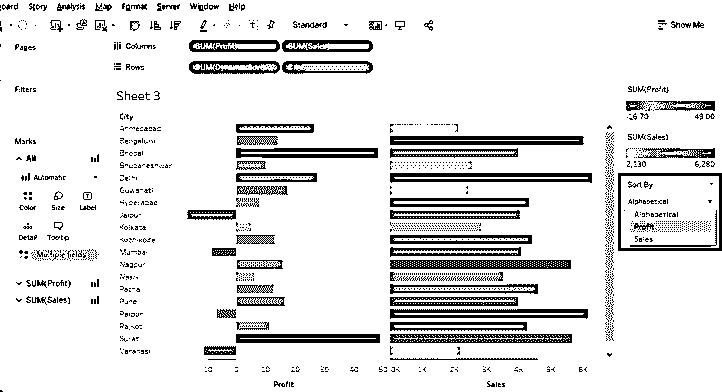

**步骤 17:** 我们在排序方式中选择了利润，可以看到结果是按照利润值的升序排序的。同样，我们也可以做销售。

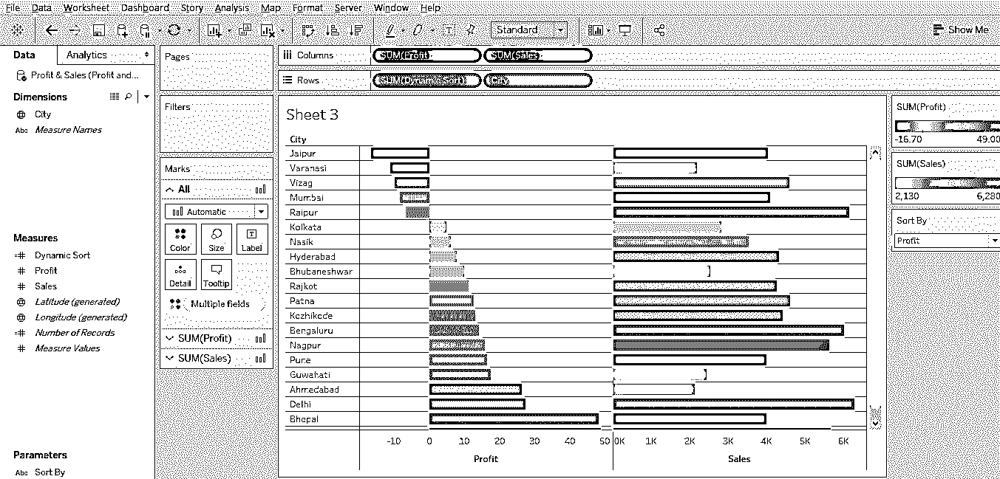

### 结论

动态参数为可视化增加了巨大的价值，并使洞察力捕获机制更快更容易。Tableau 提供了一种健壮的机制来创建和利用动态参数，这些参数可以接受并使用用户指定的值。Tableau 中的动态参数易于创建和实施，可有效地将数据转化为见解。

### 推荐文章

这是一个 Tableau 动态参数的指南。这里我们讨论在 tableau 中创建动态参数的不同步骤。您也可以阅读以下文章，了解更多信息——

1.  [动态路由的 4 大协议](https://www.educba.com/dynamic-routing/)
2.  [应用 Tableau 函数的步骤](https://www.educba.com/tableau-functions/)
3.  [什么是静态路由？](https://www.educba.com/what-is-static-routing/)
4.  [Tableau 中的交叉表](https://www.educba.com/crosstab-in-tableau/)
5.  [Tableau 特性和属性介绍](https://www.educba.com/tableau-new-features/)
6.  [如何用程序创建 JavaFX 条形图？](https://www.educba.com/javafx-bar-chart/)
7.  [Tableau 中各组的完整指南](https://www.educba.com/group-in-tableau/)

