# Tableau 中的组

> 原文：<https://www.educba.com/group-in-tableau/>

## Tableau 中的群组简介

在 Tableau 的文章组中，组是一个功能，通过它我们可以将多个维度值组合到所需的类别中。有时，我们可能会有多个维度值。对如此多的维度值进行可视化分析可能不可行，因为它可能无法传达任何有用的见解。然而，基于它们之间的一些相似性的不同维度值的组合可以允许我们创建可用于分析的组。与单个维度值相比，这些组可以更好地传达见解。因此 Tableau 中的“组”是一个非常有用的特征。

### 在 Tableau 中创建组

在本演示中，我们将使用地区销售数据集。该数据集包含印度不同销售单位的季度销售额。在这里，重要的维度是销售单位和季度，而销售额是一个衡量指标。二十个主要的印度城市代表了全国不同的销售单位。我们想了解总销售额中的区域贡献和销售单位贡献。但是，我们在数据集中没有区域作为维度。因此，我们将应用“组”的概念来实现目标。

<small>Hadoop、数据科学、统计学&其他</small>

**创建群组的逐步程序**

1.将数据集加载到 Tableau 中。为此，点击“数据”菜单下的“新数据源”。或者，单击“连接到数据”。

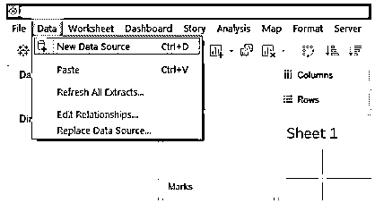

2.接下来，选择必需的数据源类型。在本例中，数据源类型是 MS Excel，因此我们选择了 Microsoft Excel。

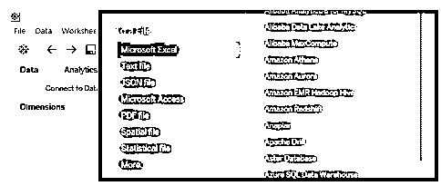

3.数据被加载到 Tableau 中，可以在“数据源”选项卡中看到，如下图所示。注意，在进行分析之前，必须对数据进行验证。

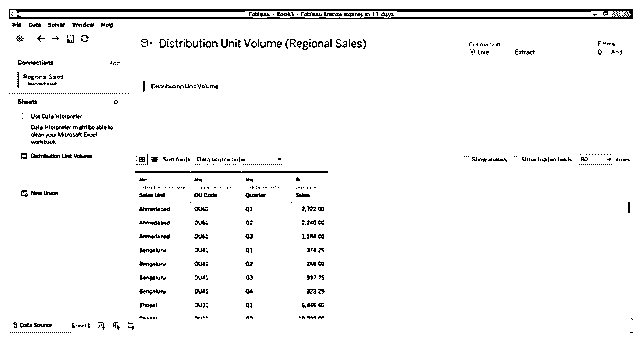

4.转到 sheet 选项卡，我们可以在必要的部分中找到维度 DU Code、Quarter 和 Sales Unit 以及 measure Sales。

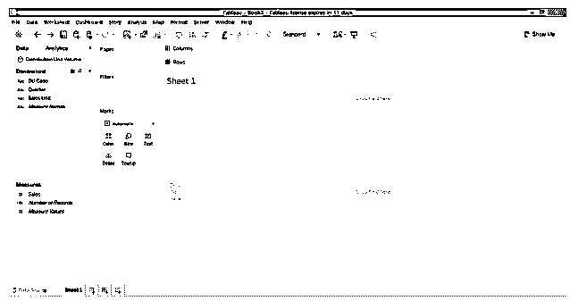

5.作为第一步，只需双击超维度销售单元并测量销售额。自动销售单元进入行区域。正如我们所看到的，我们得到了一个按销售单位给出销售数字的表格。

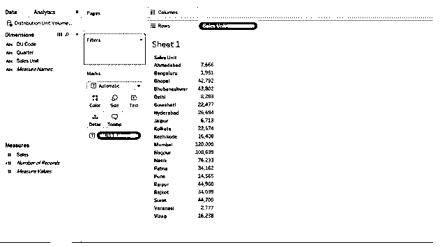

6.我们将上面的表格转换成垂直条形图，以更好的方式传达见解。但是，数据是以销售单位的方式显示的。为了了解区域销售业绩，我们需要在分析中包含区域。此外，试图通过销售单位来解释区域业绩是相当困难的。因此，为了将区域作为一个维度纳入分析，我们将创建维度值组。

在这里，不同的销售单位属于不同的地区。有些属于东方，有些属于南方，等等。因此，根据销售单位的地理位置，我们将它们分为五组，即东、西、北、南、中。当我们将这一区域维度纳入分析时，我们将能够对整个网络的销售业绩有一个全面的了解。

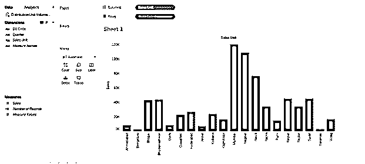

7.要创建组，请单击要将其值合并到组中的维度的下拉菜单。在这种情况下，维度是销售单位，因此，在其下拉菜单中，在“创建”中，选择组，然后单击它。这在下面的截图中有所说明。

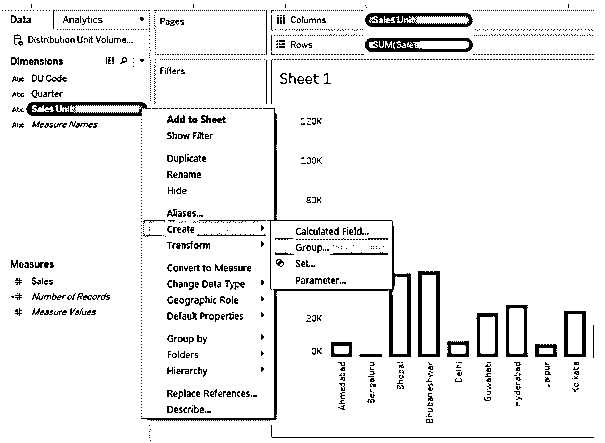

8.出现“创建组”对话框，如下所示。在此对话框中，我们可以选择所需的尺寸值来创建特定的组。

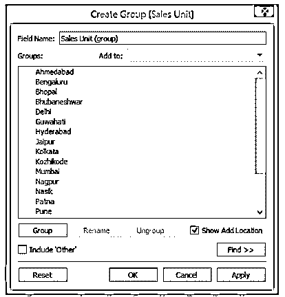

9.为了创建第一个组，我们通过按 Ctrl 键选择了 Ahmedabad、Mumbai、Nasik、Pune 和 Surat，如下图所示。然后单击“应用”生成该组。该组被命名为“West ”,表示西部地区，如下图所示。

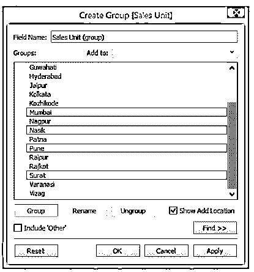

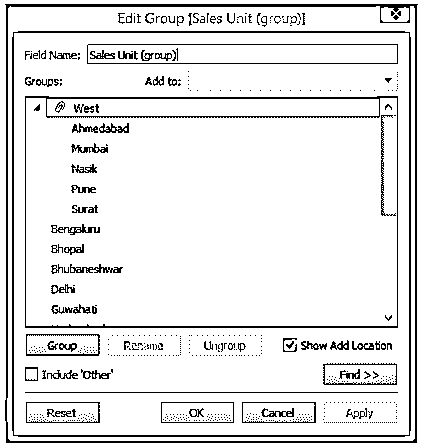

10.按照上述步骤，我们创建了第二个组“South ”,包含 Bengaluru、Hyderabad、Kozhikode 和 Vizag，如下所示。

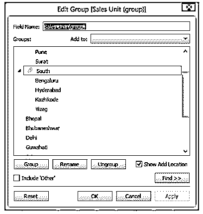

11.我们创建的第三组包括博帕尔、德里、斋浦尔和瓦拉纳西。所有这些都属于北印度，所以，我们把这个群体命名为“北”。

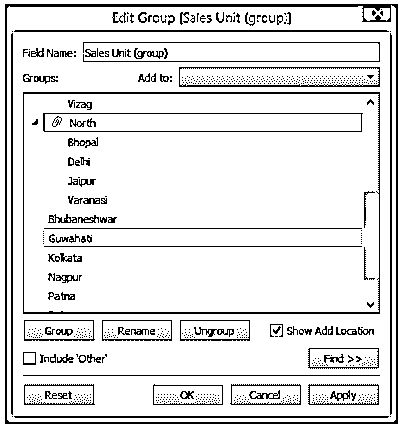

12.倒数第二个，我们按照完全相同的过程创造了“东部”地区，由布巴内什瓦尔、古瓦哈蒂、加尔各答和巴特那组成。如下图所示。

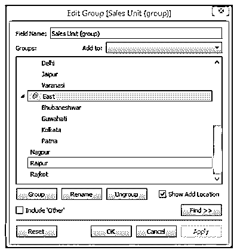

13.最后，我们创建了包含那格浦尔和赖布尔的“中央”区域。

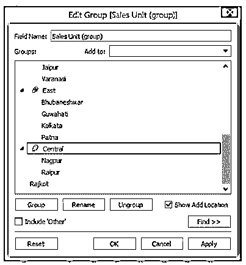

14.我们成功地创建了代表包含不同销售单位的不同区域的组。然而，从上面的截图中可以看出，我们忘记了将 Rajkot 包含在特定的组中。拉杰科特位于西部，因此必须包含在“西部”组中。要包含它，右键单击 Rajkot，然后单击“添加到”,如下所示。现在，如下面的屏幕截图所示，从区域组列表中选择“West”并单击 OK。

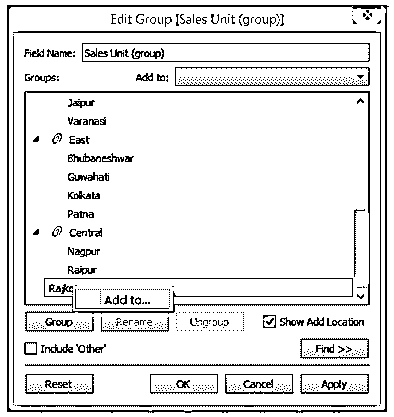

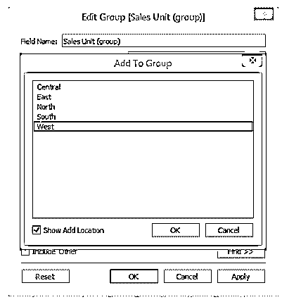

15.按照上面的步骤，我们就熟悉了另一种为组增值的方法。我们可以看到，现在，拉杰科特出现在西方。

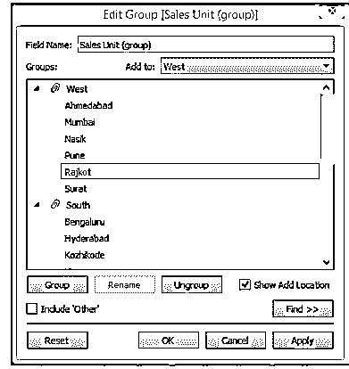

16.这些组现在将作为新创建的维度的维度值。我们必须给它一个合适的名字。所以，在“字段名”部分，我们将其命名为“Region”。最后，单击应用，然后单击确定。如下图所示。

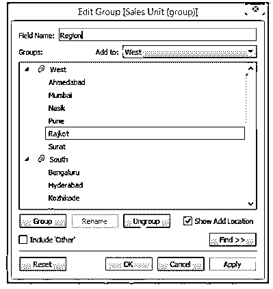

17.正如我们现在看到的，新创建的字段“作为维度”出现在“维度”部分。现在，我们可以很好地在分析中使用它。请注意，维度区域不会影响数据集，而只会促进视图级别的可视化分析。因此，通过组合不同的维度值，我们可以根据需要创建有效的可视化分析，而不会影响原始数据。

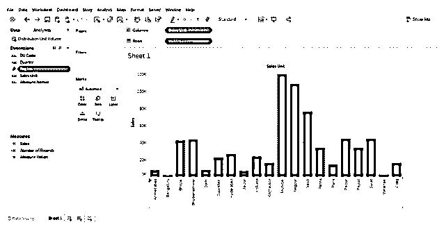

18.下面的屏幕抓图让我们进一步了解了新创建的包含各种组作为值的维 Region。

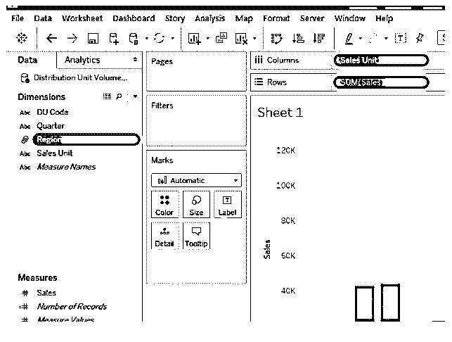

19.我们将维度区域包括在分析中，并按照销售额的降序对结果进行排序，从而生成以下分析。下面的条形图让我们可以直接了解地区销售业绩。

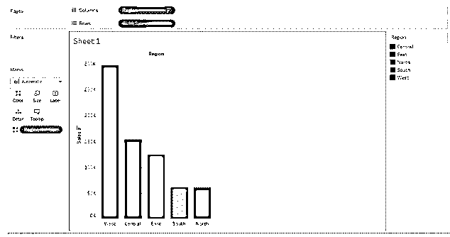

### Tableau 中的结论组

在某些情况下，必要的数据可能出现在数据集中，但不是以我们希望的方式出现。然而，通过不同维度值的组合，我们可以获得一个便于分析的新维度。Tableau 便于用户通过组的功能来应用这种方法。

### 推荐文章

这是 Tableau 中的一组指南。在这里，我们还讨论了 Tableau 中的介绍和创建组。您也可以看看以下文章，了解更多信息–

1.  [Tableau 聚合函数](https://www.educba.com/tableau-aggregate-functions/)
2.  [Tableau 数据集](https://www.educba.com/tableau-data-sets/)
3.  [什么是 Tableau 仪表盘？](https://www.educba.com/what-is-tableau-dashboard/)
4.  [在 Tableau 中创建集合](https://www.educba.com/create-set-in-tableau/)
5.  [MySQL 聚合函数|前 10 名](https://www.educba.com/mysql-aggregate-function/)
6.  [Tableau 中的 Concatenate |如何使用？](https://www.educba.com/concatenate-in-tableau/)

