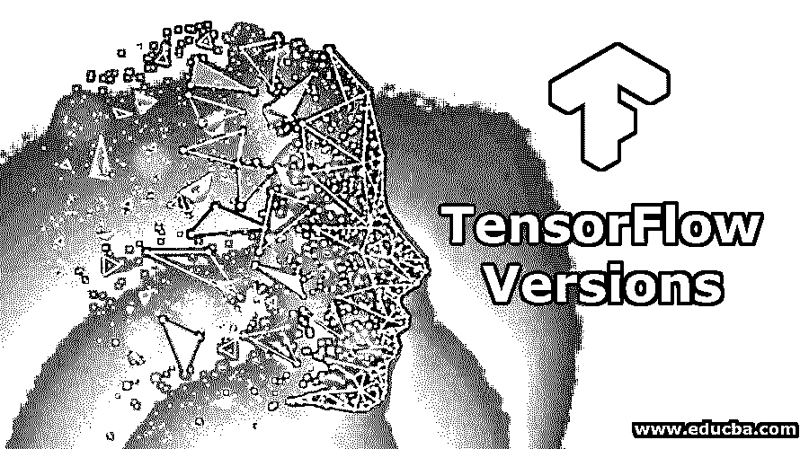

# TensorFlow 版本

> 原文：<https://www.educba.com/tensorflow-versions/>

## TensorFlow 版本概述

因为这是使用和研究最多的机器学习库，而且目前它是研究市场的热门话题，所以总是有新的更新。需要时，TensorFlow 库中会进行新的识别。TensorFlow 的当前版本是 2.0。根据数据科学领域的需求，许多包正在贬值，或者新的包正在增加，因为它们的用例不断变化。因此，跟踪 TensorFlow 的版本并不容易。

### 不同 TensorFlow 版本

TensorFlow 库的版本控制是针对所有公开可用的 API 在语义上完成的。TensorFlow 的一个版本具有主要版本、次要版本和补丁形式。

<small>Hadoop、数据科学、统计学&其他</small>

当前的 TensorFlow 版本是 2.0.0

*   主要版本:版本 2
*   次要版本:版本 0
*   补丁版本 0

每个数字的变化具有以下含义:

**1。Major** :这个发布版本表示当前版本中所有不兼容的现有功能。尽管如此，还是可以使用一些东西，比如可以迁移的图表和检查点。

**2。Minor:** 发布版本显示了现有的所有特性都没有更新，仍然是相同的。

**3。补丁:**此发布版本表示所有向后兼容功能都已修复。作为版本升级的一部分，为了向后兼容，做了一些事情。

TensorFlow 库的公共 API 可以向后兼容所有版本，包括 minor 和 patch。不同的公共 API 包括:

*   为了向后兼容，包含了所有 python 函数及其类。名称以 _(下划线)开头的私有符号、函数或类除外
*   python tf.compat 有一个兼容性 API。我们可以找到关于用户从旧版本过渡到新版本 TensorFlow 的实用程序或附加帮助。这些 API 符号被弃用且不受支持，TensorFlow 社区不会为那些版本过渡 API 添加任何新功能。

作为版本升级的一部分，不包括向后兼容性。

*   实验 API:为了向后兼容，没有包括所有的实验 API，因为它们纯粹是基于实验目的。特别是，为了向后兼容，不包括以下内容。
*   tf.contrib 模块中存在的任何符号，包括其子模块。
*   任何包含 experimental 作为关键字的符号也会被忽略。
*   其方法或类包含实验关键字的任何模块也被免除。
*   其他语言 API 如 C++、Java、Go、JavaScript 都被豁免。
*   复合操作也不包括在内。
*   浮点数。
*   随机数。
*   分布张量流中的偏斜度
*   疯狂的
*   错误行为

现在让我们讨论保存的模型、图形和检查点的版本兼容性。模型保存是在不同程序中构建和重用 ML 模型的有效方法；这是 TensorFlow 社区提供的一种对象序列化功能。

保存的模型由两部分组成:

*   编码图也称为 GraphDefs(可以有一个或多个编码图)
*   检查站

#### 1.GraphDefs 或编码图形的版本兼容性

*   TensorFlow 的每个版本发布都支持 GraphDef 版本的时间间隔。这个时间间隔在修补程序版本中是不变的。而且只有在有重大发布时才会修改。对 Graphdef 的支持只有在有主要版本时才会发生。

让我们看看 GraphDefs 的版本控制是如何工作的:

*   目前，TensorFlow 1.2 支持从 4 到 7 的 GraphDefs 版本。
*   TensorFlow 1.3 增加了 GraphDefs 版本 8，它支持版本 4 到 8。
*   但在 TensorFlow 2.0.0 中，版本 4 到 7 的支持被取消，仅支持版本 8。
*   由于主要版本已经发布，这就是为什么支持已经下降。
*   TensorFlow 提供了不同的工具，用于在失去支持时将旧图形转换为新版本。

#### 2.检查点兼容性

检查点兼容性分为以下两种:

*   向后兼容性
*   部分向前兼容性

**1。向后兼容性:**当我们需要实现已开发的图并包括在旧版本中开发的图时，会考虑这个功能。

**2。向前兼容性:**考虑一个场景，在消费者使用 TensorFlow 之前，开发人员或者我们可以说是图形或检查点的创建者被升级到新版本的 tensor flow。使用这种向前兼容性的时间。

### 结论

在本文中，我们已经看到了 TensorFlow 中的版本控制是如何发生的，以及作为升级的一部分包含的不同包，这些包都被排除在外。旧代码如何与新的升级版本兼容，兼容性如何在 TensorFlow 中工作，以及 TensorFlow 如何实现对不同版本之间处理代码的支持。

### 推荐文章

这是 TensorFlow 版本的指南。这里我们简单描述一下 TensorFlow 版本的概况和不同版本。您也可以看看以下文章，了解更多信息–

1.  [tensorlow 体系结构](https://www.educba.com/tensorflow-architecture/)
2.  [什么是张量流？](https://www.educba.com/what-is-tensorflow/)
3.  [TensorFlow Debugging](https://www.educba.com/tensorflow-debugging/)
4.  [TensorFlow Models](https://www.educba.com/tensorflow-models/)

