# 如何安装 TensorFlow

> 原文：<https://www.educba.com/install-tensorflow/>

## 如何安装 TensorFlow？

在这篇安装 TensorFlow 的文章中，我们将首先对 TensorFlow 及其在数据科学生态系统中的使用进行概述，然后安装 TensorFlow for Windows。

### What is TensorFlow?

TensorFlow 是一个流行的软件应用程序，用于实现机器学习算法，特别是神经网络。它由谷歌开发，于 2015 年作为开源平台发布。之所以叫 TensorFlow，是因为它把输入作为多维数组，也就是所谓的张量。我们可以构建一个流程图，显示我们希望对该输入执行的操作，即数据从一端进入，然后流经该操作系统，从另一端作为输出出来。

<small>Hadoop、数据科学、统计学&其他</small>

它因其极端的多功能性而广受欢迎。它可以在不同的平台上运行，比如桌面、云或者移动设备。所有这些都可以使用一个 API 来完成。它可以在多台机器上进行训练，然后我们可以在不同的机器上运行它。TensorFlow 非常快，因为它是用 C++编写的，但它可以被其他语言访问和控制，主要是 Python。TensorFlow 的另一个伟大特性是 TensorBoard，它使我们能够以图形和视觉方式监控它的工作。对机器学习，尤其是神经网络感兴趣的人，应该学习 TensorFlow。

**tensor Flow 的数据流图架构:**

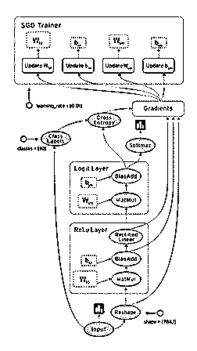

**数据流图有两个基本单元:**一个代表数学运算的节点和一条服务于被称为张量的多维数组的边。所以，这个高层次的抽象展示了数据是如何在操作之间流动的。一旦创建了图形，就编写一个内部循环来驱动计算。输入通过变量或占位符输入到节点中。在 TensorFlow 中，计算仅在会话创建后运行。

### 深度学习为什么首选 TensorFlow？

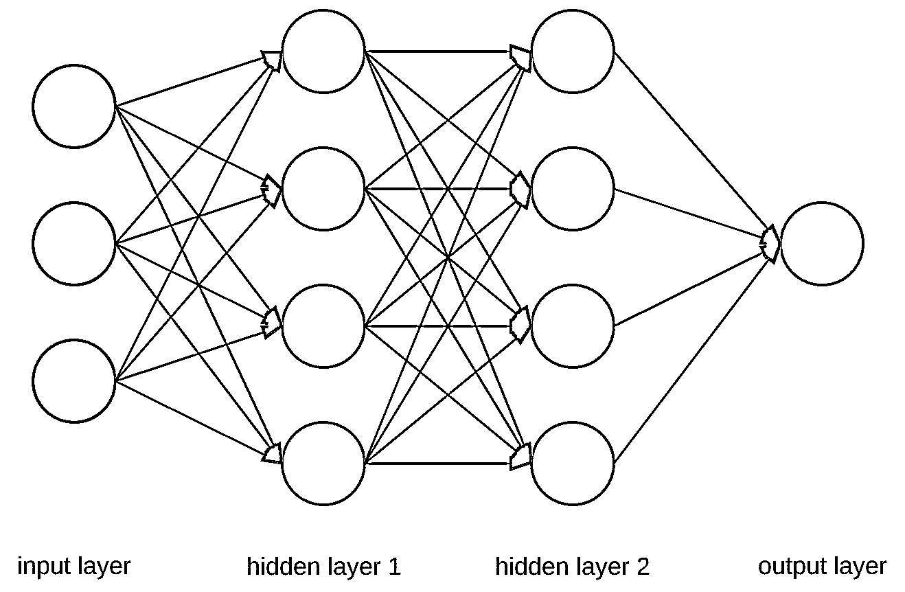

深度学习是机器学习的一部分，直接从数据中学习特征和任务。数据可以是图像、文本或声音。它通常被称为端到端学习。神经网络是我们大脑中神经元的同义词。在上图中，数据来自输入层，流经所有计算都在其中完成的隐藏层，然后传递到输出层。多个隐藏玩家使其成为深度神经网络，而单个层形成浅层神经网络。

*   它对深度学习和神经网络有广泛的内置支持，使组装网络、分配参数和运行训练过程变得容易。
*   有一些可训练的数学函数对神经网络很有用。任何基于梯度的机器学习算法都将受益于 TensorFlow 的自动微分和一流的优化器套件。
*   由于其广泛的灵活工具集合，它与各种机器学习兼容。
*   深度神经网络处理更复杂的行为，其中每个输入由激活函数处理，如双曲正切、逻辑函数等。激活函数的选择影响网络的行为，张量流控制网络的结构。
*   它也可以用于建立简单的线性和非线性模型。

### 安装 TensorFlow 的步骤

安装部分将由两部分组成:

*   安装 Anaconda
*   使用 Anaconda 提示符设置 TensorFlow

#### 第 1 部分:在 Windows 上安装 Anaconda

Anaconda 是一些流行的 python 包的捆绑包，有一个名为 conda 的包管理器(类似于 pip)。一些流行的 anaconda 包有——NumPy、scipy、Jupiter、nltk、scikit-learn 等。如果您的 windows 中安装了 Python，那么要安装所有这些包，您需要运行 pip，而如果您安装了 anaconda，您可以一次性获得所有这些包。

以下步骤说明了如何在 windows 上安装 Anaconda。Python 3.7 不支持 TensorFlow，所以我们将为 Python 3.6 使用 Anaconda。

*   从这里下载 Anaconda for Python 3.6 安装程序——https://drive.google.com/open?id = 12 BLP z3 wzsy 0k fcmgv 0 sgpj _ _ 0op-JJs。
*   安装程序下载完成后，双击它并选择下一步。

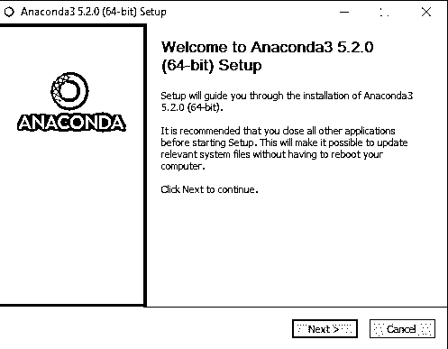

*   在下一个窗口中单击我同意。

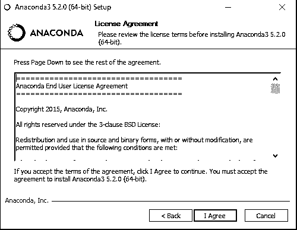

*   选择所有用户，然后单击下一步。

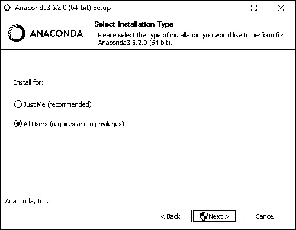

*   选择您认为合适的安装位置，然后单击下一步。

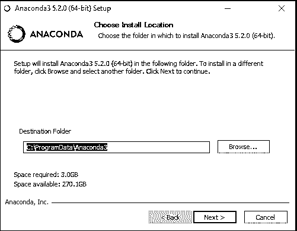

*   选中“将 Anaconda 注册为系统 Python 3.6”框，然后在下一个窗口中单击“安装”。

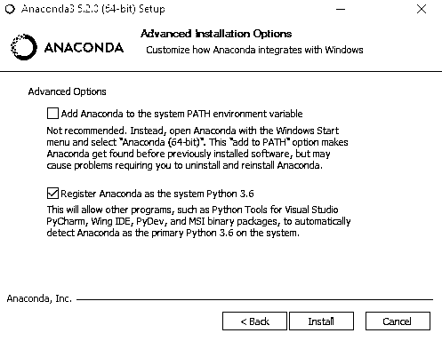

*   安装正在进行中。

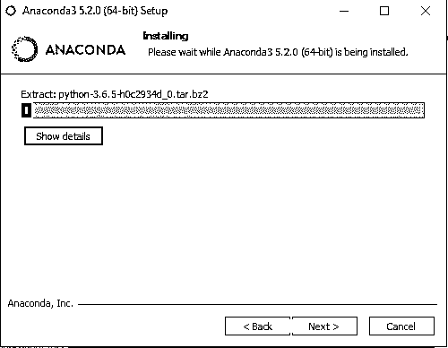

*   让安装继续，完成后，单击“下一步”完成安装。然后转到 windows 中的环境变量来设置路径。

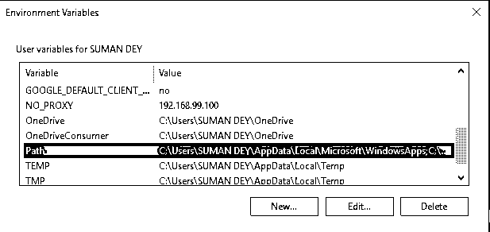

*   单击 New 并添加安装了 Anaconda 的脚本文件夹，然后单击 Ok。

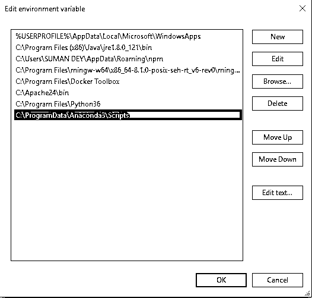

*   现在，转到 Windows 搜索栏，键入 Anaconda 提示符。双击应用程序并键入 conda–version 以确认其安装。

#### 第 2 部分:使用 Anaconda 提示符设置 TensorFlow 安装

*   转到 Anaconda 提示符处，键入 conda create -n myenv python=3.6，然后按 enter 键。

**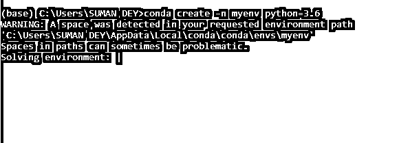

** 

*   按 Y 键并按回车键。它将创建一个单独的环境来安装 TensorFlow。

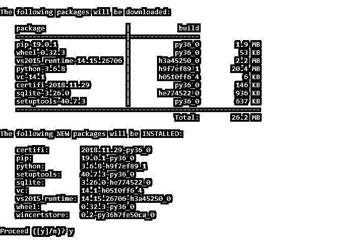

*   键入 conda activate myenv 并输入 enter 进入环境内部。

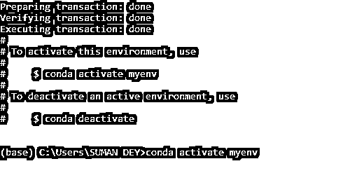

*   进入环境后，逐一输入以下内容

1.  conda install jupyter
2.  康达安装软件
3.  pip install –upgrade TensorFlow

*   完成后，键入 python，然后键入 import TensorFlow。如果没有错误，则 TensorFlow 安装成功。

### 张量流的实际应用

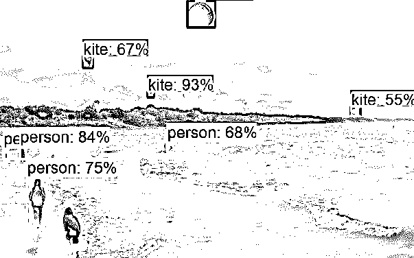

在过去几年中，深度学习已经成为几乎所有重大计算突破的核心。它已经存在于我们的许多日常产品中，如网飞和亚马逊的个性化推荐、垃圾邮件过滤，甚至是我们与苹果 Siri 或微软 Cortana 等个人助理的交互。

然而，受益于这项研究的不仅仅是科学应用。其他学科的人也开始探索深度学习如何用于物体检测案例(如图所示)。它教会计算机识别图片中的对象，然后使用这些知识来驱动新的行为。

### 张量流的最新趋势

它最近发布了 1.12.0 版本，其中几个主要改进是:

*   Keras 模型可以直接导出为 SavedModel 格式，并与 TensorFlow spring 一起使用。
*   二进制文件是在 XLA 支持下构建的，Keras 模型现在可以用 tf.data.Dataset 进行评估
*   添加到 contrib/ignite 的 Ignite 数据集允许使用 Apache Ignite。

### 推荐文章

这是如何安装 TensorFlow 的指南。这里，我们已经分别讨论了安装 TensorFlow 的说明和不同步骤。您也可以阅读以下文章，了解更多信息——

1.  [张量流与咖啡的区别](https://www.educba.com/tensorflow-vs-caffe/)
2.  [tensor flow 和 Pytorch 的比较](https://www.educba.com/tensorflow-vs-pytorch/)
3.  [深度学习职业](https://www.educba.com/careers-in-deep-learnings/)
4.  [tensor flow 游乐场简介](https://www.educba.com/tensorflow-playground/)

