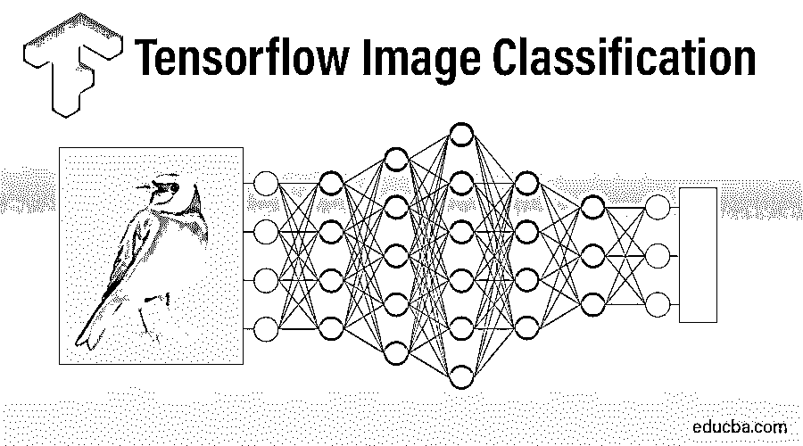
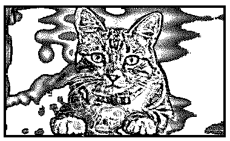

# 张量流图像分类

> 原文：<https://www.educba.com/tensorflow-image-classification/>

## 张量流图像分类综述

图像分类是用于从图像中提取信息类别的过程/任务，或者换句话说，它是基于图像的视觉内容对图像进行分类的过程。张量流图像分类被称为计算机视觉的过程。

例如，我们可以找到图像中出现了什么样的对象:人、动物还是物体。

<small>Hadoop、数据科学、统计学&其他</small>

### 什么是 Tensorflow 图像分类？

*   Tensorflow 提供了一些特殊类型的图像分类预训练和优化模型，包含许多不同类型的对象。识别包括人、活动、动物、植物和地方在内的数百种不同种类的物体是非常强大的。
*   首先，它将使用不同类别的图像进行预训练。
*   那么它的主要功能就是预测一个图像代表的是什么。

例如:如果我有一个模型在两种不同的类上训练——狗或猫

之后，提供一个图像作为输入；it1111111111111111 会给出概率比作为输出。

在训练该模型之后，它应该从给定的图像中预测正确的输出。

输出:

| 动物类型 | 可能性 |
| 狗 | Zero point zero four |
| 猫 | Zero point nine six |

从上面的输出，我们可以分类，只有 4%的机会，图像包含一只狗，96%的机会，给定的输入图像包含一只猫。

一个图像可以包含一个或多个不同种类的类，我们的模型就是在这些类上训练的。它还可以对多个对象进行分类。

#### 对图像分类的误解

*   还有，很多人误解了图像分类和计算机视觉的概念。
*   人们认为图像分类可以告诉你物体的位置或者识别图像中的物体。图像分类只能给出图像包含一个或多个类别的概率。
*   如果你想识别物体或者想知道物体在图像中的位置，你应该使用物体检测。

### 图像分类步骤

以下是影像分类需要遵循的不同步骤:

#### 1.类别的定义

根据图像数据的目标和特征明确定义您的类别，这意味着应该明确定义类别分类。

#### 2.功能选择

利用图像的颜色、图像的纹理、图像的多光谱和多时相特征来发现类别之间的关系的特征。

#### 3.训练数据样本

检查训练数据的小集合，以确定做出适当的决策。主要有两种技术[监督学习和非监督学习](https://www.educba.com/supervised-learning-vs-unsupervised-learning/)，基于训练数据选择。

#### 4.查找决策规则

基于分类与训练数据的比较做出适当的决定。

#### 5.分类

根据上述决策规则，将所有像素归入一个类别。分类使用两种方法:基于区域分割的逐像素分类和逐场分类。

#### 6.最后，对结果进行验证

检查准确性和可靠性，并验证分类的结果。对于任何图像分类，这些都是你应该遵循的主要原则。

### 使用神经网络归档 Tensorflow 影像分类的步骤

*   Tensorflow 提供 tf。Keras 是在 Tensorflow 中构建和训练模型的高级 API。
*   导入必要的包
*   从外部来源获取数据或访问数据集。Keras 提供了广泛的数据集。
*   确保您的图像数据集被正确标记。
*   将数据集分成带标签的训练图像，测试集也包含图像和标签。
*   在训练模型之前，通过观察数据的形状和长度来探索数据。所以你可以理解为什么数据集中没有例子。
*   预处理数据，根据数据集将图像大小设置为 0 到 255 像素。显示 20 到 25 张图像及其标签。
*   **建立模型**–[创建神经网络](https://www.educba.com/what-is-neural-networks/)，配置模型的层，编译模型
*   **设置网络层**–用于从给定数据中提取表示。许多简单的层被链接起来创建整个网络。对于图层，Tensorflow 提供了 tf.Keras. Layers 包，用于创建不同类型的图层。
*   **编译模型**–编译模型时，有 3 个必要的编译步骤。
    *   **优化器**–用于更新和计算模型参数的合适和最佳值的优化器。Tensorflow Keras 提供了不同类型的优化器，如 Adam、SGD 和 Adagrad。
    *   **损失函数**–损失用于在模型训练期间计算模型精度。如果损失函数在训练期间最小化，则意味着模型表现良好。
    *   **指标**–用于测量和观察模型训练和测试。例如，在图像分类正确与否的每一步检查模型的准确性。
*   **训练模型**–将带有标签的训练数据输入模型。拟合函数并设置历元，这些历元是训练模型的迭代。
*   **评估准确性**–现在我们的模型已经训练好了，但是如何验证它的预测是否正确。为此，我们必须检查经过训练的模型在测试集上的表现。使用模型。评估函数并传递测试图像，并将其标记到函数中。
*   **预测**–现在，我们的模型准备使用模型进行预测。[预测功能](https://www.educba.com/predict-function-in-r/)预测图像标签。

### 例子

自己尝试一下图像分类的例子，更好的理解图像分类。Tensorflow 提供了许多内置数据集，如 MNIST 数据；它包含带有标签的不同图像类型。尝试使用图像分类的概念来预测该图像的类别。

这是 Tensorflow 自己使用 Tensorflow Keras 包给出的示例的链接。

[https://www.tensorflow.org/tutorials/keras/classification](https://www.tensorflow.org/tutorials/keras/classification)

只需按照相同的步骤来归档图像分类。

### 结论

Tensorflow 提供了许多库支持来归档图像分类。TensorFlow 提供的图像分类模型主要用于单标签分类。他们的模型经过训练可以识别 1000 种不同的类别。如果您想使用定制模型，TensorFlow 也提供了定制选项。

### 推荐文章

这是一个张量流图像分类的指南。这里我们讨论了什么是张量流图像分类？图像分类的不同步骤以及如何用神经网络实现张量流。您也可以浏览我们推荐的其他文章，了解更多信息——

1.  [什么是张量流？](https://www.educba.com/what-is-tensorflow/)
2.  [tensor flow 简介](https://www.educba.com/introduction-to-tensorflow/)
3.  [tensorlow 替代品](https://www.educba.com/tensorflow-alternatives/)
4.  [如何安装 TensorFlow](https://www.educba.com/install-tensorflow/)
5.  [神经网络的实现](https://www.educba.com/implementation-of-neural-networks/)
6.  [TensorFlow 调试|如何工作？](https://www.educba.com/tensorflow-debugging/)

