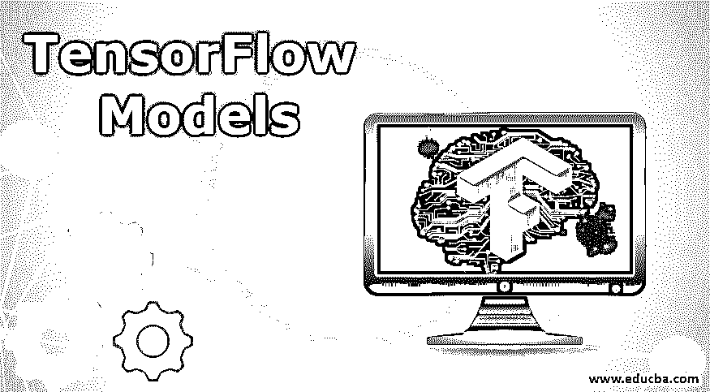

# TensorFlow Models

> 原文：<https://www.educba.com/tensorflow-models/>

## 张量流模型简介

TensorFlow Models 是 2015 年的开源机器学习库。TensorFlow 专门[用于深度学习](https://www.educba.com/what-is-deep-learning/)。TensorFlow 可用于研究和生产环境。TensorFlow 是开源的，拥有 Apache 2.0 许可证。TensorFlow 是两个词 Tensor 的组合——一个多维数组，而 Flow 是一个运算图。每一个数学运算都在张量流中表示为图形。图中的节点作为操作和边是张量。TensorFlow 运行在各种平台上——CPU、TPU、GPU、Android、IOS 和 Raspberry Pi。TensorFlow 由 GoogleBrain 团队的研究人员和开发人员开发。TensorFlow 的基础语言是 C++。

### 各种张量流模型

如今，日常技术的核心是神经网络。这些神经网络激发了深度学习模型。

<small>Hadoop、数据科学、统计学&其他</small>

神经网络就像人脑中的神经元；这些神经元具有解决复杂问题的能力。这些简单的神经元相互连接，形成一个分层的神经网络。这个分层的神经网络包含输入层、输出层、隐藏层、节点和权重。输入层是给出输入的第一层。最后一层是输出层。隐藏层是在节点(神经元/操作)和权重(信号强度)的帮助下执行处理的中间层。

张量流的各种模型有:

#### 1.卷积神经网络

Yan LeCun 和 Joshua bengio 在 1995 年提出了卷积神经网络的概念。它用于分析图像并直接从像素图像中识别视觉模式。它是一类深度前馈人工神经网络。与其他分类算法相比，CNN 需要最少的预处理。

**CNN 中的图层:**

*   **卷积层:**这是我们使用滤波器或内核对数据或图像进行卷积的一层。我们通过滑动窗口将这些过滤器应用于数据。过滤器的深度与输入相同。对于彩色图像，RGB 值给出深度为 3 的过滤器。它包括获取过滤器图像的元素乘积，然后对每个滑动动作的值求和。3d 滤波器与彩色图像的卷积的输出是 2d 矩阵。
*   **激活层:**激活功能在卷积层之间，卷积层接收输入信号，执行非线性变换，并将变换后的信号发送到下一个神经元输入层。不同的激活函数是 sigmoid，tanh，Relu，Maxout，Leaky ReLU，elu。使用最广泛的激活函数是 Relu。非线性变换用于使网络能够学习和执行复杂的任务。
*   **池层:**这一层负责减少网络中的参数数量和复杂计算。在汇集时，执行平均汇集和最大汇集。
*   **全连接层:**它将每一个神经元与之前的每一个神经元连接起来。是 CNN 上的输出层。这是 CNN 的最后一期。当输入数据是图像，2d 数据可以转换为 1d，并且模型需要很大的计算量时，应该使用 CNN。

#### 2.递归神经网络

递归神经网络(RNN)是至少一个反馈连接形成回路的网络。RNN 在保留信息一段时间，进行时间处理和学习序列方面非常强大。RNN 保留信息意味着它储存了关于过去的信息，这有助于学习序列。RNN 可以是至少有一个反馈连接的简单 RNN，也可以是完全连接的 RNN。RNN 的一个例子是文本生成。该模型将通过大量的单词或某个作者的书来训练。然后，模型将预测单词(格式)的下一个字符(o)。现在可以在电子邮件或智能手机上使用的自动预测是 RNN 的一个很好的例子。RNN 被发明用来预测序列。RNN 有助于视频分类、情感分析、人物生成、图像字幕等。

#### 3.LSTM

LSTM 是序列预测中最有效的问题之一。RNN 在处理短期依赖时非常有效。RNN 记不住上下文和很久以前说过的话。LSTM 网络非常擅长保持长期依赖/记忆。LSTM 是有用的手写识别，手写生成，音乐生成，图像字幕，语言翻译。

#### 4.受限玻尔兹曼机

它是一个无方向的图形模型，在深度学习框架(如 TensorFlow)中具有重要作用。它是一种用于降维、分类、回归、协作过滤、特征学习和主题建模的算法。在 RBM，有可见层和隐藏层。RBM 的第一层是可见层或输入层。节点执行计算并跨层连接，但同一层的两个节点没有链接，因此在 RBM 中没有节点间通信限制。每个节点处理输入，并随机决定是否传输输入。

#### 5.自动编码器

自动编码器是一种无监督的神经网络，[使用机器学习](https://www.educba.com/uses-of-machine-learning/)来进行压缩。自动编码器用于执行压缩，将多维数据转换为低维数据。原始数据在任何人需要的时候都会被重建。Autoencoder 旨在学习给定数据类型的压缩分布式表示，以进行降维。自动编码器的组件是 1。编码器 2。代码 3。解码器。

*   **编码器:**取输入图像并压缩，产生编码。
*   **解码器:**它从编码中重建原始图像。

自动编码器是数据专用的；这意味着他们只能压缩经过训练的图像。被训练用来为猫压缩图像的自动编码器不会压缩人类的图像。

#### 6.自组织地图

自组织映射有助于减少特征。它们用于将高维数据映射到低维数据，从而提供良好的数据可视化。它由输入图层、权重和 Kohonen 图层组成。Kohonen 图层也称为要素地图或竞争图层。自组织映射有利于数据可视化、降维、NLP 等。

### 结论

TensorFlow 拥有巨大的能力，可以更高效地训练不同的模型。在本文中，我们研究了不同的深度学习模型，这些模型可以在 [TensorFlow 框架](https://www.educba.com/what-is-tensorflow/)上进行训练。我们希望您已经深入了解了一些深度学习模型。

### 推荐文章

这是张量流模型的指南。在这里，我们讨论张量流模型的介绍以及五个不同的模型的详细解释。您也可以浏览我们推荐的其他文章，了解更多信息——

1.  [深度学习算法](https://www.educba.com/deep-learning-algorithms/)
2.  [tensorlow 体系结构](https://www.educba.com/tensorflow-architecture/)
3.  [张量低图像分类](https://www.educba.com/tensorflow-image-classification/)
4.  [如何安装 TensorFlow](https://www.educba.com/install-tensorflow/)

