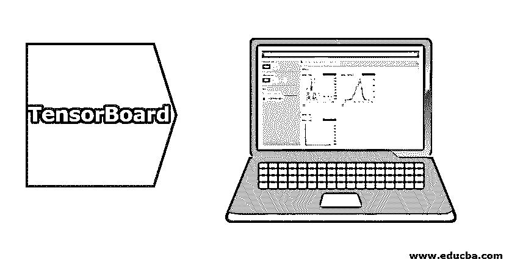
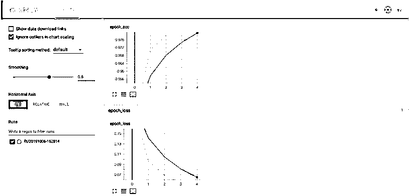
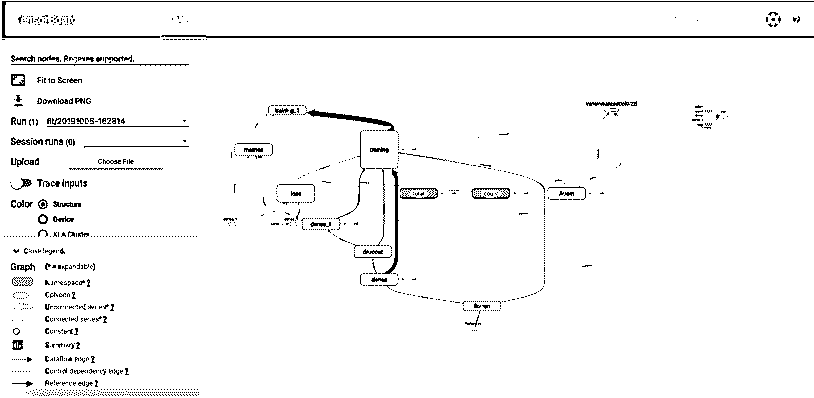
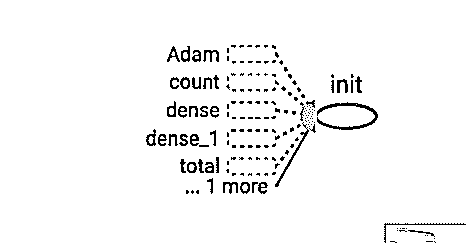
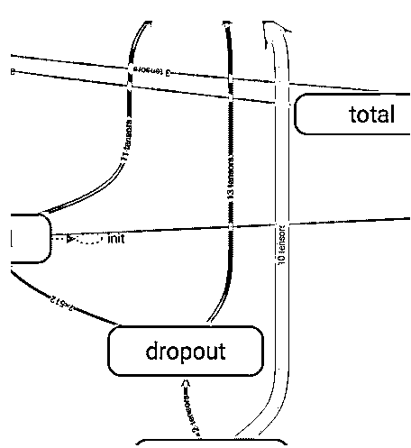
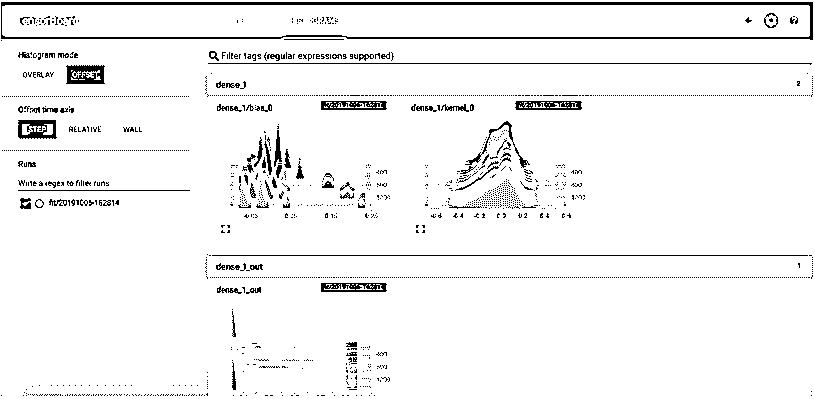
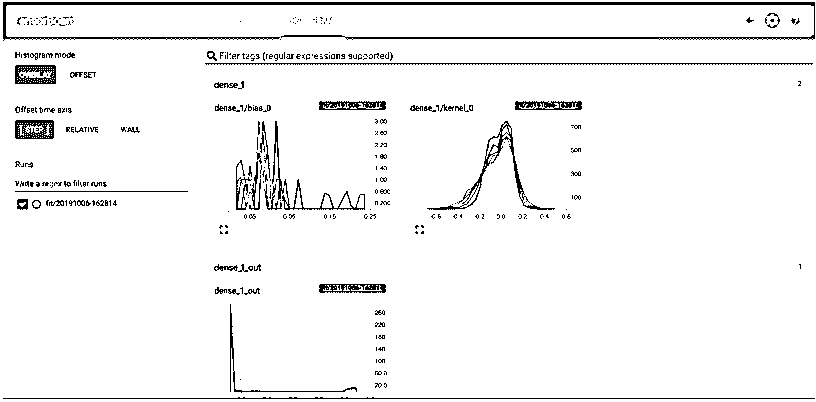
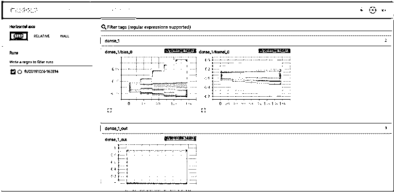

# 张量板

> 原文：<https://www.educba.com/tensorboard/>

## TensorBoard 概述

TensorBoard 是 TensorFlow 的可视化框架，用于理解和检查机器学习算法流程。[机器学习](https://www.educba.com/machine-learning-models/)模型的评估可以通过很多指标来完成，比如损耗、准确度、模型图等等。机器学习算法的性能取决于模型选择和算法中输入的超参数。通过改变这些参数的值来进行实验。

[深度学习模型](https://www.educba.com/deep-learning-model/)就像一个黑匣子；很难发现其中发生的过程。获得洞察力以构建模型是很重要的。借助可视化，您可以知道通过增强模型性能来修改哪些参数。因此 TensorBoard 是在模型训练阶段可视化每个时期的重要工具。

<small>Hadoop、数据科学、统计学&其他</small>

### 装置

要使用 pip 安装 tensorboard，请运行以下命令:

**代码:**

`pip install tensorboard`

或者，也可以使用 conda 命令进行安装:

**代码:**

`Conda install tensorboard`

### 使用

使用 Keras 模型的 tensorboard:

Keras 是深度学习模型的开源库。它是一个高级库，可以运行在 TensorFlow、theano 等之上。

使用 pip 安装 TensorFlow 和 Keras 库:

**代码:**

`pip install tensorflow pip install Keras`

让我们举一个使用 MNIST 数据集进行分类的简单例子。MNIST 是一个英文数值数据集，包含从 0 到 9 的数字图像。它可以从 Keras 库获得。

*   导入库 TensorFlow，因为我们将在 TensorFlow 后端使用 Keras。

**代码:**

`import tensorflow as tf`

*   首先，将 MNIST 数据集从 Keras 加载到训练和测试数据集中。

**代码:**

`mnist = tf.keras.datasets.mnist`

*   序列模型是通过以下方式创建的:

**代码:**

`tf.keras.models.Sequential`

*   为了定型模型，使用了 Model.fit()。可以使用以下方式创建和存储日志:

**代码:**

`tf.keras.callback.TensorBoard`

*   要启用直方图计算:

**代码:**

`histogram_freq=1.`

默认情况下是关闭的。

上述 MNIST 数据集分类的代码如下:

**代码:**

`#   Simple NN to classify handwritten digits from MNIST dataset
import tensorflow as tf
import datetime
mnist = tf.keras.datasets.mnist
(x_train, y_train),(x_test, y_test) = mnist.load_data() x_train, x_test = x_train / 255.0, x_test / 255.0
def create_model():   return tf.keras.models.Sequential([     tf.keras.layers.Flatten(input_shape=(28, 28)),     tf.keras.layers.Dense(512, activation='relu'),     tf.keras.layers.Dropout(0.2),
tf.keras.layers.Dense(10, activation='softmax')
])
model = create_model() model.compile(optimizer='adam',
loss='sparse_categorical_crossentropy',
metrics=['accuracy'])
log_dir="logs/fit/" + datetime.datetime.now().strftime("%Y%m%d-%H%M%S")
tensorboard_callback = tf.keras.callbacks.TensorBoard(log_dir=log_dir, histogram_freq=1)
model.fit(x=x_train,            y=y_train,            epochs=5,            validation_data=(x_test, y_test),
callbacks=[tensorboard_callback])`

要在本地服务器上启动 tensorboard，请转到安装 TensorFlow 的目录位置，然后运行以下命令:

**代码:**

`tensorboard --logdir=/path/to/logs/files`

#### 数量

标量显示每个时代的变化。上图显示了每个历元后的精度和损失图。epoch_acc 和 epoch_loss 是训练精度和训练损失。同时，epoch_val_acc 和 epoch_val_loss 是验证数据的精度和损失。

较亮的橙色线表示精确的精度或损失，较暗的线表示平滑的值。平滑有助于可视化数据的总体趋势。

#### 图形

图形页面帮助您可视化模型的图形。这有助于您检查模型是否构建正确。

为了可视化图形，我们需要创建一个会话，然后创建一个 TensorFlow FileWriter 对象。要创建 writer 对象，我们需要传递存储摘要的路径，并将 sess.graph 作为参数。

**代码:**

`writer = tf.summary.FileWriter(STORE_PATH, sess.graph)`

tf.placeholder()和 tf。变量()用于张量流代码中的占位符和变量。

这显示了我们构建的模型的图形可视化。所有圆角矩形都是名称空间。椭圆形表示数学运算。

常数显示为小圆圈。tensorboard 使用虚线椭圆或圆角矩形来简化，以减少图形中的混乱。这些节点链接到许多其他节点或所有节点。所以它们在图中保持为点状，在右上角可以看到它们的细节。在右上角，提供了到渐变、渐变下降或初始节点的链接。

要知道每个节点进出的张量的数量，你可以看到图形的边。图边描述了图中流动的张量的数量。这有助于识别每个节点的输入和输出维度。这有助于调试任何问题。

#### 分布和直方图

这也显示了张量随时间的分布；我们可以看到权重和偏差。这显示了每个时期的输入和输出随时间的进展。有两种查看选项:

偏移和覆盖

直方图的偏移视图如下:

直方图的叠加视图为:

分布页面显示统计分布。该图显示了平均值和标准偏差。

### 张量板的好处

*   TensorBoard 通过编写模型摘要(如标量、直方图或图像)来帮助可视化学习。反过来，这有助于提高模型的准确性并易于调试。
*   深度学习处理是一个黑盒的事情，tensorboard 通过图表和直方图帮助理解黑盒中发生的处理。

### 结论–张量板

TensorBoards 为经过训练的深度收入模型提供可视化，并帮助理解它们。它可以与 TensorFlow 和 Keras 一起使用。它主要借助直方图和模型图来可视化标量和度量的行为。

### 推荐文章

这是一份 TensorBoard 指南。在这里，我们将讨论 tensorboard 的安装和使用方法，以及 keras 模型的优点。您也可以看看以下文章，了解更多信息–

1.  [tensor flow 简介](https://www.educba.com/introduction-to-tensorflow/)
2.  [什么是张量流？](https://www.educba.com/what-is-tensorflow/)
3.  [TensorFlow 游乐场](https://www.educba.com/tensorflow-playground/)
4.  [Tensorflow Basics](https://www.educba.com/tensorflow-basics/)

