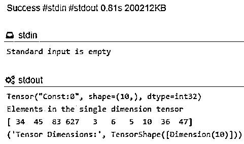
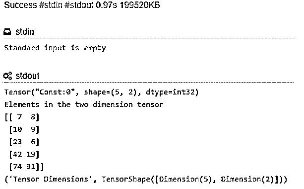
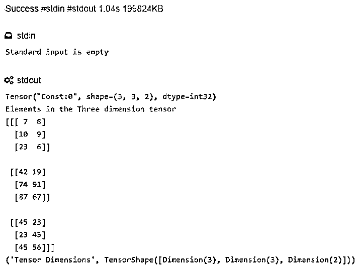
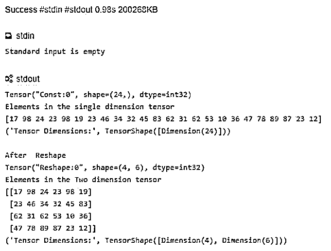
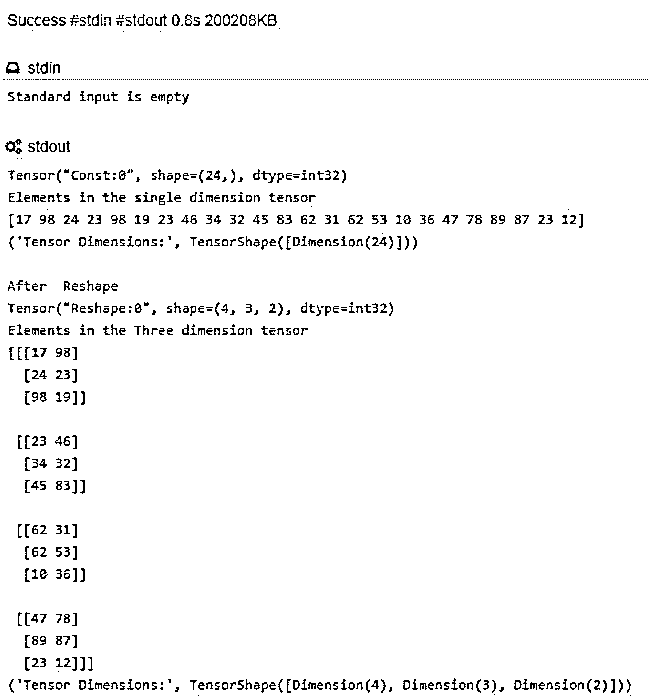
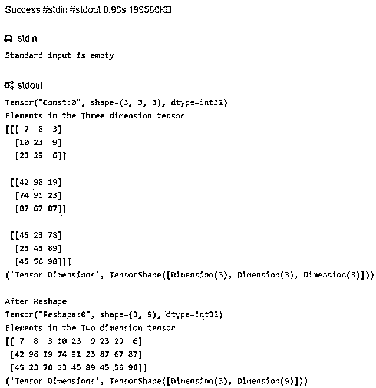

# TensorFlow Reshape

> 原文：<https://www.educba.com/tensorflow-reshape/>

## 张量流整形简介

TensorFlow Reshape 功能允许数据科学家按照他们的应用程序保证和控制数据流以实现结果的方式，调整张量的维度。张量元素的这种操作不改变原始形式，并且保持了一致性。

这种重塑设施使数据科学家能够以不同的方式训练人工智能中的神经网络，以便复杂的搜索操作、音频/视频文件匹配、图像处理和自然语言分类能够在短时间内准确解决。它还允许设计各种新的数据模型，以构建健壮和可靠的人工智能解决方案。

<small>Hadoop、数据科学、统计学&其他</small>

### 为什么要 TensorFlow 重塑？

*   它允许构建复杂的多维数据模型，这反过来又使数据在更深的层次上可视化。这也使得神经网络中所有节点的调试更加容易和快速，并且无需通过代码就能解决问题。
*   它提供了尝试不同维度的数据和设计尽可能多的数据视图的灵活性，并为任何人工智能相关的问题设计解决方案。
*   这是一个开源的平台，来自社区的想法不断提高其提供的解决方案的质量。
*   这个重塑选项使用户能够构建许多迄今为止没有想到的用例。

### 张量流整形示例

张量是像矩阵格式一样排列的数据元素的数组。它可以是一维矩阵，也可以是多维矩阵(2D、三维、4D、5D 等等)。矩阵可以保存整数、浮点数或字符串形式的文本。

多维样本张量流。

#### 示例#1

创建一维张量的代码。

**代码:**

`#Python program to define and list a single dimension Tensor
import tensorflow as tfl
sm=tfl.constant([34,45,83,627,3,6,5,10,36,47]) #define a single dimension array
# printing attributes of Tensor
print sm
with tfl.Session() as tses:
sm_value = tses.run(sm)
print ("Elements in the single dimension tensor")
print sm_value
print ("Tensor Dimensions:", sm.get_shape())`

**输出:**

张量只有一维，第一维(矩阵的行)有 10 个元素，第二维(矩阵的列)有一个元素(默认)。它包含整数数据类型。

#### 实施例 2

创建二维张量的代码。

**代码:**

`#Python program to define and list a two dimension Tensor
import tensorflow as tfl
dm=tfl.constant([[7,8],[10,9],[23,6],[42,19],[74,91]]) # two dimension array
# printing attributes of Tensor
print dm
with tfl.Session() as tses:
dm_value = tses.run(dm)
print ("Elements in the two dimension tensor")
print dm_value
print ("Tensor Dimensions", dm.get_shape())`

**输出:**

张量有两个维度，第一维(矩阵的行)有 5 个元素，第二维(矩阵的列)有 2 个元素。

#### 实施例 3

代码创建三维张量。

**代码:**

`#Python program to define and list a three dimension Tensor
import tensorflow as tfl
dm=tfl.constant([[[7,8],[10,9],[23,6]],[[42,19],[74,91],[87,67]],[[45,23],[23,45],[45,56]]]) # three dimension array
# printing attributes of Tensor
print dm
with tfl.Session() as tses:
dm_value = tses.run(dm)
print ("Elements in the Three dimension tensor")
print dm_value
print ("Tensor Dimensions", dm.get_shape())`

**输出:**

有三个维度，第一个维度中有 2 个元素，其他两个维度中有 3 个元素。

### 张量流中的整形函数

每种语言都有自己的功能，将张量从一种形式重塑为另一种形式。在 python 中，整形的语法是:

`tensorflow.reshape (tensorname, shape, name=optional)
tensorname - Name of the tensor data set that needs to converted into a new shape
shape`

| 的**号**尺寸**** | **语法** | **维度中的元素数量** |
| One | Two | Three | Four |
| One | [w] | 英语字母中的第二十三个字母 |  |  |  |
| Two | [w，x] | 英语字母中的第二十三个字母 | 英语字母表的第 24 个字母 |  |  |
| Three | [w，x，y] | 英语字母中的第二十三个字母 | 英语字母表的第 24 个字母 | 英语字母表的第 25 个字母 |  |
| Four | [w，x，y，z] | 英语字母中的第二十三个字母 | 英语字母表的第 24 个字母 | 英语字母表的第 25 个字母 | z |

**名称:**操作名称，可选。

整形函数不会干扰原始张量，它会创建另一个张量，并且必须以不同的名称存储。

**将一维数组改造成二维数组:**

一个有 24 个元素的一维数组，让我们看看它是如何被改造成 4 x 6 大小的三维数组的。

**代码:**

`#Python program to convert single dimension array into two dimension array
import tensorflow as tfl
sm=tfl.constant([17,98,24,23,98,19,23,46,34,32,45,83,62,31,62,53,10,36,47,78,89,87,23,12]) #define a single dimension array
# printing attributes of Tensor
print sm
# reshape single dimension into two dimension
dm=tfl.reshape(sm, [4,6]) #store the output in new tensor
with tfl.Session() as tses:
sm_value = tses.run(sm)
print ("Elements in the single dimension tensor")
print sm_value
print ("Tensor Dimensions:", sm.get_shape())
print (" ")
print ("After Reshape")
print dm
dm_value = tses.run(dm)
print ("Elements in the Two dimension tensor")
print dm_value
print ("Tensor Dimensions:", dm.get_shape())`

**输出:**

从具有 24 个数据元素的一维输入张量，reshape()函数将其转换为 4(行)x 6(列)的二维。

**将一维数组改造成三维数组:**

一个有 24 个元素的一维数组，让我们看看它是如何被改造成 2 x 3 x 4 大小的三维数组的。

**代码:**

`#Python program to convert single dimension array into three dimension array
import tensorflow as tfl
sm=tfl.constant([17,98,24,23,98,19,23,46,34,32,45,83,62,31,62,53,10,36,47,78,89,87,23,12]) #define a single dimension array
# printing attributes of Tensor
print sm
# reshape single dimension into three dimension
tm=tfl.reshape(sm, [4,3,2]) #store the output in new tensor
with tfl.Session() as tses:
sm_value = tses.run(sm)
print ("Elements in the single dimension tensor")
print sm_value
print ("Tensor Dimensions:", sm.get_shape())
print (" ")
print ("After Reshape")
print tm
tm_value = tses.run(tm)
print ("Elements in the Three dimension tensor")
print tm_value
print ("Tensor Dimensions:", tm.get_shape())`

**输出:**

**将三维张量整形为二维张量:**

**代码:**

`#Convert three dimension tensor into two dimension
import tensorflow as tfl
tm=tfl.constant([[[7,8,3],[10,23,9],[23,29,6]],[[42,98,19],[74,91,23],[87,67,87]],[[45,23,78],[23,45,89],[45,56,98]]]) # three dimension array
dm=tfl.reshape(tm, [3,9])
# printing attributes of Tensor
print tm
with tfl.Session() as tses:
tm_value = tses.run(tm)
print ("Elements in the Three dimension tensor")
print tm_value
print ("Tensor Dimensions", tm.get_shape())
print (" ")
print ("After Reshape")
print dm
dm_value = tses.run(dm)
print ("Elements in the Two dimension tensor")
print dm_value
print ("Tensor Dimensions", dm.get_shape())`

**输出:**

3×3×3 的三维张量被整形为 3×9 的二维张量。

### 利益

TensorFlow reshape 具有以下优势:

*   增加人工智能操作的可扩展性，并渗透到深度学习的新领域。
*   支持所有语言。
*   允许并行执行数据模型。
*   使用 reshape 可以轻松支持任何新的用例。

### 推荐文章

这是一个张量流整形指南。这里我们分别讨论 TensorFlow 中的简介、整形功能、实例和好处。您也可以看看以下文章，了解更多信息–

1.  [咖啡张量流](https://www.educba.com/caffe-tensorflow/)
2.  [TensorFlow Debugging](https://www.educba.com/tensorflow-debugging/)
3.  [什么是张量流？](https://www.educba.com/what-is-tensorflow/)
4.  [TensorFlow Models](https://www.educba.com/tensorflow-models/)

