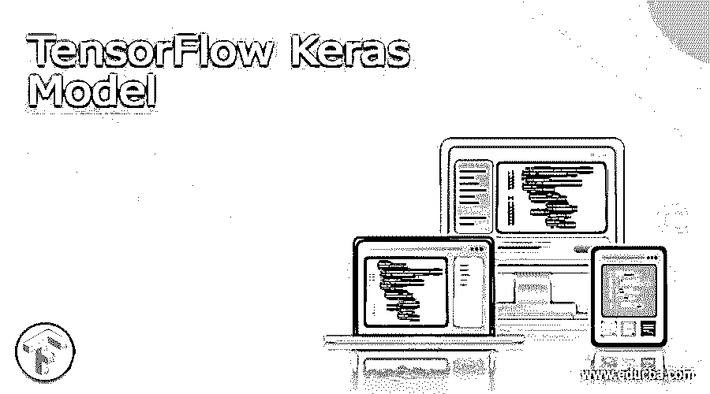

# TensorFlow Keras Model

> 原文： [https://www.educba.com/tensorflow-keras-model/](https://www.educba.com/tensorflow-keras-model/)

## 张量流 Keras 模型简介

Keras 是深度学习中可用的库，它是机器学习的子主题，由许多其他子库组成，如 TensorFlow 和 Theano。这用于人工智能和机器人技术，因为这种技术遵循算法的使用，这些算法是通过使用基于人脑工作模式并能够自学的算法开发的。Tensorflow Keras 是目前最受欢迎和高度发展的技术领域之一，因为它具有改变技术未来的潜力。在本文中，我们将了解 Keras TensorFlow 模型，以及该模型中遵循的方法。

### 张量流 Keras 模型综述

Keras 是用于深度学习的 python 的库。TensorFlow 是一种用于机器学习的技术，是 google 为端到端通信提供的 GitHub 上的开源平台，它极大地改变了专家和初学者构建机器学习模型的方式。

<small>Hadoop、数据科学、统计学&其他</small>

为了理解什么是 TensorFlow Keras，首先，你需要理解什么是 python 中的深度学习。它有助于预处理数据，然后评估、建模和优化神经网络。而机器学习基本上专注于设计和创建能够自主学习的算法，而深度学习是机器学习的子分支，其中设计的算法从人脑的工作方式和结构中获得灵感。它们也被称为人工神经网络。Keras 是学习模型和 python 库，可用于机器学习，非常易于使用，同时功能强大。它由 Tensorflow 和 Theano 等有助于数值计算的库组成。

通过比较生物学的基本神经元和 Keras 模型，让我们了解人工神经网络是如何工作的。简单的神经网络是人体内存在的单个神经元，也称为感知器，由树突和轴突组成，分别用于收集和传递数据。类似地，人工网络中的神经元具有多个输入和单个输出节点。下图显示了生物神经元和人工神经元之间的比较

为了识别或找出复杂现实场景的解决方案，我们将需要多层感知器。我们可以利用 Keras 序列模型，它实际上是这种感知器层的线性堆栈。当调用顺序类的构造时，我们可以通过简单地提供层的列表来创建这样一个模型的实例。我们可以使用下面的语句进行同样的设置——

`nameOfModel = Sequential()`

谈多层感知器。它由不同的层组成，第一层是输入层，是获取和收集数据的来源，然后是一些隐藏层，用于操作和计算，最后是输出层，用于传递信息。在 Keras 中创建我们的模型时，我们需要清楚地提到输入形状，这意味着您应该将哪种类型和结构的数据作为输入传递给模型。为此，您可以在层中使用输入形状、批量大小、输入长度和输入尺寸参数。

在复杂的情况下，您将使用密集层，因为需要有一个完全连接的层。密集层执行的操作如下所示

`Output (result) = activation (dot (input, kernel) +bias)`

如果我们不使用激活函数，稠密层包含点积和加法两个操作。

### 张量流 Keras 模型和方法

如您所知，TensorFlow Keras 模型用于深度学习，它涉及各种其他事情，而不仅仅是收集数据、处理数据和显示输出。让我们通过观察在 TensorFlow 和 Keras 库中开发模型时需要执行的步骤来理解该方法。

*   了解可用数据–您可以检查数据描述文件夹中包含的所有变量。
*   将数据加载到系统中——有各种 python 库，如 pandas，使这项任务变得非常简单。您可以通过简单地使用 import 语句来使用这个包。除此之外，您还可以使用 read_csv()方法和 sep 参数来指定分隔符。
*   浏览数据-您可以检查所有数据框，还可以交叉检查数据描述文件中的变量及其数据类型。跟踪数据，并确保您对空值的存在及其结构了如指掌，这样您就可以在清理或操作时相应地处理数据。熊猫函数 info()、tail()、sample()、head()、min()、max()、describe()、isnull()和 may others 可以证明对你有帮助。
*   数据可视化——您可以创建数据集变量的散点图，以检查其中所有可能的相关性。您可以使用 numpy 包中提供的 histogram()函数，也可以查看 matplotlib 库来帮助您完成这项工作。
*   预处理数据-拥有正确的数据后，如果您不希望在追加数据框时保留索引的标注，则可以执行此步骤，将 ignore_index 的参数值设置为 true。
*   模型的训练和测试–在这一步，您可以使用 sklearn.model_selection 库中的 train_test_split 函数。
*   数据标准化——可以从 sklearn 的包中导入 StandardScalar 模块。预处理。
*   对数据进行建模——您将通过对复杂应用程序使用多层感知来创建自己的神经网络。
*   模型的编译和拟合–您可以为您的模型使用 compile()方法和 fit()函数。你必须使模型符合现有的数据。
*   预测–使用 predict()函数进行预测，并检查其余部分是通过还是失败。
*   评估模型–评估()函数可用于此。

### 结论

Tensorflow Keras 是 python 中可用的库，用于深度学习和基于人工神经网络创建模型。

### 推荐文章

这是一个张量流 Keras 模型的指南。在这里，我们讨论 TensorFlow Keras 模型和方法，代码实现的例子。您也可以看看以下文章，了解更多信息–

1.  [系统型号](https://www.educba.com/system-models/)
2.  [费尔康模型](https://www.educba.com/phalcon-model/)
3.  [什么是 DSL 调制解调器？](https://www.educba.com/what-is-dsl-modem/)
4.  [TensorFlow Models](https://www.educba.com/tensorflow-models/)

