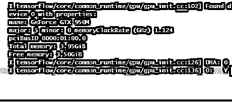

# TensorFlow OpenCL

> 原文：<https://www.educba.com/tensorflow-opencl/>

## TensorFlow OpenCL 简介

TensorFlow 是一个基于人工智能概念的机器学习算法执行框架。我们正在使用 SYCLTM 为 TensorFlow 框架添加对 OpenCLTM 设备的支持，以使开发人员能够访问更广泛的处理器。SYCL 是一个简单免费的跨平台 C++抽象层，而 OpenCL(开放计算语言)是一个用于构建跨异构平台执行的应用程序的框架。OpenCL 是基于事件和数据的并行计算的标准。

### TensorFlow OpenCL 概述

相对于 OpenGL ES 加速，OpenCL 提供了 2 倍的推理加速。如果 OpenCL 不可用，TensorFlow Lite 会退回到 OpenGL ES，尽管大多数移动 GPU 供应商都提供 OpenCL 驱动程序，即使他们没有直接接触 Android 应用程序开发。更高级别的框架和编译器越来越多地使用 OpenCL 作为加速目标。因为 OpenCL 允许 CPU 和 GPU 在运行相同的程序时共享工作负载，所以程序员可以通过在设备之间分配工作来利用这两者。因为进程的相对速率在设备间波动，这在选择如何划分工作时造成了一个难题。机器学习已经被提出作为这个问题的解决方案。

<small>Hadoop、数据科学、统计学&其他</small>

### CUDA 与 OpenCL

| **比较** | **CUDA** | **OpenCL** 的缩写形式 |
| **发达** | NVIDIA 公司。 | 由 Khronos 集团开发 |
| **定义** | 计算统一设备架构(CUDA)是一种并行计算设计，支持需要大量并行处理的应用程序。 | OpenCL 是一种开放标准，可用于各种硬件，包括台式机和笔记本电脑的 GPU。 |
| **多操作系统支持** | CUDA can run on Windows, Linux, and macOS, but it requires NVIDIA hardware to do it.例如 Windows XP 和更高版本的 macOS | OpenCL, on the other hand, can run on practically any operating system and on a wide range of hardware.

例如 Android、FreeBSD、Windows、Linux、macOS e

 |
| **GPU 支持** | 2 个 GPU | 利用 1 个 GPU |
| **语言支持** | C，C++，fortran | C，C++ |
| **模板** | CUDA 是一个 C API，也是构造。 | C++绑定并拥有 C99 |
| **功能** | 编译器构建内核 | 运行时的内核。 |
| **图书馆** | 拥有大量高性能库 | 尽管它有大量可以在任何 OpenCL 兼容的硬件上使用的库，但它不如 CUDA 全面。 |
| **性能** | 没有明显的优势，因为这取决于代码质量、硬件类型和其他因素。 | 没有明显的优势，因为这取决于代码质量、硬件类型和其他因素。 |

### TensorFlow OpenCL examples

TensorFlow-OpenCL 中没有已知漏洞，其依赖库中也没有已知漏洞。Apache-2.0 许可证适用于 TensorFlow-OpenCL。这是一份许可协议。许可许可证提供的限制最少，几乎可以用于任何项目。

Blender 的最新版本支持 OpenCL 渲染。使用 Sylabs 库提供的容器，您可以将 Blender 作为图形程序运行，该程序将使用本地镭龙 GPU 进行 OpenCL 计算:

`$ singularity exec --rocm --bind /etc/OpenCL library://sylabs/demo/blend blender`

**设置并运行 TensorFlow OpenCL**

为了给 TensorFlow 添加 OpenCL 支持，我们需要使用 ComputeCpp 来创建 TensorFlow 的 OpenCL 版本。TensorFlow 现在包括 OpenCL 支持，由于 Codeplay，可以使用 SYCL 实现。TensorFlow 基于特征线性代数 C++库。

**OpenCL 安装**

`sudo apt update
sudo apt install clinfo
clinfo`

**安装包**

`sudo apt update
sudo apt install git cmake gcc build-essential libpython3-all-dev ocl-icd-opencl-dev opencl-headers openjdk-8-jdk python3 python3-dev python3-pip zlib1g-dev
pip install -U --user numpy==1.14.5 wheel==0.31.1 six==1.11.0 mock==2.0.0 enum34==1.1.6`

**配置设置**

`git clone http://github.com/codeplaysoftware/tensorflow
cd tensorflow`

**环境变量设置**

`export CC_OPT_FLAGS="-march=native"
export PYTHON_BIN_PATH="/usr/bin/python"
export USE_DEFAULT_PYTHON_LIB_PATH=1
export TF_NEED_JEMALLOC=1
export TF_NEED_MKL=0
export TF_NEED_GCP=0
export TF_NEED_HDFS=0
export TF_ENABLE_XLA=0
export TF_NEED_CUDA=0
export TF_NEED_VERBS=0
export TF_NEED_MPI=0
export TF_NEED_GDR=0
export TF_NEED_AWS=0
export TF_NEED_S3=0
export TF_NEED_KAFKA=0
export TF_DOWNLOAD_CLANG=0
export TF_SET_ANDROID_WORKSPACE=0
export TF_NEED_OPENCL_SYCL=1
export TF_NEED_COMPUTECPP=1`

运行测试以确保 TensorFlow 构建成功是一个好主意。使用下面的命令，您可以执行大约 1500 个测试:

`bazel test --test_lang_filters=cc,py --test_timeout 1500 --verbose_failures --jobs=1 --config=sycl --config=opt -- //tensorflow/... -//tensorflow/compiler/... -//tensorflow/contrib/distributions/... -//tensorflow/contrib/lite/... -//tensorflow/contrib/session_bundle/... -//tensorflow/contrib/slim/... -//tensorflow/contrib/verbs/... -//tensorflow/core/distributed_runtime/... -//tensorflow/core/kernels/hexagon/... -//tensorflow/go/... -//tensorflow/java/... -//tensorflow/python/debug/... -//tensorflow/stream_executor/...`

**建立张量流**

`git clone http://github.com/codeplaysoftware/tensorflow
cd tensorflow`

**设置操作**

`with tf. Session() as se1:
with tf.device("/gpu:0"):
To execute a code
with tf.Session() as se1:`

该系列将构建一个新的上下文管理器，指导 TensorFlow 使用 GPU 来完成这些任务。

#### TensorFlow program

**程序#1**

`import tensorflow as tf
>>> he1 = tf.constant('Hi, TensorFlow world!')
>>> se1 = tf.Session()
>>> se1.run(hello)
'Hi, TensorFlow world!'
>>> x = tf.constant(12)
>>> y = tf.constant(22)
>>> se1.run(x + y)
34
>>> se1.close()`

**程序#2**

`import sys
import numpy as np
import tensorflow as tf
from datetime import datetime
d_name = sys.argv[1] shape = (int(sys.argv[2]), int(sys.argv[2]))
if d_name == "gpu":
d_name = "/gpu:0"
else:
d_name = "/cpu:0"
with tf.device(d_name):
ran_matrix = tf.random_uniform(shape=shape, minval=0, maxval=1)
d_operation = tf.matmul(ran_matrix, tf.transpose(ran_matrix))
sum_op = tf.reduce_sum(d_operation)
start = datetime.now()
with tf.Session(config=tf.ConfigProto(log_device_placement=True)) as session:
res = session.run(sum_op)
print(res)
print("\n" * 6)
print("Shape:", shape, "Device:", d_name)
print("Time done:", datetime.now() - startTime)
print("\n" * 6)`

**解释**

执行
Python name1.py gpu 1500

**输出:**

### TensorFlow 的 OpenCL 加速

OpenCL 允许使用广泛的加速器，包括多核 CPU、GPU、DSP、FPGAs 和推理引擎等专用硬件。OpenCL 系统分为主机和设备组件，其中主机软件以通用编程语言如 C 或 C++开发，并使用普通编译器生成以在主机 CPU 上运行。TensorFlow 到 OpenCL 的转换需要在 OpenCL C 和不同的代码库中编写内核，这两者都很难维护。当使用 SYCL 时，所有这些都是单源 C++，因此有可能以非侵入的方式将 SYCL 后端集成到 TensorFlow。

让我们看看注册的示例代码

`namespace tensorflow {
REG5(UnaryOp, CPU, "Sqrt", functor::sqrt, float, Eigen::half, double,
complex64, complex128);
#if GOOGLE_CUDA
REG3(UnaryOp, GPU, "Sqrt", functor::sqrt, float, Eigen::half, double);
#endif
#ifdef TENSORFLOW_USE_SYCL
REG2(UnaryOp, SYCL, "Sqrt", functor::sqrt, float, double);
#endif
}`

### 结论

总的来说，OpenCL 是成功的。作为一个标准，它包含所有必要的部分，即运行时代码创建和对异构计算的充分支持。因此，在本文中，我们看到了张量流是如何作用于 OpenCL 的。

### 推荐文章

这是 TensorFlow OpenCL 的使用指南。在这里，我们讨论介绍，概述，代码实现的例子。您也可以看看以下文章，了解更多信息–

1.  [张量流概率](https://www.educba.com/tensorflow-probability/)
2.  [张量流 LSTM](https://www.educba.com/tensorflow-lstm/)
3.  [咖啡张量流](https://www.educba.com/caffe-tensorflow/)
4.  [TensorFlow Debugging](https://www.educba.com/tensorflow-debugging/)

